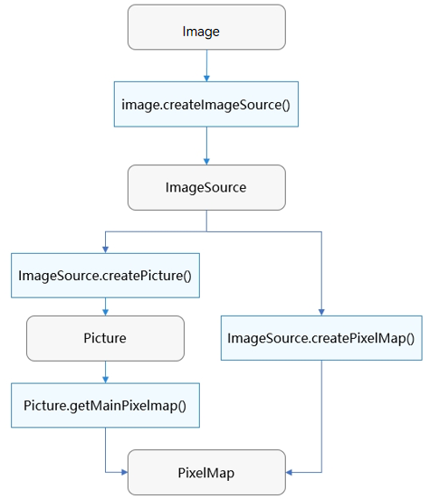
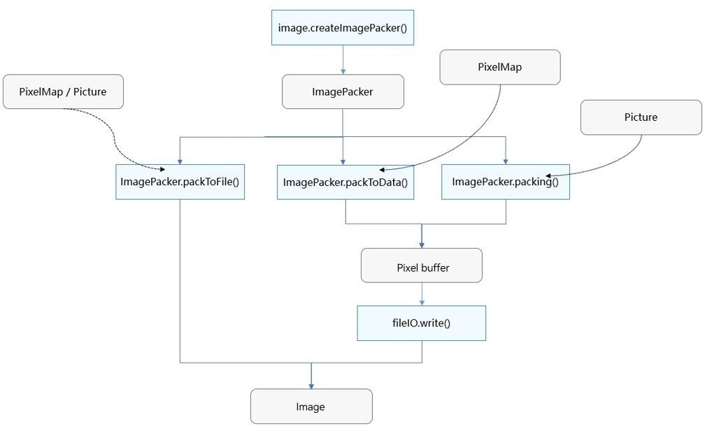

# About This Kit
<!--Kit: Image Kit-->
<!--Subsystem: Multimedia-->
<!--Owner: @aulight02-->
<!--Designer: @XiaoYao555-->
<!--Tester: @xchaosioda-->
<!--Adviser: @w_Machine_cc-->

Image Kit provides APIs for you to decode, encode, edit, and receive images, and to process image metadata.

## Highlights

- Supports encoding and decoding of popular image formats, such as HEIF, JPEG, PNG, and WebP.
- Supports HDR image encoding and decoding, providing users with a better color experience, and can also use AI capabilities to convert SDR images into HDR images.
- Provides rich image editing and processing capabilities, including image transformation, PixelMap operations, and filter effects.
- Uses efficient algorithms and optimization policies to improve image processing speed and efficiency.

## Basic Concepts

Be familiar with the following basic concepts before development:

- [PixelMap](../../reference/apis-image-kit/arkts-apis-image-PixelMap.md)

  A PixelMap object. It can be used to read or write pixel data and perform operations such as cropping, scaling, translation, rotation, and mirroring. It can also be directly passed to the [Image component](../../ui/arkts-graphics-display.md) for display. It also provides methods for obtaining image information and obtaining and setting the color gamut and HDR metadata of images.

- [Picture](../../reference/apis-image-kit/arkts-apis-image-Picture.md)

  A multi-picture object. It contains a main picture, auxiliary pictures, and metadata. The main picture contains the primary image information. The auxiliary pictures store additional information related to the main picture. The metadata stores other information related to the image. `Picture` provides methods to obtain the main picture, compose HDR images, obtain and set auxiliary pictures, and obtain and set metadata.

- Image decoding

  The operation of decoding a supported image file into a PixelMap or Picture for image display or processing in applications or the system.

- Image editing and processing

  A series of operations performed on a PixelMap, such as rotation, scaling, opacity setting, obtaining image information, and reading and writing pixel data. The origin of the coordinate system is the upper left corner.

- Image encoding

  The operation of encoding a PixelMap or Picture into an image file in a different format for subsequent processing, such as storage and transmission.

## How to Use

Image Kit provides rich image processing capabilities that developers can use flexibly as needed. You can either use the complete workflow of image decoding, editing and processing, and encoding, or directly pass the decoded PixelMap to the [Image component](../../ui/arkts-graphics-display.md) for display without further processing. Rich option parameters are available during decoding and encoding to meet the requirements of various development scenarios.

Image Kit supports [PixelMap operations](../image/image-pixelmap-operation.md) on the decoded PixelMap to process part of the target image. It also supports [image transformations](../image/image-transformation.md), allowing you to crop, scale, offset, rotate, flip, and set the opacity for an image.

Image Kit supports adding filter effects to images through [ImageEffect](../image/image-effect-guidelines.md).

Image Kit also provides the capability to read and [edit image EXIF data](../image/image-tool.md). You can obtain and configure additional attributes in image files, such as basic image information like width, height, and rotation direction, photography parameters like aperture and focal length, and GPS information like longitude and latitude.

The image decoding and encoding processes are shown in Figure 1 and Figure 2. The PixelMap obtained after decoding can be directly used for image display, editing, and processing.

**Figure 1** Image decoding process

**Figure 2** Image encoding process

## Constraints

- **Read and write permission constraints**

  During image processing, applications may need to use user images. To ensure normal function running, the application needs to request the corresponding read and write permissions from the user. For details, see [Requesting User Authorization](../../security/AccessToken/request-user-authorization.md).

- **Selecting appropriate C APIs**

  Image Kit currently provides two sets of C APIs: C APIs dependent on JS objects ([Image](../../reference/apis-image-kit/capi-image.md)) and C APIs independent of JS objects ([Image_NativeModule](../../reference/apis-image-kit/capi-image-nativemodule.md)).

  - C APIs dependent on JS objects

    These APIs can be used to perform image encoding and decoding, image receiving, and image data processing. For example code, see [Using Image to Decode Images (C/C++)](image-decoding-native.md). You can also check the C APIs under [Image](../../reference/apis-image-kit/capi-image.md) to confirm the API scope. These APIs were released before API version 11, and no new features will be added in later versions. Therefore, they are **not recommended**.

  - C APIs independent of JS objects

    In addition to providing the basic image framework capabilities described above, these APIs also support new features such as multi-picture encoding and decoding. For the development guide, see [Using Image_NativeModule to Decode Images](image-source-c.md). You can also check the C APIs under [Image_NativeModule](../../reference/apis-image-kit/capi-image-nativemodule.md) to confirm the API scope. These APIs have been supported since API version 12 and will continue to evolve. Developers are **recommended** to use them.

  > **NOTE**
  >
  > Using both sets of C APIs together is not recommended, because they are incompatible in some scenarios.

<!--RP1--><!--RP1End-->

## Related Kits

Image Kit provides capabilities such as image encoding and decoding, image receiving, image editing, and image processing. It supports the **Image** component, Gallery, and other applications that require image-related capabilities. The PixelMap obtained after image decoding can be passed to the [Image component](../../ui/arkts-graphics-display.md) for display. [ImageReceiver](../../reference/apis-image-kit/arkts-apis-image-ImageReceiver.md) can be used to implement [secondary processing of camera preview streams](../camera/native-camera-preview-imageReceiver.md).

## Samples

The following samples are available for image development:

- [Image Display and Processing (ArkTS) (API12)](https://gitcode.com/openharmony/applications_app_samples/tree/master/code/BasicFeature/Media/Image)

- [Image Display (ArkTS) (API10)](https://gitcode.com/openharmony/applications_app_samples/tree/master/code/BasicFeature/Media/ImageShow)

- [Image Cropping and Segmentation (ArkTS) (API10)](https://gitcode.com/openharmony/applications_app_samples/tree/master/code/SystemFeature/Media/GamePuzzle)
