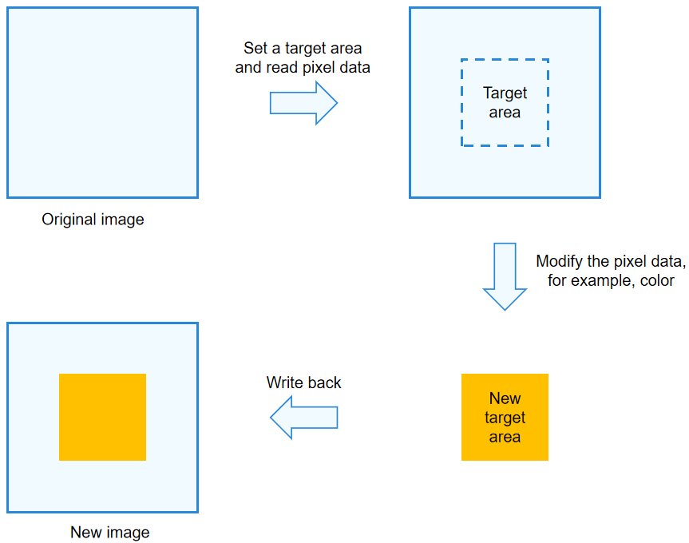

# Using PixelMap for PixelMap Operations

<!--Kit: Image Kit-->
<!--Subsystem: Multimedia-->
<!--Owner: @yaozhupeng-->
<!--Designer: @yaozhupeng-->
<!--Tester: @zhaoxiaoguang2-->
<!--Adviser: @w_Machine_cc-->
<!-- md-trans-meta sourceCommit=ba3f6c99832577d149cf0c227912c266e5256745 translatedAt=2026-08-11T01:46:46.106Z pushedAt=2026-08-11T08:07:23.623Z -->

To process a certain area in an image, you can perform PixelMap operations, which are usually used to beautify the image.

As shown in the figure below, the pixel data of a rectangle in an image is read, modified, and then written back to the corresponding area of the original image.

**Figure 1** PixelMap operation



## How to Develop

For details about the APIs for PixelMap operations, see [Interface (PixelMap)](../../reference/apis-image-kit/arkts-apis-image-PixelMap.md).

1. Complete [image decoding](image-decoding.md) and obtain a PixelMap object.

2. Obtain information from the PixelMap object.

   <!-- @[pixelmap_get_pixelmap_info](https://gitcode.com/openharmony/applications_app_samples/blob/master/code/DocsSample/Media/Image/PixelMap/entry/src/main/ets/pages/Index.ets) -->

   ``` TypeScript
   // Obtain the total number of bytes of this PixelMap object.
   const totalPixelBytes: number = this.pixelMap.getPixelBytesNumber();
   Logger.info('Total bytes: ', totalPixelBytes.toString());
   // Obtain the number of bytes per row of the image.
   const rowBytes: number = this.pixelMap.getBytesNumberPerRow();
   Logger.info('Row bytes: ', rowBytes.toString());
   // Obtain the pixel density of the current image. Pixel density refers to the number of pixels per inch of an image. The higher the pixel density, the finer the image.
   const density: number = this.pixelMap.getDensity();
   Logger.info('Density: ', density.toString());
   ```

3. Read and modify the pixel data of the target area, and write the modified data back to the original image.

   > **NOTE**
   >
   > You are advised to use **readPixelsToBuffer** with **writeBufferToPixels**, and **readPixels** with **writePixels**, to prevent issues with the PixelMap due to inconsistent pixel formats.

   <!-- @[pixelmap_bitmap_operation_all](https://gitcode.com/openharmony/applications_app_samples/blob/master/code/DocsSample/Media/Image/PixelMap/entry/src/main/ets/pages/Index.ets) -->

   ``` TypeScript
   // Scenario 1: Read and modify the entire image data.
   // Read the pixel data of the entire PixelMap and write it to the buffer in the PixelMap's pixel format.
   const buffer = new ArrayBuffer(totalPixelBytes);
   await this.pixelMap.readPixelsToBuffer(buffer).then(() => {
     Logger.info('Succeeded in reading image pixel data.');
   }).catch((error: BusinessError) => {
     Logger.error('Failed to read image pixel data. The error is: ' + String(error));
   });
   // ...
   // Read the image pixel data from the buffer in the PixelMap's pixel format and write it to the entire PixelMap.
   this.pixelMap!.writeBufferToPixels(buffer).then(() => {
     Logger.info('Succeeded in writing image pixel data.');
     this.updateImageInfo();
   }).catch((error: BusinessError) => {
     Logger.error('Failed to write image pixel data. The error is: ' + String(error));
   });
   ```

   <!-- @[pixelmap_bitmap_operation](https://gitcode.com/openharmony/applications_app_samples/blob/master/code/DocsSample/Media/Image/PixelMap/entry/src/main/ets/pages/Index.ets) -->

   ``` TypeScript
   // Scenario 2: Read and modify image data in a specified region.
   // Read the pixel data in the specified region of the PixelMap and write it to the PositionArea.pixels buffer in RGBA_8888 pixel format. The region is specified by PositionArea.region.
   const regionWidth: number = 200;
   const regionHeight: number = 100;
   const area: image.PositionArea = {
     pixels: new ArrayBuffer(regionWidth * regionHeight * 4), // Each pixel in BGRA_8888 format occupies 4 bytes.
     offset: 0,
     stride: regionWidth * 4, // Row stride of the specified region.
     region: {
       x: 0,
       y: 0,
       size: { width: regionWidth, height: regionHeight }
     }
   };
   
   await this.pixelMap.readPixels(area).then(() => {
     Logger.info('Succeeded in reading the image data in the area.');
     // ...
   }).catch((error: BusinessError) => {
     Logger.error('Failed to read the image data in the area. The error is: ' + String(error));
   });
   // Read the image pixel data from the PositionArea.pixels buffer and write it to the specified region of the PixelMap in BGRA_8888 pixel format. The region is specified by PositionArea.region.
   await this.pixelMap.writePixels(area).then(() => {
     this.updateImageInfo();
     Logger.info('Succeeded in writing pixelMap into the specified area.');
   }).catch((error: BusinessError) => {
     Logger.error('Failed to write pixelMap into the specified area. The error is: ' + String(error));
   });
   ```

## Development Example

### Cloning (Deep Copying) a PixelMap and Changing the Pixel Format

> **NOTE**
>
> - This method only copies the basic content of a PixelMap. It does not support copying the color gamut or HDR metadata. If you do not need to change the pixel format of the new PixelMap, use [clone](../../reference/apis-image-kit/arkts-apis-image-PixelMap.md#clone18) or [cloneSync](../../reference/apis-image-kit/arkts-apis-image-PixelMap.md#clonesync18).
> - This method does not support converting the new PixelMap to the following pixel formats: `RGBA_1010102`, `YCBCR_P010`, `YCRCB_P010`, and `ASTC_4x4`.

1. Complete [image decoding](image-decoding.md) and obtain a PixelMap object.

2. Perform a deep copy of the PixelMap by referring to the following code.

   <!-- @[pixelmap_clone](https://gitcode.com/openharmony/applications_app_samples/blob/master/code/DocsSample/Media/Image/PixelMap/entry/src/main/ets/pages/Index.ets) -->

   ``` TypeScript
   /**
    * Clone (deep copy) a PixelMap and change the pixel format.
    *
    * @param pixelMap - Original PixelMap.
    * @param desiredPixelFormat - Pixel format of the new PixelMap. The pixel format of the original PixelMap is used if not specified.
    * @returns Promise of the new PixelMap.
    */
   async function clonePixelMap(pixelMap: PixelMap, desiredPixelFormat?: image.PixelMapFormat): Promise<PixelMap> {
     // Obtain the image information of the original PixelMap.
     const imageInfo = pixelMap.getImageInfoSync();
     // Read the pixel data of the original PixelMap and write it to the buffer in the original PixelMap's pixel format.
     const buffer = new ArrayBuffer(pixelMap.getPixelBytesNumber());
     await pixelMap.readPixelsToBuffer(buffer);
   
     // Generate initialization options based on the image information of the original PixelMap.
     const options: image.InitializationOptions = {
       // Pixel format of the data source: must match the pixel format of the original PixelMap; otherwise, the new PixelMap image will be abnormal.
       srcPixelFormat: imageInfo.pixelFormat,
       // Pixel format of the new PixelMap.
       pixelFormat: desiredPixelFormat || imageInfo.pixelFormat,
       // Alpha type of the new PixelMap.
       alphaType: imageInfo.alphaType,
       // Size of the new PixelMap: must match the size of the original PixelMap. Passing a different size for scaling is not supported.
       size: imageInfo.size
     };
   
     // Create a new PixelMap based on the pixel data and initialization options.
     return await image.createPixelMap(buffer, options);
   }
   ```

### Vertically Stitching Two PixelMaps of the Same Width into a Long Image

> **NOTE**
>
> This method supports only PixelMaps in the following pixel formats: `RGBA_8888`, `BGRA_8888`, and `RGBA_F16`.

1. Complete [image decoding](image-decoding.md) and obtain two PixelMap objects with the same width and pixel format.

2. Stitch the two PixelMaps by referring to the following code.

   <!-- @[pixelmap_concatenation](https://gitcode.com/openharmony/applications_app_samples/blob/master/code/DocsSample/Media/Image/PixelMap/entry/src/main/ets/pages/Index.ets) -->

   ``` TypeScript
   /**
    * Vertically concatenate two PixelMaps of the same width into a long image.
    *
    * @param pixelMap1 - The first PixelMap.
    * @param pixelMap2 - The second PixelMap. Its width must be the same as the first, but its height can differ.
    * @returns A Promise of the new PixelMap after concatenation.
    */
   async function concatPixelMap(pixelMap1: PixelMap, pixelMap2: PixelMap): Promise<PixelMap> {
     // Read the pixel data of pixelMap1 into area1.pixels.
     const imageInfo1 = pixelMap1.getImageInfoSync();
     const area1: image.PositionArea = {
       pixels: new ArrayBuffer(pixelMap1.getPixelBytesNumber()),
       offset: 0,
       stride: pixelMap1.getBytesNumberPerRow(),
       region: {
         size: imageInfo1.size,
         x: 0,
         y: 0
       }
     };
     await pixelMap1.readPixels(area1);
   
     // Read the pixel data of pixelMap2 into area2.pixels.
     const imageInfo2 = pixelMap2.getImageInfoSync();
     const area2: image.PositionArea = {
       pixels: new ArrayBuffer(pixelMap2.getPixelBytesNumber()),
       offset: 0,
       stride: pixelMap2.getBytesNumberPerRow(),
       region: {
         size: imageInfo2.size,
         x: 0,
         y: 0
       }
     };
     await pixelMap2.readPixels(area2);
   
     // Create a new blank PixelMap whose width equals that of pixelMap1 and pixelMap2, and whose height is the sum of pixelMap1 and pixelMap2.
     const options: image.InitializationOptions = {
       srcPixelFormat: imageInfo1.pixelFormat,
       pixelFormat: imageInfo1.pixelFormat,
       size: {
         width: imageInfo1.size.width,
         height: imageInfo1.size.height + imageInfo2.size.height
       }
     };
     const newPixelMap = image.createPixelMapSync(options);
   
     // Write the previously obtained pixel data of pixelMap1 and pixelMap2 to the new PixelMap in order.
     await newPixelMap.writePixels(area1);
     area2.region.y = imageInfo1.size.height; // The write position of pixelMap2 pixels should start from the row after the last row of pixelMap1 pixels.
     await newPixelMap.writePixels(area2);
   
     return newPixelMap;
   }
   ```

<!--RP1-->
<!--RP1End-->