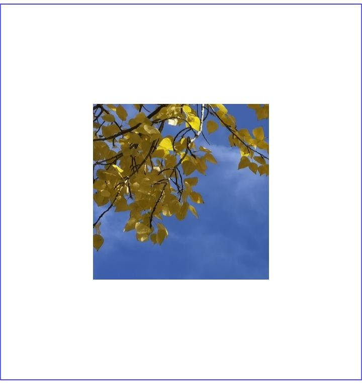
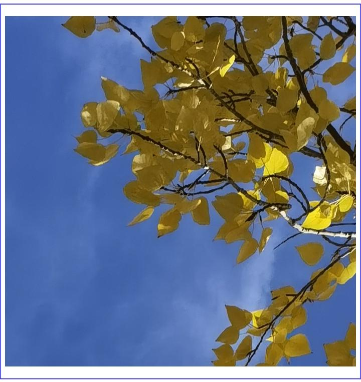

# Using PixelMap to Transform Images

Image processing refers to a series of operations performed on the pixel map, such as obtaining image information, cropping, scaling, translating, rotating, flipping, setting opacity, and reading and writing pixel data. These operations can be classified into image transformation and [PixelMap operation](image-pixelmap-operation.md). This topic describes the image transformation operations that you can perform.

## How to Develop

Read [Image](../../reference/apis-image-kit/js-apis-image.md#pixelmap7) for APIs related to image transformation.

1. Complete [image decoding](image-decoding.md) and obtain a **PixelMap** object.

2. Obtain image information.

   ```ts
   import { BusinessError } from '@kit.BasicServicesKit';
   // Obtain the image size.
   pixelMap.getImageInfo().then( (info : image.ImageInfo) => {
     console.info('info.width = ' + info.size.width);
     console.info('info.height = ' + info.size.height);
   }).catch((err : BusinessError) => {
     console.error("Failed to obtain the image pixel map information.And the error is: " + err);
   });
   ```

3. Perform image transformation.

   Original image:

     

   - Crop the image.

     ```ts
     // x: x-axis coordinate of the start point for cropping (0).
     // y: y-axis coordinate of the start point for cropping (0).
     // height: height after cropping (400), cropping from top to bottom.
     // width: width after cropping (400), cropping from left to right.
     pixelMap.crop({x: 0, y: 0, size: { height: 400, width: 400 } });
     ```

     

   - Scale the image.

     ```ts
     // The width of the image after scaling is 0.5 of the original width.
     // The height of the image after scaling is 0.5 of the original height.
     pixelMap.scale(0.5, 0.5);
     ```

     

   - Translate the image.

     ```ts
     // Translate the image by 100 units downwards.
     // Translate the image by 100 units rightwards.
     pixelMap.translate(100, 100);
     ```

     

   - Rotate the image.

     ```ts
     // Rate the image clockwise by 90°.
     pixelMap.rotate(90);
     ```

     

   - Flip the image.

     ```ts
     // Flip the image vertically.
     pixelMap.flip(false, true);
     ```

     

     ```ts
     // Flip the image horizontally.
     pixelMap.flip(true, false);
     ```

     

   - Set the opacity of the image.

     ```ts
     // Set the opacity to 0.5.
     pixelMap.opacity(0.5);
     ```

     
