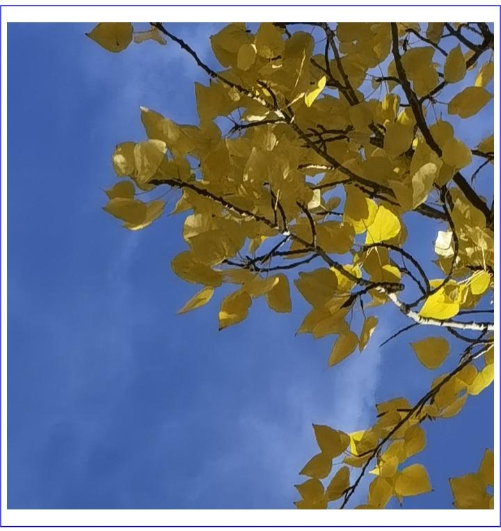
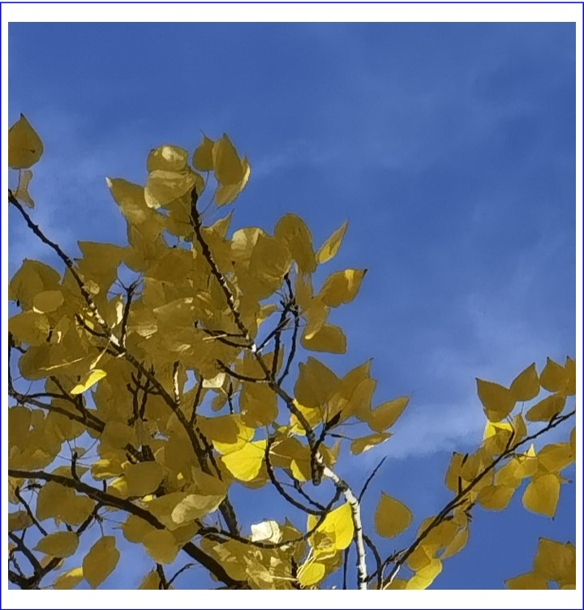

# Using PixelMap to Transform Images

<!--Kit: Image Kit-->
<!--Subsystem: Multimedia-->
<!--Owner: @yaozhupeng-->
<!--Designer: @yaozhupeng-->
<!--Tester: @zhaoxiaoguang2-->
<!--Adviser: @w_Machine_cc-->
<!-- md-trans-meta sourceCommit=ba3f6c99832577d149cf0c227912c266e5256745 translatedAt=2026-08-11T01:49:05.322Z pushedAt=2026-08-11T09:55:01.133Z -->

Image processing refers to a series of operations performed on the PixelMap, such as obtaining image information, cropping, scaling, translating, rotating, flipping, setting opacity, and reading and writing pixel data. These operations can be classified into image transformation and [PixelMap operation](image-pixelmap-operation.md). This topic describes the image transformation operations that you can perform.

## How to Develop

For details about the APIs related to image transformation, see [Interface (PixelMap)](../../reference/apis-image-kit/arkts-apis-image-PixelMap.md).

1. Complete [image decoding](image-decoding.md) and obtain a PixelMap object.

2. Obtain image information.

   <!-- @[pixelmap_get_image_info](https://gitcode.com/openharmony/applications_app_samples/blob/master/code/DocsSample/Media/Image/PixelMap/entry/src/main/ets/pages/Index.ets) -->

   ``` TypeScript
   // Obtain the image size.
   await this.pixelMap.getImageInfo().then((info: image.ImageInfo) => {
     this.imageInfo = info;
     Logger.info('Image width: ', info.size.width.toString());
     Logger.info('Image height: ', info.size.height.toString());
   }).catch((err: BusinessError) => {
     Logger.error('Failed to obtain the image pixel map information. The error is: ', String(err));
   });
   ```

3. Perform image transformation.

   Original image:

   

   - Crop the image.

     <!-- @[pixelmap_crop_image](https://gitcode.com/openharmony/applications_app_samples/blob/master/code/DocsSample/Media/Image/PixelMap/entry/src/main/ets/pages/Index.ets) -->

     ``` TypeScript
     const imageInfo = this.pixelMap.getImageInfoSync();
     const cropWidth = Math.min(400, imageInfo.size.width); // Prevent the crop area from exceeding the bounds when the original image width is less than 400.
     const cropHeight = Math.min(400, imageInfo.size.height); // Prevent the crop area from exceeding the bounds when the original image height is less than 400.
     // x: x-axis coordinate of the start point for cropping (0).
     // y: y-axis coordinate of the start point for cropping (0).
     // width: When the original image width is not less than 400, the crop width is 400, and the direction is from left to right (the cropped image width is 400).
     // height: When the original image height is not less than 400, the crop height is 400, and the direction is from top to bottom (the cropped image height is 400).
     this.pixelMap.crop({ x: 0, y: 0, size: { width: cropWidth, height: cropHeight } }).then(() => {
       // ...
     });
     ```

     

   - Scale the image.

     <!-- @[pixelmap_scale_image](https://gitcode.com/openharmony/applications_app_samples/blob/master/code/DocsSample/Media/Image/PixelMap/entry/src/main/ets/pages/Index.ets) -->

     ``` TypeScript
     // The width is 0.5 times the original.
     // The height is 0.5 times the original.
     this.pixelMap.scale(0.5, 0.5).then(() => {
       // ...
     });
     ```

     

   - Translation

     <!-- @[pixelmap_translate_image](https://gitcode.com/openharmony/applications_app_samples/blob/master/code/DocsSample/Media/Image/PixelMap/entry/src/main/ets/pages/Index.ets) -->

     ``` TypeScript
     // Translate downward by 100.
     // Translate rightward by 100.
     this.pixelMap.translate(100, 100).then(() => {
       // ...
     });
     ```

     

   - Rotate the image.

     <!-- @[pixelmap_rotate_image](https://gitcode.com/openharmony/applications_app_samples/blob/master/code/DocsSample/Media/Image/PixelMap/entry/src/main/ets/pages/Index.ets) -->

     ``` TypeScript
     // Rotate the image clockwise by 90°.
     this.pixelMap.rotate(90).then(() => {
       // ...
     });
     ```

     

   - Flip the image.

     <!-- @[pixelmap_vertical_flip_image](https://gitcode.com/openharmony/applications_app_samples/blob/master/code/DocsSample/Media/Image/PixelMap/entry/src/main/ets/pages/Index.ets) -->

     ``` TypeScript
     // Flip the image vertically.
     this.pixelMap.flip(false, true).then(() => {
       // ...
     });
     ```

     

     <!-- @[pixelmap_horizontal_flip_image](https://gitcode.com/openharmony/applications_app_samples/blob/master/code/DocsSample/Media/Image/PixelMap/entry/src/main/ets/pages/Index.ets) -->

     ``` TypeScript
     // Flip the image horizontally.
     this.pixelMap.flip(true, false).then(() => {
       // ...
     });
     ```

     

   - Set the opacity of the image.

     <!-- @[pixelmap_change_opacity_image](https://gitcode.com/openharmony/applications_app_samples/blob/master/code/DocsSample/Media/Image/PixelMap/entry/src/main/ets/pages/Index.ets) -->

     ``` TypeScript
     // Change the opacity of all pixels to 0.5.
     this.pixelMap.opacity(0.5).then(() => {
       // ...
     });
     ```

     

<!--RP1-->
<!--RP1End-->