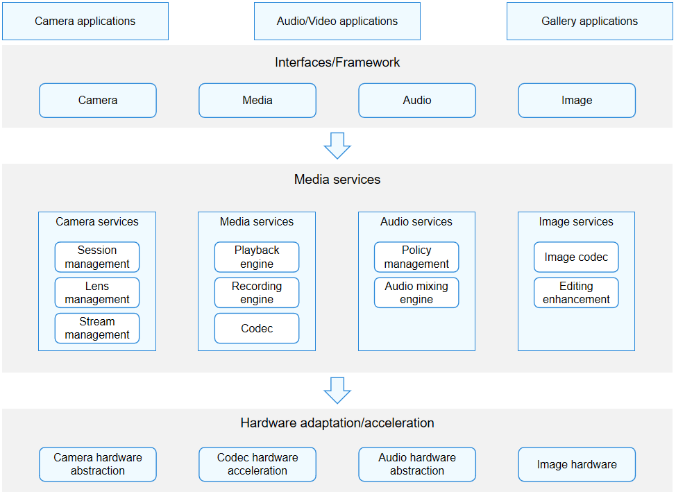

# Media Application Development Overview

## Multimedia Subsystem Architecture

The multimedia subsystem provides the capability of processing users' visual and auditory information. For example, it can be used to collect, compress, store, decompress, and play audio and video information. Based on the type of media information to process, the multimedia subsystem subsystem is usually divided into four modules: audio, media, camera, and image.

As shown in the figure below, the multimedia subsystem provides APIs for developing audio/video, camera, and gallery applications, and provides adaptation and acceleration for different hardware chips. In the middle part, it provides core media functionalities and management mechanisms in the form of services.

**Figure 1** Overall framework of the multimedia subsystem 

- Audio module: provides interfaces and services for volume management, audio route management, and audio mixing management.

- Media module: provides interfaces and services for audio and video decompression, playback, compression, and recording.

- Camera module: provides interfaces and services for accurately controlling camera lenses and collecting visual information.

- Image module: provides interfaces and services for image encoding, decoding, and processing.
