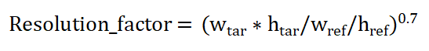
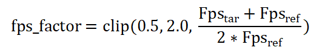

# Creating an Asynchronous Thread for AVTranscoder Video Transcoding (ArkTS)

During development, applications often create asynchronous threads to perform video compression tasks to meet various requirements, including:

- Saving storage space

  High-definition video files typically consume a significant amount of storage space, with just a few minutes of video potentially occupying several GB. Video compression can significantly reduce file size, thereby saving storage space.

- Improving device compatibility

  Different devices support various video formats for playback. Video transcoding can convert the source video format into commonly supported formats, meeting the playback needs of different devices and therefore enhancing the compatibility of video files across devices.

## Basic Concepts

The bit rate and resolution (width × height) of a video are two key factors that affect video quality and file size. Their relationship is not a simple linear correspondence but is influenced by multiple factors, including encoding efficiency and content complexity.

- **Basic concepts of bit rate and resolution (width × height)**
  - Bit rate: amount of data in the video stream per unit of time (measured in kbit/s or Mbit/s). 1 Mbit/s = 1,000,000 bit/s (1,000,000 bits per second).
  
    A higher bit rate means more data is transmitted per unit of time, potentially resulting in higher quality but also larger file sizes.

  - Resolution: number of pixels in the video frame (for example, 1920×1080).

    A higher resolution means more pixels, resulting in clearer details but also requiring more data to process.

- **Relationship between the bit rate and resolution**
  - Intuitive relationship

    Given the same encoding efficiency and content complexity, a higher resolution requires a higher bit rate to maintain quality. If the allocated bit rate is insufficient, the encoder compresses the data (for example, by discarding details or increasing block effects) to reduce the data volume.

  - Formula reference (rule of thumb):
    - The bit rate is proportional to the product of resolution width, resolution height, frame rate, and complexity coefficient.
    - The complexity coefficient is related to the dynamic nature of the video content. For example, static scenes (like lecture videos) have a low complexity coefficient and can maintain clarity with a lower bit rate, whereas dynamic scenes (like sports events) have a high complexity factor and require a higher bit rate.

- **Impact on encoding efficiency**

  Different encoding standards (such as H.264, H.265, and AV1) have different compression efficiencies.
  - Efficient encoders (such as H.265) can achieve approximately 50% lower bit rates at the same resolution and quality when compared with H.264.
  - Inefficient encoders (such as MJPEG) require higher bit rates to avoid quality loss.

## Choosing the Right Bit Rate and Resolution

- **Bit rate conversion**
  
  Input: source video width w<sub>ref</sub>, source video height h<sub>ref</sub>, source video frame rate fps<sub>ref</sub>, source video bit rate R<sub>ref</sub>, target video width w<sub>tar</sub>, target video height h<sub>tar</sub>, and target video frame rate fps<sub>tar</sub>
  
  Output: target video bit rate R<sub>tar</sub>

  The calculation process is shown below.

  

  The resolution and frame rate coefficients can be calculated using the following empirical formulas:

  

  
  
  The formula y=clip (0.5, 2, x) means: if x∈ [0.5, 2.0], then y=x; if x<0.5, then y=0.5; if x>2.0, then y=2.0.

- **Bit rate calculation**

  Select a baseline bit rate, for example, a 720P/30 fps video with a default bit rate of 3 Mbit/s, denoted as V0.

  If you need to transcode video V1 to output video V2, perform the following operations:
  1. Substitute (V0,V2) to get the estimated bit rate R2.
  2. Substitute (V1,V2) to get the estimated bit rate R2'.
  Take the minimum of the two to ensure the target bit rate is lower than the source video.

- **Resolution setting reference (using H.264 as an example)**

  |  Resolution| Dynamic Content (Like Games)|  Medium Dynamic Content (Like Movies)| Static Content (Like Slides) |
  | :------------ | :------------ | :------------ | :------------ |
  | 720p (1280 × 720)  | 3.5–5 Mbit/s | 2.5–4 Mbit/s |  1–2 Mbit/s|
  | 1080p (1920 × 1080) |  6–8 Mbit/s| 4–6 Mbit/s | 2–3 Mbit/s |
  | 4K (3840 × 2160) | 25–35 Mbit/s |  15–25 Mbit/s|  10–15 Mbit/s|

- **Conversion examples**

    Scenario 1: There is a video with a resolution of 1280×720 and 30fps, with a bit rate of 1 Mbit/s, which is a relatively high-quality video. You need to transcode it to a video with a resolution of 640×480 and 30fps. The bit rate should be set to 463,463 bit/s. The calculation is as follows:

    Resolution_factor = 0.463463

    fps_factor = 1

    R<sub>tar</sub> = 463,463bps

    Scenario 2: There is a video with a resolution of 1280×720 and 30fps, with a bit rate of 1 Mbps. You need to transcode it to a video with a bit rate of 600,000 bit/s and 30fps. The resolution should be set to 888×500. The calculation is as follows:

    fps_factor = 1

    R<sub>tar</sub> = 600,000bps

    Resolution_factor = 0.482029

## Video Transcoding Development Example

```ts
import { media } from '@kit.MediaKit';
import { BusinessError } from '@kit.BasicServicesKit';
import { common } from '@kit.AbilityKit';
export class AVTranscoderDemo {
    private avTranscoder: media.AVTranscoder | undefined = undefined;
    private avConfig: media.AVTranscoderConfig = {
        // audioBitrate: 100000, // Audio bit rate.
        // audioCodec: media.CodecMimeType.AUDIO_AAC, // Audio encoding format.
        fileFormat: media.ContainerFormatType.CFT_MPEG_4, // Container format.
        videoBitrate: 1000000, // Video bit rate.
        videoCodec: media.CodecMimeType.VIDEO_AVC, // Video encoding format.
        videoFrameWidth: 1280, // Video frame width.
        videoFrameHeight: 720 // Video frame height.
    };
    // Set AVTranscoder callback functions.
    setAVTranscoderCallback() {
        if (canIUse("SystemCapability.Multimedia.Media.AVTranscoder")) {
            if (this.avTranscoder != undefined) {
                // Callback function for the completion of transcoding.
                this.avTranscoder.on('complete', async () => {
                    console.log(`AVTranscoder is completed`);
                    await this.releaseTranscoderingProcess();
                });
                // Callback function for errors.
                this.avTranscoder.on('error', (err: BusinessError) => {
                    console.error(`AVTranscoder failed, code is ${err.code}, message is ${err.message}`);
                });
            }
        }
    }
    // Process of starting transcoding.
    async startTranscoderingProcess() {
        if (canIUse("SystemCapability.Multimedia.Media.AVTranscoder")) {
            if (this.avTranscoder != undefined) {
                await this.avTranscoder.release();
                this.avTranscoder = undefined;
            }
            // 1. Create an avTranscoder instance.
            this.avTranscoder = await media.createAVTranscoder();
            this.setAVTranscoderCallback();
            // 2. Obtain the source file FD and output file FD and assign them to avTranscoder. For details, see the FilePicker document.
            let context = getContext(this) as common.UIAbilityContext;
            let fileDescriptor = await context.resourceManager.getRawFd('H264_AAC.mp4');
            this.avTranscoder.fdSrc = fileDescriptor;
            this.avTranscoder.fdDst = 55;
            // 3. Set transcoding parameters to complete the preparations.
            await this.avTranscoder.prepare(this.avConfig);
            // 4. Start transcoding.
            await this.avTranscoder.start();
        }
    }
    // Process of pausing transcoding.
    async pauseTranscoderingProcess() {
        if (canIUse("SystemCapability.Multimedia.Media.AVTranscoder")) {
            if (this.avTranscoder != undefined) { // It is reasonable to call pause only after start is called and returns a value.
                await this.avTranscoder.pause();
            }
        }
    }
    // Resume the transcoding process.
    async resumeTranscoderingProcess() {
        if (canIUse("SystemCapability.Multimedia.Media.AVTranscoder")) {
            if (this.avTranscoder != undefined) { // It is reasonable to call resume only after pause is called and returns a value.
                await this.avTranscoder.resume();
            }
        }
    }
    // Release the transcoding process.
    async releaseTranscoderingProcess() {
        if (canIUse("SystemCapability.Multimedia.Media.AVTranscoder")) {
            if (this.avTranscoder != undefined) {
                // 1. Release the avTranscoder instance.
                await this.avTranscoder.release();
                this.avTranscoder = undefined;
                // 2. Close the FD of the output file.
            }
        }
    }
    // A complete example of starting, pausing, resuming, and exiting transcoding.
    async avTranscoderDemo() {
        await this.startTranscoderingProcess(); // Start transcoding.
        await this.pauseTranscoderingProcess(); // Pause transcoding.
        await this.resumeTranscoderingProcess(); // Resume transcoding.
        await this.releaseTranscoderingProcess(); // Exit transcoding.
    }
}
```

For details about how to use the transcoding capability to transcode and compress videos, see [Using AVTranscoder to Transcode Videos](using-avtranscoder-for-transcodering.md).

## Using Asynchronous Threads for Transcoding

This example uses a Worker thread to perform asynchronous transcoding. For details about how to use Worker threads, refer to the following documents:

- [@ohos.worker (Starting the Worker)](../../reference/apis-arkts/js-apis-worker.md)
- [Worker](../../arkts-utils/worker-introduction.md)

### How to Develop

1. Import header files, create a Worker thread, and register callback functions.

   ```ts
   import { ErrorEvent, MessageEvents, worker } from '@kit.ArkTS'
   import { SendableObject } from '../util/SendableObject';
   import { common, sendableContextManager } from '@kit.AbilityKit';
   ```

   ```ts
   // Create a Worker object.
   this.workerInstance = new worker.ThreadWorker('entry/ets/workers/task.ets');

   // Register the onmessage callback. When the host thread receives a message from the Worker thread through the workerPort.postMessage interface,
   // this callback is invoked and executed in the host thread.
   this.workerInstance.onmessage = (e: MessageEvents) => {
       let data: string = e.data;
       console.info("workerInstance onmessage is: ", data);
       if (data == 'complete') {
           console.info("complete: ", data);
           this.workerInstance?.terminate();
       }
   }

   // Register the onErrors callback to capture global exceptions generated during the onmessage callback, timer callback, and file execution of the Worker thread. This callback is executed in the host thread.
   this.workerInstance.onerror = (err: ErrorEvent) => {
       console.info("workerInstance onerror message is: " + err.message);
   }

   // Register the onmessageerror callback. When the Worker object receives a message that cannot be serialized, this callback is invoked and executed in the host thread.
   this.workerInstance.onmessageerror = () => {
       console.info('workerInstance onmessageerror');
   }

   // Register the onexit callback. When the Worker object is destroyed, this callback is invoked and executed in the host thread.
   this.workerInstance.onexit = (e: number) => {
       // When the Worker object exits normally, the code is 0. When the Worker object exits abnormally, the code is 1.
       console.info("workerInstance onexit code is: ", e);
   }
   ```

2. Create a parameter object and send it to the Worker thread.

   The parameter object model is as follows:

    ```ts
    import { sendableContextManager } from '@kit.AbilityKit';

    @Sendable
    export class SendableObject {
        constructor(sendableContext: sendableContextManager.SendableContext, data: string = '') {
            this.sendableContext = sendableContext;
            this.data = data;
        }

        private sendableContext: sendableContextManager.SendableContext;
        private data: string;

        public getSendableContext() {
            return this.sendableContext;
        }

        public getData() {
            return this.data;
        }
    }
    ```

    The logic for sending parameters is as follows:

    ```ts
    // Send a message to the Worker thread.
    const context:common.Context = await getContext();
    const sendableContext: sendableContextManager.SendableContext = sendableContextManager.convertFromContext(context);
    const sendableObject: SendableObject = new SendableObject(sendableContext, "some information");
    this.workerInstance.postMessageWithSharedSendable(sendableObject);
    ```

3. The Worker thread receives the parameters and executes the transcoding logic.

   Receiving parameters:

    ```ts
    // Receive the parameters.
    const sendableObject: SendableObject = event.data;
    const sendableContext: sendableContextManager.SendableContext =
    sendableObject.getSendableContext() as sendableContextManager.SendableContext;
    const context: common.Context =
    sendableContextManager.convertToContext(sendableContext) as common.Context;
    // Execute the transcoding logic.
    await doSome(context);
    // Send a message to the main thread.
    workerPort.postMessage('start end');
    ```

    Executing transcoding logic:

    ```ts
    async function doSome(context: common.Context) {
        console.info(`doSome in`);
        try {
            let transcoder = await media.createAVTranscoder();
            // Callback function for the completion of transcoding.
            transcoder.on('complete', async () => {
                console.info(`transcode complete`);
                await transcoder?.release()
                workerPort.postMessage('complete');
            })
            // Callback function for transcoding errors.
            transcoder.on('error', async (err: BusinessError) => {
                await transcoder?.release();
            })
            // Callback function for transcoding progress updates.
            transcoder.on('progressUpdate', (progress: number) => {
            })

            let fileDescriptor = await context.resourceManager.getRawFd('3.mkv');
            transcoder.fdSrc = fileDescriptor;
            let fdPath = context.filesDir + "/" + "VID_" + Date.parse(new Date().toString()) + ".mp4";
            let file = fs.openSync(fdPath, fs.OpenMode.READ_WRITE | fs.OpenMode.CREATE);
            let fd = file.fd;
            console.info(`file fd ${fd}`);
            transcoder.fdDst = file.fd;

            let config: media.AVTranscoderConfig = {
                // audioBitrate: 200000,
                // audioCodec: media.CodecMimeType.AUDIO_AAC,
                fileFormat: media.ContainerFormatType.CFT_MPEG_4,
                videoBitrate: 200000,
                videoCodec: media.CodecMimeType.VIDEO_AVC,
                videoFrameWidth: 640,
                videoFrameHeight: 480,
            }
            await transcoder?.prepare(config);
            await transcoder?.start();
        } catch (e) {
            console.info(`error :  ${e}`);
        }
    }
    ```

4. Listen for transcoding completion events and send a message to the main thread when transcoding is complete.

    ```ts
    transcoder.on('complete', async () => {
        console.info(`transcode complete`);
        await transcoder?.release()
        // Send a message to the main thread, indicating that the transcoding is complete.
        workerPort.postMessage('complete');
    })
    ```

5. The main thread receives the message from the Worker thread indicating transcoding completion and destroys the Worker thread.

   ```ts
   // Register the onmessage callback. When the host thread receives a message from the Worker thread through the workerPort.postMessage interface, this callback is invoked and executed in the host thread.
       this.workerInstance.onmessage = (e: MessageEvents) => {
           let data: string = e.data;
           console.info("workerInstance onmessage is: ", data);
           if (data == 'complete') {
               console.info("complete: ", data);
               this.workerInstance?.terminate();
           }
       }
   ```

### Core Code

**Index.ets(src/main/ets/pages/Index.ets)**

```ts
import { ErrorEvent, MessageEvents, worker } from '@kit.ArkTS'
import { SendableObject } from '../util/SendableObject';
import { common, sendableContextManager } from '@kit.AbilityKit';

@Entry
@Component
struct Index {
    private workerInstance?: worker.ThreadWorker;

    build() {
        RelativeContainer() {
        Button('Start transcoding')
            .onClick(async () => {
                console.info(`Button put`);
                await this.startWorker();
            })
            .alignRules({
                center: { anchor: '__container__', align: VerticalAlign.Center },
                middle: { anchor: '__container__', align: HorizontalAlign.Center }
            })
        }
        .height('100%')
        .width('100%')
    }

    async startWorker() {
        // Create a Worker object.
        this.workerInstance = new worker.ThreadWorker('entry/ets/workers/task.ets');

        // Register the onmessage callback. When the host thread receives a message from the Worker thread through the workerPort.postMessage interface,
        // this callback is invoked and executed in the host thread.
        this.workerInstance.onmessage = (e: MessageEvents) => {
            let data: string = e.data;
            console.info("workerInstance onmessage is: ", data);
            if (data == 'complete') {
                console.info("complete: ", data);
                this.workerInstance?.terminate();
            }
        }

        // Register the onErrors callback to capture global exceptions generated during the onmessage callback, timer callback, and file execution of the Worker thread.
        // this callback is invoked and executed in the host thread.
        this.workerInstance.onerror = (err: ErrorEvent) => {
            console.info("workerInstance onerror message is: " + err.message);
        }

        // Register the onmessageerror callback. When the Worker object receives a message that cannot be serialized, this callback is invoked and executed in the host thread.
        this.workerInstance.onmessageerror = () => {
            console.info('workerInstance onmessageerror');
        }

        // Register the onexit callback. When the Worker object is destroyed, this callback is invoked and executed in the host thread.
        this.workerInstance.onexit = (e: number) => {
            // When the Worker object exits normally, the code is 0. When the Worker object exits abnormally, the code is 1.
            console.info("workerInstance onexit code is: ", e);
        }

        // Send a message to the Worker thread.
        const context:common.Context = await getContext();
        const sendableContext: sendableContextManager.SendableContext = sendableContextManager.convertFromContext(context);
        const sendableObject: SendableObject = new SendableObject(sendableContext, "some information");
        this.workerInstance.postMessageWithSharedSendable(sendableObject);
    }
}
```

**SendableObject.ets(src/main/ets/util/SendableObject.ets)**

```ts
import { sendableContextManager } from '@kit.AbilityKit';

// Decorate the parameters with @Sendable.
@Sendable
export class SendableObject {
    constructor(sendableContext: sendableContextManager.SendableContext, data: string = '') {
        this.sendableContext = sendableContext;
        this.data = data;
    }

    private sendableContext: sendableContextManager.SendableContext;
    private data: string;

    public getSendableContext() {
        return this.sendableContext;
    }

    public getData() {
        return this.data;
    }
}
```

**task.ets(src/main/ets/workers/task.ets)**

```ts
import { ErrorEvent, MessageEvents, ThreadWorkerGlobalScope, worker } from '@kit.ArkTS';
import { media } from '@kit.MediaKit';
import { BusinessError } from '@kit.BasicServicesKit';
import fs from '@ohos.file.fs';
import { SendableObject } from '../util/SendableObject';
import { common, sendableContextManager } from '@kit.AbilityKit';

const workerPort: ThreadWorkerGlobalScope = worker.workerPort;

workerPort.onmessage = async (event: MessageEvents) => {
    console.info(`onmessage in`);
    // Receive the parameters.
    const sendableObject: SendableObject = event.data;
    const sendableContext: sendableContextManager.SendableContext =
        sendableObject.getSendableContext() as sendableContextManager.SendableContext;
    const context: common.Context =
        sendableContextManager.convertToContext(sendableContext) as common.Context;
    // Execute the transcoding logic.
    await doSome(context);
    // Send a message to the main thread.
    workerPort.postMessage('start end');
};

workerPort.onmessageerror = (event: MessageEvents) => {
    console.info('workerPort onmessageerror');
};

workerPort.onerror = (event: ErrorEvent) => {
    console.info('workerPort onerror err is: ', event.message);
};

async function doSome(context: common.Context) {
    console.info(`doSome in`);
    try {
        let transcoder = await media.createAVTranscoder();
        // Callback function for the completion of transcoding.
        transcoder.on('complete', async () => {
            console.info(`transcode complete`);
            await transcoder?.release()
            // Send a message to the main thread, indicating that the transcoding is complete.
            workerPort.postMessage('complete');
        })
        // Callback function for transcoding errors.
        transcoder.on('error', async (err: BusinessError) => {
            await transcoder?.release();
        })
        // Callback function for transcoding progress updates.
        transcoder.on('progressUpdate', (progress: number) => {
        })
        // Read raw files in the rawfile directory.
        let fileDescriptor = await context.resourceManager.getRawFd('3.mkv');
        transcoder.fdSrc = fileDescriptor;
        let fdPath = context.filesDir + "/" + "VID_" + Date.parse(new Date().toString()) + ".mp4";
        let file = fs.openSync(fdPath, fs.OpenMode.READ_WRITE | fs.OpenMode.CREATE);
        let fd = file.fd;
        console.info(`file fd ${fd}`);
        transcoder.fdDst = file.fd;

        let config: media.AVTranscoderConfig = {
            fileFormat: media.ContainerFormatType.CFT_MPEG_4,
            audioCodec: media.CodecMimeType.AUDIO_AAC,
            videoCodec: media.CodecMimeType.VIDEO_AVC,
            videoBitrate: 200000,
            videoFrameWidth: 640,
            videoFrameHeight: 480,
        }
        await transcoder?.prepare(config);
        await transcoder?.start();
    } catch (e) {
        console.info(`error :  ${e}`);
    }
}
```

**build-profile.json5(build-profile.json5)**

```json
{
    "apiType": "stageMode",
    "buildOption": {
        "sourceOption": {
            "workers": [
                "./src/main/ets/workers/task.ets",
            ]
        }
    },
    "buildOptionSet": [
        {
            "name": "release",
            "arkOptions": {
                "obfuscation": {
                    "ruleOptions": {
                        "enable": false,
                        "files": [
                        "./obfuscation-rules.txt"
                        ]
                    }
                }
            }
        },
    ],
    "targets": [
        {
            "name": "default"
        },
        {
            "name": "ohosTest",
        }
    ]
}
```
