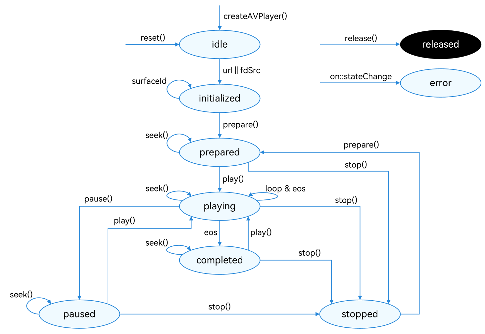

# Using AVPlayer to Play Audio (ArkTS)

<!--Kit: Media Kit-->
<!--Subsystem: Multimedia-->
<!--Owner: @chennotfound-->
<!--Designer: @dongyu_dy-->
<!--Tester: @xchaosioda-->
<!--Adviser: @w_Machine_cc-->
<!-- md-trans-meta sourceCommit=29aa363c8c07cd0d943043ae209ad0a85fcdc3c5 translatedAt=2026-08-11T01:52:47.727Z pushedAt=2026-08-11T12:51:21.301Z -->

[AVPlayer](media-kit-intro.md#avplayer) is used for end-to-end playback of raw media assets. This topic demonstrates how to use AVPlayer to play a complete audio track. To play PCM audio data, call [AudioRenderer](../audio/using-audiorenderer-for-playback.md).

The full playback process includes creating an AVPlayer instance, setting the media asset to play, setting playback parameters (volume, speed, and focus mode), controlling playback (play, pause, seek, and stop), resetting the playback configuration, and releasing the instance.

During application development, you can use the **state** property of AVPlayer to obtain its state or call **on('stateChange')** to listen for state changes. If the application performs an operation when the AVPlayer is not in the given state, the system may throw an exception or generate other undefined behavior.

**Figure 1** Playback state transition


For details about the states, see [AVPlayerState](../../reference/apis-media-kit/arkts-apis-media-t.md#avplayerstate9). When the AVPlayer is in the **prepared**, **playing**, **paused**, or **completed** state, the playback engine is working and a large amount of RAM is occupied. If your application does not need to use the AVPlayer, call **reset()** or **release()** to release the instance.

## Developer's Tips

This topic describes only how to implement the playback of a media asset. In practice, background playback and playback conflicts may be involved. You can refer to the following description to handle the situation based on your service requirements.

- If you want the application to continue playing the media asset in the background or when the screen is off, use the [AVSession](../avsession/avsession-access-scene.md) and [continuous task](../../task-management/continuous-task.md) to prevent the playback from being forcibly interrupted by the system.

- If the media asset being played involves audio, the playback may be interrupted by other applications based on the system audio management policy. (For details, see [Processing Audio Interruption Events](../audio/audio-playback-concurrency.md).) It is recommended that the player application proactively listen for audio interruption events and handle the events accordingly to avoid the inconsistency between the application status and the expected effect.

- When a device is connected to multiple audio output devices, the application can listen for audio output device changes through [on('audioOutputDeviceChangeWithInfo')](../../reference/apis-media-kit/arkts-apis-media-AVPlayer.md#onaudiooutputdevicechangewithinfo11) and handle them accordingly.

- To access online media resources, you must request the ohos.permission.INTERNET permission.

- To switch between the receiver and speaker, refer to the instructions provided in [Switching Audio Output Devices](../audio/audio-output-device-switcher.md).

## How to Develop

For details about the APIs, see [AVPlayer](../../reference/apis-media-kit/arkts-apis-media-AVPlayer.md).

1. Call **createAVPlayer()** to create an AVPlayer instance. The AVPlayer is the **idle** state.

    ```ts
    import { media } from '@kit.MediaKit';

    // Create an AVPlayer instance.
    let avPlayer = await media.createAVPlayer();
    ```

2. Set the events to listen for, which will be used in the full-process scenario. The table below lists the supported events.

   | Event Type| Description|
   | -------- | -------- |
   | stateChange | Mandatory; used to listen for changes of the **state** property of the AVPlayer.<br>To ensure proper functionality, the listener must be configured when the AVPlayer is in the idle state and before the resource setting API is called. If the listener is set after the resource setting API is called, the stateChange event reported during resource setting may fail to be received.|
   | error | Mandatory; used to listen for AVPlayer errors.<br>To ensure proper functionality, the listener must be configured when the AVPlayer is in the idle state and before the resource setting API is called. If the listener is set after the resource setting API is called, the error event reported during resource setting may fail to be received.|
   | durationUpdate | Used to listen for progress bar updates to refresh the media asset duration.|
   | timeUpdate | Used to listen for the current position of the progress bar to refresh the current time.|
   | seekDone | Used to listen for the completion status of the **seek()** request.<br>This event is reported when the AVPlayer seeks to the playback position specified in **seek()**.|
   | speedDone | Used to listen for the completion status of the **setSpeed()** request.<br>This event is reported when the AVPlayer plays music at the speed specified in **setSpeed()**.|
   | volumeChange | Used to listen for the completion status of the **setVolume()** request.<br>This event is reported when the AVPlayer plays music at the volume specified in **setVolume()**.|
   | bufferingUpdate | Used to listen for network playback buffer information. This event reports the buffer percentage and playback progress.|
   | audioInterrupt | Used to listen for audio interruption. This event is used together with the **audioInterruptMode** property.<br>This event is reported when the current audio playback is interrupted by another (for example, when a call is coming), so the application can process the event in time.|

    ```ts
    // This is only an example. You can set the events to listen for as required.
    import { BusinessError } from '@kit.BasicServicesKit';
    import { audio } from '@kit.AudioKit';

    avPlayer.on('stateChange', async (state: string, reason: media.StateChangeReason) => {
        // Add your service logic as required.
    });
    avPlayer.on('error', (error: BusinessError) => {
        // Add your service logic as required.
    });
    avPlayer.on('durationUpdate', (duration: number) => {
        // Add your service logic as required.
    });
    avPlayer.on('timeUpdate', (time: number) => {
        // Add your service logic as required.
    });
    avPlayer.on('seekDone', (seekDoneTime: number) => {
        // Add your service logic as required.
    });
    avPlayer.on('speedDone', (speed: number) => {
        // Add your service logic as required.
    });
    avPlayer.on('volumeChange', (vol: number) => {
        // Add your service logic as required.
    });
    avPlayer.on('bufferingUpdate', (infoType: media.BufferingInfoType, value: number) => {
        // Add your service logic as required.
    });
    avPlayer.on('audioInterrupt', (info: audio.InterruptEvent) => {
        // Add your service logic as required.
    });
    ```

3. Set the media asset URL. The AVPlayer enters the **initialized** state.

   > **NOTE**
   >
   > The URL in the code snippet below is for reference only. You need to check the media asset validity and set the URL based on service requirements.
   > 
   > - If local files are used for playback, ensure that the files are available and the application sandbox path is used for access. For details about how to obtain the application sandbox path, see [Obtaining Application File Paths](../../application-models/application-context-stage.md#obtaining-application-file-paths). For details about the application sandbox and how to push files to the application sandbox directory, see [File Management](../../file-management/app-sandbox-directory.md).
   > 
   > - If a network playback path is used, you must [declare the ohos.permission.INTERNET permission](../../security/AccessToken/declare-permissions.md).
   > 
   > - You can use ResourceManager.[getRawFd](../../reference/apis-localization-kit/js-apis-resource-manager.md#getrawfd9) to open the HAP resource file descriptor.
   > 
   > - The [playback formats and protocols](media-kit-intro.md#supported-formats-and-protocols) in use must be those supported by the system.

   **Example 1: playing a network media asset**

   ```ts
   let url = 'https://abc.bcd.example.mp3'; // Example only. Replace with the actual resource URL.
   if (avPlayer == null) {
       return;
   }
   avPlayer.url = url;
   ```

   **Example 2: playing a file in the application sandbox**

   ```ts
   let fdPath = 'fd://'; // Example only. Replace with the actual resource URL.
   let path : string = `${this.context.filesDir}/${this.fileName}`; // This is only for illustration. Replace it with the actual app sandbox file path.
   let file = await fs.open(path);
   fdPath = fdPath + file.fd;
   this.avPlayer = await media.createAVPlayer();
   this.avPlayer.url = fdPath;
   ```

4. (Optional) Set the audio renderer information. The information must be set when the AVPlayer is in the initialized state, that is, before **prepare()** is called for the first time. If the media source contains videos, the default value of **usage** is **STREAM_USAGE_MOVIE**. Otherwise, the default value of **usage** is **STREAM_USAGE_MUSIC**. The default value of **rendererFlags** is 0.

    To ensure that audio behavior meets usage expectations, you are advised to proactively configure [audio.AudioRendererInfo](../../reference/apis-audio-kit/arkts-apis-audio-i.md#audiorendererinfo8) based on specific business scenarios and actual requirements, and [select an appropriate playback stream type](../../media/audio/using-right-streamusage-for-playback.md) for the audio.

    ```ts
    import { audio } from '@kit.AudioKit';

    avPlayer.audioRendererInfo = {
        usage: audio.StreamUsage.STREAM_USAGE_MOVIE,
        rendererFlags: 0
    }
    ```

5. Prepare for playback. Specifically, call **prepare()** to switch the AVPlayer to the prepared state. In this state, you can obtain the video duration and adjust the volume.

    ```ts
    import { BusinessError } from '@kit.BasicServicesKit';

    avPlayer.prepare((err: BusinessError) => {
        if (err) {
            console.error('Failed to prepare,error message is :' + err.message);
        } else {
            console.info('Succeeded in preparing');
        }
    });
    ```

6. Perform audio playback control. Specifically, call **play()**, **pause()**, **seek()**, and **stop()** as required.

   > **NOTE**
   >
   > Starting from API version 23, silent frames are skipped during audio playback.

    ```ts
    import { BusinessError } from '@kit.BasicServicesKit';

    // Playback operation.
    avPlayer.play().then(() => {
        console.info('Succeeded in playing');
    }, (err: BusinessError) => {
        console.error('Failed to play,error message is :' + err.message);
    });
    // Pause operation.
    avPlayer.pause((err: BusinessError) => {
        if (err) {
            console.error('Failed to pause,error message is :' + err.message);
        } else {
            console.info('Succeeded in pausing');
        }
    });
    // Seek operation.
    let seekTime: number = 1000;
    avPlayer.seek(seekTime, media.SeekMode.SEEK_PREV_SYNC);
    // Stop operation.
    avPlayer.stop((err: BusinessError) => {
        if (err) {
            console.error('Failed to stop,error message is :' + err.message);
        } else {
            console.info('Succeeded in stopping');
        }
    });
    ```

7. (Optional) Replace resources. Specifically, call **reset()** to reset the AVPlayer. The AVPlayer enters the **idle** state again and you can change the media asset URL.

    ```ts
    import { BusinessError } from '@kit.BasicServicesKit';

    avPlayer.reset((err: BusinessError) => {
        avPlayer.url = url;
        if (err) {
            console.error('Failed to reset, error message is :' + err.message);
        } else {
            console.info('Succeeded in resetting');
        }
    });
    // Replace the URL.
    let url = 'https://example.com/audio.mp3'; // This is only an example. Replace it with the actual resource file URL.
    if (avPlayer == null) {
        return;
    }
    avPlayer.url = url;
    ```

8. Call **release()** to switch the AVPlayer to the **released** state. Now your application exits the playback.

    ```ts
    import { BusinessError } from '@kit.BasicServicesKit';

    avPlayer.release((err: BusinessError) => {
        if (err) {
            console.error('Failed to release,error message is :' + err.message);
        } else {
            console.info('Succeeded in releasing');
        }
    });
    ```

## Running the Sample Project

Refer to the sample code below to play a complete piece of music. In this example, 3 seconds after the playback starts, the playback is paused for 3 seconds and then resumed.

1. Create a project, download the [sample project](https://gitcode.com/openharmony/applications_app_samples/tree/master/code/DocsSample/Media/AVPlayer/AVPlayerArkTSAudio), and copy its resources to the corresponding directories.

    ```text
    AVPlayerArkTSAudio
    entry/src/main/ets/
    └── pages
        └── Index.ets (playback page)
    entry/src/main/resources/
    ├── base
    │   ├── element
    │   │   ├── color.json
    │   │   ├── float.json
    │   │   └── string.json
    │   └── media
    │       ├── ic_video_play.svg (play button image resource)
    │       └── ic_video_pause.svg (pause button image resource)
    └── rawfile
        └── test_01.mp3 (audio resource)
    ```

2. Compile and run the project.