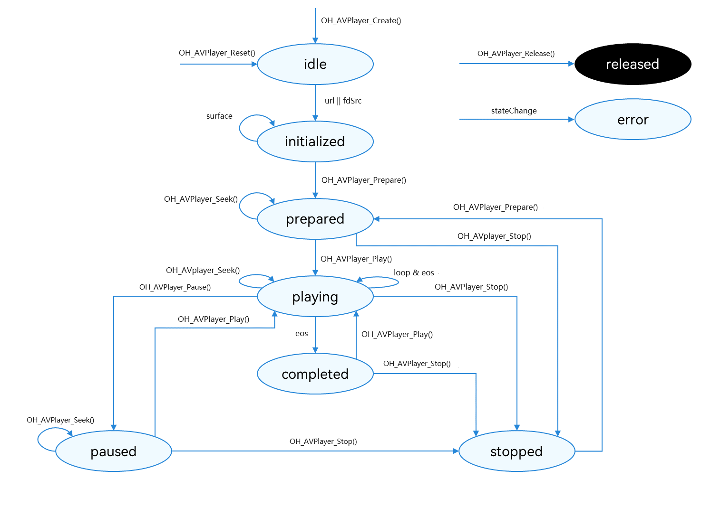

# Using AVPlayer to Play Audio (C/C++)

The [AVPlayer](media-kit-intro.md#avplayer) is used to play raw media assets in an end-to-end manner. In this topic, you will learn how to use the AVPlayer to play a complete piece of music.


The full playback process includes creating an AVPlayer instance, setting callback functions, setting the media asset to play, setting playback parameters (volume, speed, and focus mode), controlling playback (play, pause, seek, and stop), resetting the playback configuration, and releasing the AVPlayer instance.


During application development, you can obtain the playback process information through the callbacks [OH_AVPlayerOnInfoCallback](../../reference/apis-media-kit/capi-avplayer-base-h.md#oh_avplayeroninfocallback) and [OH_AVPlayerOnErrorCallback](../../reference/apis-media-kit/capi-avplayer-base-h.md#oh_avplayeronerrorcallback) of the AVPlayer. If the application performs an operation when the AVPlayer is not in the given state, the system may throw an exception or generate other undefined behavior.

**Figure 1** Playback state transition



For details about the states, see [AVPlayerState](../../reference/apis-media-kit/capi-avplayer-base-h.md#avplayerstate). When the AVPlayer is in the **prepared**, **playing**, **paused**, or **completed** state, the playback engine is working and a large amount of RAM is occupied. If your application does not need to use the AVPlayer, call **OH_AVPlayer_Reset()** or **OH_AVPlayer_Release()** to release the instance.

## Development Tips

This topic describes only how to implement the playback of a media asset. In practice, background playback and playback conflicts may be involved. You can refer to the following description to handle the situation based on your service requirements.

- If you want the application to continue playing the media asset in the background or when the screen is off, use the [AVSession](../avsession/avsession-access-scene.md) and [continuous task](../../task-management/continuous-task.md) to prevent the playback from being forcibly interrupted by the system. Only ArkTS APIs are provided.
- If the media asset being played involves audio, the playback may be interrupted by other applications based on the system audio management policy. (For details, see [Processing Audio Interruption Events](../audio/audio-playback-concurrency.md).) It is recommended that the player application proactively listen for audio interruption events [AV_INFO_TYPE_INTERRUPT_EVENT](../../reference/apis-media-kit/capi-avplayer-base-h.md#avplayeroninfotype) through [OH_AVPlayer_SetOnInfoCallback()](../../reference/apis-media-kit/capi-avplayer-h.md#oh_avplayer_setoninfocallback) and handle the events accordingly to avoid the inconsistency between the application status and the expected effect.
- When a device is connected to multiple audio output devices, the application can listen for audio output device changes [AV_INFO_TYPE_AUDIO_OUTPUT_DEVICE_CHANGE](../../reference/apis-media-kit/capi-avplayer-base-h.md#avplayeroninfotype) through [OH_AVPlayer_SetOnInfoCallback()](../../reference/apis-media-kit/capi-avplayer-h.md#oh_avplayer_setoninfocallback) and perform the processing accordingly.
- During the playback, an internal error may occur, for example, network data download failure or media service unavailability. You are advised to set an error callback through [OH_AVPlayer_SetOnErrorCallback()](../../reference/apis-media-kit/capi-avplayer-h.md#oh_avplayer_setonerrorcallback) and handle the error based on the error type.
- Use [OH_AVPlayer_SetOnInfoCallback()](../../reference/apis-media-kit/capi-avplayer-h.md#oh_avplayer_setoninfocallback) and [OH_AVPlayer_SetOnErrorCallback()](../../reference/apis-media-kit/capi-avplayer-h.md#oh_avplayer_setonerrorcallback) to set the information callback [OH_AVPlayerOnInfoCallback](../../reference/apis-media-kit/capi-avplayer-base-h.md#oh_avplayeroninfocallback) and error callback [OH_AVPlayerOnErrorCallback](../../reference/apis-media-kit/capi-avplayer-base-h.md#oh_avplayeronerrorcallback), respectively. After[OH_AVPlayerOnInfoCallback](../../reference/apis-media-kit/capi-avplayer-base-h.md#oh_avplayeroninfocallback) is set, the callback [OH_AVPlayerOnInfo](../../reference/apis-media-kit/capi-avplayer-base-h.md#oh_avplayeroninfo) set through [OH_AVPlayer_SetPlayerCallback()](../../reference/apis-media-kit/capi-avplayer-h.md#oh_avplayer_setplayercallback) is not executed. After [OH_AVPlayerOnErrorCallback](../../reference/apis-media-kit/capi-avplayer-base-h.md#oh_avplayeronerrorcallback) is set, the callback[OH_AVPlayerOnError](../../reference/apis-media-kit/capi-avplayer-base-h.md#oh_avplayeronerror) set through [OH_AVPlayer_SetPlayerCallback()](../../reference/apis-media-kit/capi-avplayer-h.md#oh_avplayer_setplayercallback) is not executed.

## How to Develop
Link the following dynamic library in the CMake script:
```
target_link_libraries(sample PUBLIC libavplayer.so)
```

To use [OH_AVPlayer_SetOnInfoCallback()](../../reference/apis-media-kit/capi-avplayer-h.md#oh_avplayer_setoninfocallback) and [OH_AVPlayer_SetOnErrorCallback()](../../reference/apis-media-kit/capi-avplayer-h.md#oh_avplayer_setonerrorcallback) to set the information callback and error callback, link the following dynamic link library in the CMake script:
```
target_link_libraries(sample PUBLIC libnative_media_core.so)
```

To use system logging, include the following header file:
```
#include <hilog/log.h>
```

In addition, link the following dynamic link library in the CMake script:
```
target_link_libraries(sample PUBLIC libhilog_ndk.z.so)
```

You can use C/C++ APIs related to audio playback by including the header files [avplayer.h](../../reference/apis-media-kit/capi-avplayer-h.md), [avpalyer_base.h](../../reference/apis-media-kit/capi-avplayer-base-h.md), and [native_averrors.h](../../reference/apis-avcodec-kit/native__averrors_8h.md).

Read [AVPlayer](../../reference/apis-media-kit/capi-avplayer.md) for the API reference.

1. Create an AVPlayer instance by calling [OH_AVPlayer_Create()](../../reference/apis-media-kit/capi-avplayer-h.md#oh_avplayer_create). The AVPlayer is initialized to the [AV_IDLE](../../reference/apis-media-kit/capi-avplayer-base-h.md#avplayerstate) state.

2. Set callbacks to listen for events. Specifically, call [OH_AVPlayer_SetOnInfoCallback()](../../reference/apis-media-kit/capi-avplayer-h.md#oh_avplayer_setoninfocallback) and [OH_AVPlayer_SetOnErrorCallback()](../../reference/apis-media-kit/capi-avplayer-h.md#oh_avplayer_setonerrorcallback) to set the information callback and error callback, which are used in the entire process scenario. The table below lists the supported events.
   | Event Type| Description|
   | -------- | -------- |
   | OH_AVPlayerOnInfoCallback | Mandatory; used to listen for AVPlayer process information.|
   | OH_AVPlayerOnErrorCallback | Mandatory; used to listen for AVPlayer errors.|

    The application can obtain more information from the callbacks set by calling [OH_AVPlayer_SetOnInfoCallback()](../../reference/apis-media-kit/capi-avplayer-h.md#oh_avplayer_setoninfocallback) and [OH_AVPlayer_SetOnErrorCallback()](../../reference/apis-media-kit/capi-avplayer-h.md#oh_avplayer_setonerrorcallback). In addition, it can set **userData** to distinguish different AVPlayer instances.

3. Set the media asset. Specifically, call [OH_AVPlayer_SetURLSource()](../../reference/apis-media-kit/capi-avplayer-h.md#oh_avplayer_seturlsource) to set the URL of the media asset. The AVPlayer enters the [AV_INITIALIZED](../../reference/apis-media-kit/capi-avplayer-base-h.md#avplayerstate) state.

4. (Optional) Set the audio stream type by calling [OH_AVPlayer_SetAudioRendererInfo()](../../reference/apis-media-kit/capi-avplayer-h.md#oh_avplayer_setaudiorendererinfo).

5. (Optional) Set the audio interruption mode by calling [OH_AVPlayer_SetAudioInterruptMode()](../../reference/apis-media-kit/capi-avplayer-h.md#oh_avplayer_setaudiointerruptmode).

6. Prepare for the playback by calling [OH_AVPlayer_Prepare()](../../reference/apis-media-kit/capi-avplayer-h.md#oh_avplayer_prepare). The AVPlayer enters the [AV_PREPARED](../../reference/apis-media-kit/capi-avplayer-base-h.md#avplayerstate) state. In this case, you can obtain the duration and set the volume.

7. (Optional) Set the audio effect mode of the AVPlayer by calling [OH_AVPlayer_SetAudioEffectMode()](../../reference/apis-media-kit/capi-avplayer-h.md#oh_avplayer_setaudioeffectmode).

8. Control the playback. You can call [OH_AVPlayer_Play()](../../reference/apis-media-kit/capi-avplayer-h.md#oh_avplayer_play), [OH_AVPlayer_Pause()](../../reference/apis-media-kit/capi-avplayer-h.md#oh_avplayer_pause), [OH_AVPlayer_Seek()](../../reference/apis-media-kit/capi-avplayer-h.md#oh_avplayer_seek), and [OH_AVPlayer_Stop()](../../reference/apis-media-kit/capi-avplayer-h.md#oh_avplayer_stop) to trigger different control operations.

9. (Optional) Reset the media asset by calling [OH_AVPlayer_Reset()](../../reference/apis-media-kit/capi-avplayer-h.md#oh_avplayer_reset). The AVPlayer enters the [AV_IDLE](../../reference/apis-media-kit/capi-avplayer-base-h.md#avplayerstate) state again and you can change the media asset URL.

10. Exit the playback. Specifically, call [OH_AVPlayer_Release()](../../reference/apis-media-kit/capi-avplayer-h.md#oh_avplayer_release) to destroy the instance. The AVPlayer enters the [AV_RELEASED](../../reference/apis-media-kit/capi-avplayer-base-h.md#avplayerstate) state and exits the playback. Further actions on the AVPlayer instance may lead to undefined behavior, such as the process crashing or the application terminating unexpectedly.

## Running the Sample Project

1. Create a project, download the [sample project](https://gitcode.com/openharmony/applications_app_samples/tree/master/code/DocsSample/Media/AVPlayer/AVPlayerNDKAudio), and copy its resources to the corresponding directories.
    ```
    AVPlayerNDKAudio
    entry/src/main/ets/
    └── pages
        └── Index.ets (playback page)
    entry/src/main/
    ├── cpp
    │   ├── types
    │   │   └── libentry
    │   │       └── Index.d.ts (JavaScript mapping of NDK functions)
    │ ├── CMakeLists.txt (CMake script)
    │   └── napi_init.cpp (NDK functions)
    └── resources
        ├── base
        │   ├── element
        │   │   ├── color.json
        │   │   ├── float.json
        │   │   └── string.json
        │   └── media
        │       ├── ic_video_play.svg (play button image resource)
        │       └── ic_video_pause.svg (pause button image resource)
        └── rawfile
            └── test_01.mp3 (audio resource)
    ```
2. Compile and run the project.
