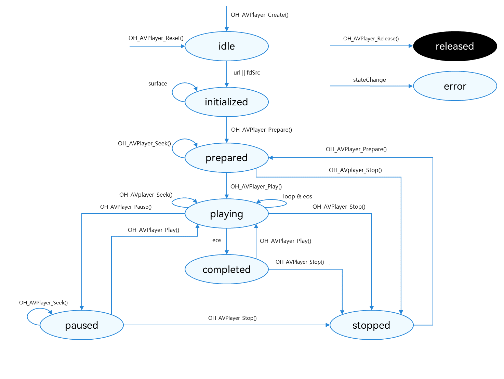

# Using AVPlayer to Play Streaming Media (C/C++)

<!--Kit: Media Kit-->
<!--Subsystem: Multimedia--> 
<!--Owner: @chennotfound-->
<!--Designer: @dongyu_dy-->
<!--Tester: @xchaosioda-->
<!--Adviser: @w_Machine_cc-->
<!-- md-trans-meta sourceCommit=d2114fc37f3314c085e77066b3804cf1306d0e8a translatedAt=2026-08-11T01:55:12.187Z pushedAt=2026-08-12T03:03:07.897Z -->

Starting from API version 11, [AVPlayer](../../reference/apis-media-kit/capi-avplayer.md) supports end-to-end playback of streaming media resources. This guide walks you through the complete playback of a streaming media example, covering AVPlayer streaming media playback features.

The complete playback process includes the following steps: creating an AVPlayer instance, setting callback functions, setting playback resources, setting playback parameters (volume/playback speed/audio focus mode), setting the playback window, controlling playback (play/pause/seek/stop), resetting the player, and releasing the player instance.

During app development, you can proactively obtain playback process information through AVPlayer's information callback function [OH_AVPlayerOnInfoCallback](../../reference/apis-media-kit/capi-avplayer-base-h.md#oh_avplayeroninfocallback) and error callback function [OH_AVPlayerOnErrorCallback](../../reference/apis-media-kit/capi-avplayer-base-h.md#oh_avplayeronerrorcallback). If the app performs operations when the video player is in an error state, the system may throw exceptions or generate other undefined behaviors.

For detailed state descriptions, see [AVPlayerState](../../reference/apis-media-kit/capi-avplayer-base-h.md#avplayerstate). When playback is in the prepared/playing/paused/completed state, the playback engine is in working state, which consumes a significant amount of system memory. If the client does not use the player temporarily, you can call `reset()` or `release()` to reclaim memory resources and use resources properly.

**Playback state changes:**


## Development Suggestions

This guide only describes how to implement streaming media resource playback. To play local resources, see [Using AVPlayer to Play Videos (C/C++)](using-ndk-avplayer-for-video-playback.md). If your app development involves background playback, playback conflicts, or similar scenarios, refer to the following instructions as needed.

Avoid forced interruption of playback by the system. This feature is only available for ArkTS APIs. To use this feature, see [Using AVPlayer to Play Videos (ArkTS)](video-playback.md).

- During playback, if the media data being played involves audio, the playback may be interrupted by other apps according to the system audio management policy (see [Handling Audio Focus Changes](../audio/audio-playback-concurrency.md#handling-audio-focus-changes)). You are advised to use [OH_AVPlayer_SetOnInfoCallback()](../../reference/apis-media-kit/capi-avplayer-h.md#oh_avplayer_setoninfocallback) to proactively listen for the audio interruption event [AVPlayerOnInfoType](../../reference/apis-media-kit/capi-avplayer-base-h.md#avplayeroninfotype).AV_INFO_TYPE_INTERRUPT_EVENT, and handle it accordingly based on the specific information to avoid inconsistencies between the app state and the expected behavior.

- When the device is connected to multiple audio output devices simultaneously, it is recommended to use [OH_AVPlayer_SetOnInfoCallback()](../../reference/apis-media-kit/capi-avplayer-h.md#oh_avplayer_setoninfocallback) to proactively listen for the audio output device change event [AVPlayerOnInfoType](../../reference/apis-media-kit/capi-avplayer-base-h.md#avplayeroninfotype).AV_INFO_TYPE_AUDIO_OUTPUT_DEVICE_CHANGE and handle it accordingly.

- During playback, the app may encounter exceptions due to internal system issues such as network data download failures or abnormal termination of media services. You are advised to set an error listener callback function through the [OH_AVPlayer_SetOnErrorCallback()](../../reference/apis-media-kit/capi-avplayer-h.md#oh_avplayer_setonerrorcallback) API, and handle different error types accordingly to prevent playback exceptions.

## How to Develop

- Link the dynamic libraries in the CMake script.

  ```C++
  target_link_libraries(sample PUBLIC libavplayer.so)
  ```

- When using [OH_AVPlayer_SetOnInfoCallback()](../../reference/apis-media-kit/capi-avplayer-h.md#oh_avplayer_setoninfocallback) and [OH_AVPlayer_SetOnErrorCallback()](../../reference/apis-media-kit/capi-avplayer-h.md#oh_avplayer_setonerrorcallback) to set the information listener callback function and error listener callback function, link the following dynamic library in the CMake script.

  ```C++
  target_link_libraries(sample PUBLIC libnative_media_core.so)
  ```

- When using the system log capability, include the following header file.

  ```C++
  #include <hilog/log.h>
  ```

  Link the following dynamic library in the CMake script.

  ```C++
  target_link_libraries(sample PUBLIC libhilog_ndk.z.so)
  ```

By including the [avplayer.h](../../reference/apis-media-kit/capi-avplayer-h.md), [avplayer_base.h](../../reference/apis-media-kit/capi-avplayer-base-h.md), and [native_averrors.h](../../reference/apis-avcodec-kit/capi-native-averrors-h.md) header files, you can use the APIs related to streaming media playback.

For detailed API descriptions, see [AVPlayer](../../reference/apis-media-kit/capi-avplayer.md).

1. Call [OH_AVPlayer_Create()](../../reference/apis-media-kit/capi-avplayer-h.md#oh_avplayer_create) to create an AVPlayer instance. The AVPlayer is initialized to the [AVPlayerState](../../reference/apis-media-kit/capi-avplayer-base-h.md#avplayerstate)`.AV_IDLE` state.

   <!-- @[OH_AVPlayer_Create](https://gitcode.com/openharmony/applications_app_samples/blob/master/code/DocsSample/Media/AVPlayer/AVPlayerNDKStreamingMedia/entry/src/main/cpp/napi_init.cpp) -->

   ``` C++
   OH_AVPlayer *player = OH_AVPlayer_Create();
   ```

2. Call [OH_AVPlayer_SetOnInfoCallback()](../../reference/apis-media-kit/capi-avplayer-h.md#oh_avplayer_setoninfocallback) and [OH_AVPlayer_SetOnErrorCallback()](../../reference/apis-media-kit/capi-avplayer-h.md#oh_avplayer_setonerrorcallback) to set the information listener callback and error listener callback for use in full-process scenarios. While obtaining more information, you can also differentiate playback instances by setting `userData`.

   The following table lists supported listener events.

   | Event Type | Description |
   | -------- | -------- |
   | OH_AVPlayerOnInfoCallback | Mandatory event. Listens for process information of the player.<br>This listener must be set when the player is in the AV_IDLE state and before any resource setting API is called. If the listener is set after calling a resource setting API, the OH_AVPlayerOnInfoCallback events reported during resource setting cannot be received. |
   | OH_AVPlayerOnErrorCallback | Mandatory event. Listens for error information of the player.<br>This listener must be set when the player is in the AV_IDLE state and before any resource setting API is called. If the listener is set after calling a resource setting API, the OH_AVPlayerOnErrorCallback events reported during resource setting cannot be received. |

   <!-- @[OH_AVPlayer_SetOnInfoCallback](https://gitcode.com/openharmony/applications_app_samples/blob/master/code/DocsSample/Media/AVPlayer/AVPlayerNDKStreamingMedia/entry/src/main/cpp/napi_init.cpp) -->  

   ``` C++
   // Set the callback to listen for information.
   LOG("call OH_AVPlayer_SetOnInfoCallback");
   int32_t ret = OH_AVPlayer_SetOnInfoCallback(player, OHAVPlayerOnInfoCallback, nullptr);
   LOG("OH_AVPlayer_SetOnInfoCallback ret:%{public}d", ret);
   ```

   <!-- @[OH_AVPlayer_SetOnErrorCallback](https://gitcode.com/openharmony/applications_app_samples/blob/master/code/DocsSample/Media/AVPlayer/AVPlayerNDKStreamingMedia/entry/src/main/cpp/napi_init.cpp) -->  

   ``` C++
   LOG("call OH_AVPlayer_SetOnErrorCallback");
   ret = OH_AVPlayer_SetOnErrorCallback(player, OHAVPlayerOnErrorCallback, nullptr);
   LOG("OH_AVPlayer_SetOnErrorCallback ret:%{public}d", ret);
   ```

3. Call [OH_AVPlayer_SetURLSource()](../../reference/apis-media-kit/capi-avplayer-h.md#oh_avplayer_seturlsource) to set the URL (supports on-demand and live streaming sources). The AVPlayer enters the [AVPlayerState](../../reference/apis-media-kit/capi-avplayer-base-h.md#avplayerstate)`.AV_INITIALIZED` (initialized) state.

   <!-- @[OH_AVPlayer_SetURLSource](https://gitcode.com/openharmony/applications_app_samples/blob/master/code/DocsSample/Media/AVPlayer/AVPlayerNDKStreamingMedia/entry/src/main/cpp/napi_init.cpp) -->  

   ``` C++
   LOG("player %{public}s >> URL source", url);
   LOG("call %{public}s", "OH_AVPlayer_SetURLSource");
   ret = OH_AVPlayer_SetURLSource(player, url);
   LOG("OH_AVPlayer_SetURLSource ret:%{public}d", ret);
   ```

4. (Optional) In live streaming scenarios, call [OH_AVPlayer_SetPlaybackStrategy()](../../reference/apis-media-kit/capi-avplayer-h.md#oh_avplayer_setplaybackstrategy) to enable smart frame catching for the AVPlayer.

   <!-- @[OH_AVPlayer_SetPlaybackStrategy](https://gitcode.com/openharmony/applications_app_samples/blob/master/code/DocsSample/Media/AVPlayer/AVPlayerNDKStreamingMedia/entry/src/main/cpp/napi_init.cpp) -->

   ``` C++
   void OHAVPlayerSetPlaybackStrategy(OH_AVPlayer *player)
   {
       // Set the playback strategy.
       OH_AVPlaybackStrategy *myStrategy = OH_AVPlaybackStrategy_Create();
       double waterLine = 6.0;
       OH_AVPlaybackStrategy_SetThresholdForAutoQuickPlay(myStrategy, waterLine); // Set smart frame chasing for live streaming scenarios.
       int32_t ret = OH_AVPlayer_SetPlaybackStrategy(player, myStrategy);
       LOG("OH_AVPlayer_SetPlaybackStrategy ret:%{public}d", ret);
       OH_AVPlaybackStrategy_Destroy(myStrategy);
   }
   ```

5. (Optional) Call [OH_AVPlayer_SetAudioRendererInfo()](../../reference/apis-media-kit/capi-avplayer-h.md#oh_avplayer_setaudiorendererinfo) to set the audio stream type for the AVPlayer.

   <!-- @[OH_AVPlayer_SetAudioRendererInfo](https://gitcode.com/openharmony/applications_app_samples/blob/master/code/DocsSample/Media/AVPlayer/AVPlayerNDKStreamingMedia/entry/src/main/cpp/napi_init.cpp) -->

   ``` C++
   // Set the audio stream type.
   LOG("call %{public}s", "OH_AVPlayer_SetAudioRendererInfo");
   OH_AudioStream_Usage streamUsage = OH_AudioStream_Usage::AUDIOSTREAM_USAGE_UNKNOWN;
   ret = OH_AVPlayer_SetAudioRendererInfo(player, streamUsage);
   LOG("OH_AVPlayer_SetAudioRendererInfo ret:%{public}d", ret);
   ```

6. (Optional) Call [OH_AVPlayer_SetAudioInterruptMode()](../../reference/apis-media-kit/capi-avplayer-h.md#oh_avplayer_setaudiointerruptmode) to set the audio stream interruption mode for the AVPlayer.

   <!-- @[OH_AVPlayer_SetAudioInterruptMode](https://gitcode.com/openharmony/applications_app_samples/blob/master/code/DocsSample/Media/AVPlayer/AVPlayerNDKStreamingMedia/entry/src/main/cpp/napi_init.cpp) -->

   ``` C++
   // Set the audio stream interrupt mode.
   LOG("call OH_AVPlayer_SetAudioInterruptMode");
   OH_AudioInterrupt_Mode interruptMode = OH_AudioInterrupt_Mode::AUDIOSTREAM_INTERRUPT_MODE_INDEPENDENT;
   ret = OH_AVPlayer_SetAudioInterruptMode(player, interruptMode);
   LOG("OH_AVPlayer_SetAudioInterruptMode ret:%{public}d", ret);
   ```

7. Call [OH_AVPlayer_SetVideoSurface()](../../reference/apis-media-kit/capi-avplayer-h.md#oh_avplayer_setvideosurface) to set the playback window. This function must be called after `SetSource` and before `Prepare`.

   <!-- @[OH_AVPlayer_SetVideoSurface](https://gitcode.com/openharmony/applications_app_samples/blob/master/code/DocsSample/Media/AVPlayer/AVPlayerNDKStreamingMedia/entry/src/main/cpp/napi_init.cpp) -->

   ``` C++
   ret = OH_AVPlayer_SetVideoSurface(player, context->nativeWindow_);
   LOG("OH_AVPlayer_SetVideoSurface ret:%{public}d", ret);
   ```

8. Call [OH_AVPlayer_Prepare()](../../reference/apis-media-kit/capi-avplayer-h.md#oh_avplayer_prepare). The AVPlayer enters the [AVPlayerState](../../reference/apis-media-kit/capi-avplayer-base-h.md#avplayerstate)`.AV_PREPARED` state, where you can obtain the duration and set the volume.

   <!-- @[OH_AVPlayer_Prepare](https://gitcode.com/openharmony/applications_app_samples/blob/master/code/DocsSample/Media/AVPlayer/AVPlayerNDKStreamingMedia/entry/src/main/cpp/napi_init.cpp) -->

   ``` C++
   ret = OH_AVPlayer_Prepare(player); // Triggered after the playback source is set.
   if (ret != AV_ERR_OK) {
       // Handle the exception.
       LOG("player %{public}s", "OH_AVPlayer_Prepare Err");
   }
   ```

9. (Optional) Call [OH_AVPlayer_SetAudioEffectMode()](../../reference/apis-media-kit/capi-avplayer-h.md#oh_avplayer_setaudioeffectmode) to set the audio effect mode for the AVPlayer.

   <!-- @[OH_AVPlayer_SetAudioEffectMode](https://gitcode.com/openharmony/applications_app_samples/blob/master/code/DocsSample/Media/AVPlayer/AVPlayerNDKStreamingMedia/entry/src/main/cpp/napi_init.cpp) -->

   ``` C++
   LOG("AVPlayerState AV_PREPARED");
   ret = OH_AVPlayer_SetAudioEffectMode(player, EFFECT_NONE); // Set the audio effect mode.
   LOG("OH_AVPlayer_SetAudioEffectMode ret:%{public}d", ret);
   ```

10. Call [OH_AVPlayer_Play()](../../reference/apis-media-kit/capi-avplayer-h.md#oh_avplayer_play), [OH_AVPlayer_Pause()](../../reference/apis-media-kit/capi-avplayer-h.md#oh_avplayer_pause), [OH_AVPlayer_Seek()](../../reference/apis-media-kit/capi-avplayer-h.md#oh_avplayer_seek), and [OH_AVPlayer_Stop()](../../reference/apis-media-kit/capi-avplayer-h.md#oh_avplayer_stop) to control the playback.

    <!-- @[OH_AVPlayer_Play](https://gitcode.com/openharmony/applications_app_samples/blob/master/code/DocsSample/Media/AVPlayer/AVPlayerNDKStreamingMedia/entry/src/main/cpp/napi_init.cpp) -->

    ``` C++
    static napi_value NAPI_Global_Play(napi_env env, napi_callback_info info) {
        int ret = -1;
        auto context = SampleManager::GetInstance();
        if (context->player_ != NULL) {
            ret = OH_AVPlayer_Play(context->player_);
            LOG("OH_AVPlayer_Play ret:%{public}d", ret);
        } else {
            LOG("no found Player Instances");
        }
        napi_value value;
        napi_create_int32(env, ret, &value);
        return value;
    }
    ```

    <!-- @[OH_AVPlayer_Pause](https://gitcode.com/openharmony/applications_app_samples/blob/master/code/DocsSample/Media/AVPlayer/AVPlayerNDKStreamingMedia/entry/src/main/cpp/napi_init.cpp) -->

    ``` C++
    static napi_value NAPI_Global_Pause(napi_env env, napi_callback_info info) {
        int ret = 100;
        auto context = SampleManager::GetInstance();
        if (context->player_ != NULL) {
            ret = OH_AVPlayer_Pause(context->player_);
            LOG("OH_AVPlayer_Pause ret:%{public}d", ret);
        } else {
            LOG("no found Player Instances");
        }
        napi_value value;
        napi_create_int32(env, ret, &value);
        return value;
    }
    ```

    <!-- @[OH_AVPlayer_Seek](https://gitcode.com/openharmony/applications_app_samples/blob/master/code/DocsSample/Media/AVPlayer/AVPlayerNDKStreamingMedia/entry/src/main/cpp/napi_init.cpp) -->

    ``` C++
    static napi_value NAPI_Global_Seek(napi_env env, napi_callback_info info) {
        size_t argc = 2;
        napi_value args[2] = {nullptr};
        napi_get_cb_info(env, info, &argc, args, nullptr, nullptr);
        int seekValue;
        napi_get_value_int32(env, args[0], &seekValue);
        int mode;
        napi_get_value_int32(env, args[1], &mode);
        auto context = SampleManager::GetInstance();
        if (context->player_ != NULL) {
            int ret;
            switch (mode) {
            case 0:
                LOG("call NAPI_Global_Seek value:%{public}d  mode:AV_SEEK_NEXT_SYNC", seekValue);
                ret = OH_AVPlayer_Seek(context->player_, seekValue, AV_SEEK_NEXT_SYNC);
                break;
            case 1:
                LOG("call NAPI_Global_Seek value:%{public}d  mode:AV_SEEK_PREVIOUS_SYNC", seekValue);
                ret = OH_AVPlayer_Seek(context->player_, seekValue, AV_SEEK_PREVIOUS_SYNC);
                break;
            case 2:
                LOG("call NAPI_Global_Seek value:%{public}d  mode:AV_SEEK_CLOSEST", seekValue);
                ret = OH_AVPlayer_Seek(context->player_, seekValue, AV_SEEK_CLOSEST);
                break;
            default:
                LOG("call NAPI_Global_Seek value:%{public}d  mode:AV_SEEK_PREVIOUS_SYNC", seekValue);
                ret = OH_AVPlayer_Seek(context->player_, seekValue, AV_SEEK_PREVIOUS_SYNC);
                break;
            }
            LOG("OH_AVPlayer_Seek ret:%{public}d", ret);
        } else {
            LOG("no found Player Instances");
        }
        napi_value value;
        napi_create_int32(env, 0, &value);
        return value;
    }
    ```

    <!-- @[OH_AVPlayer_Stop](https://gitcode.com/openharmony/applications_app_samples/blob/master/code/DocsSample/Media/AVPlayer/AVPlayerNDKStreamingMedia/entry/src/main/cpp/napi_init.cpp) -->

    ``` C++
    static napi_value NAPI_Global_Stop(napi_env env, napi_callback_info info) {
        int ret = 100;
        auto context = SampleManager::GetInstance();
        if (context->player_ != NULL) {
            ret = OH_AVPlayer_Stop(context->player_);
            LOG("OH_AVPlayer_Stop ret:%{public}d", ret);
        } else {
            LOG("no found Player Instances");
        }
        napi_value value;
        napi_create_int32(env, ret, &value);
        return value;
    }
    ```

11. (Optional) Call [OH_AVPlayer_Reset()](../../reference/apis-media-kit/capi-avplayer-h.md#oh_avplayer_reset) to reset the resource. AVPlayer re-enters the [AVPlayerState](../../reference/apis-media-kit/capi-avplayer-base-h.md#avplayerstate)`.AV_IDLE state`, allowing the resource URL to be changed.

    <!-- @[OH_AVPlayer_Reset](https://gitcode.com/openharmony/applications_app_samples/blob/master/code/DocsSample/Media/AVPlayer/AVPlayerNDKStreamingMedia/entry/src/main/cpp/napi_init.cpp) -->

    ``` C++
    static napi_value NAPI_Global_Reset(napi_env env, napi_callback_info info) {
        int ret = 100;
        auto context = SampleManager::GetInstance();
        if (context->player_ != NULL) {
            ret = OH_AVPlayer_Reset(context->player_);
            LOG("OH_AVPlayer_Reset ret:%{public}d", ret);
        } else {
            LOG("no found Player Instances");
        }
        napi_value value;
        napi_create_int32(env, ret, &value);
        return value;
    }
    ```

12. Call [OH_AVPlayer_Release()](../../reference/apis-media-kit/capi-avplayer-h.md#oh_avplayer_release) to destroy the instance. AVPlayer enters the [AVPlayerState](../../reference/apis-media-kit/capi-avplayer-base-h.md#avplayerstate)`.AV_RELEASED` state and exits playback. Any subsequent operations on the AVPlayer instance will result in undefined behavior, which may cause the app process to crash or the app to exit abnormally.

    <!-- @[OH_AVPlayer_Release](https://gitcode.com/openharmony/applications_app_samples/blob/master/code/DocsSample/Media/AVPlayer/AVPlayerNDKStreamingMedia/entry/src/main/cpp/napi_init.cpp) -->

    ``` C++
    static napi_value NAPI_Global_Release(napi_env env, napi_callback_info info) {
        int ret = -1;
        auto context = SampleManager::GetInstance();
        if (context->player_ != NULL) {
            ret = OH_AVPlayer_Release(context->player_);
            LOG("OH_AVPlayer_Release ret:%{public}d", ret);
        } else {
            LOG("no found Player Instances");
        }
        napi_value value;
        napi_create_int32(env, ret, &value);
        return value;
    }
    ```

## Running the Complete Sample

1. Create a project and download the [sample project](https://gitcode.com/openharmony/applications_app_samples/tree/master/code/DocsSample/Media/AVPlayer/AVPlayerNDKStreamingMedia).

2. Compile the newly created project and run it.