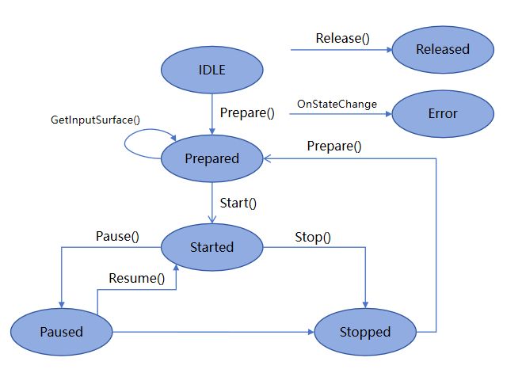

# Using AVRecorder to Record Videos (C/C++)

You can use the AVRecorder to develop the audio and video recording service. The AVRecorder supports audio capture, audio encoding, video encoding, audio encapsulation, and video encapsulation. It is applicable to simple video recording scenarios and can be used to generate local media files directly.

In this topic, you will learn how to use the AVRecorder to complete the process of starting, pausing, resuming, and stopping video recording.

During application development, you can use the **state** property of the AVRecorder to obtain the AVRecorder state or call **OH_AVRecorder_SetStateCallback** to listen for state changes. Your code must meet the state machine requirements. For example, **OH_AVRecorder_Pause()** is called only when the AVRecorder is in the **started** state, and **OH_AVRecorder_Resume()** is called only when it is in the **paused** state.

**Figure 1** Recording state transition



For details about the states, see [AVRecorderState](../../reference/apis-media-kit/js-apis-media.md#avrecorderstate9).


## Requesting Permissions

Before your development, configure the following permissions for your application.
- To use the microphone, request the ohos.permission.MICROPHONE permission. For details about how to request user authorization, see [Requesting User Authorization](../../security/AccessToken/request-user-authorization.md).
- To use the camera for photo capture, request the ohos.permission.CAMERA permission. For details about how to request user authorization, see [Requesting User Authorization](../../security/AccessToken/request-user-authorization.md).
- To read images or videos from Gallery, preferentially use the media library [Picker for access](../medialibrary/photoAccessHelper-photoviewpicker.md).
- To save images or videos to Gallery, preferentially use the [security component for storage](../medialibrary/photoAccessHelper-savebutton.md).

> **NOTE**
>
> To clone, back up, or synchronize images and videos in users' public directory, request the ohos.permission.READ_IMAGEVIDEO and ohos.permission.WRITE_IMAGEVIDEO permissions for reading and writing audio files. For details, see <!--RP1-->[Requesting Restricted Permissions](../../security/AccessToken/declare-permissions-in-acl.md)<!--RP1End-->.


## How to Develop

> **NOTE**
>
> The AVRecorder only processes video data. To complete video recording, it must work with the video data collection module, which transfers the captured video data to the AVRecorder for data processing through the surface. Currently, the commonly used data collection module is the camera module. For details, see [Camera Recording](../camera/native-camera-recording.md).
>
> For details about how to create and save a file, see [Accessing Application Files](../../file-management/app-file-access.md). By default, files are saved in the sandbox path of the application. To save them to Gallery, use the [security components](../medialibrary/photoAccessHelper-savebutton.md).


You can use C/C++ APIs related to video recording by including the header files [avrecorder.h](../../reference/apis-media-kit/capi-avrecorder-h.md), [avrecorder_base.h](../../reference/apis-media-kit/capi-avrecorder-base-h.md), and [native_averrors.h](../../reference/apis-avcodec-kit/native__averrors_8h.md).

Read [AVRecorder](../../reference/apis-media-kit/capi-avrecorder.md) for the API reference.

Link the dynamic library in the CMake script.
```
target_link_libraries(entry PUBLIC libavrecorder.so)
```

To use [OH_AVFormat](../../reference/apis-avcodec-kit/_core.md#oh_avformat) APIs, include the following header file:
```
#include <multimedia/player_framework/native_avformat.h>
```

In addition, link the following dynamic link library in the CMake script:
```
target_link_libraries(entry PUBLIC libnative_media_core.so)
```

To use system logging, include the following header file:
```
#include <hilog/log.h>
```

In addition, link the following dynamic link library in the CMake script:
```
target_link_libraries(entry PUBLIC libhilog_ndk.z.so)
```

1. Create an AVRecorder instance. The AVRecorder is in the **idle** state.

   ```C++
   #include <multimedia/player_framework/avrecorder.h>
   #include <multimedia/player_framework/avrecorder_base.h>

   static struct OH_AVRecorder *g_avRecorder = {};
   g_avRecorder = OH_AVRecorder_Create();
   ```

2. Set the events to listen for.
   | Event Type| Description|
   | -------- | -------- |
   | OnStateChange | Listens for AVRecorder state changes.|
   | OnError | Listens for AVRecorder errors.|
   | OnUri | Listens for media files generated by the AVRecorder.|

   ```C++
   // Set a callback to respond to state changes.
   void OnStateChange(OH_AVRecorder *recorder, OH_AVRecorder_State state,
       OH_AVRecorder_StateChangeReason reason, void *userData) {
       (void)recorder;
       (void)userData;

       // Convert reason into a string.
       const char *reasonStr = (reason == AVRECORDER_USER) ? "USER" : (reason == AVRECORDER_BACKGROUND) ? "BACKGROUND" : "UNKNOWN";

       if (state == IDLE) {
           OH_LOG_INFO(LOG_APP, "==NDKDemo== Recorder OnStateChange IDLE, reason: %{public}s", reasonStr);
           // Process the state change.
       }
       if (state == PREPARED) {
           OH_LOG_INFO(LOG_APP, "==NDKDemo== Recorder OnStateChange PREPARED, reason: %{public}s", reasonStr);
           // Process the state change.
       }
       if (state == STARTED) {
           OH_LOG_INFO(LOG_APP, "==NDKDemo== Recorder OnStateChange STARTED, reason: %{public}s", reasonStr);
           // Process the state change.
       }
       if (state == PAUSED) {
           OH_LOG_INFO(LOG_APP, "==NDKDemo== Recorder OnStateChange PAUSED, reason: %{public}s", reasonStr);
           // Process the state change.
       }
       if (state == STOPPED) {
           OH_LOG_INFO(LOG_APP, "==NDKDemo== Recorder OnStateChange STOPPED, reason: %{public}s", reasonStr);
           // Process the state change.
       }
       if (state == RELEASED) {
           OH_LOG_INFO(LOG_APP, "==NDKDemo== Recorder OnStateChange RELEASED, reason: %{public}s", reasonStr);
           // Process the state change.
       }
       if (state == ERROR) {
           OH_LOG_INFO(LOG_APP, "==NDKDemo== Recorder OnStateChange ERROR, reason: %{public}s", reasonStr);
           // Process the state change.
       }
   }

   // Set an error callback.
   void OnError(OH_AVRecorder *recorder, int32_t errorCode, const char *errorMsg, void *userData) {
       (void)recorder;
       (void)userData;
       OH_LOG_INFO(LOG_APP, "==NDKDemo== Recorder OnError errorCode: %{public}d, error message: %{public}s",
           errorCode, errorMsg);
   }

   // Set a callback to listen for the generation of media files. (This operation is required when AUTO_CREATE is selected for fileGenerationMode.)
   void OnUri(OH_AVRecorder *recorder, OH_MediaAsset *asset, void *userData) {
       (void)recorder;
       (void)userData;
       if (asset != nullptr) {
           auto changeRequest = OH_MediaAssetChangeRequest_Create(asset);
           if (changeRequest == nullptr) {
               OH_LOG_ERROR(LOG_APP, "==NDKDemo== changeRequest is null!");
               return;
           }
           MediaLibrary_ImageFileType imageFileType = MEDIA_LIBRARY_IMAGE_JPEG; // Available video interfaces are provided by the media library.
           uint32_t result = OH_MediaAssetChangeRequest_SaveCameraPhoto(changeRequest, imageFileType);
           OH_LOG_INFO(LOG_APP, "result of OH_MediaAssetChangeRequest_SaveCameraPhoto: %d", result);

           uint32_t resultChange = OH_MediaAccessHelper_ApplyChanges(changeRequest);
           OH_LOG_INFO(LOG_APP, "result of OH_MediaAccessHelper_ApplyChanges: %d", resultChange);

           OH_MediaAsset_Release(asset);
           OH_MediaAssetChangeRequest_Release(changeRequest);
       } else {
           OH_LOG_ERROR(LOG_APP, "Received null media asset!");
       }
   }
   ```

3. Set video recording parameters and call **OH_AVRecorder_Prepare()**. The AVRecorder enters the **prepared** state.

   > **NOTE**
   >
   > Pay attention to the following when configuring parameters:
   >
   > - Before parameter configuration, ensure that you have gained the required permissions. For details, see [Requesting Permissions](#requesting-permissions).
   >
   > - In pure video recording scenarios, set only video-related parameters in **OH_AVRecorder_Config** of **OH_AVRecorder_Prepare()**.
   >
   > - The [recording specifications](media-kit-intro.md#supported-formats) in use must be those supported. The video bit rate, resolution, and frame rate are subject to the ranges supported by the hardware device.
   >
   > - The recording output URL (URL in **OH_AVRecorder_Config** in the sample code) must be in the format of fd://xx (where xx indicates a file descriptor). You must call the basic file operation APIs to implement access to the application file. For details, see [Accessing Application Files](../../file-management/native-fileio-guidelines.md).

   ```C++
   void SetConfig(OH_AVRecorder_Config &config)
   {
       config.audioSourceType = AVRECORDER_MIC;
       config.videoSourceType = AVRECORDER_SURFACE_ES;

       // Set media properties.
       config.profile.audioBitrate = 96000;
       config.profile.audioChannels = 2;
       config.profile.audioCodec = AVRECORDER_AUDIO_AAC;
       config.profile.audioSampleRate = 48000;

       config.profile.videoBitrate = 2000000;
       config.profile.videoFrameWidth = 1280;
       config.profile.videoFrameHeight = 720;
       config.profile.videoFrameRate = 30;
       config.profile.videoCodec = AVRECORDER_VIDEO_AVC;
       config.profile.isHdr = false;
       config.profile.enableTemporalScale = false;
    
       config.profile.fileFormat = AVRECORDER_CFT_MPEG_4;
       config.fileGenerationMode = AVRECORDER_APP_CREATE;

       config.metadata.videoOrientation = (char*)malloc(2);
       if (config.metadata.videoOrientation != nullptr) {
           strcpy(config.metadata.videoOrientation, "0"); // Video rotation angle, which can be 0, 90, 180, or 270.
       }
       OH_LOG_INFO(LOG_APP, "==NDKDemo== videoOrientation: %{public}s", config.metadata.videoOrientation);

       config.metadata.location.latitude = 27.791863;
       config.metadata.location.longitude = 64.574687;
    }

    // Prepare for recording.
    static napi_value PrepareAVRecorder(napi_env env, napi_callback_info info)
    {
        (void)info;
        OH_LOG_INFO(LOG_APP, "==NDKDemo== PrepareAVRecorder in!");
        g_avRecorder = OH_AVRecorder_Create();
        OH_LOG_INFO(LOG_APP, "==NDKDemo== AVRecorder Create ok! g_avRecorder: %{public}p", g_avRecorder);
        if (g_avRecorder == nullptr) {
            OH_LOG_ERROR(LOG_APP, "==NDKDemo== AVRecorder Create failed!");
        }
        OH_AVRecorder_Config *config = new OH_AVRecorder_Config();
        
        SetConfig(*config);
    
        // 1. Set the URL. (This operation is required when APP_CREATE is selected for fileGenerationMode.)
        const std::string AVREORDER_ROOT = "/data/storage/el2/base/files/";
        int32_t outputFd = open((AVREORDER_ROOT + "avrecorder01.mp4").c_str(), O_RDWR | O_CREAT, 0777); // Set the file name.
        std::string fileUrl = "fd://" + std::to_string(outputFd);
        config->url = const_cast<char *>(fileUrl.c_str());
        OH_LOG_INFO(LOG_APP, "config.url is: %s", const_cast<char *>(fileUrl.c_str()));
    
        // 2. Set the callbacks.
        // Callback triggered when the state changes.
        OH_AVRecorder_SetStateCallback(g_avRecorder, OnStateChange, nullptr);

        // Callback triggered when an error occurs.
        OH_AVRecorder_SetErrorCallback(g_avRecorder, OnError, nullptr);

        // Callback triggered when a media file is generated. (This operation is required when AUTO_CREATE is selected for fileGenerationMode.)
        OH_AVErrCode ret = OH_AVRecorder_SetUriCallback(g_avRecorder, OnUri, nullptr);
        if (ret == AV_ERR_OK) {
            OH_LOG_INFO(LOG_APP, "==NDKDemo==  OH_AVRecorder_SetUriCallback succeed!");
        } else {
            OH_LOG_ERROR(LOG_APP, "==NDKDemo==  Failed to set URI callback, error code: %d", ret);
        }
        
        // 3. Call the prepare API.
        int result = OH_AVRecorder_Prepare(g_avRecorder, config);
        if (result != AV_ERR_OK) {
            OH_LOG_ERROR(LOG_APP, "==NDKDemo== AVRecorder Prepare failed %{public}d", result);
        }
      
        napi_value res;
        napi_create_int32(env, result, &res);
        return res;
    }
   ```

4. Obtain the surface ID required for video recording and initialize the video data input source. This step is performed in the video data collection module. For the camera module, you need to create a Camera instance, obtain the camera list, create a camera input stream, and create a video output stream. For details, see [Video Recording](../camera/native-camera-recording.md).

   Call **getInputSurface()**. The returned surface ID is transferred to the video data collection module, which is generally the camera module. The following sample code demonstrates only the procedure for obtaining the surface ID.

   The video data collection module obtains the surface based on the surface ID and transmits video data to the AVRecorder through the surface. Then the AVRecorder processes the video data.

   ```C++
   // Obtain the surface ID.
   OHNativeWindow *window = nullptr;
   int resultCode = OH_AVRecorder_GetInputSurface(g_avRecorder, &window);
   uint64_t surfaceId = 0;
   OH_NativeWindow_GetSurfaceId(window, &surfaceId);
   ```

5. Initialize the video data input source.

   This step is performed in the video data collection module. For the camera module, you need to create a Camera instance, obtain the camera list, create a camera input stream, and create a video output stream. For details, see [Video Recording](../camera/native-camera-recording.md).

6. Start recording.

   Start the input source to input video data, for example, by calling **OH_VideoOutput_Start()** of the camera module. Then call **OH_AVRecorder_Start()** to switch the AVRecorder to the **started** state.
   
   ```
   OH_AVRecorder_Start(g_avRecorder);
   ```
7. Call **OH_AVRecorder_Pause()** to pause recording. The AVRecorder enters the **paused** state. In addition, pause data input, for example, by calling **OH_VideoOutput_Stop()** of the camera module.
   ```
   OH_AVRecorder_Pause(g_avRecorder);
   ```
8. Call **OH_AVRecorder_Resume()** to resume recording. The AVRecorder enters the **started** state again.
   ```
   OH_AVRecorder_Resume(g_avRecorder);
   ```
9. Call **OH_AVRecorder_Stop()** to stop recording. The AVRecorder enters the **stopped** state again. In addition, stop camera recording.
   ```
   OH_AVRecorder_Stop(g_avRecorder);
   ```
10. Call **OH_AVRecorder_Reset()** to reset the resources. The AVRecorder enters the **idle** state. In this case, you can reconfigure the recording parameters.
      ```
      OH_AVRecorder_Reset(g_avRecorder);
      ```
11. Call **OH_AVRecorder_Release()** to release the resources. The AVRecorder enters the **released** state. In addition, release the video data input source resources (camera resources in this example).
      ```
      OH_AVRecorder_Release(g_avRecorder);
      ```


## Development Example

Refer to the sample code below to complete the process of creating a recorder instance, preparing for, starting, pausing, resuming, and stopping recording, resetting the recording state, and releasing the recording resources.

   ```C++
   #include <fcntl.h>
   #include "hilog/log.h"
   #include <multimedia/player_framework/avrecorder.h>
   #include <multimedia/player_framework/avrecorder_base.h>
   #include <multimedia/media_library/media_asset_change_request_capi.h>
   #include <multimedia/media_library/media_access_helper_capi.h>
   #include <multimedia/media_library/media_asset_capi.h>

   static struct OH_AVRecorder *g_avRecorder = {};

   // Set a callback to respond to state changes.
   void OnStateChange(OH_AVRecorder *recorder, OH_AVRecorder_State state,
                      OH_AVRecorder_StateChangeReason reason, void *userData)
   {
      (void)recorder;
      (void)userData;

      // Convert reason into a string.
      const char *reasonStr = (reason == AVRECORDER_USER) ? "USER" :
                              (reason == AVRECORDER_BACKGROUND) ? "BACKGROUND" : "UNKNOWN";

      if (state == AVRECORDER_IDLE) {
         OH_LOG_INFO(LOG_APP, "==NDKDemo== Recorder OnStateChange IDLE, reason: %{public}s", reasonStr);
         // Process the state change.
      }
      if (state == AVRECORDER_PREPARED) {
         OH_LOG_INFO(LOG_APP, "==NDKDemo== Recorder OnStateChange PREPARED, reason: %{public}s", reasonStr);
         // Process the state change.
      }
      if (state == AVRECORDER_STARTED) {
         OH_LOG_INFO(LOG_APP, "==NDKDemo== Recorder OnStateChange STARTED, reason: %{public}s", reasonStr);
         // Process the state change.
      }
      if (state == AVRECORDER_PAUSED) {
         OH_LOG_INFO(LOG_APP, "==NDKDemo== Recorder OnStateChange PAUSED, reason: %{public}s", reasonStr);
         // Process the state change.
      }
      if (state == AVRECORDER_STOPPED) {
         OH_LOG_INFO(LOG_APP, "==NDKDemo== Recorder OnStateChange STOPPED, reason: %{public}s", reasonStr);
         // Process the state change.
      }
      if (state == AVRECORDER_RELEASED) {
         OH_LOG_INFO(LOG_APP, "==NDKDemo== Recorder OnStateChange RELEASED, reason: %{public}s", reasonStr);
         // Process the state change.
      }
      if (state == AVRECORDER_ERROR) {
         OH_LOG_INFO(LOG_APP, "==NDKDemo== Recorder OnStateChange ERROR, reason: %{public}s", reasonStr);
         // Process the state change.
      }
   }

   // Set an error callback.
   void OnError(OH_AVRecorder *recorder, int32_t errorCode, const char *errorMsg, void *userData)
   {
      (void)recorder;
      (void)userData;
      OH_LOG_INFO(LOG_APP, "==NDKDemo== Recorder OnError errorCode: %{public}d, error message: %{public}s",
                  errorCode, errorMsg);
   }

   // Set a callback to listen for the generation of media files. (This operation is required when AUTO_CREATE is selected for fileGenerationMode.)
   void OnUri(OH_AVRecorder *recorder, OH_MediaAsset *asset, void *userData)
   {
      (void)recorder;
      (void)userData;
      OH_LOG_INFO(LOG_APP, "==NDKDemo== OnUri in!");
      if (asset != nullptr) {
         auto changeRequest = OH_MediaAssetChangeRequest_Create(asset);
         if (changeRequest == nullptr) {
            OH_LOG_ERROR(LOG_APP, "==NDKDemo== changeRequest is null!");
            return;
         }
         MediaLibrary_ImageFileType imageFileType = MEDIA_LIBRARY_IMAGE_JPEG; // Available video interfaces are provided by the media library.
         uint32_t result = OH_MediaAssetChangeRequest_SaveCameraPhoto(changeRequest, imageFileType);
         OH_LOG_INFO(LOG_APP, "result of OH_MediaAssetChangeRequest_SaveCameraPhoto: %d", result);

         uint32_t resultChange = OH_MediaAccessHelper_ApplyChanges(changeRequest);
         OH_LOG_INFO(LOG_APP, "result of OH_MediaAccessHelper_ApplyChanges: %d", resultChange);

         OH_MediaAsset_Release(asset);
         OH_MediaAssetChangeRequest_Release(changeRequest);
      } else {
         OH_LOG_ERROR(LOG_APP, "Received null media asset!");
      }
      OH_LOG_INFO(LOG_APP, "==NDKDemo== OnUri out!");
   }

   void SetConfig(OH_AVRecorder_Config &config)
   {
      config.audioSourceType = AVRECORDER_MIC;
      config.videoSourceType = AVRECORDER_SURFACE_ES;

      // Set media properties.
      config.profile.audioBitrate = 96000;
      config.profile.audioChannels = 2;
      config.profile.audioCodec = AVRECORDER_AUDIO_AAC;
      config.profile.audioSampleRate = 48000;

      config.profile.videoBitrate = 2000000;
      config.profile.videoFrameWidth = 1280;
      config.profile.videoFrameHeight = 720;
      config.profile.videoFrameRate = 30;
      config.profile.videoCodec = AVRECORDER_VIDEO_AVC;
      config.profile.isHdr = false;
      config.profile.enableTemporalScale = false;

      config.profile.fileFormat = AVRECORDER_CFT_MPEG_4;
      config.fileGenerationMode = AVRECORDER_APP_CREATE;

      config.metadata.videoOrientation = (char *)malloc(2);
      if (config.metadata.videoOrientation != nullptr) {
         strcpy(config.metadata.videoOrientation, "0"); // Video rotation angle, which can be 0, 90, 180, or 270.
      }
      OH_LOG_INFO(LOG_APP, "==NDKDemo== videoOrientation: %{public}s", config.metadata.videoOrientation);

      config.metadata.location.latitude = 27.791863;
      config.metadata.location.longitude = 64.574687;
   }

   // 1. Prepare for recording.
   static napi_value PrepareAVRecorder(napi_env env, napi_callback_info info)
   {
      (void)info;
      OH_LOG_INFO(LOG_APP, "==NDKDemo== PrepareAVRecorder in!");
      g_avRecorder = OH_AVRecorder_Create();
      OH_LOG_INFO(LOG_APP, "==NDKDemo== AVRecorder Create ok! g_avRecorder: %{public}p", g_avRecorder);
      if (g_avRecorder == nullptr) {
         OH_LOG_ERROR(LOG_APP, "==NDKDemo== AVRecorder Create failed!");
      }
      OH_AVRecorder_Config *config = new OH_AVRecorder_Config();

      SetConfig(*config);

      // 1.1 Set the URL. (This operation is required when APP_CREATE is selected for fileGenerationMode.)
      const std::string AVREORDER_ROOT = "/data/storage/el2/base/files/";
      int32_t outputFd = open((AVREORDER_ROOT + "avrecorder01.mp4").c_str(), O_RDWR | O_CREAT, 0777); // Set the file name.
      std::string fileUrl = "fd://" + std::to_string(outputFd);
      config->url = const_cast<char *>(fileUrl.c_str());

      // 1.2 Set the callbacks.
      // Callback triggered when the state changes.
      OH_AVRecorder_SetStateCallback(g_avRecorder, OnStateChange, nullptr);

      // Callback triggered when an error occurs.
      OH_AVRecorder_SetErrorCallback(g_avRecorder, OnError, nullptr);

      // Callback triggered when a media file is generated. (This operation is required when AUTO_CREATE is selected for fileGenerationMode.)
      OH_AVErrCode ret = OH_AVRecorder_SetUriCallback(g_avRecorder, OnUri, nullptr);
      if (ret == AV_ERR_OK) {
         OH_LOG_INFO(LOG_APP, "==NDKDemo==  OH_AVRecorder_SetUriCallback succeed!");
      } else {
         OH_LOG_ERROR(LOG_APP, "==NDKDemo==  Failed to set URI callback, error code: %d", ret);
      }

      // 1.3 Call the prepare API.
      int result = OH_AVRecorder_Prepare(g_avRecorder, config);
      if (result != AV_ERR_OK) {
         OH_LOG_ERROR(LOG_APP, "==NDKDemo== AVRecorder Prepare failed %{public}d", result);
      }

      napi_value res;
      napi_create_int32(env, result, &res);
      return res;
   }

   // 2. Start the camera.
   static napi_value PrepareCamera(napi_env env, napi_callback_info info)
   {
      OH_LOG_INFO(LOG_APP, "==NDKDemo== AVRecorder PrepareCamera");
      (void)info;

      OHNativeWindow *window = nullptr;
      int resultCode = OH_AVRecorder_GetInputSurface(g_avRecorder, &window);
      if (resultCode != AV_ERR_OK || window == nullptr) {
          OH_LOG_INFO(LOG_APP, "==NDKDemo== AVRecorder OH_AVRecorder_GetInputSurface failed!");
          napi_value errorResult;
          napi_create_int32(env, -1, &errorResult); // -1 indicates an error.
          return errorResult;
      }
      uint64_t surfaceId = 0;
      OH_NativeWindow_GetSurfaceId(window, &surfaceId);

      // Pass the surface ID to the data collection module. For details, see the camera module.

      int result = 0;
      napi_value res;
      napi_create_int32(env, result, &res);
      return res;
   }

   // 3. Start recording.
   static napi_value StartAVRecorder(napi_env env, napi_callback_info info)
   {
      (void)info;
      int result = OH_AVRecorder_Start(g_avRecorder);
      if (result != AV_ERR_OK) {
         OH_LOG_ERROR(LOG_APP, "==NDKDemo== AVRecorder Start failed %{public}d", result);
      }
      napi_value res;
      napi_create_int32(env, result, &res);
      return res;
   }

   // 4. Pause recording.
   static napi_value PauseAVRecorder(napi_env env, napi_callback_info info)
   {
      (void)info;
      int result = OH_AVRecorder_Pause(g_avRecorder);
      if (result != AV_ERR_OK) {
         OH_LOG_ERROR(LOG_APP, "==NDKDemo== AVRecorder Pause failed %{public}d", result);
      }
      napi_value res;
      napi_create_int32(env, result, &res);
      return res;
   }

   // 5. Resume recording.
   static napi_value ResumeAVRecorder(napi_env env, napi_callback_info info)
   {
      (void)info;
      int result = OH_AVRecorder_Resume(g_avRecorder);
      if (result != AV_ERR_OK) {
         OH_LOG_ERROR(LOG_APP, "==NDKDemo== AVRecorder Resume failed %{public}d", result);
      }
      napi_value res;
      napi_create_int32(env, result, &res);
      return res;
   }

   // 6. Stop recording.
   static napi_value StopAVRecorder(napi_env env, napi_callback_info info)
   {
      (void)info;
      int result = OH_AVRecorder_Stop(g_avRecorder);
      if (result != AV_ERR_OK) {
         OH_LOG_ERROR(LOG_APP, "==NDKDemo== AVRecorder Stop failed %{public}d", result);
      }
      napi_value res;
      napi_create_int32(env, result, &res);
      return res;
   }

   // 7. Reset the recording state.
   static napi_value ResetAVRecorder(napi_env env, napi_callback_info info)
   {
      (void)info;
      // Check whether g_avRecorder is valid.
      if (g_avRecorder == nullptr) {
         OH_LOG_ERROR(LOG_APP, "==NDKDemo== g_avRecorder is nullptr!");
         napi_value res;
         napi_create_int32(env, AV_ERR_INVALID_VAL, &res);
         return res;
      }

      int result = OH_AVRecorder_Reset(g_avRecorder);
      if (result != AV_ERR_OK) {
         OH_LOG_ERROR(LOG_APP, "==NDKDemo== AVRecorder Reset failed %{public}d", result);
      }
      napi_value res;
      napi_create_int32(env, result, &res);
      return res;
   }

   // 8. Release recording resources.
   static napi_value ReleaseAVRecorder(napi_env env, napi_callback_info info)
   {
      (void)info;
      // Check whether g_avRecorder is valid.
      if (g_avRecorder == nullptr) {
         OH_LOG_ERROR(LOG_APP, "==NDKDemo== g_avRecorder is nullptr!");
         napi_value res;
         napi_create_int32(env, AV_ERR_INVALID_VAL, &res);
         return res;
      }
      
      int result = OH_AVRecorder_Release(g_avRecorder);
      g_avRecorder = nullptr;   // After recording resources are released, the g_avRecorder pointer must be explicitly set to null.

      if (result != AV_ERR_OK) {
         OH_LOG_ERROR(LOG_APP, "==NDKDemo== AVRecorder Release failed %{public}d", result);
      }
      napi_value res;
      napi_create_int32(env, result, &res);
      return res;
   }
   ```
