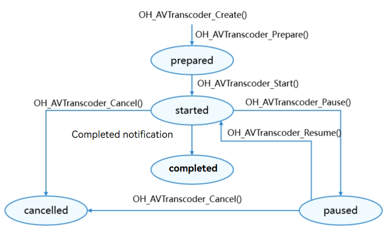

# Using AVTranscoder to Transcode Videos (C/C++)

You can use the [AVTranscoder](media-kit-intro.md#avtranscoder) to implement video transcoding. <!--RP1--><!--RP1End--> You can call [canIUse](../../reference/common/init.md#caniuse) to check whether the device supports AVTranscoder and continue the operations described in this topic only when the return value of **canIUse("SystemCapability.Multimedia.Media.AVTranscoder")** is **true**.

This topic describes how to use the AVTranscoder to implement video transcoding, covering the process of starting, pausing, resuming, and exiting transcoding.

**Figure 1** AVTranscoder state transition



For details about the states, see [OH_AVTranscoder_State](../../reference/apis-media-kit/capi-avtranscoder-base-h.md#oh_avtranscoder_state).

## How to Develop

Link the dynamic libraries in the CMake script.

```
target_link_libraries(entry PUBLIC libavtranscoder.so libace_napi.z.so)
```

To use system logging, include the following header file:

```c++
#include <hilog/log.h>
```

In addition, link the following dynamic link library in the CMake script:

```
target_link_libraries(sample PUBLIC libhilog_ndk.z.so)
```

Import the **avtranscoder.h** and **avtranscoder_base.h** header files to use the transcoding APIs.
Read [AVTranscoder](../../reference/apis-media-kit/capi-avtranscoder.md) for the API reference.

1. Call **OH_AVTranscoder_Create()** to create a transcoding instance.

    ```c++
    OH_AVTranscoder *transcoder = OH_AVTranscoder_Create();
    ```

2. Set callback functions. Specifically, call **OH_AVTranscoder_SetStateCallback()**, **OH_AVTranscoder_SetErrorCallback()**, and **OH_AVTranscoder_SetProgressUpdateCallback()** to set callbacks for transcoding status changes, transcoding error events, and transcoding progress update events, respectively. The table below describes these callbacks.

   | Event Type| Description|
   | -------- | -------- |
   | OH_AVTranscoder_OnStateChange | Optional event, which is invoked when the transcoding status changes.|
   | OH_AVTranscoder_OnError | Optional event, which is invoked when a transcoding error occurs.|
   | OH_AVTranscoder_OnProgressUpdate | Optional event, which is invoked when the transcoding progress changes.|

   You can also customize data using **userData** in these callbacks.

    ```c++
    typedef struct NdkAVTransCoderUser {
       using StateChangeFunc = std::function<void()>;
       NdkAVTransCoderUser();
       NdkAVTransCoderUser(const NdkAVTransCoderUser &other) = delete;
       NdkAVTransCoderUser &operator=(const NdkAVTransCoderUser &other) = delete;
       ~NdkAVTransCoderUser();
 
       void OnStateChangeCb(OH_AVTranscoder *transcoder, OH_AVTranscoder_State state);
       void OnErrorCb(OH_AVTranscoder *transcoder, int32_t errorCode, const char  *errorMsg);
       void OnProgressUpdateCb(OH_AVTranscoder *transcoder, int progress);
       std::map<uint32_t, StateChangeFunc> stateChangeFuncs_;
 
       OH_AVTranscoder *transcoder = nullptr;
       int32_t errorCode = AV_ERR_OK;
       OH_AVTranscoder_State transCoderState = AVTRANSCODER_PREPARED;
       int avTranscoderProgress = 0;
       int inStartStateCount = 0;
    } NdkAVTransCoderUser;
 
    void NdkAVTransCoderUser::OnProgressUpdateCb(OH_AVTranscoder *transcoder, int  progress)
    {
       LOG("NdkAVTransCoderUser OnProgressUpdateCb progress: %{public}d", progress);
       this->avTranscoderProgress = progress;
    }
 
    void NdkAVTransCoderUser::OnErrorCb(OH_AVTranscoder *transcoder, int32_t  errorCode, const char *errorMsg)
    {
       LOG("NdkAVTransCoderUser OnErrorCb errorCode: %{public}d ,errorMsg: %{public} s", errorCode,
          errorMsg == nullptr ? "unknown" : errorMsg);
       this->errorCode = errorCode;
    }
 
    void NdkAVTransCoderUser::OnStateChangeCb(OH_AVTranscoder *transcoder,  OH_AVTranscoder_State state)
    {
       this->transCoderState = state;
       if (transcoder == nullptr) {
          return;
       }
       int32_t ret = -1;
       switch (state) {
          case AVTRANSCODER_PREPARED: {
                this->transCoderState = AVTRANSCODER_PREPARED;
                if (this->stateChangeFuncs_.count(AVTRANSCODER_PREPARED) > 0) {
                   this->stateChangeFuncs_[AVTRANSCODER_PREPARED]();
                }
                break;
          }
          case AVTRANSCODER_STARTED: {
                this->transCoderState = AVTRANSCODER_STARTED;
                if (this->stateChangeFuncs_.count(AVTRANSCODER_STARTED) > 0) {
                   this->stateChangeFuncs_[AVTRANSCODER_STARTED]();
                }
                break;
          }
          case AVTRANSCODER_PAUSED: {
                this->transCoderState = AVTRANSCODER_PAUSED;
                if (this->stateChangeFuncs_.count(AVTRANSCODER_PAUSED) > 0) {
                   this->stateChangeFuncs_[AVTRANSCODER_PAUSED]();
                }
                break;
          }
          case AVTRANSCODER_CANCELLED: {
                this->transCoderState = AVTRANSCODER_CANCELLED;
                if (this->stateChangeFuncs_.count(AVTRANSCODER_CANCELLED) > 0) {
                   this->stateChangeFuncs_[AVTRANSCODER_CANCELLED]();
                }
                break;
          }
          case AVTRANSCODER_COMPLETED: {
                this->transCoderState = AVTRANSCODER_COMPLETED;
                if (this->stateChangeFuncs_.count(AVTRANSCODER_COMPLETED) > 0) {
                   this->stateChangeFuncs_[AVTRANSCODER_COMPLETED]();
                }
                break;
          }
          default:
                break;
       }
    }
 
    static void AvTranscoderStateChangeCbImpl(OH_AVTranscoder *transcoder,  OH_AVTranscoder_State state, void *userData)
    {
       LOG("AvTranscoderStateChangeCbImpl state: %{public}d", state);
       NdkAVTransCoderUser *ndkAVTransCoderUser =  reinterpret_cast<NdkAVTransCoderUser *>(userData);
       if (ndkAVTransCoderUser == nullptr || transcoder == nullptr) {
          LOGE("AvTranscoderStateChangeCbImpl ndkAVTransCoderUser or transcoder is  nullptr");
          return;
       }
       ndkAVTransCoderUser->OnStateChangeCb(transcoder, state);
    }
 
    static void AvTranscoderErrorCbImpl(OH_AVTranscoder *transcoder, int32_t  errorCode, const char *errorMsg,
                                        void *userData)
    {
       LOG("AvTranscoderErrorCbImpl errorCode: %{public}d, errorMsg: %{public}s",  errorCode,
          errorMsg == nullptr ? "unknown" : errorMsg);
       NdkAVTransCoderUser *ndkAVTransCoderUser =  reinterpret_cast<NdkAVTransCoderUser *>(userData);
       if (ndkAVTransCoderUser == nullptr || transcoder == nullptr) {
          LOGE("AvTranscoderErrorCbImpl ndkAVTransCoderUser or transcoder is  nullptr");
          return;
       }
       ndkAVTransCoderUser->OnErrorCb(transcoder, errorCode, errorMsg);
    }
 
    static void AvTranscoderProgressUpdateCbImpl(OH_AVTranscoder *transcoder, int  progress, void *userData)
    {
       LOG("AvTranscoderProgressUpdateCbImpl progress: %{public}d", progress);
       NdkAVTransCoderUser *ndkAVTransCoderUser =  reinterpret_cast<NdkAVTransCoderUser *>(userData);
       if (ndkAVTransCoderUser == nullptr || transcoder == nullptr) {
          LOGE("AvTranscoderProgressUpdateCbImpl ndkAVTransCoderUser or transcoder is  nullptr");
          return;
       }
       ndkAVTransCoderUser->OnProgressUpdateCb(transcoder, progress);
    }
    static napi_value OHAvTranscoderNdkPlay(napi_env env, napi_callback_info info)
    {
       OH_AVTranscoder_SetStateCallback(transcoder, AvTranscoderStateChangeCbImpl, transcoderUser); // Set the status callback.
       OH_AVTranscoder_SetErrorCallback(transcoder, AvTranscoderErrorCbImpl, transcoderUser); // Set the error callback.
       OH_AVTranscoder_SetProgressUpdateCallback(transcoder, AvTranscoderProgressUpdateCbImpl, transcoderUser); // Set the progress callback.
    }
    ```

3. Call **OH_AVTranscoderConfig_Create()** to create a transcoding configuration instance.

    ```c++
    OH_AVTranscoder_Config *config = OH_AVTranscoderConfig_Create();
    ```

4. Call **OH_AVTranscoderConfig_SetSrcFD()** to set the file descriptor of the source video.

    ```c++
    OH_AVTranscoderConfig_SetSrcFD(config, srcFd, srcOffset, length); // Set the file descriptor of the source video.
    ```

5. Call **OH_AVTranscoderConfig_SetDstFD()** to set the file descriptor of the output video.

    ```c++
    OH_AVTranscoderConfig_SetDstFD(config, dstFd); // Set the file descriptor of the output video.
    ```

6. (Optional) Call **OH_AVTranscoderConfig_SetDstVideoType()** to set the encoding format of the output video.

    ```c++
    OH_AVTranscoderConfig_SetDstVideoType(config, "video/avc"); // (Optional) Set the video encoding format.
    ```

7. (Optional) Call **OH_AVTranscoderConfig_SetDstAudioType()** to set the encoding format of the output audio.

    ```c++
    OH_AVTranscoderConfig_SetDstAudioType(config, "audio/mp4a-latm"); // (Optional) Audio encoding format.
    ```

8. Call **OH_AVTranscoderConfig_SetDstFileType()** to set the container format of the output video.

    ```c++
    OH_AVTranscoderConfig_SetDstFileType(config, AV_OUTPUT_FORMAT_MPEG_4); // Container format.
    ```

9. (Optional) Call **OH_AVTranscoderConfig_SetDstAudioBitrate()** to set the bit rate of the output audio.

    ```c++
    const std::int32_t AUDIO_BITRATE = 200000;
    OH_AVTranscoderConfig_SetDstAudioBitrate(config, AUDIO_BITRATE); // (Optional) Audio bit rate.
    ```

10. (Optional) Call **OH_AVTranscoderConfig_SetDstVideoBitrate()** to set the bit rate of the output video.

    ```c++
    const std::int32_t VIDEO_BITRATE = 3000000;
    OH_AVTranscoderConfig_SetDstVideoBitrate(config, VIDEO_BITRATE); // (Optional) Video bit rate.
    ```
<!--RP2--><!--RP2End-->
11. Call **OH_AVTranscoder_Prepare()** to prepare for transcoding. After a successful call, the instance transitions to the **AVTRANSCODER_PREPARED** state.

    ```c++
    OH_AVErrCode errCode = AV_ERR_OK;
    errCode = OH_AVTranscoder_Prepare(transcoder, config); // Prepare for transcoding.
    ```

12. Call **OH_AVTranscoder_Start()** to start transcoding. After a successful call, the instance transitions to the **AVTRANSCODER_STARTED** state.

    ```c++
    OH_AVErrCode errCode = AV_ERR_OK;
    errCode = OH_AVTranscoder_Start(transcoder); // Start transcoding.
    ```

13. (Optional) Call **OH_AVTranscoder_Pause()** to pause transcoding. After a successful call, the instance transitions to the **AVTRANSCODER_PAUSED** state.

    ```c++
    OH_AVErrCode errCode = AV_ERR_OK;
    errCode = OH_AVTranscoder_Pause(transcoder); // Pause transcoding.
    ```

14. (Optional) Call **OH_AVTranscoder_Resume()** to resume transcoding. After a successful call, the instance transitions to the **AVTRANSCODER_STARTED** state.

    ```c++
    OH_AVErrCode errCode = AV_ERR_OK;
    errCode = OH_AVTranscoder_Resume(transcoder); // Resume transcoding.
    ```

15. (Optional) Call **OH_AVTranscoder_Cancel()** to cancel transcoding. After a successful call, the instance transitions to the **AVTRANSCODER_CANCELLED** state.

    ```c++
    OH_AVErrCode errCode = AV_ERR_OK;
    errCode = OH_AVTranscoder_Cancel(transcoder); // Cancel transcoding.
    ```

16. Call **OH_AVTranscoderConfig_Release()** to destroy the transcoding configuration instance and release resources.

    ```c++
    OH_AVErrCode errCode = AV_ERR_OK;
    errCode = OH_AVTranscoderConfig_Release(config); // Release the transcoding configuration instance.
    ```

17. Call **OH_AVTranscoder_Release()** to destroy the transcoding instance and release resources.

    ```c++
    OH_AVErrCode errCode = AV_ERR_OK;
    errCode = OH_AVTranscoder_Release(transcoder); // Release the transcoding instance.
    ```

## Running the Sample Project

1. Create a project, download the [sample project](https://gitcode.com/openharmony/applications_app_samples/tree/master/code/DocsSample/Media/AVTranscoder/AVTranscoderNDK), and copy its resources to the corresponding directories.

    ```
    AVTranscoderNDK
    entry/src/main/ets/
    └── pages
        │    └── Index.ets (transcoding UI)
    entry/src/main/
    ├── cpp
    │   ├── types
    │   │   └── libentry
    │   │       └── Index.d.ts (JavaScript mapping of NDK functions)
    │   ├── CMakeLists.txt (CMake script)
    │   └── napi_init.cpp (NDK functions)
    └── resources
        ├── base
        │   └── element
        │       ├── color.json
        │       ├── float.json
        │       └── string.json
        └── rawfile
            └── src.mp4 (video resource)
    ```

2. Compile and run the project.
