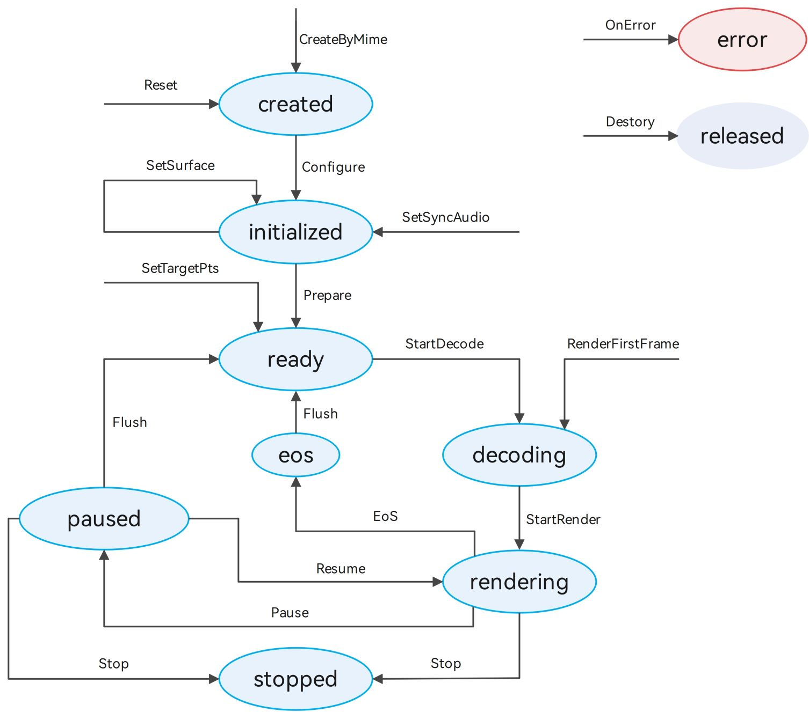

# Using LPP to Play Audio and Video (C/C++)

The Low Power Player (LPP) offers an end-to-end media pipeline from the source to rendering, while keeping power consumption to a minimum. This guide walks you through playing a local video file using the LPP APIs.

The full playback process includes creating a demuxer, creating a player, setting callback functions, configuring playback parameters (speed and volume), controlling playback (play, pause, resume, stop, and reset), and releasing the player instance.

**Figure 1** Playback state transition 


When the player is in the ready, decoding, rendering, paused, or stopped state, it occupies system resources. Call **reset** or **destroy** to reclaim the resources when it is no longer needed.

## Development Tips

This topic describes only how to implement the playback of a media asset. In practice, background playback and playback conflicts may be involved. You can refer to the following description to handle the situation based on your service requirements.

- When an application is playing media data that involves audio, it may be interrupted by other applications according to the system audio management policy. (For details, see [Processing Audio Interruption Events](../audio/audio-playback-concurrency.md#handling-audio-focus-changes).) It is recommended that the application proactively listen for audio interruption events through [OH_LowPowerAudioSinkCallback_SetInterruptListener](../../reference/apis-media-kit/capi-lowpower-audio-sink-h.md#oh_lowpoweraudiosinkcallback_setinterruptlistener) and handle the events accordingly to avoid inconsistencies between the application status and the expected effect.

- When the device is connected to multiple audio output devices, it is recommended that the application listen for audio output device change events through [OH_LowPowerAudioSinkCallback_SetDeviceChangeListener](../../reference/apis-media-kit/capi-lowpower-audio-sink-h.md#oh_lowpoweraudiosinkcallback_setdevicechangelistener) and handle the events accordingly.

- During application execution, system internal exceptions may occur, such as network exceptions, insufficient memory, or unavailable media services. It is recommended that the application listen for errors through [OH_LowPowerAudioSinkCallback_SetErrorListener](../../reference/apis-media-kit/capi-lowpower-audio-sink-h.md#oh_lowpoweraudiosinkcallback_seterrorlistener) or [OH_LowPowerVideoSinkCallback_SetErrorListener](../../reference/apis-media-kit/capi-lowpower-video-sink-h.md#oh_lowpowervideosinkcallback_seterrorlistener) and handle the errors accordingly.

- During playback, the player obtains the buffer of a specified track through [OH_AVDemuxer_ReadSampleBuffer](../../reference/apis-avcodec-kit/_a_v_demuxer.md#oh_avdemuxer_readsamplebuffer) and encapsulates multiple buffers through [OH_AVSamplesBuffer_AppendOneBuffer](../../reference/apis-media-kit/capi-lowpower-avsink-base-h.md#oh_avsamplesbuffer_appendonebuffer). Then the player starts consumption through notifications invoked by [OH_LowPowerAudioSink_ReturnSamples](../../reference/apis-media-kit/capi-lowpower-audio-sink-h.md#oh_lowpoweraudiosink_returnsamples) or [OH_LowPowerVideoSink_ReturnSamples](../../reference/apis-media-kit/capi-lowpower-video-sink-h.md#oh_lowpowervideosink_returnsamples). When the player needs data, it triggers the callback registered through [OH_LowPowerAudioSinkCallback_SetDataNeededListener](../../reference/apis-media-kit/capi-lowpower-audio-sink-h.md#oh_lowpoweraudiosinkcallback_setdataneededlistener) or [OH_LowPowerVideoSinkCallback_SetDataNeededListener](../../reference/apis-media-kit/capi-lowpower-video-sink-h.md#oh_lowpowervideosinkcallback_setdataneededlistener).

- Pay attention to the timing of API calls. Make reasonable calls according to the state diagram and detailed API documentation. After the program execution, call the corresponding `OH_***_Destroy` API to release resources.

- When registering a callback, you can configure custom data in the last parameter **void *userData** to perform certain settings (such as state changes) in the callback functions.<br>
  Other callback functions:<br>
  [OH_LowPowerAudioSinkCallback_SetPositionUpdateListener](../../reference/apis-media-kit/capi-lowpower-audio-sink-h.md#oh_lowpoweraudiosinkcallback_setpositionupdatelistener): called when the playback progress updates.<br>[OH_LowPowerAudioSinkCallback_SetEosListener](../../reference/apis-media-kit/capi-lowpower-audio-sink-h.md#oh_lowpoweraudiosinkcallback_seteoslistener) or [OH_LowPowerVideoSinkCallback_SetEosListener](../../reference/apis-media-kit/capi-lowpower-video-sink-h.md#oh_lowpowervideosinkcallback_seteoslistener): called when the playback is completed.<br>
  [OH_LowPowerVideoSinkCallback_SetRenderStartListener](../../reference/apis-media-kit/capi-lowpower-video-sink-h.md#oh_lowpowervideosinkcallback_setrenderstartlistener): called when video rendering starts.<br>
  [OH_LowPowerVideoSink_SetTargetStartFrame](../../reference/apis-media-kit/capi-lowpower-video-sink-h.md#oh_lowpowervideosink_settargetstartframe): called when the target frame is reached.<br>
  [OH_LowPowerVideoSinkCallback_SetStreamChangedListener](../../reference/apis-media-kit/capi-lowpower-video-sink-h.md#oh_lowpowervideosinkcallback_setstreamchangedlistener): called when the video stream is switched.<br>
  [OH_LowPowerVideoSinkCallback_SetFirstFrameDecodedListener](../../reference/apis-media-kit/capi-lowpower-video-sink-h.md#oh_lowpowervideosinkcallback_setfirstframedecodedlistener): called when the first frame of video is decoded.

## How to Develop

Link the dynamic libraries in the CMake script.

```
target_link_libraries(sample PUBLIC liblowpower_avsink.so)
```

Include the header files.

```
#include "multimedia/player_framework/lowpower_audio_sink_base.h"
#include "multimedia/player_framework/lowpower_audio_sink.h"
#include "multimedia/player_framework/lowpower_video_sink.h"
#include "multimedia/player_framework/lowpower_video_sink_base.h"
```

To use system logging, include the following header file:

```
#include <hilog/log.h>
```

In addition, link the following dynamic link library in the CMake script:

```
target_link_libraries(sample PUBLIC libhilog_ndk.z.so)
```

Include the following libraries: demuxer, basic decoding, and display rendering.

```
set(BASE_LIBRARY
    libnative_media_codecbase.so libnative_media_core.so libnative_media_vdec.so libnative_window.so
    libnative_media_venc.so libnative_media_acodec.so libnative_media_avdemuxer.so libnative_media_avsource.so
    libohaudio.so
)
target_link_libraries(sample PUBLIC ${BASE_LIBRARY})
```

Include the [lowpower_audio_sink_base.h](../../reference/apis-media-kit/capi-lowpower-audio-sink-base-h.md), [lowpower_audio_sink.h](../../reference/apis-media-kit/capi-lowpower-audio-sink-h.md), [lowpower_video_sink.h](../../reference/apis-media-kit/capi-lowpower-video-sink-h.md) and [lowpower_video_sink_base.h](../../reference/apis-media-kit/capi-lowpower-video-sink-base-h.md) header files to use audio and video playback APIs.

1.  Creates a player.

    Based on actual service requirements, you can use a self-developed demuxer or create an [OH_AVSource](../../reference/apis-avcodec-kit/_a_v_source.md#oh_avsource) instance by calling [OH_AVSource_CreateWithDataSource()](../../reference/apis-avcodec-kit/_a_v_source.md#oh_avsource_createwithdatasource), [OH_AVSource_CreateWithFD()](../../reference/apis-avcodec-kit/_a_v_source.md#oh_avsource_createwithfd), or [OH_AVSource_CreateWithURI()](../../reference/apis-avcodec-kit/_a_v_source.md#oh_avsource_createwithuri). Then call [OH_AVDemuxer_CreateWithSource()](../../reference/apis-avcodec-kit/_a_v_demuxer.md#oh_avdemuxer_createwithsource) through the OH_AVSource instance to create a demuxer and obtain video metadata.

    ```
    source_ = OH_AVSource_CreateWithFD(info.inputFd, info.inputFileOffset, info.inputFileSize);
    demuxer_ = OH_AVDemuxer_CreateWithSource(source_);
    int32_t ret = GetTrackInfo(sourceFormat, info);
    ```

2.  Based on the video metadata, call [OH_LowPowerAudioSink_CreateByMime](../../reference/apis-media-kit/capi-lowpower-audio-sink-h.md#oh_lowpoweraudiosink_createbymime) or [OH_LowPowerVideoSink_CreateByMime](../../reference/apis-media-kit/capi-lowpower-video-sink-h.md#oh_lowpowervideosink_createbymime) to create a player.

    ```
    lppVideoStreamer_ = OH_LowPowerVideoSink_CreateByMime(codecMime.c_str());
    lppAudioStreamer_ = OH_LowPowerAudioSink_CreateByMime(codecMime.c_str());
    ```

3.  Set callbacks.

    Call [OH_LowPowerAudioSinkCallback_Create](../../reference/apis-media-kit/capi-lowpower-audio-sink-h.md#oh_lowpoweraudiosinkcallback_create) or [OH_LowPowerVideoSinkCallback_Create](../../reference/apis-media-kit/capi-lowpower-video-sink-h.md#oh_lowpowervideosinkcallback_create) to create a callback for [OH_LowPowerAudioSinkCallback](../../reference/apis-media-kit/capi-lowpoweraudiosink-oh-lowpoweraudiosinkcallback.md) or [OH_LowPowerVideoSinkCallback](../../reference/apis-media-kit/capi-lowpowervideosink-oh-lowpowervideosinkcallback.md). Add the callbacks to the structure via the **setListener** API, and register them with **registerCallback**.

    ```
    lppAudioStreamerCallback_ = OH_LowPowerAudioSinkCallback_Create();
    OH_LowPowerAudioSinkCallback_SetDataNeededListener(lppAudioStreamerCallback_, LppCallback::OnDataNeeded, lppUserData);
    OH_LowPowerAudioSinkCallback_SetPositionUpdateListener(lppAudioStreamerCallback_, LppCallback::OnPositionUpdated, lppUserData);
    ret = OH_LowPowerAudioSink_RegisterCallback(lppAudioStreamer_, lppAudioStreamerCallback_);
    ```

4.  Configure the player.

    Based on the metadata obtained through demultiplexing, create and configure [OH_AVFormat](../../reference/apis-avcodec-kit/_core.md#oh_avformat). Configure the player by calling [OH_LowPowerAudioSink_Configure](../../reference/apis-media-kit/capi-lowpower-audio-sink-h.md#oh_lowpoweraudiosink_configure) or [OH_LowPowerVideoSink_Configure](../../reference/apis-media-kit/capi-lowpower-video-sink-h.md#oh_lowpowervideosink_configure). For details about the parameters, see the sample code. For video streams, call [OH_LowPowerVideoSink_SetVideoSurface](../../reference/apis-media-kit/capi-lowpower-video-sink-h.md#oh_lowpowervideosink_setvideosurface) to set the display window.

    ```
    OH_AVFormat *format = OH_AVFormat_Create();
     
    OH_AVFormat_SetIntValue(format, OH_MD_KEY_WIDTH, sampleInfo.videoWidth);
    OH_AVFormat_SetIntValue(format, OH_MD_KEY_HEIGHT, sampleInfo.videoHeight);
    OH_AVFormat_SetDoubleValue(format, OH_MD_KEY_FRAME_RATE, sampleInfo.frameRate);
    OH_AVFormat_SetIntValue(format, OH_MD_KEY_PIXEL_FORMAT, sampleInfo.pixelFormat);
    OH_AVFormat_SetIntValue(format, OH_MD_KEY_ROTATION, sampleInfo.rotation);
     
    int ret = OH_LowPowerVideoSink_Configure(lppVideoStreamer_, format);
    ```

5.  Prepare for playback.

    Call [OH_LowPowerVideoSink_SetSyncAudioSink](../../reference/apis-media-kit/capi-lowpower-video-sink-h.md#oh_lowpowervideosink_setsyncaudiosink) to set audio-video synchronization binding. Then, call [OH_LowPowerAudioSink_Prepare](../../reference/apis-media-kit/capi-lowpower-audio-sink-h.md#oh_lowpoweraudiosink_prepare) or [OH_LowPowerVideoSink_Prepare](../../reference/apis-media-kit/capi-lowpower-video-sink-h.md#oh_lowpowervideosink_prepare). After a successful call, the player enters the preparing state.

    ```
    OH_LowPowerVideoSink_Prepare(lppVideoStreamer_);
    ```

6.  Start playback.

    Call [OH_LowPowerAudioSink_Start](../../reference/apis-media-kit/capi-lowpower-audio-sink-h.md#oh_lowpoweraudiosink_start) or [OH_LowPowerVideoSink_StartRenderer](../../reference/apis-media-kit/capi-lowpower-video-sink-h.md#oh_lowpowervideosink_startrenderer) to start rendering. For video streams, before rendering, call [OH_LowPowerVideoSink_StartDecoder](../../reference/apis-media-kit/capi-lowpower-video-sink-h.md#oh_lowpowervideosink_startdecoder) to start decoding, or call [OH_LowPowerVideoSink_RenderFirstFrame](../../reference/apis-media-kit/capi-lowpower-video-sink-h.md#oh_lowpowervideosink_renderfirstframe) to start decoding and display the first frame.

    ```
    OH_LowPowerVideoSink_StartDecoder(lppVideoStreamer_);
    OH_LowPowerVideoSink_StartRenderer(lppVideoStreamer_);
    ```

7.  (Optional) Control the playback.

     To pause the playback, call [OH_LowPowerAudioSink_Pause](../../reference/apis-media-kit/capi-lowpower-audio-sink-h.md#oh_lowpoweraudiosink_pause) or [OH_LowPowerVideoSink_Pause](../../reference/apis-media-kit/capi-lowpower-video-sink-h.md#oh_lowpowervideosink_pause).<br>
     To resume the playback, call [OH_LowPowerAudioSink_Resume](../../reference/apis-media-kit/capi-lowpower-audio-sink-h.md#oh_lowpoweraudiosink_resume) or [OH_LowPowerVideoSink_Resume](../../reference/apis-media-kit/capi-lowpower-video-sink-h.md#oh_lowpowervideosink_resume).<br>
     To stop the playback, call [OH_LowPowerAudioSink_Stop](../../reference/apis-media-kit/capi-lowpower-audio-sink-h.md#oh_lowpoweraudiosink_stop) or [OH_LowPowerVideoSink_Stop](../../reference/apis-media-kit/capi-lowpower-video-sink-h.md#oh_lowpowervideosink_stop).<br>
     To set the playback volume, call [OH_LowPowerAudioSink_SetVolume](../../reference/apis-media-kit/capi-lowpower-audio-sink-h.md#oh_lowpoweraudiosink_setvolume).<br>
     To set the playback speed, call [OH_LowPowerAudioSink_SetPlaybackSpeed](../../reference/apis-media-kit/capi-lowpower-audio-sink-h.md#oh_lowpoweraudiosink_setplaybackspeed) or [OH_LowPowerVideoSink_SetPlaybackSpeed](../../reference/apis-media-kit/capi-lowpower-video-sink-h.md#oh_lowpowervideosink_setplaybackspeed).<br>
     To clear cache data (which can be used for seeking), call [OH_LowPowerAudioSink_Flush](../../reference/apis-media-kit/capi-lowpower-audio-sink-h.md#oh_lowpoweraudiosink_flush) or [OH_LowPowerVideoSink_Flush](../../reference/apis-media-kit/capi-lowpower-video-sink-h.md#oh_lowpowervideosink_flush).<br>

8.  (Optional) Replace resources.

    Call [OH_LowPowerAudioSink_Reset](../../reference/apis-media-kit/capi-lowpower-audio-sink-h.md#oh_lowpoweraudiosink_reset) or [OH_LowPowerVideoSink_Reset](../../reference/apis-media-kit/capi-lowpower-video-sink-h.md#oh_lowpowervideosink_reset) to reset the resource. You can replace resources and reconfigure the player.

9.  Exit the playback.

    Call [OH_LowPowerAudioSink_Destroy](../../reference/apis-media-kit/capi-lowpower-audio-sink-h.md#oh_lowpoweraudiosink_destroy) or [OH_LowPowerVideoSink_Destroy](../../reference/apis-media-kit/capi-lowpower-video-sink-h.md#oh_lowpowervideosink_destroy) to destroy the instance. The player enters the RELEASED state and exits the playback.

## Running the Sample Project

1. Create a project. Download the [sample project](https://gitee.com/harmonyos_samples/guide-snippets/tree/master/MediaKit/LowPowerAVSInk/lowPowerAVSinkSample), and copy its resources to the corresponding directories.

   ```
   lpp_demo-sample/entry/src/main/          
   ├── cpp                                # Native layer
   │   ├── capbilities                    # Capability interfaces and implementation
   │   │   ├── include                    # Capability interfaces
   │   │   ├── demuxer.cpp                # Demuxer implementation
   │   │   ├── lpp_audio_streamer.cpp     # LPP audio stream implementation
   │   │   └── lpp_video_streamer.cpp     # LPP video stream implementation
   │   ├── common                         # Common modules
   │   │   ├── dfx                        # Logs
   │   │   ├── lpp_callback.cpp           # LPP audio and video callback implementation  
   │   │   ├── lpp_callback.h             # LPP audio and video callback interfaces
   │   │   └── sample_info.h              # Common classes for function implementation
   │   ├── render                         # Render module interfaces and implementation* Window player settings
   │   │   ├── include                    # Display module interfaces
   │   │   ├── egl_core.cpp               # Display parameter settings
   │   │   ├── plugin_manager.cpp         # Display module management implementation
   │   │   └── plugin_render.cpp          # Display logic implementation
   │   ├── sample                         # Native layer
   │   │   ├── player                     # Player interfaces and implementation at the native layer
   │   │   │   ├── Player.cpp             # Player implementation at the native layer
   │   │   │   ├── Player.h               # Player interfaces at the native layer
   │   │   │   ├── PlayerNative.cpp       # Player entry at the native layer
   │   │   │   └── PlayerNative.h         # Interface exposed by the native layer
   │   ├── types                          # 
   │   │   └── libplayer                  # Interfaces exposed by the player to the UI layer
   │   └── CMakeLists.txt                 # Compilation entry
   ├── ets                                # UI layer
   │   ├── common                         # Common modules
   │   │   ├── utils                      # Common utility class
   │   │   │   ├── DateTimeUtils.ets      # Used to obtain the current time
   │   │   │   └── Logger.ts              # Log utility
   │   |   └───CommonConstants.ets        # Common constants
   │   ├── entryability                   # Application entry
   │   │   └── EntryAbility.ts            # Implementation of the permission request dialog box
   │   ├── pages                          # Pages contained in the EntryAbility
   │   │   └── Index.ets                  # Home page/Playback page
   ├── resources                          # Static resources
   │   ├── base                           # Resource files in this directory are assigned unique IDs.
   │   │   ├── element                    # Fonts and colors
   │   │   ├── media                      # Images
   │   │   └── profile                    # Home page of the app entry
   │   ├── en_US                          # Resources in this directory are preferentially matched when the device language is English (US).
   │   └── zh_CN                          # Resources in this directory are preferentially matched when the device language is simplified Chinese.
   └── module.json5                       # Module configuration information
   ```

2. Compile and run the project.
