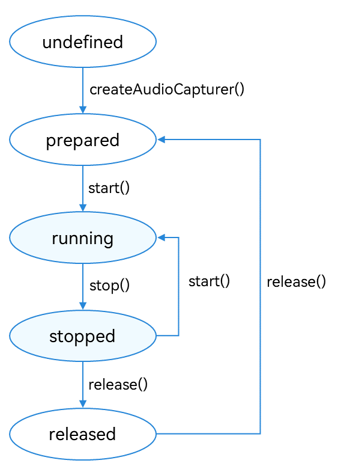

# Using AudioCapturer for Audio Recording

The AudioCapturer is used to record Pulse Code Modulation (PCM) audio data. It is suitable if you have extensive audio development experience and want to implement more flexible recording features.

## Development Guidelines

The full recording process involves creating an **AudioCapturer** instance, configuring audio recording parameters, starting and stopping recording, and releasing the instance. In this topic, you will learn how to use the AudioCapturer to recording audio data. Before the development, you are advised to read [AudioCapturer](../reference/apis/js-apis-audio.md#audiocapturer8) for the API reference.

The figure below shows the state changes of the AudioCapturer. After an **AudioCapturer** instance is created, different APIs can be called to switch the AudioCapturer to different states and trigger the required behavior. If an API is called when the AudioCapturer is not in the given state, the system may throw an exception or generate other undefined behavior. Therefore, you are advised to check the AudioCapturer state before triggering state transition.

**Figure 1** AudioCapturer state transition



You can call **on('stateChange')** to listen for state changes. For details about each state, see [AudioState](../reference/apis/js-apis-audio.md#audiostate8).

### How to Develop

1. Set audio recording parameters and create an **AudioCapturer** instance. For details about the parameters, see [AudioCapturerOptions](../reference/apis/js-apis-audio.md#audiocaptureroptions8).
   
   ```ts
    import audio from '@ohos.multimedia.audio';
    
    let audioStreamInfo: audio.AudioStreamInfo = {
      samplingRate: audio.AudioSamplingRate.SAMPLE_RATE_44100,
      channels: audio.AudioChannel.CHANNEL_2,
      sampleFormat: audio.AudioSampleFormat.SAMPLE_FORMAT_S16LE,
      encodingType: audio.AudioEncodingType.ENCODING_TYPE_RAW
    };
    
    let audioCapturerInfo: audio.AudioCapturerInfo = {
      source: audio.SourceType.SOURCE_TYPE_MIC,
      capturerFlags: 0
    };
    
    let audioCapturerOptions: audio.AudioCapturerOptions = {
      streamInfo: audioStreamInfo,
      capturerInfo: audioCapturerInfo
    };
    
    audio.createAudioCapturer(audioCapturerOptions, (err, data) => {
      if (err) {
        console.error(`Invoke createAudioCapturer failed, code is ${err.code}, message is ${err.message}`);
      } else {
        console.info('Invoke createAudioCapturer succeeded.');
        let audioCapturer = data;
      }
    });
   ```

2. Call **start()** to switch the AudioCapturer to the **running** state and start recording.
   
   ```ts
    audioCapturer.start((err: BusinessError) => {
      if (err) {
        console.error(`Capturer start failed, code is ${err.code}, message is ${err.message}`);
      } else {
        console.info('Capturer start success.');
      }
    });
   ```

3. Specify the recording file path and call **read()** to read the data in the buffer.
   
   ```ts
    import fs from '@ohos.file.fs';
    
    let context = getContext(this);
    async function read() {
      let path = context.filesDir;
      const filePath = path + '/voice_call_data.wav';
      let file: fs.File = fs.openSync(filePath, fs.OpenMode.READ_WRITE | fs.OpenMode.CREATE);
      let bufferSize: number = await audioCapturer.getBufferSize();
      let buffer: ArrayBuffer = await audioCapturer.read(bufferSize, true);
      fs.writeSync(file.fd, buffer);
    }
   ```

4. Call **stop()** to stop recording.
   
   ```ts
    audioCapturer.stop((err: BusinessError) => {
      if (err) {
        console.error(`Capturer stop failed, code is ${err.code}, message is ${err.message}`);
      } else {
        console.info('Capturer stopped.');
      }
    });
   ```

5. Call **release()** to release the instance.
   
   ```ts
    audioCapturer.release((err: BusinessError) => {
      if (err) {
        console.error(`capturer release failed, code is ${err.code}, message is ${err.message}`);
      } else {
        console.info('capturer released.');
      }
    });
   ```


### Sample Code

Refer to the sample code below to record audio using AudioCapturer.

```ts
import audio from '@ohos.multimedia.audio';
import fs from '@ohos.file.fs';

const TAG = 'AudioCapturerDemo';
let context = getContext(this);

let audioCapturer: audio.AudioCapturer | undefined = undefined;
let audioStreamInfo: audio.AudioStreamInfo = {
  samplingRate: audio.AudioSamplingRate.SAMPLE_RATE_44100,
  channels: audio.AudioChannel.CHANNEL_1,
  sampleFormat: audio.AudioSampleFormat.SAMPLE_FORMAT_S16LE,
  encodingType: audio.AudioEncodingType.ENCODING_TYPE_RAW
}
let audioCapturerInfo: audio.AudioCapturerInfo = {
  source: audio.SourceType.SOURCE_TYPE_MIC, // Audio source type.
  capturerFlags: 0 // Flag indicating an AudioCapturer.
}
let audioCapturerOptions: audio.AudioCapturerOptions = {
  streamInfo: audioStreamInfo,
  capturerInfo: audioCapturerInfo
}

// Create an AudioCapturer instance, and set the events to listen for.
async function init() {
  audio.createAudioCapturer(audioCapturerOptions, (err, capturer) => { // Create an AudioCapturer instance.
    if (err) {
      console.error(`Invoke createAudioCapturer failed, code is ${err.code}, message is ${err.message}`);
      return;
    }
    console.info(`${TAG}: create AudioCapturer success`);
    audioCapturer = capturer;
    if (audioCapturer !== undefined) {
      (audioCapturer as audio.AudioCapturer).on('markReach', 1000, (position: number) => { // Subscribe to the markReach event. A callback is triggered when the number of captured frames reaches 1000.
        if (position === 1000) {
          console.info('ON Triggered successfully');
        }
      });
      (audioCapturer as audio.AudioCapturer).on('periodReach', 2000, (position: number) => { // Subscribe to the periodReach event. A callback is triggered when the number of captured frames reaches 2000.
        if (position === 2000) {
          console.info('ON Triggered successfully');
        }
      });
    }
  });
}

// Start audio recording.
async function start() {
  if (audioCapturer !== undefined) {
    let stateGroup = [audio.AudioState.STATE_PREPARED, audio.AudioState.STATE_PAUSED, audio.AudioState.STATE_STOPPED];
    if (stateGroup.indexOf((audioCapturer as audio.AudioCapturer).state.valueOf()) === -1) { // Recording can be started only when the AudioCapturer is in the STATE_PREPARED, STATE_PAUSED, or STATE_STOPPED state.
      console.error(`${TAG}: start failed`);
      return;
    }
    await (audioCapturer as audio.AudioCapturer).start(); // Start recording.
    const path = context.filesDir + '/test.wav'; // Path for storing the recorded audio file.
    let file: fs.File = fs.openSync(filePath, fs.OpenMode.READ_WRITE | fs.OpenMode.CREATE); // Create the file if it does not exist.
    let fd = file.fd;
    let numBuffersToCapture = 150; // Write data for 150 times.
    let count = 0;
    class Options {
      offset: number = 0;
      length: number = 0
    }
    while (numBuffersToCapture) {
      let bufferSize = await (audioCapturer as audio.AudioCapturer).getBufferSize();
      let buffer = await (audioCapturer as audio.AudioCapturer).read(bufferSize, true);
      let options: Options = {
        offset: count * bufferSize,
        length: bufferSize
      };
      if (buffer === undefined) {
        console.error(`${TAG}: read buffer failed`);
      } else {
        let number = fs.writeSync(fd, buffer, options);
        console.info(`${TAG}: write date: ${number}`);
      }
      numBuffersToCapture--;
      count++;
    }
  }
}

// Stop recording.
async function stop() {
  if (audioCapturer !== undefined) {
    // The AudioCapturer can be stopped only when it is in the STATE_RUNNING or STATE_PAUSED state.
    if ((audioCapturer as audio.AudioCapturer).state.valueOf() !== audio.AudioState.STATE_RUNNING && (audioCapturer as audio.AudioCapturer).state.valueOf() !== audio.AudioState.STATE_PAUSED) {
      console.info('Capturer is not running or paused');
      return;
    }
    await (audioCapturer as audio.AudioCapturer).stop(); // Stop recording.
    if ((audioCapturer as audio.AudioCapturer).state.valueOf() === audio.AudioState.STATE_STOPPED) {
       console.info('Capturer stopped');
    } else {
       console.error('Capturer stop failed');
    }
  }
}

// Release the instance.
async function release() {
  if (audioCapturer !== undefined) {
    // The AudioCapturer can be released only when it is not in the STATE_RELEASED or STATE_NEW state.
    if ((audioCapturer as audio.AudioCapturer).state.valueOf() === audio.AudioState.STATE_RELEASED || (audioCapturer as audio.AudioCapturer).state.valueOf() === audio.AudioState.STATE_NEW) {
      console.info('Capturer already released');
      return;
    }
    await (audioCapturer as audio.AudioCapturer).release(); // Release resources.
    if ((audioCapturer as audio.AudioCapturer).state.valueOf() === audio.AudioState.STATE_RELEASED) {
      console.info('Capturer released');
    } else {
      console.error('Capturer release failed');
    }
  }
}
```
