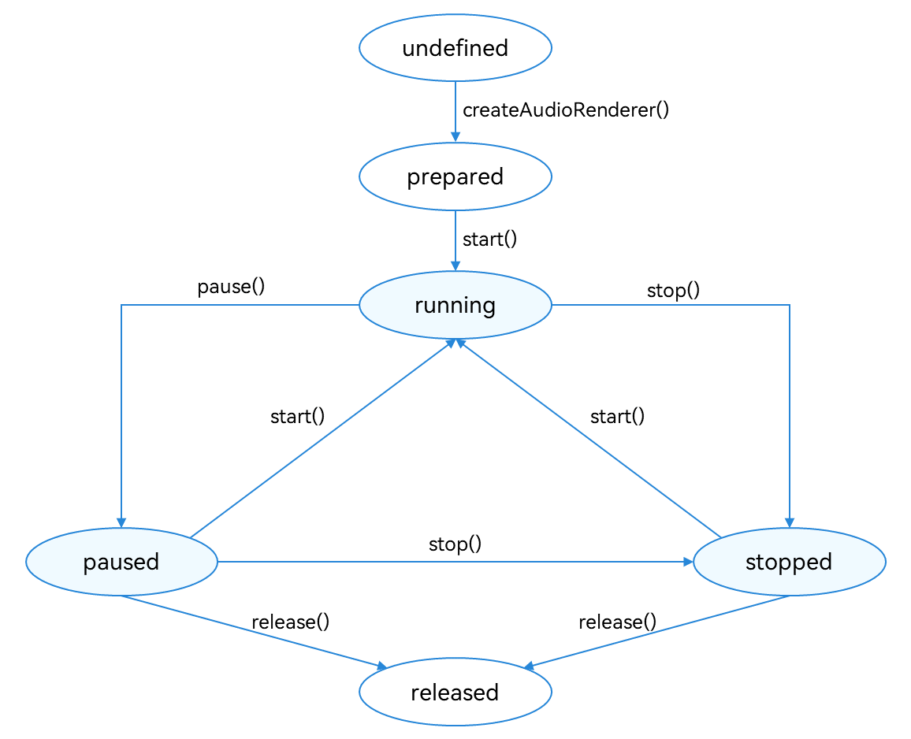

# Using AudioRenderer for Audio Playback

The AudioRenderer is used to play Pulse Code Modulation (PCM) audio data. Unlike the AVPlayer, the AudioRenderer can perform data preprocessing before audio input. Therefore, the AudioRenderer is more suitable if you have extensive audio development experience and want to implement more flexible playback features.

## Development Guidelines

The full rendering process involves creating an **AudioRenderer** instance, configuring audio rendering parameters, starting and stopping rendering, and releasing the instance. In this topic, you will learn how to use the AudioRenderer to render audio data. Before the development, you are advised to read [AudioRenderer](../reference/apis/js-apis-audio.md#audiorenderer8) for the API reference.

The figure below shows the state changes of the AudioRenderer. After an **AudioRenderer** instance is created, different APIs can be called to switch the AudioRenderer to different states and trigger the required behavior. If an API is called when the AudioRenderer is not in the given state, the system may throw an exception or generate other undefined behavior. Therefore, you are advised to check the AudioRenderer state before triggering state transition.

To prevent the UI thread from being blocked, most **AudioRenderer** calls are asynchronous. Each API provides the callback and promise functions. The following examples use the callback functions.

**Figure 1** AudioRenderer state transition 



During application development, you are advised to use **on('stateChange')** to subscribe to state changes of the AudioRenderer. This is because some operations can be performed only when the AudioRenderer is in a given state. If the application performs an operation when the AudioRenderer is not in the given state, the system may throw an exception or generate other undefined behavior.

- **prepared**: The AudioRenderer enters this state by calling **createAudioRenderer()**.

- **running**: The AudioRenderer enters this state by calling **start()** when it is in the **prepared**, **paused**, or **stopped** state.

- **paused**: The AudioRenderer enters this state by calling **pause()** when it is in the **running** state. When the audio playback is paused, it can call **start()** to resume the playback.

- **stopped**: The AudioRenderer enters this state by calling **stop()** when it is in the **paused** or **running** state

- **released**: The AudioRenderer enters this state by calling **release()** when it is in the **prepared**, **paused**, or **stopped** state. In this state, the AudioRenderer releases all occupied hardware and software resources and will not transit to any other state.

### How to Develop

1. Set audio rendering parameters and create an **AudioRenderer** instance. For details about the parameters, see [AudioRendererOptions](../reference/apis/js-apis-audio.md#audiorendereroptions8).
     
   ```ts
   import audio from '@ohos.multimedia.audio';
   
   let audioStreamInfo = {
     samplingRate: audio.AudioSamplingRate.SAMPLE_RATE_44100,
     channels: audio.AudioChannel.CHANNEL_1,
     sampleFormat: audio.AudioSampleFormat.SAMPLE_FORMAT_S16LE,
     encodingType: audio.AudioEncodingType.ENCODING_TYPE_RAW
   };
   
   let audioRendererInfo = {
     content: audio.ContentType.CONTENT_TYPE_SPEECH,
     usage: audio.StreamUsage.STREAM_USAGE_VOICE_COMMUNICATION,
     rendererFlags: 0
   };
   
   let audioRendererOptions = {
     streamInfo: audioStreamInfo,
     rendererInfo: audioRendererInfo
   };
   
   audio.createAudioRenderer(audioRendererOptions, (err, data) => {
     if (err) {
       console.error(`Invoke createAudioRenderer failed, code is ${err.code}, message is ${err.message}`);
       return;
     } else {
       console.info('Invoke createAudioRenderer succeeded.');
       let audioRenderer = data;
     }
   });
   ```

2. Call **start()** to switch the AudioRenderer to the **running** state and start rendering.
     
   ```ts
   audioRenderer.start((err) => {
     if (err) {
       console.error(`Renderer start failed, code is ${err.code}, message is ${err.message}`);
     } else {
       console.info('Renderer start success.');
     }
   });
   ```

3. Specify the address of the file to render. Open the file and call **write()** to continuously write audio data to the buffer for rendering and playing. To implement personalized playback, process the audio data before writing it.
     
   ```ts
   const bufferSize = await audioRenderer.getBufferSize();
   let file = fs.openSync(filePath, fs.OpenMode.READ_ONLY);
   let buf = new ArrayBuffer(bufferSize);
   let readsize = await fs.read(file.fd, buf);
   let writeSize = await new Promise((resolve, reject) => {
     audioRenderer.write(buf, (err, writeSize) => {
       if (err) {
         reject(err);
       } else {
         resolve(writeSize);
       }
     });
   });
   ```

4. Call **stop()** to stop rendering.
     
   ```ts
   audioRenderer.stop((err) => {
     if (err) {
       console.error(`Renderer stop failed, code is ${err.code}, message is ${err.message}`);
     } else {
       console.info('Renderer stopped.');
     }
   });
   ```

5. Call **release()** to release the instance.
     
   ```ts
   audioRenderer.release((err) => {
     if (err) {
       console.error(`Renderer release failed, code is ${err.code}, message is ${err.message}`);
     } else {
       console.info('Renderer released.');
     }
   });
   ```

### Sample Code

Refer to the sample code below to render an audio file using AudioRenderer.
  
```ts
import audio from '@ohos.multimedia.audio';
import fs from '@ohos.file.fs';

const TAG = 'AudioRendererDemo';

export default class AudioRendererDemo {
  private renderModel = undefined;
  private audioStreamInfo = {
    samplingRate: audio.AudioSamplingRate.SAMPLE_RATE_48000, // Sampling rate.
    channels: audio.AudioChannel.CHANNEL_2, // Channel.
    sampleFormat: audio.AudioSampleFormat.SAMPLE_FORMAT_S16LE, // Sampling format.
    encodingType: audio.AudioEncodingType.ENCODING_TYPE_RAW // Encoding format.
  }
  private audioRendererInfo = {
    content: audio.ContentType.CONTENT_TYPE_MUSIC, // Media type.
    usage: audio.StreamUsage.STREAM_USAGE_MEDIA, // Audio stream usage type.
    rendererFlags: 0 // AudioRenderer flag.
  }
  private audioRendererOptions = {
    streamInfo: this.audioStreamInfo,
    rendererInfo: this.audioRendererInfo
  }

  // Create an AudioRenderer instance, and set the events to listen for.
  init() {
    audio.createAudioRenderer(this.audioRendererOptions, (err, renderer) => { // Create an AudioRenderer instance.
      if (!err) {
        console.info(`${TAG}: creating AudioRenderer success`);
        this.renderModel = renderer;
        this.renderModel.on('stateChange', (state) => { // Set the events to listen for. A callback is invoked when the AudioRenderer is switched to the specified state.
          if (state == 2) {
            console.info('audio renderer state is: STATE_RUNNING');
          }
        });
        this.renderModel.on('markReach', 1000, (position) => { // Subscribe to the markReach event. A callback is triggered when the number of rendered frames reaches 1000.
          if (position == 1000) {
            console.info('ON Triggered successfully');
          }
        });
      } else {
        console.info(`${TAG}: creating AudioRenderer failed, error: ${err.message}`);
      }
    });
  }

  // Start audio rendering.
  async start() {
    let stateGroup = [audio.AudioState.STATE_PREPARED, audio.AudioState.STATE_PAUSED, audio.AudioState.STATE_STOPPED];
    if (stateGroup.indexOf(this.renderModel.state) === -1) { // Rendering can be started only when the AudioRenderer is in the prepared, paused, or stopped state.
      console.error(TAG + 'start failed');
      return;
    }
    await this.renderModel.start(); // Start rendering.

    const bufferSize = await this.renderModel.getBufferSize();
    let context = getContext(this);
    let path = context.filesDir;
    const filePath = path + '/test.wav'; // Use the sandbox path to obtain the file. The actual file path is /data/storage/el2/base/haps/entry/files/test.wav.

    let file = fs.openSync(filePath, fs.OpenMode.READ_ONLY);
    let stat = await fs.stat(filePath);
    let buf = new ArrayBuffer(bufferSize);
    let len = stat.size % bufferSize === 0 ? Math.floor(stat.size / bufferSize) : Math.floor(stat.size / bufferSize + 1);
    for (let i = 0; i < len; i++) {
      let options = {
        offset: i * bufferSize,
        length: bufferSize
      };
      let readsize = await fs.read(file.fd, buf, options);

      // buf indicates the audio data to be written to the buffer. Before calling AudioRenderer.write(), you can preprocess the audio data for personalized playback. The AudioRenderer reads the audio data written to the buffer for rendering.

      let writeSize = await new Promise((resolve, reject) => {
        this.renderModel.write(buf, (err, writeSize) => {
          if (err) {
            reject(err);
          } else {
            resolve(writeSize);
          }
        });
      });
      if (this.renderModel.state === audio.AudioState.STATE_RELEASED) { // The rendering stops if the AudioRenderer is in the released state.
        fs.close(file);
        await this.renderModel.stop();
      }
      if (this.renderModel.state === audio.AudioState.STATE_RUNNING) {
        if (i === len - 1) { // The rendering stops if the file finishes reading.
          fs.close(file);
          await this.renderModel.stop();
        }
      }
    }
  }

  // Pause the rendering.
  async pause() {
    // Rendering can be paused only when the AudioRenderer is in the running state.
    if (this.renderModel.state !== audio.AudioState.STATE_RUNNING) {
      console.info('Renderer is not running');
      return;
    }
    await this.renderModel.pause(); // Pause rendering.
    if (this.renderModel.state === audio.AudioState.STATE_PAUSED) {
      console.info('Renderer is paused.');
    } else {
      console.error('Pausing renderer failed.');
    }
  }

  // Stop rendering.
  async stop() {
    // Rendering can be stopped only when the AudioRenderer is in the running or paused state.
    if (this.renderModel.state !== audio.AudioState.STATE_RUNNING && this.renderModel.state !== audio.AudioState.STATE_PAUSED) {
      console.info('Renderer is not running or paused.');
      return;
    }
    await this.renderModel.stop(); // Stop rendering.
    if (this.renderModel.state === audio.AudioState.STATE_STOPPED) {
      console.info('Renderer stopped.');
    } else {
      console.error('Stopping renderer failed.');
    }
  }

  // Release the instance.
  async release() {
    // The AudioRenderer can be released only when it is not in the released state.
    if (this.renderModel.state === audio.AudioState.STATE_RELEASED) {
      console.info('Renderer already released');
      return;
    }
    await this.renderModel.release(); // Release the instance.
    if (this.renderModel.state === audio.AudioState.STATE_RELEASED) {
      console.info('Renderer released');
    } else {
      console.error('Renderer release failed.');
    }
  }
}
```

When audio streams with the same or higher priority need to use the output device, the current audio playback will be interrupted. The application can respond to and handle the interruption event. For details about how to process concurrent audio playback, see [Audio Playback Concurrency Policies](audio-playback-concurrency.md).
