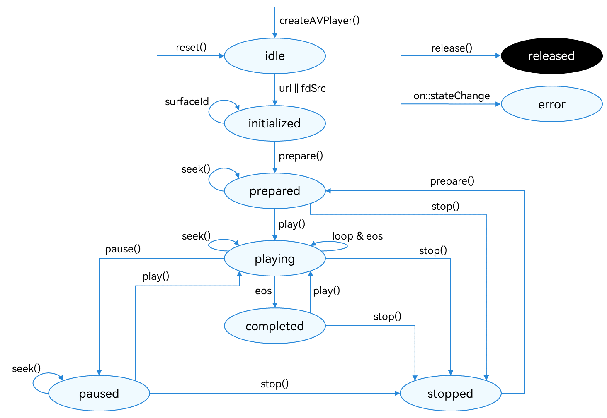

# Using AVPlayer for Audio Playback

The AVPlayer is used to play raw media assets in an end-to-end manner. In this topic, you will learn how to use the AVPlayer to play a complete piece of music.

If you want the application to continue playing the music in the background or when the screen is off, you must use the [AVSession](avsession-overview.md) and [continuous task](../task-management/continuous-task.md) to prevent the playback from being forcibly interrupted by the system.


The full playback process includes creating an **AVPlayer** instance, setting the media asset to play, setting playback parameters (volume, speed, and focus mode), controlling playback (play, pause, seek, and stop), resetting the playback configuration, and releasing the instance.


During application development, you can use the **state** attribute of the AVPlayer to obtain the AVPlayer state or call **on('stateChange')** to listen for state changes. If the application performs an operation when the AVPlayer is not in the given state, the system may throw an exception or generate other undefined behavior.


**Figure 1** Playback state transition 


For details about the state, see [AVPlayerState](../reference/apis/js-apis-media.md#avplayerstate9). When the AVPlayer is in the **prepared**, **playing**, **paused**, or **completed** state, the playback engine is working and a large amount of RAM is occupied. If your application does not need to use the AVPlayer, call **reset()** or **release()** to release the instance.

## How to Develop

Read [AVPlayer](../reference/apis/js-apis-media.md#avplayer9) for the API reference.

1. Call **createAVPlayer()** to create an **AVPlayer** instance. The AVPlayer is the **idle** state.

2. Set the events to listen for, which will be used in the full-process scenario. The table below lists the supported events.
   | Event Type| Description|
   | -------- | -------- |
   | stateChange | Mandatory; used to listen for changes of the **state** attribute of the AVPlayer.|
   | error | Mandatory; used to listen for AVPlayer errors.|
   | durationUpdate | Used to listen for progress bar updates to refresh the media asset duration.|
   | timeUpdate | Used to listen for the current position of the progress bar to refresh the current time.|
   | seekDone | Used to listen for the completion status of the **seek()** request.<br>This event is reported when the AVPlayer seeks to the playback position specified in **seek()**.|
   | speedDone | Used to listen for the completion status of the **setSpeed()** request.<br>This event is reported when the AVPlayer plays music at the speed specified in **setSpeed()**.|
   | volumeChange | Used to listen for the completion status of the **setVolume()** request.<br>This event is reported when the AVPlayer plays music at the volume specified in **setVolume()**.|
   | bufferingUpdate | Used to listen for network playback buffer information. This event reports the buffer percentage and playback progress.|
   | audioInterrupt | Used to listen for audio interruption. This event is used together with the **audioInterruptMode** attribute.<br>This event is reported when the current audio playback is interrupted by another (for example, when a call is coming), so the application can process the event in time.|

3. Set the media asset URL. The AVPlayer enters the **initialized** state.
   > **NOTE**
   >
   > The URL in the code snippet below is for reference only. You need to check the media asset validity and set the URL based on service requirements.
   > 
   > - If local files are used for playback, ensure that the files are available and the application sandbox path is used for access. For details about how to obtain the application sandbox path, see [Obtaining Application File Paths](../application-models/application-context-stage.md#obtaining-application-file-paths). For details about the application sandbox and how to push files to the application sandbox, see [File Management](../file-management/app-sandbox-directory.md).
   > 
   > - If a network playback path is used, you must request the ohos.permission.INTERNET [permission](../security/accesstoken-guidelines.md).
   > 
   > - You can also use **ResourceManager.getRawFd** to obtain the file descriptor of a file packed in the HAP file. For details, see [ResourceManager API Reference](../reference/apis/js-apis-resource-manager.md#getrawfd9).
   > 
   > - The [playback formats and protocols](avplayer-avrecorder-overview.md#supported-formats-and-protocols) in use must be those supported by the system.

4. Call **prepare()** to switch the AVPlayer to the **prepared** state. In this state, you can obtain the duration of the media asset to play and set the volume.

5. Call **play()**, **pause()**, **seek()**, and **stop()** to perform audio playback control as required.

6. (Optional) Call **reset()** to reset the AVPlayer. The AVPlayer enters the **idle** state again and you can change the media asset URL.

7. Call **release()** to switch the AVPlayer to the **released** state. Now your application exits the playback.

## Sample Code

Refer to the sample code below to play a complete piece of music.

```ts
import media from '@ohos.multimedia.media';
import fs from '@ohos.file.fs';
import common from '@ohos.app.ability.common';

export class AVPlayerDemo {
  private avPlayer;
  private count: number = 0;

  // Set AVPlayer callback functions.
  setAVPlayerCallback() {
    // Callback function for the seek operation.
    this.avPlayer.on('seekDone', (seekDoneTime) => {
      console.info(`AVPlayer seek succeeded, seek time is ${seekDoneTime}`);
    })
    // Callback function for errors. If an error occurs during the operation on the AVPlayer, reset() is called to reset the AVPlayer.
    this.avPlayer.on('error', (err) => {
      console.error(`Invoke avPlayer failed, code is ${err.code}, message is ${err.message}`);
      this.avPlayer.reset(); // Call reset() to reset the AVPlayer, which enters the idle state.
    })
    // Callback function for state changes.
    this.avPlayer.on('stateChange', async (state, reason) => {
      switch (state) {
        case 'idle': // This state is reported upon a successful callback of reset().
          console.info('AVPlayer state idle called.');
          this.avPlayer.release(); // Call release() to release the instance.
          break;
        case 'initialized': // This state is reported when the AVPlayer sets the playback source.
          console.info('AVPlayerstate initialized called.');
          this.avPlayer.prepare().then(() => {
            console.info('AVPlayer prepare succeeded.');
          }, (err) => {
            console.error(`Invoke prepare failed, code is ${err.code}, message is ${err.message}`);
          });
          break;
        case 'prepared': // This state is reported upon a successful callback of prepare().
          console.info('AVPlayer state prepared called.');
          this.avPlayer.play(); // Call play() to start playback.
          break;
        case 'playing': // This state is reported upon a successful callback of play().
          console.info('AVPlayer state playing called.');
          if (this.count !== 0) {
            console.info('AVPlayer start to seek.');
            this.avPlayer.seek (this.avPlayer.duration); // Call seek() to seek to the end of the audio clip.
          } else {
            this.avPlayer.pause(); // Call pause() to pause the playback.
          }
          this.count++;
          break;
        case 'paused': // This state is reported upon a successful callback of pause().
          console.info('AVPlayer state paused called.');
          this.avPlayer.play(); // Call play() again to start playback.
          break;
        case 'completed': // This state is reported upon the completion of the playback.
          console.info('AVPlayer state completed called.');
          this.avPlayer.stop(); // Call stop() to stop the playback.
          break;
        case 'stopped': // This state is reported upon a successful callback of stop().
          console.info('AVPlayer state stopped called.');
          this.avPlayer.reset(); // Call reset() to reset the AVPlayer state.
          break;
        case 'released':
          console.info('AVPlayer state released called.');
          break;
        default:
          console.info('AVPlayer state unknown called.');
          break;
      }
    })
  }

  // The following demo shows how to use the file system to open the sandbox address, obtain the media file address, and play the media file using the URL attribute.
  async avPlayerUrlDemo() {
    // Create an AVPlayer instance.
    this.avPlayer = await media.createAVPlayer();
    // Set a callback function for state changes.
    this.setAVPlayerCallback();
    let fdPath = 'fd://';
    // Obtain the sandbox address filesDir through UIAbilityContext. The stage model is used as an example.
    let context = getContext(this) as common.UIAbilityContext;
    let pathDir = context.filesDir;
    let path = pathDir + '/01.mp3';
    // Open the corresponding file address to obtain the file descriptor and assign a value to the URL to trigger the reporting of the initialized state.
    let file = await fs.open(path);
    fdPath = fdPath + '' + file.fd;
    this.avPlayer.url = fdPath;
  }

  // The following demo shows how to use resourceManager to obtain the media file packed in the HAP file and play the media file by using the fdSrc attribute.
  async avPlayerFdSrcDemo() {
    // Create an AVPlayer instance.
    this.avPlayer = await media.createAVPlayer();
    // Set a callback function for state changes.
    this.setAVPlayerCallback();
    // Call getRawFd of the resourceManager member of UIAbilityContext to obtain the media asset URL.
    // The return type is {fd,offset,length}, where fd indicates the file descriptor address of the HAP file, offset indicates the media asset offset, and length indicates the duration of the media asset to play.
    let context = getContext(this) as common.UIAbilityContext;
    let fileDescriptor = await context.resourceManager.getRawFd('01.mp3');
    // Assign a value to fdSrc to trigger the reporting of the initialized state.
    this.avPlayer.fdSrc = fileDescriptor;
  }
}
```
