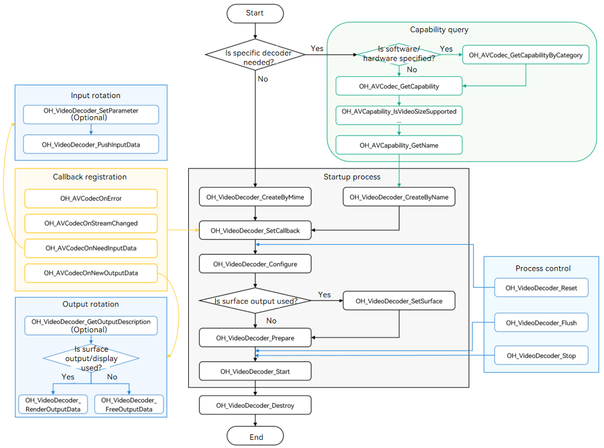

# Video Decoding

You can call the native APIs provided by the **VideoDecoder** module to decode video, that is, to decode media data into a YUV file or send it for display.

Currently, the following decoding capabilities are supported:

| Container Specification| Video Hardware Decoding Type      | Video Software Decoding Type  |
| -------- | --------------------- | ---------------- |
| mp4      | AVC (H.264), HEVC (H.265)|AVC (H.264) |

Video software decoding and hardware decoding are different. When a decoder is created based on the MIME type, only H.264 (video/avc) is supported for software decoding, and H.264 (video/avc) and H.265 (video/hevc) are supported for hardware decoding.

## How to Develop

Read [VideoDecoder](../reference/native-apis/_video_decoder.md) for the API reference.

The figure below shows the call relationship of video decoding.



### Linking the Dynamic Library in the CMake Script

``` cmake
target_link_libraries(sample PUBLIC libnative_media_codecbase.so)
target_link_libraries(sample PUBLIC libnative_media_core.so)
target_link_libraries(sample PUBLIC libnative_media_vdec.so)
```

### How to Develop

1. Add the header files.

   ``` c++
   #include <multimedia/player_framework/native_avcodec_videodecoder.h>
   #include <multimedia/player_framework/native_avcapability.h>
   #include <multimedia/player_framework/native_avcodec_base.h>
   #include <multimedia/player_framework/native_avformat.h>
   ```

2. Create a decoder instance.

   You can create a decoder by name or MIME type.

   ``` c++
    // To create a decoder by name, call OH_AVCapability_GetName to obtain the codec names available and then call OH_VideoDecoder_CreateByName. If your application has special requirements, for example, expecting a decoder that supports a certain resolution, you can call OH_AVCodec_GetCapability to query the capability first.
    OH_AVCapability *capability = OH_AVCodec_GetCapability(OH_AVCODEC_MIMETYPE_VIDEO_AVC, false);
    const char *name = OH_AVCapability_GetName(capability);
    OH_AVCodec *videoDec = OH_VideoDecoder_CreateByName(name);
   ```

   ```c++
    // Create a decoder by MIME type.
    // Create an H.264 decoder for software/hardware decoding. The system creates the most appropriate decoder if multiple decoders are available.
    OH_AVCodec *videoDec = OH_VideoDecoder_CreateByMime(OH_AVCODEC_MIMETYPE_VIDEO_AVC);
    // Create an H.265 decoder for hardware decoding.
    OH_AVCodec *videoDec = OH_VideoDecoder_CreateByMime(OH_AVCODEC_MIMETYPE_VIDEO_HEVC);
   ```

   ``` c++
   // Initialize the queues.
   class VDecSignal {
   public:
       std::mutex inMutex_;
       std::mutex outMutex_;
       std::condition_variable inCond_;
       std::condition_variable outCond_;
       std::queue<uint32_t> inQueue_;
       std::queue<uint32_t> outQueue_;
       std::queue<OH_AVMemory *> inBufferQueue_;
       std::queue<OH_AVMemory *> outBufferQueue_;
       std::queue<OH_AVCodecBufferAttr> attrQueue_;
   };
   VDecSignal *signal_;
   ```

3. Call **OH_VideoDecoder_SetCallback()** to set callback functions.

   Register the **OH_AVCodecAsyncCallback** struct that defines the following callback function pointers:

   - **OH_AVCodecOnError**, a callback used to report a codec operation error
   - **OH_AVCodecOnStreamChanged**, a callback used to report a codec stream change, for example, stream width or height change.
   - **OH_AVCodecOnNeedInputData**, a callback used to report input data required, which means that the decoder is ready for receiving data
   - **OH_AVCodecOnNewOutputData**, a callback used to report output data generated, which means that decoding is complete (Note: The **data** parameter in the callback function is empty in surface output mode.)

   You need to process the callback functions to ensure that the decoder runs properly.

   ``` c++
    // Implement the OH_AVCodecOnError callback function.
    static void OnError(OH_AVCodec *codec, int32_t errorCode, void *userData)
    {
        (void)codec;
        (void)errorCode;
        (void)userData;
    }

    // Implement the OH_AVCodecOnStreamChanged callback function.
    static void OnStreamChanged(OH_AVCodec *codec, OH_AVFormat *format, void *userData)
    {
        (void)codec;
        (void)format;
        (void)userData;
    }

    // Implement the OH_AVCodecOnNeedInputData callback function.
    static void OnNeedInputData(OH_AVCodec *codec, uint32_t index, OH_AVMemory *data, void *userData)
    {
        (void)codec;
        VDecSignal *signal_ = static_cast<VDecSignal *>(userData);
        std::unique_lock<std::mutex> lock(signal_->inMutex_);
        // The ID of the input frame is sent to inQueue_.
        signal_->inQueue_.push(index);
        // The input frame data is sent to inBufferQueue_.
        signal_->inBufferQueue_.push(data);
        signal_->inCond_.notify_all();
    }

    // Implement the OH_AVCodecOnNewOutputData callback function.
    static void OnNeedOutputData(OH_AVCodec *codec, uint32_t index, OH_AVMemory *data, OH_AVCodecBufferAttr *attr,
                                        void *userData)
    {
        (void)codec;
        VDecSignal *signal_ = static_cast<VDecSignal *>(userData);
        std::unique_lock<std::mutex> lock(signal_->outMutex_);
        // The index of the output buffer is sent to outQueue_.
        signal_->outQueue_.push(index);
        // The decoded data (specified by data) is sent to outBufferQueue_. (Note: data is empty in surface output mode.)
        signal_->outBufferQueue_.push(data);
        signal_->attrQueue_.push(*attr);
        signal_->outCond_.notify_all();
    }
    OH_AVCodecAsyncCallback cb = {&OnError, &OnStreamChanged, &OnNeedInputData, &OnNeedOutputData};
    // Set the asynchronous callbacks.
    int32_t ret = OH_VideoDecoder_SetCallback(videoDec, cb, signal_);
   ```

4. Call **OH_VideoDecoder_Configure()** to configure the decoder.

   The following options are mandatory: video frame width, video frame height, and video color format.

   ``` c++
    // (Mandatory) Configure the video frame width.
    constexpr uint32_t DEFAULT_WIDTH = 320; 
    // (Mandatory) Configure the video frame height.
    constexpr uint32_t DEFAULT_HEIGHT = 240;
    OH_AVFormat *format = OH_AVFormat_Create();
    // Set the format.
    OH_AVFormat_SetIntValue(format, OH_MD_KEY_WIDTH, DEFAULT_WIDTH);
    OH_AVFormat_SetIntValue(format, OH_MD_KEY_HEIGHT, DEFAULT_HEIGHT);
    OH_AVFormat_SetIntValue(format, OH_MD_KEY_PIXEL_FORMAT, AV_PIXEL_FORMAT_NV21);
    // Configure the decoder.
    int32_t ret = OH_VideoDecoder_Configure(videoDec, format);
    OH_AVFormat_Destroy(format);
   ```

5. (Optional) Set the surface.

   This step is required only when the surface is used to send the data for display. The application obtains the native window from the XComponent. For details about the process, see [XComponent](../reference/arkui-ts/ts-basic-components-xcomponent.md).

   ``` c++
    // Set the parameters of the display window.
    int32_t ret = OH_VideoDecoder_SetSurface(videoDec, window); // Obtain the window from the XComponent.
    bool isSurfaceMode = true;
   ```

6. (Optional) Configure the surface parameters of the decoder.

   This step is required only when the surface is used.

   ``` c++
    OH_AVFormat *format = OH_AVFormat_Create();
    // Configure the display rotation angle.
    OH_AVFormat_SetIntValue(format, OH_MD_KEY_ROTATION, 90);
    // Configure the matching mode (scaling or cropping) between the video and the display screen.
    OH_AVFormat_SetIntValue(format, OH_MD_KEY_SCALING_MODE, SCALING_MODE_SCALE_CROP);
    int32_t ret = OH_VideoDecoder_SetParameter(videoDec, format);
    OH_AVFormat_Destroy(format);
   ```

7. Call **OH_VideoDecoder_Start()** to start the decoder.

   ``` c++
    string_view outputFilePath = "/*yourpath*.yuv";
    std::unique_ptr<std::ifstream> inputFile = std::make_unique<std::ifstream>();
    // Open the path of the binary file to be decoded.
    inputFile->open(inputFilePath.data(), std::ios::in | std::ios::binary); 
    // Configure the parameter in buffer mode.
    if(!isSurfaceMode) {
        // Configure the output file path in buffer mode.
        std::unique_ptr<std::ofstream> outFile = std::make_unique<std::ofstream>();
        outFile->open(outputFilePath.data(), std::ios::out | std::ios::binary);
    }
    // Start decoding.
    int32_t ret = OH_VideoDecoder_Start(videoDec);
   ```

8. Call **OH_VideoDecoder_PushInputData()** to push the stream to the input queue for decoding.

   ``` c++
    // Configure the buffer information.
    OH_AVCodecBufferAttr info;
    // Call av_packet_alloc of FFmpeg to initialize and return a container packet.
    AVPacket pkt = av_packet_alloc();
    // Configure the input size, offset, and timestamp of the buffer.
    info.size = pkt->size;
    info.offset = 0;
    info.pts = pkt->pts;
    info.flags = AVCODEC_BUFFER_FLAGS_NONE;
    // Send the data to the input queue for decoding. The index is the subscript of the queue.
    int32_t ret = OH_VideoDecoder_PushInputData(videoDec, index, info);
   ```

9. In surface display mode, call **OH_VideoDecoder_RenderOutputData()** to display and release the decoded frames. In the surface no display mode or buffer mode, call **OH_VideoDecoder_FreeOutputData()** to the release decoded frames.

   ``` c++
    int32_t ret;
    // Write the decoded data (specified by data) to the output file.
    outFile->write(reinterpret_cast<char *>(OH_AVMemory_GetAddr(data)), data.size);
    // Free the buffer that stores the output data. The index is the subscript of the surface/buffer queue.
    if (isSurfaceMode && isRender) {
        ret = OH_VideoDecoder_RenderOutputData(videoDec, index);
    } else {
        ret = OH_VideoDecoder_FreeOutputData(videoDec, index);
    }
    if (ret != AV_ERR_OK) {
        // Exception handling.
    }
   ```

10. (Optional) Call **OH_VideoDecoder_Flush()** to refresh the decoder.
   
    After **OH_VideoDecoder_Flush()** is called, the decoder remains in the running state, but the current queue is cleared and the buffer storing the decoded data is freed.
   
    To continue decoding, you must call **OH_VideoDecoder_Start()** again.

    ``` c++
    int32_t ret;
    // Refresh the decoder.
    ret = OH_VideoDecoder_Flush(videoDec);
    if (ret != AV_ERR_OK) {
        // Exception handling.
    }
    // Start decoding again.
    ret = OH_VideoDecoder_Start(videoDec);
    ```

11. (Optional) Call **OH_VideoDecoder_Reset()** to reset the decoder.

    After **OH_VideoDecoder_Reset()** is called, the decoder returns to the initialized state. To continue decoding, you must call **OH_VideoDecoder_Configure()** and then **OH_VideoDecoder_Start()**.

    ``` c++
     int32_t ret;
     // Reset the decoder.
     ret = OH_VideoDecoder_Reset(videoDec);
     if (ret != AV_ERR_OK) {
         // Exception handling.
     }
     // Reconfigure the decoder.
     ret = OH_VideoDecoder_Configure(videoDec, format);
    ```

12. Call **OH_VideoDecoder_Stop()** to stop the decoder.

    ``` c++
     int32_t ret;
     // Stop the decoder.
     ret = OH_VideoDecoder_Stop(videoDec);
     if (ret != AV_ERR_OK) {
         // Exception handling.
     }
    ```

13. Call **OH_VideoDecoder_Destroy()** to destroy the decoder instance and release resources.

    ``` c++
     int32_t ret;
     // Call OH_VideoDecoder_Destroy to destroy the decoder.
     ret = OH_VideoDecoder_Destroy(videoDec);
     if (ret != AV_ERR_OK) {
         // Exception handling.
     }
    ```
