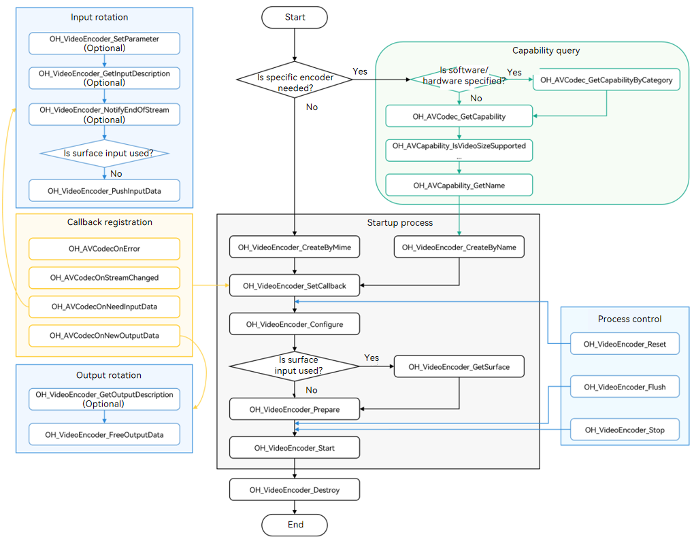

# Video Encoding

You can call the native APIs provided by the **VideoEncoder** module to encode a video, that is, to compress audio and video data into an audio and video stream.

Currently, the following encoding capabilities are supported:

| Container Specification| Video Encoding Type                | Audio Encoding Type    |
| -------- | ---------------------------- | ---------------- |
| mp4      | HEVC (H.265), AVC (H.264)| AAC, MPEG (MP3)|
| m4a      | HEVC (H.265), AVC (H.264)| AAC              |

## Surface Input and Buffer Input

Surface input and buffer input differ in data sources.

Surface input contains information such as pixel data and pixel format, for example, a recorded video stream directly transferred by the camera module. It is more applicable to scenarios such as real-time video capture.

Buffer input refers to a memory space, which is generally a byte array or a pointer to the memory. It is more applicable to scenarios such as reading audio and video data from files or real-time streaming transmission.

The two also differ slightly in the API calling modes:

- In buffer input mode, an application calls **OH_VideoEncoder_PushInputData()** to input data. In surface input mode, an application, before the encoder starts, calls **OH_VideoEncoder_GetSurface()** to obtain the surface for video data transmission.
- In buffer input mode, an application calls **OH_VideoEncoder_PushInputData()** to pass in the End of Stream (EOS) flag, and the encoder stops when it reads the last frame. In surface input mode, an application calls **OH_VideoEncoder_NotifyEndOfStream()** to notify the encoder of EOS.

For details about the development procedure, see [Buffer Input](#buffer-input) and [Surface Input](#surface-input).

## How to Develop

Read [VideoEncoder](../reference/native-apis/_video_encoder.md) for the API reference.

The figure below shows the call relationship of video encoding.



### Linking the Dynamic Library in the CMake Script

```cmake
target_link_libraries(sample PUBLIC libnative_media_codecbase.so)
target_link_libraries(sample PUBLIC libnative_media_core.so)
target_link_libraries(sample PUBLIC libnative_media_venc.so)
```

### Buffer Input

The following walks you through how to implement the entire video encoding process in buffer input mode. It uses the YUV file input and H.264 encoding format as an example.

Currently, the **VideoEncoder** module supports only data transferring in asynchronous mode.

1. Add the header files.

   ```cpp
   #include <multimedia/player_framework/native_avcodec_videoencoder.h>
   #include <multimedia/player_framework/native_avcapability.h>
   #include <multimedia/player_framework/native_avcodec_base.h>
   #include <multimedia/player_framework/native_avformat.h>
   ```
2. Create an encoder instance.

   You can create an encoder by name or MIME type.

   ```c++
   // To create an encoder by MIME type, call OH_VideoEncoder_CreateByMime. The system creates the most appropriate encoder based on the MIME type.
   OH_AVCodec *videoEnc = OH_VideoEncoder_CreateByMime(OH_AVCODEC_MIMETYPE_VIDEO_AVC);
   ```

   ```c++
   // To create an encoder by name, call OH_AVCapability_GetName to obtain the codec names available and then call OH_VideoEncoder_CreateByName. If your application has special requirements, for example, expecting an encoder that supports a certain resolution, you can call OH_AVCodec_GetCapability to query the capability first.
   OH_AVCapability *capability = OH_AVCodec_GetCapability(OH_AVCODEC_MIMETYPE_VIDEO_AVC, true);
   const char *codecName = OH_AVCapability_GetName(capability);
   OH_AVCodec *videoEnc = OH_VideoEncoder_CreateByName(codecName);
   ```
3. Call **OH_VideoEncoder_SetCallback()** to set callback functions.

   > **NOTE**
   >
   > In the callback functions, pay attention to the multi-thread conflict for operations on the data queue.

   Register the **OH_AVCodecAsyncCallback** struct that defines the following callback function pointers:

   - **OH_AVCodecOnError**, a callback used to report a codec operation error
   - **OH_AVCodecOnStreamChanged**, a callback used to report a codec stream change, for example, audio channel change
   - **OH_AVCodecOnNeedInputData**, a callback used to report input data required, which means that the encoder is ready for receiving PCM data
   - **OH_AVCodecOnNewOutputData**, a callback used to report output data generated, which means that encoding is complete

   You need to process the callback functions to ensure that the encoder runs properly.

   ```c++
   // Implement the OH_AVCodecOnError callback function.
   static void OnError(OH_AVCodec *codec, int32_t errorCode, void *userData)
   {
       (void)codec;
       (void)errorCode;
       (void)userData;
   }

   // Implement the OH_AVCodecOnStreamChanged callback function.
   static void OnStreamChanged(OH_AVCodec *codec, OH_AVFormat *format, void *userData)
   {
       (void)codec;
       (void)format;
       (void)userData;
   }

   // Implement the OH_AVCodecOnNeedInputData callback function.
   static void OnNeedInputData(OH_AVCodec *codec, uint32_t index, OH_AVMemory *mem, void *userData)
   {
       (void)userData;
       // The index of the input frame buffer is sent to InIndexQueue.
       // The input frame data (specified by mem) is sent to InBufferQueue.
       // Perform data processing. For details, see
       // 7. Write the stream to encode.
       // 8. Notify the encoder of EOS.
   }

   // Implement the OH_AVCodecOnNewOutputData callback function.
   static void OnNeedOutputData(OH_AVCodec *codec, uint32_t index, OH_AVMemory *mem, 
                                OH_AVCodecBufferAttr *attr, void *userData)
   {
       (void)userData;
       // The index of the output frame buffer is sent to outIndexQueue.
       // The encoded frame data (specified by mem) is sent to outBufferQueue.
       // The data format of the encoded frame is sent to outAttrQueue.
       // Perform data processing. For details, see
       // 9. Output the encoded frames.
   }

   // Call OH_VideoEncoder_SetCallback to set the callback functions.
   OH_AVCodecAsyncCallback cb = {&OnError, &OnStreamChanged, &OnNeedInputData, &OnNeedOutputData};
   int32_t ret = OH_VideoEncoder_SetCallback(videoEnc, cb, NULL);
   if (ret != AV_ERR_OK) {
       // Exception handling.
   }
   ```
4. Call **OH_VideoEncoder_Configure()** to configure the encoder.

   Currently, the following options must be configured for all supported formats: video frame width, video frame height, and video pixel format. In the code snippet below, the following data is used:

   - **DEFAULT_WIDTH**: 320 pixels
   - **DEFAULT_HEIGHT**: 240 pixels
   - **DEFAULT_PIXELFORMAT**: **AV_PIXEL_FORMAT_YUVI420** (the pixel format of the YUV file is YUV420P)

   ```c++
   // (Mandatory) Configure the video frame width.
   constexpr uint32_t DEFAULT_WIDTH = 320; 
   // (Mandatory) Configure the video frame height.
   constexpr uint32_t DEFAULT_HEIGHT = 240;
   // (Mandatory) Configure the video pixel format.
   constexpr OH_AVPixelFormat DEFAULT_PIXELFORMAT = AV_PIXEL_FORMAT_YUVI420;
   OH_AVFormat *format = OH_AVFormat_Create();
   // Set the format.
   OH_AVFormat_SetIntValue(format, OH_MD_KEY_WIDTH, DEFAULT_WIDTH);
   OH_AVFormat_SetIntValue(format, OH_MD_KEY_HEIGHT, DEFAULT_HEIGHT);
   OH_AVFormat_SetIntValue(format, OH_MD_KEY_PIXEL_FORMAT, DEFAULT_PIXELFORMAT);
   // Configure the encoder.
   int32_t ret = OH_VideoEncoder_Configure(videoEnc, format);
   if (ret != AV_ERR_OK) {
       // Exception handling.
   }
   ```
5. Call **OH_VideoEncoder_Prepare()** to prepare internal resources for the encoder.

    

   ```c++
   ret = OH_VideoEncoder_Prepare(videoEnc);
   if (ret != AV_ERR_OK) {
       // Exception handling.
   }
   ```
6. Call **OH_VideoEncoder_Start()** to start the encoder.

   As soon as the encoder starts, the callback functions will be triggered to respond to events. Therefore, you must configure the input file and output file first.

   ```c++
   // Configure the paths of the input and output files.
   string_view inputFilePath = "/*yourpath*.yuv";
   string_view outputFilePath = "/*yourpath*.h264";
   std::unique_ptr<std::ifstream> inputFile = std::make_unique<std::ifstream>();
   std::unique_ptr<std::ofstream> outputFile = std::make_unique<std::ofstream>();
   inputFile->open(inputFilePath.data(), std::ios::in | std::ios::binary);
   outputFile->open(outputFilePath.data(), std::ios::out | std::ios::binary | std::ios::ate);
   // Start the encoder to start encoding.
   int32_t ret = OH_VideoEncoder_Start(videoEnc);
   if (ret != AV_ERR_OK) {
       // Exception handling.
   }
   ```
7. (Optional) Dynamically configure the encoder instance.

   ```c++
   OH_AVFormat *format = OH_AVFormat_Create();
   // Configure the video frame rate.
   double frameRate = 30.0;
   // Configure the video YUV range flag.
   bool rangeFlag = false;
   // Configure the video primary color.
   int32_t primary = static_cast<int32_t>(OH_ColorPrimary::COLOR_PRIMARY_BT709);
   // Configure the transfer features.
   int32_t transfer = static_cast<int32_t>(OH_TransferCharacteristic::TRANSFER_CHARACTERISTIC_BT709);
   // Configure the maximum matrix coefficient.
   int32_t matrix = static_cast<int32_t>(OH_MaxtrixCoefficient::MATRIX_COEFFICIENT_IDENTITY);
   // Configure the encoding profile.
   int32_t profile = static_cast<int32_t>(OH_AVCProfile::AVC_PROFILE_BASELINE);
   // Configure the encoding bit rate mode.
   int32_t rateMode = static_cast<int32_t>(OH_VideoEncodeBitrateMode::CBR);
   // Configure the key frame interval, in milliseconds.
   int32_t iFrameInterval = 23000;
   // Configure the required encoding quality. Only an encoder in constant quality mode supports this configuration.
   int32_t quality = 0;
   // Configure the bit rate.
   int64_t bitRate = 3000000;
   // Set the format.
   OH_AVFormat_SetDoubleValue(format, OH_MD_KEY_FRAME_RATE, frameRate);
   OH_AVFormat_SetIntValue(format, OH_MD_KEY_RANGE_FLAG, rangeFlag);
   OH_AVFormat_SetIntValue(format, OH_MD_KEY_COLOR_PRIMARIES, primary);
   OH_AVFormat_SetIntValue(format, OH_MD_KEY_TRANSFER_CHARACTERISTICS, transfer);
   OH_AVFormat_SetIntValue(format, OH_MD_KEY_MATRIX_COEFFICIENTS, matrix);

   OH_AVFormat_SetIntValue(format, OH_MD_KEY_I_FRAME_INTERVAL, iFrameInterval);
   OH_AVFormat_SetIntValue(format, OH_MD_KEY_PROFILE, profile);
   OH_AVFormat_SetIntValue(format, OH_MD_KEY_VIDEO_ENCODE_BITRATE_MODE, rateMode);
   OH_AVFormat_SetLongValue(format, OH_MD_KEY_BITRATE, bitRate);
   OH_AVFormat_SetIntValue(format, OH_MD_KEY_QUALITY, quality);

   int32_t ret = OH_VideoEncoder_SetParameter(videoEnc, format);
   if (ret != AV_ERR_OK) {
       // Exception handling.
   }
   ```
8. Call **OH_VideoEncoder_PushInputData()** to push the stream to the input queue for encoding.

   In the code snippet below, the following parameters are used:

   - **GetOneFrameSize()**: function for calculating the frame length of the YUV file. For details about the calculation process, see related YUV documents.
   - **mem**: parameter passed in by the callback function **OnNeedInputData**. You can call **OH_AVMemory_GetAddr** to obtain the pointer to the shared memory address.
   - **index**: index of the data queue, which is passed in by the callback function **OnNeedInputData**.

   ```c++
   // Process the file stream and obtain the frame length, and then write the data to encode to the memory of the specified index.
   int32_t frameSize = GetOneFrameSize();
   inputFile->read(reinterpret_cast<char *>(OH_AVMemory_GetAddr(mem)), frameSize);
   // Configure the buffer information.
   OH_AVCodecBufferAttr info;
   info.size = frameSize;
   info.offset = 0;
   info.pts = 0;
   info.flags = AVCODEC_BUFFER_FLAGS_CODEC_DATA;
   // Send the data to the input queue for encoding. The index is the subscript of the input queue.
   int32_t ret = OH_VideoEncoder_PushInputData(videoEnc, index, info);
   if (ret != AV_ERR_OK) {
       // Exception handling.
   }
   ```
9. Notify the encoder of EOS.

   In the code snippet below, **index** specifies the index of the data queue, which is passed in by the callback function **OnNeedInputData**. The API **OH_VideoEncoder_PushInputData** is used to notify the encoder of EOS. This API is also used in step 7 to push the stream to the input queue for encoding. Therefore, in the current step, you must pass in the **AVCODEC_BUFFER_FLAGS_EOS** flag.

   ```c++
   int32_t ret;
   OH_AVCodecBufferAttr info;
   info.size = 0;
   info.offset = 0;
   info.pts = 0;
   info.flags = AVCODEC_BUFFER_FLAG_EOS;
   ret = OH_VideoEncoder_PushInputData(videoEnc, index, info);
   if (ret != AV_ERR_OK) {
       // Exception handling.
   }
   ```
10. Call **OH_VideoEncoder_FreeOutputData()** to output the encoded frames.

    In the code snippet below, the following parameters are used:

    - **index**: index of the data queue, which is passed in by the callback function **OnNeedOutputData**.
    - **attr**: buffer storing the output data, which is passed in by the callback function **OnNeedOutputData**.
    - **mem**: parameter passed in by the callback function **OnNeedOutputData**. You can call **OH_AVMemory_GetAddr** to obtain the pointer to the shared memory address.

    ```c++
    // Write the encoded frame data (specified by mem) to the output file.
    outputFile->write(reinterpret_cast<char *>(OH_AVMemory_GetAddr(mem)), attr->size);
    // Free the output buffer. The index is the subscript of the output queue.
    int32_t ret = OH_VideoEncoder_FreeOutputData(videoEnc, index);
    if (ret != AV_ERR_OK) {
        // Exception handling.
    }
    ```
11. (Optional) Call **OH_VideoEncoder_Flush()** to refresh the encoder.

    After **OH_VideoEncoder_Flush()** is called, the encoder remains in the running state, but the current queue is cleared and the buffer storing the encoded data is freed.

    To continue encoding, you must call **OH_VideoEncoder_Start()** again.

    ```c++
    int32_t ret;
    // Refresh the encoder.
    ret = OH_VideoEncoder_Flush(videoEnc);
    if (ret != AV_ERR_OK) {
        // Exception handling.
    }
    // Start encoding again.
    ret = OH_VideoEncoder_Start(videoEnc);
    if (ret != AV_ERR_OK) {
        // Exception handling.
    }
    ```
12. (Optional) Call **OH_VideoEncoder_Reset()** to reset the encoder.

    After **OH_VideoEncoder_Reset()** is called, the encoder returns to the initialized state. To continue encoding, you must call **OH_VideoEncoder_Configure()** and then **OH_VideoEncoder_Start()**.

    ```c++
    int32_t ret;
    // Reset the encoder.
    ret = OH_VideoEncoder_Reset(videoEnc);
    if (ret != AV_ERR_OK) {
        // Exception handling.
    }
    // Reconfigure the encoder.
    ret = OH_VideoEncoder_Configure(videoEnc, format);
    if (ret != AV_ERR_OK) {
        // Exception handling.
    }
    ```
13. Call **OH_VideoEncoder_Stop()** to stop the encoder.

    ```c++
    int32_t ret;
    // Stop the encoder.
    ret = OH_VideoEncoder_Stop(videoEnc);
    if (ret != AV_ERR_OK) {
        // Exception handling.
    }
    ```
14. Call **OH_VideoEncoder_Destroy()** to destroy the encoder instance and release resources.

    > **NOTE**
    >
    > After the call, you must set a null pointer to the encoder to prevent program errors caused by wild pointers.
    >

    ```c++
    int32_t ret;
    // Call OH_VideoEncoder_Destroy to destroy the encoder.
    ret = OH_VideoEncoder_Destroy(videoEnc);
    videoEnc = nullptr;
    if (ret != AV_ERR_OK) {
        // Exception handling.
    }
    ```

### Surface Input

The following walks you through how to implement the entire video encoding process in surface input mode. It uses the video data input and H.264 encoding format as an example.
Currently, the **VideoEncoder** module supports only data transferring in asynchronous mode.

1. Add the header files.

   ```cpp
   #include <multimedia/player_framework/native_avcodec_videoencoder.h>
   #include <multimedia/player_framework/native_avcapability.h>
   #include <multimedia/player_framework/native_avformat.h>
   #include <multimedia/player_framework/native_avcodec_base.h> 
   ```
2. Create an encoder instance.

   You can create an encoder by name or MIME type.

   ```c++
   // To create an encoder by MIME type, call OH_VideoEncoder_CreateByMime. The system creates the most appropriate encoder based on the MIME type.
   OH_AVCodec *videoEnc = OH_VideoEncoder_CreateByMime(OH_AVCODEC_MIMETYPE_VIDEO_AVC);
   ```

   ```c++
   // To create an encoder by name, call OH_AVCapability_GetName to obtain the codec names available and then call OH_VideoEncoder_CreateByName. If your application has special requirements, for example, expecting an encoder that supports a certain resolution, you can call OH_AVCodec_GetCapability to query the capability first.
   OH_AVCapability *capability = OH_AVCodec_GetCapability(OH_AVCODEC_MIMETYPE_VIDEO_AVC, true);
   const char *codecName = OH_AVCapability_GetName(capability);
   OH_AVCodec *videoEnc = OH_VideoEncoder_CreateByName(codecName);
   ```
3. Call **OH_VideoEncoder_SetCallback()** to set callback functions.

   > **NOTE**
   >
   > In the callback functions, pay attention to the multi-thread conflict for operations on the data queue.
   >

   Register the **OH_AVCodecAsyncCallback** struct that defines the following callback function pointers:

   - **OH_AVCodecOnError**, a callback used to report a codec operation error
   - **OH_AVCodecOnStreamChanged**, a callback used to report a codec stream change, for example, audio channel change
   - **OH_AVCodecOnNeedInputData**, a callback used to report input data required, which means that the encoder is ready for receiving PCM data
   - **OH_AVCodecOnNewOutputData**, a callback used to report output data generated, which means that encoding is complete

   ```c++
   // Set the OnError callback function.
   static void OnError(OH_AVCodec *codec, int32_t errorCode, void *userData)
   {
       (void)codec;
       (void)errorCode;
       (void)userData;
   }

   // Set the OnStreamChanged callback function.
   static void OnStreamChanged(OH_AVCodec *codec, OH_AVFormat *format, void *userData)
   {
       (void)codec;
       (void)format;
       (void)userData;
   }

   // Set the OnNeedInputData callback function, which is used to send an input frame to the data queue.
   static void OnNeedInputData(OH_AVCodec *codec, uint32_t index, OH_AVMemory *mem, void *userData)
   {
       (void)userData;
       (void)index;
       (void)mem;
       // In surface mode, this callback function does not take effect. You can input data by using the surface.
   }

   // Set the OnNeedOutputData callback function, which is used to send an encoded frame to the output queue.
   static void OnNeedOutputData(OH_AVCodec *codec, uint32_t index, OH_AVMemory *mem, 
                                OH_AVCodecBufferAttr *attr, void *userData)
   {
       (void)userData;
       // The index of the output frame buffer is sent to outIndexQueue.
       // The encoded frame data (specified by mem) is sent to outBufferQueue.
       // The data format of the encoded frame is sent to outAttrQueue.
       // Perform data processing. For details, see
       // 10. Output the encoded frames.
   }

   // Call OH_VideoEncoder_SetCallback to set the callback functions.
   OH_AVCodecAsyncCallback cb = {&OnError, &OnStreamChanged, &OnNeedInputData, &OnNeedOutputData};
   int32_t ret = OH_VideoEncoder_SetCallback(videoEnc, cb, NULL);
   if (ret != AV_ERR_OK) {
       // Exception handling.
   }
   ```
4. Call **OH_VideoEncoder_Configure()** to configure the encoder.

   Currently, the following options must be configured for all supported formats: video frame width, video frame height, and video pixel format. In the code snippet below, the following data is used:

   - **DEFAULT_WIDTH**: 320 pixels
   - **DEFAULT_HEIGHT**: 240 pixels
   - **DEFAULT_PIXELFORMAT**: **AV_PIXEL_FORMAT_YUVI420** (the pixel format of the YUV file is YUV420P)

   ```c++
   // (Mandatory) Configure the video frame width.
   constexpr uint32_t DEFAULT_WIDTH = 320; 
   // (Mandatory) Configure the video frame height.
   constexpr uint32_t DEFAULT_HEIGHT = 240;
   // (Mandatory) Configure the video pixel format.
   constexpr OH_AVPixelFormat DEFAULT_PIXELFORMAT = AV_PIXEL_FORMAT_YUVI420;
   OH_AVFormat *format = OH_AVFormat_Create();
   // Set the format.
   OH_AVFormat_SetIntValue(format, OH_MD_KEY_WIDTH, DEFAULT_WIDTH);
   OH_AVFormat_SetIntValue(format, OH_MD_KEY_HEIGHT, DEFAULT_HEIGHT);
   OH_AVFormat_SetIntValue(format, OH_MD_KEY_PIXEL_FORMAT, DEFAULT_PIXELFORMAT);
   // Configure the encoder.
   int32_t ret = OH_VideoEncoder_Configure(videoEnc, format);
   if (ret != AV_ERR_OK) {
       // Exception handling.
   }
   ```
5. Call **OH_VideoEncoder_Prepare()** to prepare internal resources for the encoder. 

   ```c++
ret = OH_VideoEncoder_Prepare(videoEnc);
   if (ret != AV_ERR_OK) {
       // Exception handling.
   }
   ```
6. Obtain a surface.

   Obtain the **OHNativeWindow** input in surface input mode. The surface must be obtained before the encoder starts.

   ```c++
   int32_t ret;
   // Obtain the surface used for data input.
   OHNativeWindow *nativeWindow;
   ret =  OH_VideoEncoder_GetSurface(videoEnc, &nativeWindow);
   if (ret != AV_ERR_OK) {
       // Exception handling.
   }
   // Configure the surface of the input data through the OHNativeWindow* variable type.
   ```

   For details about how to use the **OHNativeWindow*** variable type, see [NativeWindow](../reference/native-apis/_native_window.md).
7. Call **OH_VideoEncoder_Start()** to start the encoder.

   ```c++
   int32_t ret;
   // Start the encoder to start encoding.
   ret = OH_VideoEncoder_Start(videoEnc);
   if (ret != AV_ERR_OK) {
       // Exception handling.
   }
   ```
8. (Optional) Dynamically configure the encoder instance.

   ```c++
   OH_AVFormat *format = OH_AVFormat_Create();
   // Configure the video frame rate.
   double frameRate = 30.0;
   // Configure the video YUV range flag.
   bool rangeFlag = false;
   // Configure the video primary color.
   int32_t primary = static_cast<int32_t>(OH_ColorPrimary::COLOR_PRIMARY_BT709);
   // Configure the transfer features.
   int32_t transfer = static_cast<int32_t>(OH_TransferCharacteristic::TRANSFER_CHARACTERISTIC_BT709);
   // Configure the maximum matrix coefficient.
   int32_t matrix = static_cast<int32_t>(OH_MaxtrixCoefficient::MATRIX_COEFFICIENT_IDENTITY);
   // Configure the encoding profile.
   int32_t profile = static_cast<int32_t>(OH_AVCProfile::AVC_PROFILE_BASELINE);
   // Configure the encoding bit rate mode.
   int32_t rateMode = static_cast<int32_t>(OH_VideoEncodeBitrateMode::CBR);
   // Configure the key frame interval, in milliseconds.
   int32_t iFrameInterval = 23000;
   // Configure the required encoding quality. Only an encoder in constant quality mode supports this configuration.
   int32_t quality = 0;
   // Configure the bit rate.
   int64_t bitRate = 3000000;
   // Set the format.
   OH_AVFormat_SetDoubleValue(format, OH_MD_KEY_FRAME_RATE, frameRate);
   OH_AVFormat_SetIntValue(format, OH_MD_KEY_RANGE_FLAG, rangeFlag);
   OH_AVFormat_SetIntValue(format, OH_MD_KEY_COLOR_PRIMARIES, primary);
   OH_AVFormat_SetIntValue(format, OH_MD_KEY_TRANSFER_CHARACTERISTICS, transfer);
   OH_AVFormat_SetIntValue(format, OH_MD_KEY_MATRIX_COEFFICIENTS, matrix);

   OH_AVFormat_SetIntValue(format, OH_MD_KEY_I_FRAME_INTERVAL, iFrameInterval);
   OH_AVFormat_SetIntValue(format, OH_MD_KEY_PROFILE, profile);
   OH_AVFormat_SetIntValue(format, OH_MD_KEY_VIDEO_ENCODE_BITRATE_MODE, rateMode);
   OH_AVFormat_SetLongValue(format, OH_MD_KEY_BITRATE, bitRate);
   OH_AVFormat_SetIntValue(format, OH_MD_KEY_QUALITY, quality);

   int32_t ret = OH_VideoEncoder_SetParameter(videoEnc, format);
   if (ret != AV_ERR_OK) {
       // Exception handling.
   }
   ```
9. Write the stream to encode.

   In step 5, you have configured the **OHNativeWindow*** variable type returned by **OH_VideoEncoder_GetSurface**. The data required for encoding is continuously input by the surface. Therefore, you do not need to process the **OnNeedInputData** callback function or use **OH_VideoEncoder_PushInputData** to input data.
10. Call **OH_VideoEncoder_NotifyEndOfStream()** to notify the encoder of EOS.

    ```c++
    int32_t ret;
    // In surface input mode, you only need to call this API to notify the encoder of EOS.
    // In buffer input mode, you need to set the AVCODEC_BUFFER_FLAGS_EOS flag and then call OH_VideoEncoder_PushInputData to notify the encoder of EOS.
    ret = OH_VideoEncoder_NotifyEndOfStream(videoEnc);
    if (ret != AV_ERR_OK) {
        // Exception handling.
    }
    ```
11. Call **OH_VideoEncoder_FreeOutputData()** to output the encoded frames.

    In the code snippet below, the following parameters are used:

    - **index**: index of the data queue, which is passed in by the callback function **OnNeedOutputData**.
    - **attr**: buffer storing the output data, which is passed in by the callback function **OnNeedOutputData**.
    - **mem**: parameter passed in by the callback function **OnNeedOutputData**. You can call **OH_AVMemory_GetAddr** to obtain the pointer to the shared memory address.

    ```c++
    // Write the encoded frame data (specified by mem) to the output file.
    outputFile->write(reinterpret_cast<char *>(OH_AVMemory_GetAddr(mem)), attr->size);
    // Free the output buffer. The index is the subscript of the output queue.
    int32_t ret = OH_VideoEncoder_FreeOutputData(videoEnc, index);
    if (ret != AV_ERR_OK) {
        // Exception handling.
    }
    ```

The subsequent processes (including refreshing, resetting, stopping, and destroying the encoder) are the same as those in buffer input mode. For details, see steps 9-12 in [Buffer Input](#buffer-input).
