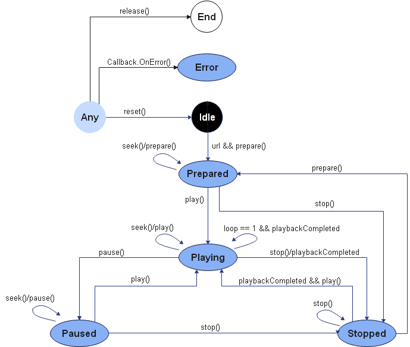
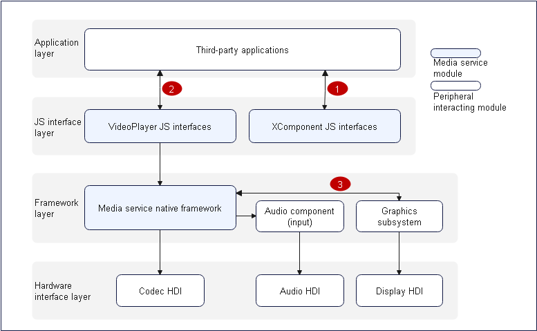

# Video Playback Development

## Introduction

You can use video playback APIs to convert audio data into audible analog signals and play the signals using output devices. You can also manage playback tasks. For example, you can start, suspend, stop playback, release resources, set the volume, seek to a playback position, set the playback speed, and obtain track information. This document describes development for the following video playback scenarios: full-process, normal playback, video switching, and loop playback.

## Working Principles

The following figures show the video playback state transition and the interaction with external modules for video playback.

**Figure 1** Video playback state transition



**Figure 2** Interaction with external modules for video playback



**NOTE**: When a third-party application calls a JS interface provided by the JS interface layer, the framework layer invokes the audio component through the media service of the native framework to output the audio data decoded by the software to the audio HDI. The graphics subsystem outputs the image data decoded by the codec HDI at the hardware interface layer to the display HDI. In this way, video playback is implemented.

*Note: Video playback requires hardware capabilities such as display, audio, and codec.*

1. A third-party application obtains a surface ID from the XComponent.
2. The third-party application transfers the surface ID to the VideoPlayer JS.
3. The media service flushes the frame data to the surface buffer.

## Compatibility

Use the mainstream playback formats and resolutions, rather than custom ones to avoid playback failures, frame freezing, and artifacts. The system is not affected by incompatibility issues. If such an issue occurs, you can exit stream playback mode.

The table below lists the mainstream playback formats and resolutions.

| Video Container Format|                     Description                     |               Resolution              |
| :----------: | :-----------------------------------------------: | :--------------------------------: |
|     mp4      | Video format: H.264/MPEG-2/MPEG-4/H.263; audio format: AAC/MP3| Mainstream resolutions, such as 1080p, 720p, 480p, and 270p|
|     mkv      | Video format: H.264/MPEG-2/MPEG-4/H.263; audio format: AAC/MP3| Mainstream resolutions, such as 1080p, 720p, 480p, and 270p|
|      ts      |   Video format: H.264/MPEG-2/MPEG-4; audio format: AAC/MP3   | Mainstream resolutions, such as 1080p, 720p, 480p, and 270p|
|     webm     |          Video format: VP8; audio format: VORBIS          | Mainstream resolutions, such as 1080p, 720p, 480p, and 270p|

## How to Develop

For details about the APIs, see [VideoPlayer in the Media API](../reference/apis/js-apis-media.md#videoplayer8).

### Full-Process Scenario

The full video playback process includes creating an instance, setting the URL, setting the surface ID, preparing for video playback, playing video, pausing playback, obtaining track information, seeking to a playback position, setting the volume, setting the playback speed, stopping playback, resetting the playback configuration, and releasing resources.

For details about the **url** types supported by **VideoPlayer**, see the [url attribute](../reference/apis/js-apis-media.md#videoplayer_attributes).

For details about how to create an XComponent, see [XComponent](../reference/arkui-ts/ts-basic-components-xcomponent.md).

```js
import media from '@ohos.multimedia.media'
import fileIO from '@ohos.fileio'
export class VideoPlayerDemo {
  // Report an error in the case of a function invocation failure.
  failureCallback(error) {
    console.info(`error happened,error Name is ${error.name}`);
    console.info(`error happened,error Code is ${error.code}`);
    console.info(`error happened,error Message is ${error.message}`);
  }

  // Report an error in the case of a function invocation exception.
  catchCallback(error) {
    console.info(`catch error happened,error Name is ${error.name}`);
    console.info(`catch error happened,error Code is ${error.code}`);
    console.info(`catch error happened,error Message is ${error.message}`);
  }

  // Used to print the video track information.
  printfDescription(obj) {
    for (let item in obj) {
      let property = obj[item];
      console.info('key is ' + item);
      console.info('value is ' + property);
    }
  }

  async videoPlayerDemo() {
    let videoPlayer = undefined;
    let surfaceID = 'test' // The surfaceID parameter is used for screen display. Its value is obtained through the XComponent API. For details about the document link, see the method of creating the XComponent.
    let fdPath = 'fd://'
    // The stream in the path can be pushed to the device by running the "hdc file send D:\xxx\H264_AAC.mp4 /data/app/el1/bundle/public/ohos.acts.multimedia.video.videoplayer/ohos.acts.multimedia.video.videoplayer/assets/entry/resources/rawfile" command.
    let path = '/data/app/el1/bundle/public/ohos.acts.multimedia.video.videoplayer/ohos.acts.multimedia.video.videoplayer/assets/entry/resources/rawfile/H264_AAC.mp4';
    await fileIO.open(path).then((fdNumber) => {
      fdPath = fdPath + '' + fdNumber;
      console.info('open fd success fd is' + fdPath);
    }, (err) => {
      console.info('open fd failed err is' + err);
    }).catch((err) => {
      console.info('open fd failed err is' + err);
    });
    // Call createVideoPlayer to create a VideoPlayer instance.
    await media.createVideoPlayer().then((video) => {
      if (typeof (video) != 'undefined') {
        console.info('createVideoPlayer success!');
        videoPlayer = video;
      } else {
        console.info('createVideoPlayer fail!');
      }
    }, this.failureCallback).catch(this.catchCallback);
    // Set the playback source for the player.
    videoPlayer.url = fdPath;

    // Set the surface ID to display the video image.
    await videoPlayer.setDisplaySurface(surfaceID).then(() => {
      console.info('setDisplaySurface success');
    }, this.failureCallback).catch(this.catchCallback);

    // Call the prepare API to prepare for playback.
    await videoPlayer.prepare().then(() => {
      console.info('prepare success');
    }, this.failureCallback).catch(this.catchCallback);

    // Call the play API to start playback.
    await videoPlayer.play().then(() => {
      console.info('play success');
    }, this.failureCallback).catch(this.catchCallback);

    // Pause playback.
    await videoPlayer.pause().then(() => {
      console.info('pause success');
    }, this.failureCallback).catch(this.catchCallback);

    // Use a promise to obtain the video track information communication_dsoftbus.
    let arrayDescription;
    await videoPlayer.getTrackDescription().then((arrlist) => {
      if (typeof (arrlist) != 'undefined') {
        arrayDescription = arrlist;
      } else {
        console.log('video getTrackDescription fail');
      }
    }, this.failureCallback).catch(this.catchCallback);

    for (let i = 0; i < arrayDescription.length; i++) {
      this.printfDescription(arrayDescription[i]);
    }

    // Seek to the 50s position. For details about the input parameters, see the API document.
    let seekTime = 50000;
    await videoPlayer.seek(seekTime, media.SeekMode.SEEK_NEXT_SYNC).then((seekDoneTime) => {
      console.info('seek success');
    }, this.failureCallback).catch(this.catchCallback);

    // Set the volume. For details about the input parameters, see the API document.
    let volume = 0.5;
    await videoPlayer.setVolume(volume).then(() => {
      console.info('setVolume success');
    }, this.failureCallback).catch(this.catchCallback);

    // Set the playback speed. For details about the input parameters, see the API document.
    let speed = media.PlaybackSpeed.SPEED_FORWARD_2_00_X;
    await videoPlayer.setSpeed(speed).then(() => {
      console.info('setSpeed success');
    }, this.failureCallback).catch(this.catchCallback);

    // Stop playback.
    await videoPlayer.stop().then(() => {
      console.info('stop success');
    }, this.failureCallback).catch(this.catchCallback);

    // Reset the playback configuration.
    await videoPlayer.reset().then(() => {
      console.info('reset success');
    }, this.failureCallback).catch(this.catchCallback);

    // Release playback resources.
    await videoPlayer.release().then(() => {
      console.info('release success');
    }, this.failureCallback).catch(this.catchCallback);

    // Set the related instances to undefined.
    videoPlayer = undefined;
    surfaceID = undefined;
  }
}
```

### Normal Playback Scenario

```js
import media from '@ohos.multimedia.media'
import fileIO from '@ohos.fileio'
export class VideoPlayerDemo {
  // Report an error in the case of a function invocation failure.
  failureCallback(error) {
    console.info(`error happened,error Name is ${error.name}`);
    console.info(`error happened,error Code is ${error.code}`);
    console.info(`error happened,error Message is ${error.message}`);
  }

  // Report an error in the case of a function invocation exception.
  catchCallback(error) {
    console.info(`catch error happened,error Name is ${error.name}`);
    console.info(`catch error happened,error Code is ${error.code}`);
    console.info(`catch error happened,error Message is ${error.message}`);
  }

  // Used to print the video track information.
  printfDescription(obj) {
    for (let item in obj) {
      let property = obj[item];
      console.info('key is ' + item);
      console.info('value is ' + property);
    }
  }

  async videoPlayerDemo() {
    let videoPlayer = undefined;
    let surfaceID = 'test' // The surfaceID parameter is used for screen display. Its value is obtained through the XComponent API. For details about the document link, see the method of creating the XComponent.
    let fdPath = 'fd://'
    // The stream in the path can be pushed to the device by running the "hdc file send D:\xxx\H264_AAC.mp4 /data/app/el1/bundle/public/ohos.acts.multimedia.video.videoplayer/ohos.acts.multimedia.video.videoplayer/assets/entry/resources/rawfile" command.
    let path = '/data/app/el1/bundle/public/ohos.acts.multimedia.video.videoplayer/ohos.acts.multimedia.video.videoplayer/assets/entry/resources/rawfile/H264_AAC.mp4';
    await fileIO.open(path).then((fdNumber) => {
      fdPath = fdPath + '' + fdNumber;
      console.info('open fd success fd is' + fdPath);
    }, (err) => {
      console.info('open fd failed err is' + err);
    }).catch((err) => {
      console.info('open fd failed err is' + err);
    });
    // Call createVideoPlayer to create a VideoPlayer instance.
    await media.createVideoPlayer().then((video) => {
      if (typeof (video) != 'undefined') {
        console.info('createVideoPlayer success!');
        videoPlayer = video;
      } else {
        console.info('createVideoPlayer fail!');
      }
    }, this.failureCallback).catch(this.catchCallback);
    // Set the playback source for the player.
    videoPlayer.url = fdPath;

    // Set the surface ID to display the video image.
    await videoPlayer.setDisplaySurface(surfaceID).then(() => {
      console.info('setDisplaySurface success');
    }, this.failureCallback).catch(this.catchCallback);

    // Call the prepare API to prepare for playback.
    await videoPlayer.prepare().then(() => {
      console.info('prepare success');
    }, this.failureCallback).catch(this.catchCallback);

    // Call the play API to start playback.
    await videoPlayer.play().then(() => {
      console.info('play success');
    }, this.failureCallback).catch(this.catchCallback);

    // Stop playback.
    await videoPlayer.stop().then(() => {
      console.info('stop success');
    }, this.failureCallback).catch(this.catchCallback);

    // Release playback resources.
    await videoPlayer.release().then(() => {
      console.info('release success');
    }, this.failureCallback).catch(this.catchCallback);

    // Set the related instances to undefined.
    videoPlayer = undefined;
    surfaceID = undefined;
  }
}
```

### Switching to the Next Video Clip

```js
import media from '@ohos.multimedia.media'
import fileIO from '@ohos.fileio'
export class VideoPlayerDemo {
  // Report an error in the case of a function invocation failure.
  failureCallback(error) {
    console.info(`error happened,error Name is ${error.name}`);
    console.info(`error happened,error Code is ${error.code}`);
    console.info(`error happened,error Message is ${error.message}`);
  }

  // Report an error in the case of a function invocation exception.
  catchCallback(error) {
    console.info(`catch error happened,error Name is ${error.name}`);
    console.info(`catch error happened,error Code is ${error.code}`);
    console.info(`catch error happened,error Message is ${error.message}`);
  }

  // Used to print the video track information.
  printfDescription(obj) {
    for (let item in obj) {
      let property = obj[item];
      console.info('key is ' + item);
      console.info('value is ' + property);
    }
  }

  async videoPlayerDemo() {
    let videoPlayer = undefined;
    let surfaceID = 'test' // The surfaceID parameter is used for screen display. Its value is obtained through the XComponent API. For details about the document link, see the method of creating the XComponent.
    let fdPath = 'fd://'
    // The stream in the path can be pushed to the device by running the "hdc file send D:\xxx\H264_AAC.mp4 /data/app/el1/bundle/public/ohos.acts.multimedia.video.videoplayer/ohos.acts.multimedia.video.videoplayer/assets/entry/resources/rawfile" command.
    let path = '/data/app/el1/bundle/public/ohos.acts.multimedia.video.videoplayer/ohos.acts.multimedia.video.videoplayer/assets/entry/resources/rawfile/H264_AAC.mp4';
    let nextPath = '/data/app/el1/bundle/public/ohos.acts.multimedia.video.videoplayer/ohos.acts.multimedia.video.videoplayer/assets/entry/resources/rawfile/MP4_AAC.mp4';
    await fileIO.open(path).then((fdNumber) => {
      fdPath = fdPath + '' + fdNumber;
      console.info('open fd success fd is' + fdPath);
    }, (err) => {
      console.info('open fd failed err is' + err);
    }).catch((err) => {
      console.info('open fd failed err is' + err);
    });
    // Call createVideoPlayer to create a VideoPlayer instance.
    await media.createVideoPlayer().then((video) => {
      if (typeof (video) != 'undefined') {
        console.info('createVideoPlayer success!');
        videoPlayer = video;
      } else {
        console.info('createVideoPlayer fail!');
      }
    }, this.failureCallback).catch(this.catchCallback);
    // Set the playback source for the player.
    videoPlayer.url = fdPath;

    // Set the surface ID to display the video image.
    await videoPlayer.setDisplaySurface(surfaceID).then(() => {
      console.info('setDisplaySurface success');
    }, this.failureCallback).catch(this.catchCallback);

    // Call the prepare API to prepare for playback.
    await videoPlayer.prepare().then(() => {
      console.info('prepare success');
    }, this.failureCallback).catch(this.catchCallback);

    // Call the play API to start playback.
    await videoPlayer.play().then(() => {
      console.info('play success');
    }, this.failureCallback).catch(this.catchCallback);

    // Reset the playback configuration.
    await videoPlayer.reset().then(() => {
      console.info('reset success');
    }, this.failureCallback).catch(this.catchCallback);

    // Obtain the next video FD address.
    fdPath = 'fd://'
    await fileIO.open(nextPath).then((fdNumber) => {
      fdPath = fdPath + '' + fdNumber;
      console.info('open fd success fd is' + fdPath);
    }, (err) => {
      console.info('open fd failed err is' + err);
    }).catch((err) => {
      console.info('open fd failed err is' + err);
    });
    // Set the second video playback source.
    videoPlayer.url = fdPath;

    // Call the prepare API to prepare for playback.
    await videoPlayer.prepare().then(() => {
      console.info('prepare success');
    }, this.failureCallback).catch(this.catchCallback);

    // Call the play API to start playback.
    await videoPlayer.play().then(() => {
      console.info('play success');
    }, this.failureCallback).catch(this.catchCallback);

    // Release playback resources.
    await videoPlayer.release().then(() => {
      console.info('release success');
    }, this.failureCallback).catch(this.catchCallback);

    // Set the related instances to undefined.
    videoPlayer = undefined;
    surfaceID = undefined;
  }
}
```

### Looping a Video Clip

```js
import media from '@ohos.multimedia.media'
import fileIO from '@ohos.fileio'
export class VideoPlayerDemo {
  // Report an error in the case of a function invocation failure.
  failureCallback(error) {
    console.info(`error happened,error Name is ${error.name}`);
    console.info(`error happened,error Code is ${error.code}`);
    console.info(`error happened,error Message is ${error.message}`);
  }

  // Report an error in the case of a function invocation exception.
  catchCallback(error) {
    console.info(`catch error happened,error Name is ${error.name}`);
    console.info(`catch error happened,error Code is ${error.code}`);
    console.info(`catch error happened,error Message is ${error.message}`);
  }

  // Used to print the video track information.
  printfDescription(obj) {
    for (let item in obj) {
      let property = obj[item];
      console.info('key is ' + item);
      console.info('value is ' + property);
    }
  }

  async videoPlayerDemo() {
    let videoPlayer = undefined;
    let surfaceID = 'test' // The surfaceID parameter is used for screen display. Its value is obtained through the XComponent API. For details about the document link, see the method of creating the XComponent.
    let fdPath = 'fd://'
    // The stream in the path can be pushed to the device by running the "hdc file send D:\xxx\H264_AAC.mp4 /data/app/el1/bundle/public/ohos.acts.multimedia.video.videoplayer/ohos.acts.multimedia.video.videoplayer/assets/entry/resources/rawfile" command.
    let path = '/data/app/el1/bundle/public/ohos.acts.multimedia.video.videoplayer/ohos.acts.multimedia.video.videoplayer/assets/entry/resources/rawfile/H264_AAC.mp4';
    await fileIO.open(path).then((fdNumber) => {
      fdPath = fdPath + '' + fdNumber;
      console.info('open fd success fd is' + fdPath);
    }, (err) => {
      console.info('open fd failed err is' + err);
    }).catch((err) => {
      console.info('open fd failed err is' + err);
    });
    // Call createVideoPlayer to create a VideoPlayer instance.
    await media.createVideoPlayer().then((video) => {
      if (typeof (video) != 'undefined') {
        console.info('createVideoPlayer success!');
        videoPlayer = video;
      } else {
        console.info('createVideoPlayer fail!');
      }
    }, this.failureCallback).catch(this.catchCallback);
    // Set the playback source for the player.
    videoPlayer.url = fdPath;

    // Set the surface ID to display the video image.
    await videoPlayer.setDisplaySurface(surfaceID).then(() => {
      console.info('setDisplaySurface success');
    }, this.failureCallback).catch(this.catchCallback);

    // Call the prepare API to prepare for playback.
    await videoPlayer.prepare().then(() => {
      console.info('prepare success');
    }, this.failureCallback).catch(this.catchCallback);
    // Set the loop playback attribute.
    videoPlayer.loop = true;
    // Call the play API to start loop playback.
    await videoPlayer.play().then(() => {
      console.info('play success, loop value is ' + videoPlayer.loop);
    }, this.failureCallback).catch(this.catchCallback);
  }
}
```
