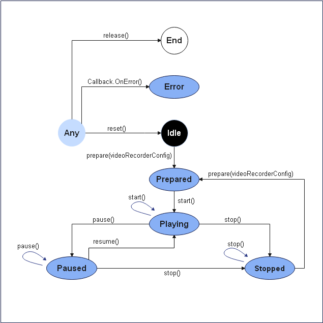
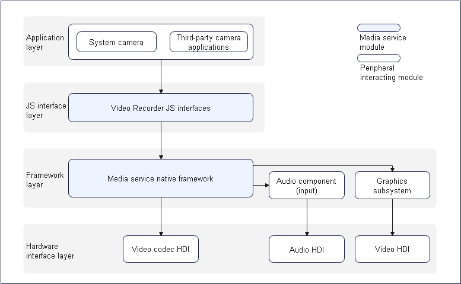

# Video Recording Development

## Introduction

You can use video recording APIs to capture audio and video signals, encode them, and save them to files. You can start, suspend, resume, and stop recording, and release resources. You can also specify parameters such as the encoding format, encapsulation format, and file path for video recording.

## Working Principles

The following figures show the video recording state transition and the interaction with external modules for video recording.

**Figure 1** Video recording state transition



**Figure 2** Interaction with external modules for video recording



**NOTE**: When a third-party camera application or system camera calls a JS interface provided by the JS interface layer, the framework layer uses the media service of the native framework to invoke the audio component. Through the audio HDI, the audio component captures audio data, encodes the audio data through software, and saves the encoded audio data to a file. The graphics subsystem captures image data through the video HDI, encodes the image data through the video codec HDI, and saves the encoded image data to a file. In this way, video recording is implemented.

## Constraints

Before developing video recording, configure the permissions **ohos.permission.MICROPHONE** and **ohos.permission.CAMERA** for your application. For details about the configuration, see [Permission Application Guide](../security/accesstoken-guidelines.md).

## How to Develop

For details about the APIs, see [VideoRecorder in the Media API](../reference/apis/js-apis-media.md#videorecorder9).

### Full-Process Scenario

The full video recording process includes creating an instance, setting recording parameters, starting, pausing, resuming, and stopping recording, and releasing resources.

```js
import media from '@ohos.multimedia.media'
import mediaLibrary from '@ohos.multimedia.mediaLibrary'
export class VideoRecorderDemo {
  private testFdNumber; // Used to save the FD address.
  // pathName indicates the passed recording file name, for example, 01.mp4. The generated file address is /storage/media/100/local/files/Video/01.mp4.
  // To use the media library, declare the following permissions: ohos.permission.MEDIA_LOCATION, ohos.permission.WRITE_MEDIA, and ohos.permission.READ_MEDIA.
  async getFd(pathName) {
    let displayName = pathName;
    const mediaTest = mediaLibrary.getMediaLibrary();
    let fileKeyObj = mediaLibrary.FileKey;
    let mediaType = mediaLibrary.MediaType.VIDEO;
    let publicPath = await mediaTest.getPublicDirectory(mediaLibrary.DirectoryType.DIR_VIDEO);
    let dataUri = await mediaTest.createAsset(mediaType, displayName, publicPath);
    if (dataUri != undefined) {
      let args = dataUri.id.toString();
      let fetchOp = {
        selections : fileKeyObj.ID + "=?",
        selectionArgs : [args],
      }
      let fetchFileResult = await mediaTest.getFileAssets(fetchOp);
      let fileAsset = await fetchFileResult.getAllObject();
      let fdNumber = await fileAsset[0].open('Rw');
      this.testFdNumber = "fd://" + fdNumber.toString();
    }
  }

  // Error callback triggered in the case of an error
  failureCallback(error) {
      console.info('error happened, error name is ' + error.name);
      console.info('error happened, error code is ' + error.code);
      console.info('error happened, error message is ' + error.message);
  }

  // Error callback triggered in the case of an exception
  catchCallback(error) {
      console.info('catch error happened, error name is ' + error.name);
      console.info('catch error happened, error code is ' + error.code);
      console.info('catch error happened, error message is ' + error.message);
  }

  async videoRecorderDemo() {
    let videoRecorder = null; // videoRecorder is an empty object and assigned with a value after createVideoRecorder is successfully called.
    let surfaceID = null; // Used to save the surface ID returned by getInputSurface.
    // Obtain the FD address of the video to be recorded.
    await this.getFd('01.mp4');
    // Recording-related parameter settings
    let videoProfile = {
      audioBitrate : 48000,
      audioChannels : 2,
      audioCodec : 'audio/mp4a-latm',
      audioSampleRate : 48000,
      fileFormat : 'mp4',
      videoBitrate : 48000,
      videoCodec : 'video/mp4v-es',
      videoFrameWidth : 640,
      videoFrameHeight : 480,
      videoFrameRate : 30
    }

    let videoConfig = {
      audioSourceType : 1,
      videoSourceType : 0,
      profile : videoProfile,
      url : this.testFdNumber, // testFdNumber is generated by getFd.
      orientationHint : 0,
      location : { latitude : 30, longitude : 130 }
    }
    // Create a VideoRecorder object.
    await media.createVideoRecorder().then((recorder) => {
      console.info('case createVideoRecorder called');
      if (typeof (recorder) != 'undefined') {
        videoRecorder = recorder;
        console.info('createVideoRecorder success');
      } else {
        console.info('createVideoRecorder failed');
      }
    }, this.failureCallback).catch(this.catchCallback);

    // Call the prepare API to prepare for video recording.
    await videoRecorder.prepare(videoConfig).then(() => {
      console.info('prepare success');
    }, this.failureCallback).catch(this.catchCallback);

    // Obtain the surface ID, save it, and pass it to camera-related APIs.
    await videoRecorder.getInputSurface().then((surface) => {
      console.info('getInputSurface success');
      surfaceID = surface;
    }, this.failureCallback).catch(this.catchCallback);

    // Video recording depends on camera-related APIs. The following operations can be performed only after the video output start API is invoked. For details about how to call the camera APIs, see the samples.
    // Start video recording.
    await videoRecorder.start().then(() => {
      console.info('start success');
    }, this.failureCallback).catch(this.catchCallback);

    // Pause video recording before the video output stop API of the camera is invoked.
    await videoRecorder.pause().then(() => {
      console.info('pause success');
    }, this.failureCallback).catch(this.catchCallback);

    // Resume video recording after the video output start API of the camera is invoked.
    await videoRecorder.resume().then(() => {
      console.info('resume success');
    }, this.failureCallback).catch(this.catchCallback);

    // Stop video recording after the video output stop API of the camera is invoked.
    await videoRecorder.stop().then(() => {
      console.info('stop success');
    }, this.failureCallback).catch(this.catchCallback);

    // Reset the recording configuration.
    await videoRecorder.reset().then(() => {
      console.info('reset success');
    }, this.failureCallback).catch(this.catchCallback);

    // Release the video recording resources and camera object resources.
    await videoRecorder.release().then(() => {
      console.info('release success');
    }, this.failureCallback).catch(this.catchCallback);

    // Set the related object to null.
    videoRecorder = undefined;
    surfaceID = undefined;
  }
}
```

