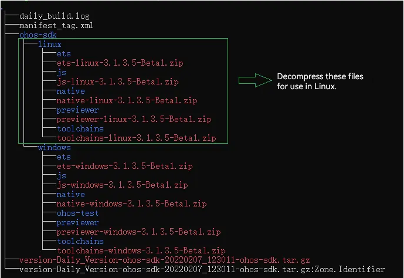
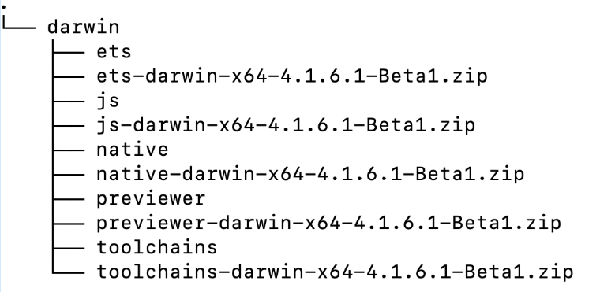
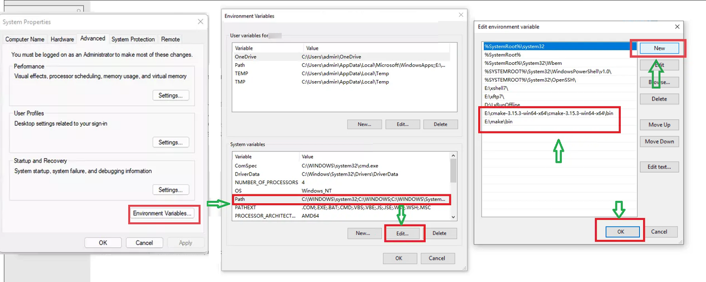
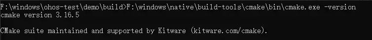
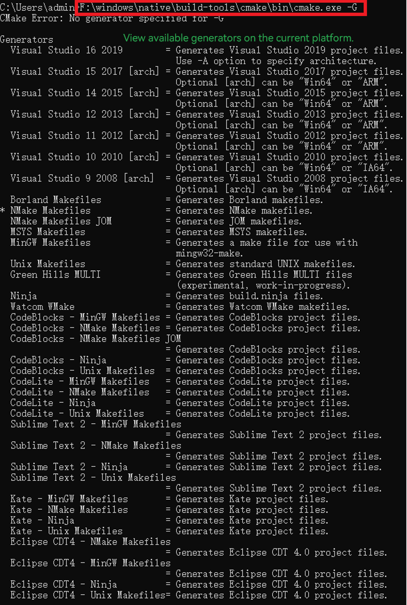
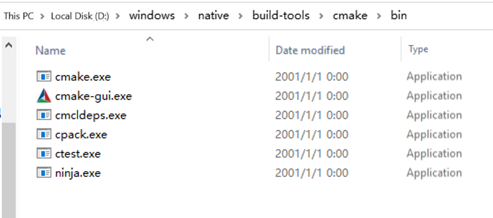
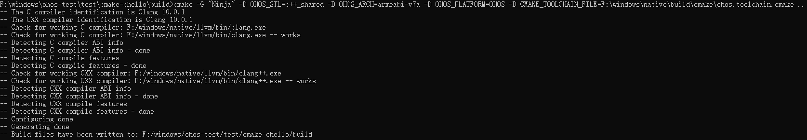
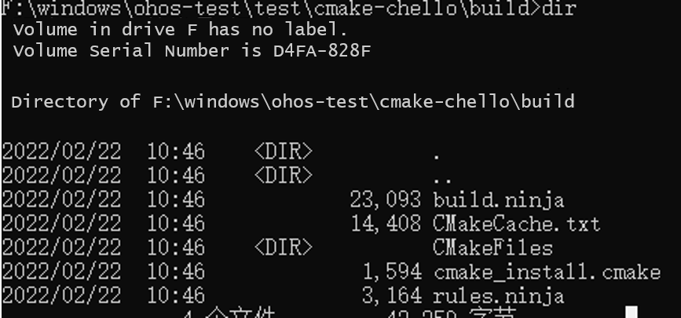

# Building an NDK Project with CMake


In many complex application projects, C++ projects are compiled and built in command line mode through build systems such as CMake. The following describes how to switch an existing CMake project to the OpenHarmony toolchain so that CMake can be used to build the project.


## Downloading the NDK
<!--RP1-->
1. (Recommended) Acquire source code from mirrors for an officially released version. Specifically, access the release notes of the target version, locate the **Acquiring Source Code from Mirror** section, and download the source code based on your system type.


2. Download the NDK from the SDK Manager in DevEco Studio.
<!--RP1End-->

## Decompressing the NDK

Place the downloaded NDK in a folder you prefer and decompress it.

Below shows the directory structure after decompression on Windows or Linux.



Below shows the directory structure after decompression on macOS.



### Configuring the Environment Variable
Skip this step if the NDK is downloaded from DevEco Studio.
1. Add the CMake tool that comes with the NDK to the environment variables.
+ On Linux

  ```
  # Open the .bashrc file.
  vim ~/.bashrc
  # Append the custom CMake path to the file. Save the file and exit.
  export PATH=${sdk_path}/native/build-tools/cmake/bin:$PATH
  # Run the source ~/.bashrc command to make the environment variable take effect.
  source ~/.bashrc
  ```

+ On macOS

  ```
  #In the current user directory, open the .bash_profile file. If the file does not exist, create one.
  vim ~/.bash_profile
  #Append the custom CMake path to the file. Save the file and exit.
  export PATH=${sdk_path}/native/build-tools/cmake/bin:$PATH
  #Run the source ~/.bash_profile command to make the environment variable take effect.
  source ~/.bash_profile
  ```

+ On Windows

  Right-click **This PC** and choose **Properties** from the shortcut menu. In the displayed dialog box, click the **Advanced System Settings** tab and then click **Environment Variables**. Under **System Variables** dialog box, select the **Path** environment variable and click **Edit**. Add the paths, save the settings, and exit. (If the next step cannot be performed, restart the computer.)
  
  
  
  Open the CLI and run the **{*cmake_installation_path*}\cmake.exe -version** command. If the CMake version number is displayed correctly, the environment variable configuration is complete.

  


2. Check the default CMake path.
   + On Linux or macOS
      ```
      #Run the which cmake command.
      which cmake
      #The result should be the same as the custom path previously appended to the .bashrc file.
      ~/ohos-sdk/ohos-sdk/linux/native/build-tools/cmake/bin/cmake
      ```
   + On Windows
     
     Right-click **This PC** and choose **Properties** from the shortcut menu. In the displayed dialog box, click the **Advanced System Settings** tab and then click **Environment Variables**. Under **System Variables** dialog box, check the **Path** value. The displayed CMake path should be the one you have added.


## Using the NDK to Compile a Native Program

You can use the NDK to quickly develop a native program, including native dynamic libraries, static libraries, and executable files. The following exemplifies how to use the NDK to compile an executable program and a dynamic library in a C/C++ demo project.


### Demo Project

The following is a CMake demo project. This project contains two directories. The **include** directory contains the header files of the library, and the **src** directory contains all source code. Specifically, the **src** directory contains two files: **sum.cpp** (algorithm file) and **main.cpp** (main entry file for invoking algorithms). The two files are compiled into an executable program and an algorithm dynamic library.

**Demo Project Directory**

```
demo
  ├── CMakeLists.txt
  ├── include
       └── sum.h
  └── src
       ├── CMakeLists.txt
       ├── sum.cpp
       └── hello.cpp
```

**CMakeLists.txt in the demo Directory**

```
# Specify the minimum CMake version.
CMAKE_MINIMUM_REQUIRED(VERSION 3.16)

# Set the project name, which is HELLO in this example.
PROJECT(HELLO)

#Add a subdirectory and build the subdirectory.
ADD_SUBDIRECTORY(src)
```

**CMakeLists.txt in the src Directory**

```
SET(LIBHELLO_SRC hello.cpp)

# Set compilation flags.
SET(CMAKE_CXX_FLAGS "${CMAKE_CXX_FLAGS} -O0")   
 
# Set the link parameter. The value below is only for exemplary purposes.
SET(CMAKE_EXE_LINKER_FLAGS "${CMAKE_EXE_LINKER_FLAGS} -Wl,--emit-relocs --verbose")    

# Add a libsum dynamic library target. If the compilation is successful, a libsum.so file is generated.
ADD_LIBRARY(sum SHARED sum.cpp)

# Add the executable target called Hello. If the compilation is successful, a Hello executable is generated.
ADD_EXECUTABLE(Hello ${LIBHELLO_SRC})

# Specify the path to the include directory of the Hello target.
TARGET_INCLUDE_DIRECTORIES(Hello PUBLIC ../include)

# Specify the name of the library to be linked to the Hello target.
TARGET_LINK_LIBRARIES(Hello PUBLIC sum)
```

**Source Code**

**hello.cpp** source code:

```
#include <iostream>
#include "sum.h"

int main(int argc,const char **argv)
{
    std::cout<< "hello world!" <<std::endl;
    int total = sum(1, 100);
    std::cout<< "Sum 1 + 100=" << total << std::endl;
    return 0;
}
```

**sum.h** source code:

```
int sum(int a, int b);
```

**sum.cpp** source code:

```
#include <iostream>
    
int sum(int a, int b)
{
    return a + b;
}
```


### Compiling and Building the Demo Project

**For Linux and macOS**

In the project directory, create the **build** directory to store the intermediate files generated during CMake building. **NOTE**<br>In the following commands, **ohos-sdk** is the root directory of the downloaded SDK. Replace it with the actual directory.

1. To build the project using dynamic linking with the C++ shared library, use **OHOS_STL=c++_shared**. Note that if **OHOS_STL** is not specified, **c++_shared** is used by default. Set **DOHOS_ARCH** based on the target system architecture. With **DOHOS_ARCH=armeabi-v7a**, a 32-bit dynamic library is compiled; with **DOHOS_ARCH=arm64-v8a**, a 64-bit dynamic library is compiled.

   ```
    >mkdir build && cd build
    >cmake -DOHOS_STL=c++_shared -DOHOS_ARCH=armeabi-v7a -DOHOS_PLATFORM=OHOS -DCMAKE_TOOLCHAIN_FILE={ohos-sdk}/linux/native/build/cmake/ohos.toolchain.cmake ..
    >cmake --build .
   ```

2. To build the project using static linking with the C++ shared library, use **OHOS_STL=c++_static**. Set **DOHOS_ARCH** based on the target system architecture. With **DOHOS_ARCH=armeabi-v7a**, a 32-bit static library is compiled; with **DOHOS_ARCH=arm64-v8a**, a 64-bit static library is compiled.

   ```
    >mkdir build && cd build
    >cmake -DOHOS_STL=c++_static -DOHOS_ARCH=armeabi-v7a -DOHOS_PLATFORM=OHOS -DCMAKE_TOOLCHAIN_FILE={ohos-sdk}/linux/native/build/cmake/ohos.toolchain.cmake ..
    >cmake --build .
   ```

   In the command, the **OHOS_ARCH** and **OHOS_PLATFORM** variables ultimately generate the **--target** command argument for Clang++. In this example, they correspond to the **--target=arm-linux-ohos** and **--march=armv7a** arguments.
   
   In the **CMAKE_TOOLCHAIN_FILE** file, **--sysroot={ndk_*sysroot_directory*}** is set for Clang++ by default, instructing the compiler to search for the root directory of system header files.

**For Windows**

Using CMake in Windows, unlike that in Linux, requires you to use the **-G** option to specify the generator.



In this example, the Ninja generator, which comes with the NDK, is used, as indicated by **-G "Ninja"**.



Step 1. Create the **build** folder in the project directory and run the following command:
```
 F:\windows\native\build-tools\cmake\bin\cmake.exe -G "Ninja" -D OHOS_STL=c++_shared -D OHOS_ARCH=armeabi-v7a -D OHOS_PLATFORM=OHOS -D CMAKE_TOOLCHAIN_FILE=F:\windows\native\build\cmake\ohos.toolchain.cmake ..
```
**NOTE**<br>If debugging is required, add the **-D CMAKE_BUILD_TYPE=normal** option. Both the CMake path and the toolchain file path (**ohos.toolchain.cmake**) should point to your downloaded NDK directory.
The following figure shows the command output.



The **build.ninja** file is the build configuration file.

Step 2. Use the ninja command to compile and generate the target file. The following figure shows the location of the target file.



Use **ninja -f build.ninja** or **cmake --build**. The following figure shows the command output.


