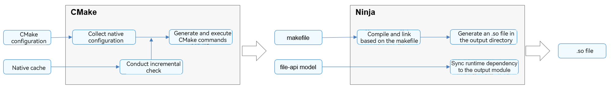

# Building an NDK Project with the DevEco Studio Template


The NDK uses CMake and Ninja to build C/C++ code of applications. The figure below shows the build process.





The core build process is as follows:


1. The build settings in the CMake configuration script and **externalNativeOptions** in **build-profile.json5** are compared with the settings in the native cache to generate CMake commands, and execute them.

2. Run Ninja, perform compilation and linking based on the makefile, and synchronize the generated .so file and the .so file on which the runtime depends to the output directory to complete the build process.


You can use the application template provided by DevEco Studio to quickly generate a CMake build script and set related compilation and build parameters in **build-profile.json5**.


## CMakeLists.txt

The NDK project created using the DevEco Studio template contains the automatically generated **CMakeLists.txt** script, as shown in the following:

```
# the minimum version of CMake.
cmake_minimum_required(VERSION 3.4.1)
project(MyApplication) 

# Define a variable and assign the cpp directory of the current module as its value.
set(NATIVERENDER_ROOT_PATH ${CMAKE_CURRENT_SOURCE_DIR})

# Add an .h directory, which includes the cpp and cpp/include directories, and instruct CMake to find in this directory the imported header file.
include_directories(${NATIVERENDER_ROOT_PATH}
                    ${NATIVERENDER_ROOT_PATH}/include)

# Declare the product libentry.so. SHARED indicates that the product is a dynamic library, and hello.cpp indicates the source code of the product.
add_library(entry SHARED hello.cpp)

# Declare the third-party library libace_napi.z.so required for linking to the product entry.
# The name of the third-party library is directly used here because it is in the NDK and has been in the link addressing path. No additional declaration is required.
target_link_libraries(entry PUBLIC libace_napi.z.so)
```

The source code, header files, and third-party libraries required for compilation are contained in the default **CMakeLists.txt** script. You can add custom compilation parameters, function declarations, and simple logic control based on the actual project.


## externalNativeOptions

The **externalNativeOptions** parameter in the module-level **build-profile.json5** file is the entry for configuring C/C++ file compilation of the NDK project. You can use **path** to specify the path to the CMake script, **arguments** to set CMake parameters, **cppFlags** to set C++ compiler parameters, and **abiFilters** to set the compilation architecture.
```
"apiType": "stageMode",
"buildOption": {
  "arkOptions": {
   },
  "externalNativeOptions": {
    "path": "./src/main/cpp/CMakeLists.txt",
    "arguments": "",
    "cppFlags": "",
    "abiFilters": [
       "arm64-v8a",
       "armeabi-v7a",
       "x86_64"
    ],
  }
}
```

The following table describes the **externalNativeOptions** parameter.

| Configuration Item| Type| Description| 
| -------- | -------- | -------- |
| path | string | Path to the CMake build script, that is, the **CMakeLists.txt** file.| 
| abiFilters | array | Local ABI. Available options are as follows:<br>- armeabi-v7a<br>- arm64-v8a<br>- x86_64<br>If this parameter is not set, the **arm64-v8a** option is used.| 
| arguments | string | CMake compilation parameters.| 
| cppFlags | string | C++ compiler parameters.| 

 
