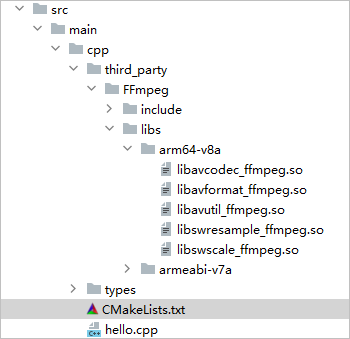
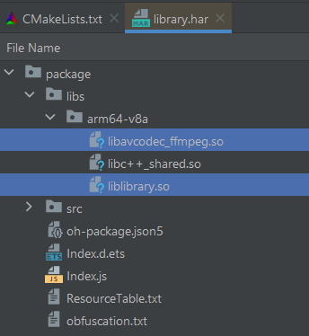

# Building an NDK Project with Prebuilt Libraries


In an NDK project, you can use the CMake syntax to import and use prebuilt libraries. When prebuilt libraries are referenced, the prebuilt libraries in the **libs** directory of the module and the prebuilt libraries declared in the **CMakeList.txt** script are packaged.


For example, the prebuilt library **libavcodec_ffmpeg.so** is located in the following directory during development.





To use it in your project, add it through **add_library** in the **CMakeLists.txt** script of the module and declare information such as the path to the prebuilt library. Then you can declare the link to the prebuilt library in **target_link_libraries**. The following is an example of the script:


```
add_library(library SHARED hello.cpp)

add_library(avcodec_ffmpeg SHARED IMPORTED)
set_target_properties(avcodec_ffmpeg
    PROPERTIES
    IMPORTED_LOCATION ${CMAKE_CURRENT_SOURCE_DIR}/third_party/FFmpeg/libs/${OHOS_ARCH}/libavcodec_ffmpeg.so)

target_link_libraries(library PUBLIC libace_napi.z.so avcodec_ffmpeg)
```


When prebuilt libraries are used in the HAR, the currently built libraries and prebuilt libraries required for linking are packed to the **libs** directory in the HAR, as shown in the following figure.





To use the prebuilt library integrated in a remote dependency HAR, write the reference script in the **CMakeLists.txt** file as follows:


```
set(DEPENDENCY_PATH ${CMAKE_CURRENT_SOURCE_DIR}/../../../oh_modules)
add_library(library SHARED IMPORTED)
set_target_properties(library
    PROPERTIES
    IMPORTED_LOCATION ${DEPENDENCY_PATH}/library/libs/${OHOS_ARCH}/liblibrary.so)
add_library(entry SHARED hello.cpp)
target_link_libraries(entry PUBLIC libace_napi.z.so library)
```


To use the prebuilt library integrated in a local HAR, write the reference script in the **CMakeLists.txt** file as follows:


```
set(LIBRARY_DIR "${NATIVERENDER_ROOT_PATH}/../../../../library/build/default/intermediates/libs/default/${OHOS_ARCH}/")
add_library(library SHARED IMPORTED)
set_target_properties(library
    PROPERTIES
    IMPORTED_LOCATION ${LIBRARY_DIR}/liblibrary.so)
add_library(entry SHARED hello.cpp)
target_link_libraries(entry PUBLIC libace_napi.z.so)
```
