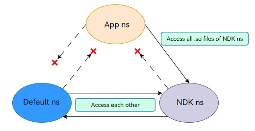

# C/C++ Library Mechanisms

The OpenHarmony NDK provides industry standard libraries [libc](../reference/native-lib/musl.md) and [libc++](../reference/native-lib/cpp.md). This topic describes the mechanisms of these libraries in OpenHarmony. Understanding these mechanisms helps you avoid pitfalls during NDK development.

##  C++ Compatibility

In OpenHarmony, both the system library and application native library use C++ standard library (see [libc++](../reference/native-lib/cpp.md#libc-version)). However, the C++ standard library used by the system library is updated with the image version, and the C++ standard library used by the app native library is updated with the SDK used for compilation. Since both the C++ standard libraries have multiple major versions, the different update approach may cause ABI compatibility issues. To solve this problem, OpenHarmony differentiates the two C++ standard libraries as follows:

- System library: uses **libc++.so**, which is released with the system image.
- Application native library: uses **libc++_shared.so**, which is released with the application.

The two libraries use different C++ namespaces. **libc++.so** uses **__h**, and **libc++_shared.so** uses **__n1**.

> **NOTE**
>
> The system and application cannot use the same C++ standard library. Native APIs are C APIs, which are used to isolate the C++ running environment. If the **libc++_shared.so** version in the HAR file is different from that of the application, incompatibility issues may occur. To solve this problem, use the same SDK version to update the HAR file.

**Known C++ Compatibility Issues**

If "symbol not found, s=\_\_emutls_get_address" is reported when an application starts or when **dlopen()** is called, update the SDK of the application or HAR. This symbol is not provided by **libc++\_shared.so** in the API version 9 or earlier, and is available since API version 11.  

##  musl libc Dynamic Linker

### Linker Namespace
Unlike the namespace in C++, a linker namespace (also referred to as ns) is a mechanism provided by the dynamic linker to isolate shared libraries within different namespaces. For example, the system native library can load the native library in the system directories, such as **/system/lib64** or **/vendor/lib64**; a common application can load only the common application native library and NDK library, but cannot directly load the system native library.

The dynamic linker must be associated with a specific namespace when it loads the shared library specified by **DT_NEEDED** in compilation or calls **dlopen** to load a shared library.

OpenHarmony has the following types of linker namespaces:

- Default ns: default namespace created for locating the .so files in **/system/lib{abi}** and **/vendor/lib{abi}** when the dynamic linker stats.

- NDK ns: default namespace created for exposing the NDK interfaces in .so files in **/system/lib{abi}/ndk** when the dynamic linker stats.

- App ns: namespace created when an application is started. It directs to the application installation path (sandbox path), that is, the .so file used to load the application.

The namespace mechanism restricts the invocation between the application native library and the system native library, as shown in the following figure.

 The default ns and NDK ns can access all .so files of each other, but cannot access the .so files of the app ns.
 The app ns can access all .so files of the NDK ns, but cannot access the .so files of the default ns.



### rpath
Run-time path (rpath) is a mechanism for specifying the runtime search path of a shared library. This mechanism allows a runtime search path to be embedded in an executable file or shared library. The dynamic linker uses this path to find required libraries.

The namespace mechanism allows an application to load only the native libraries in its installation directory (for example, **libs/arm64** on the ARM64 platform). If an application needs to load multiple native libraries, the native library in the newly created directory cannot be loaded. In this case, you can use the rpath mechanism to specify the search path during compilation.

For example, **libhello.so** in the application installation directory **lib/arm64** depends on **libworld.so** in the newly created directory **lib/arm64/module**. Set **rpath** in the **CMakeList.txt** file of the application and compile the file, and run **readelf** to view the rpath of **libhello.so**. As shown in the following figure, **$ORIGIN** indicates the path of **libhello.so**. The application can load **libworld.so** in the **module** directory during running.
```
SET(CMAKE_BUILD_WITH_INSTALL_RPATH TRUE)
SET(CMAKE_INSTALL_RPATH "\${ORIGIN}/module")
```


### dlclose
You can use **dlclose** to uninstall a dynamic library.

### symbol-version
symbol-version is a symbol retrieval mechanism provided by libc for symbol relocation in dynamic linking. It supports relocation of the symbols of different versions and helps solve the problem of duplicate symbols. For details, see <a href="https://www.gnu.org/software/gnulib/manual/html_node/LD-Version-Scripts.html">LD Version Scripts (GNU Gnulib)</a>.

### Fortified Check of the FD in select()
If the file descriptor (**fd**) passed in **FD_SET** or **FD_CLR** is not within the value range [0, 1024), abort crash will be triggered.

If the **fd** value passed in **FD_ISSET** is not within the value range [0, 1024), **false** will be returned.

### Globalization
Since API version 12, **locale** in **newlocale()** and **setlocale()** can be set to any of the following values: **C**, **C.UTF-8**, **en_US**, **en_US.UTF-8**, **zh_CN**, and **zh_CN.UTF-8**. **strtod_l**, **wcstod_l**, and **localeconv** support the **locale** values **zh_CN** and **zh_CN.UTF-8**. Note that **strtod_l()** and **wcstod_l()** do not support conversion of hexadecimal numbers and floating-point numbers.

### fdsan
File descriptor sanitizer ([fdsan](./fdsan.md)) helps detect the user-after-close and double-close issues of FDs.

##  Signal Usage
To avoid conflicts with system reserved signals, comply with the following rules when using signals:
- Signals 1 to 34 are reserved for the system and cannot be used.
- Signals 35 to 45 have been occupied by internal system modules (such as memory, DFX, runtime, and system services) by API version 19. To avoid conflicts with system behaviors and unexpected problems, do not use these signals.
- The values of **SIGRTMIN** and **__libc_current_sigrtmin** are 35, indicating the start number of real-time signals available to applications (applications can actually use only signals 46 and later).

The HarmonyOS internal signals are as follows.

| ID| Name     | Description            | ID| Name                                       | Description                     |
|------|-----------|-----------------|------|--------------------------------------------|---------------------------|
| 1    | SIGHUP    |  Terminal suspension control.   | 24   | SIGXCPU                                    | CPU time limit exceeded.         | 
| 2    | SIGINT    |  Interrupted.          | 25   | SIGXFSZ                                    | Maximum file size exceeded.           |
| 3    | SIGQUIT   |  Keyboard exit.       | 26   | SIGVTALRM                                  | Virtual timer.                |
| 4    | SIGILL    |  Invalid instruction.       | 27   | SIGPROF                                    | Profiling timer expired.      |
| 5    | SIGTRAP   |  Debug breakpoint.       | 28   | SIGWINCH                                   | Terminal window size changed.          |
| 6    | SIGABRT   |  Aborted.       | 29   | SIGIO                                      | I/O availability notification.              |
| 7    | SIGBUS    |  Bus error.       | 30   | SIGPWR                                     | Power fault.                  |
| 8    | SIGFPE    |  Arithmetic exception.       | 31   | SIGSYS                                     | Invalid system call.              |
| 9    | SIGKILL   |  Forcible termination.       | 32   | SIGTIMER                                   | Timer.            |
| 10   | SIGUSR1   |  Custom signal 1.| 33   | SIGCANCEL                                  | Thread canceled.              |
| 11   | SIGSEGV   |  Invalid memory access.    | 34   | SIGSYNCCALL                                | Synchronous call.              |
| 12   | SIGUSR2   |  Custom signal 2.| 35   | MUSL_SIGNAL_NATIVE_REMOTE (SIGRTMIN + 0)   | System reserved.                  |
| 13   | SIGPIPE   |  Pipe damaged.        | 36   | MUSL_SIGNAL_HOOK (SIGRTMIN + 1)            | System reserved.                 |
| 14   | SIGALRM   |  Alarm.      | 37   | MUSL_SIGNAL_UNHOOK (SIGRTMIN + 2)          | System reserved.                 |
| 15   | SIGTERM   |  Application termination request.    | 38   | MUSL_SIGNAL_NATIVE_LOCAL (SIGRTMIN + 3)    | System reserved.                 |
| 16   | SIGSTKFLT |  Coprocessor stack error.   | 39  | MUSL_SIGNAL_JSHEAP (SIGRTMIN + 4)          | System reserved.                 |
| 17   | SIGCHLD   |  Child process exit/stop.  | 40  | MUSL_SIGNAL_JSHEAP_PRIV (SIGRTMIN + 5)     | System reserved.                 |
| 18   | SIGCONT   |  Continue the execution.        | 41   | MUSL_SIGNAL_SAMPLE_STACK (SIGRTMIN + 6)    | System reserved.                 |
| 19   | SIGSTOP   |  Forcible stop.        | 42   | MUSL_SIGNAL_LEAK_STACK (SIGRTMIN + 7)      | System reserved.                 |
| 20   | SIGTSTP   |  Stop inputting on the terminal.  | 43   | MUSL_SIGNAL_RECYCLE_JEMALLOC (SIGRTMIN + 8) | System reserved.                 |
| 21   | SIGTTIN   |  Background terminal reading.      | 44   | MUSL_SIGNAL_MEMCHECK (SIGRTMIN + 9)         | System reserved.                 |
| 22   | SIGTTOU   |  Background terminal writing.      | 45   | MUSL_SIGNAL_FDTRACK (SIGRTMIN + 10)         | System reserved.                 |
| 23   | SIGURG    |  Socket has urgent data. |   -  |                          -                  |                 -        |
