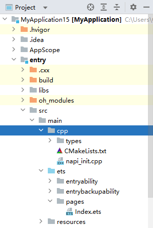

# Creating an NDK Project

The following uses the NDK project template of DevEco Studio to create an NDK project.

>  **NOTE**
> 
> The project wizard and default template parameters vary according to the DevEco Studio version.

1. Open the DevEco Studio project wizard using either of the following methods:
   - If no project is open, select **Create Project** on the welcome page.
   - If a project is already open, choose **File** > **New** > **Create Project** on the menu bar.

2. On the **Choose Your Ability Template** page, select **Native C++** as the template, and click **Next**.
   

3. On the project configuration page, configure basic project information and click **Finish**. DevEco Studio will automatically generate the sample code and resources that match your project type. Wait until the project is created.
   The main code of your application is in the **cpp** folder under **entry/src/main** of the project directory. For details about the files in the **cpp** folder, see <!--RP1-->[C++ Project Directory Structure](https://developer.huawei.com/consumer/en/doc/harmonyos-guides-V5/ide-project-structure-V5)<!--RP1End-->.

   
