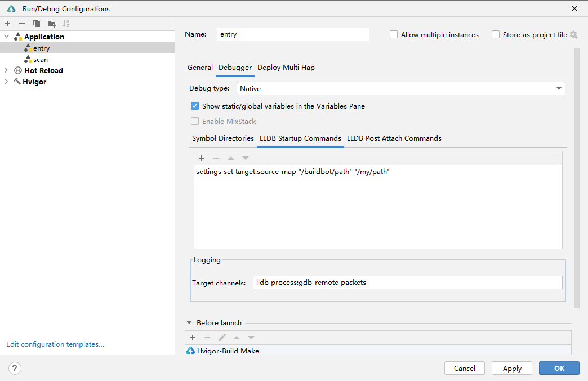

# Debugging in DevEco Studio

DevEco Studio provides a wide range of debugging features, which can be used to detect and rectify program errors during NDK development. These debugging features include:

- Debugging using a real device: Run your application or service on a real device to see how it behaves on the device.
  During debugging, if the source code path of the .so file of the local compilation device is different from the configured C++ source code path, fix the issue using either of the following methods:

  - Create the mapping between files. After you debug code with the Step Into feature, you will be prompted to associate the source code. Click **Select file** and select the local C++ source code for association.
     
  - Create the mapping between paths. Choose **Run** > **Edit Configurations**, select a module, switch to the **Debugger** tab, select **Native**, and add the **settings set target.source-map "/buildbot/path" "/my/path"** command on the **LLDB Startup Commands** tab page to establish the mapping. Parameter 1 indicates the source code path in the compilation environment, and parameter 2 indicates the local source code path.
     

- Visualized variable debugging: Observe the continuous change of variable values on the GUI. By viewing, comparing, and analyzing the change process and logical relationship of a variable, you can determine whether the current value (variable) meets the expected result and locate the fault (if any) quickly and effectively.

- C/C++ reverse debugging: During debugging, you can roll back to historical lines and breakpoints to view related variable information.
