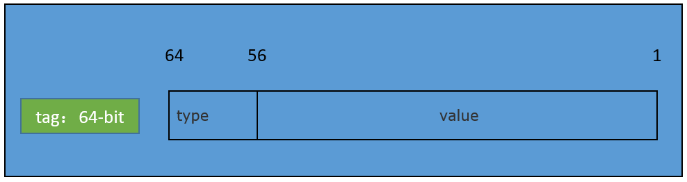

# Using fdsan

## Introduction

File descriptor sanitizer (fdsan) is a tool used to detect mishandling of file descriptor ownership, which includes double-close and use-after-close. The file descriptor can indicate a file, directory, network socket, I/O device, and the like in an operating system. When a file or a socket is opened in an application, a file descriptor is generated. If a file descriptor is repeatedly closed after being used or is used after being closed, security risks such as memory leaks and file handle leaks will be caused. This type of problems is difficult to locate. That is why fdsan comes in handy.

## Working Principle

fdsan provides functions to associate a file descriptor with an owner and enforces detection of file descriptor errors based on ownership. When a file is opened or created, the file descriptor returned is associated with a tag, which indicates the owner responsible for closing it. Before the file is closed, the tag associated with the file descriptor is checked to determine whether the owner is correct. If yes, the file can be closed. Otherwise, an exception will be thrown to trigger error handling.

A tag is of 64 bits, consisting of the following:

- **type**: an 8-bit string indicating how a file descriptor is encapsulated for management. For example, **FDSAN_OWNER_TYPE_FILE** indicates that the file descriptor is managed as a handle to a file. The value of **type** is defined in **fdsan_owner_type**.

- **value**: a 56-bit string uniquely identifying a tag.

 **Figure** Tag




## Available APIs

### fdsan_set_error_level

```
enum fdsan_error_level fdsan_set_error_level(enum fdsan_error_level new_level);
```

**Description**<br>Sets an error level, which determines the processing behavior when an exception is detected. The default value is **FDSAN_ERROR_LEVEL_WARN_ALWAYS**.

**Parameters**<br>**fdsan_error_level**

| Value                      | Description                                                        |
| -------------------------- | ------------------------------------------------------------ |
| `FDSAN_ERROR_LEVEL_DISABLED` | fdsan is disabled, that is, no processing is performed.                        |
| `FDSAN_ERROR_LEVEL_WARN_ONCE` | Give a warning in HiLog only when the error is detected for the first time and then continue execution with fdsan disabled (**FDSAN_ERROR_LEVEL_DISABLED**).|
| `FDSAN_ERROR_LEVEL_WARN_ALWAYS` | Give a warning in HiLog only each time the error is detected.|
| `FDSAN_ERROR_LEVEL_FATAL` | Call **abort** to terminate the process when the error is detected.|

**Return value**<br>Old **error_level**.

### fdsan_get_error_level

```
enum fdsan_error_level fdsan_get_error_level();
```

**Description**<br>Obtains the current error level.

**Return value**<br>Current error level.

### fdsan_create_owner_tag
```
uint64_t fdsan_create_owner_tag(enum fdsan_owner_type type, uint64_t tag);
```
**Description**<br>Creates a tag for a file descriptor.

**Parameters**<br>**fdsan_owner_type**

| Value                      | Description                                                        |
| -------------------------- | ------------------------------------------------------------ |
| `FDSAN_OWNER_TYPE_GENERIC_00` | Default type.    |
| `FDSAN_OWNER_TYPE_GENERIC_FF` | Default type for invalid file descriptors.|
| `FDSAN_OWNER_TYPE_FILE` | Type for a file, which can be opened by using **fopen()** or **fdopen()**.|
| `FDSAN_OWNER_TYPE_DIRECTORY` | Type for a directory, which can be opened by using **opendir** or **fdopendir**.|
| `FDSAN_OWNER_TYPE_UNIQUE_FD` | Type for **unique_fd**. This value is reserved.|
| `FDSAN_OWNER_TYPE_ZIPARCHIVE` | Type for a .zip file. This value is reserved.|

**Return value**<br>Created tag, which can be used as an input of **fdsan_exchange_owner_tag**.

### fdsan_exchange_owner_tag

```
void fdsan_exchange_owner_tag(int fd, uint64_t expected_tag, uint64_t new_tag);
```
**Description**<br>Modifies the tag of a file descriptor.

Locate the **FdEntry** based on the file descriptor and check whether the value of **close_tag** is the same as that of **expected_tag**. If yes, you can change the value of **FdEntry** with the value of **new_tag** passed in.

If the value of **close_tag** is not the same as that of **expected_tag**, an error occurs.

**Parameters**

| Name                      | Type              | Description                                                        |
| -------------------------- | ------------------------------------------------------------ | ------------------------------------------------------------ |
| `fd` | int | File descriptor, which serves as an index of **FdEntry**.|
| `expected_tag` | uint64_t | Expected value of the tag.    |
| `new_tag` | uint64_t | New value of the tag.  |


### fdsan_close_with_tag

```
int fdsan_close_with_tag(int fd, uint64_t tag);
```
**Description**<br>Closes a file descriptor based on the tag.

Locate the **FdEntry** based on the file descriptor. If **close_tag** is the same as **tag**, the file descriptor can be closed. Otherwise, an exception occurs.

**Parameters**

| Name                      | Type              | Description                                                        |
| -------------------------- | ------------------------------------------------------------ | ------------------------------------------------------------ |
| `fd` | int | File descriptor to close.|
| `tag` | uint64_t | Expected tag.    |

**Return value**<br>Returns **0** if the file descriptor is closed; returns **-1** otherwise.

### fdsan_get_owner_tag
```
uint64_t fdsan_get_owner_tag(int fd);
```
**Description**<br>Obtains tag information based on the given file descriptor.

Locate **FdEntry** based on the file descriptor and obtain **close_tag**.

**Parameters**

| Name                      | Type              | Description                                                        |
| -------------------------- | ------------------------------------------------------------ | ------------------------------------------------------------ |
| `tag` | uint64_t | Owner tag.    |

**Return value**<br>Tag of the file descriptor.

### fdsan_get_tag_type
```
const char* fdsan_get_tag_type(uint64_t tag);
```
**Description**<br>Obtains the file descriptor type based on the given tag.

The type information can be calculated based on the tag information.

**Parameters**

| Name                      | Type              | Description                                                        |
| -------------------------- | ------------------------------------------------------------ | ------------------------------------------------------------ |
| `tag` | uint64_t | Owner tag.    |

**Return value**<br>Type obtained.

### fdsan_get_tag_value
```
uint64_t fdsan_get_tag_value(uint64_t tag);
```
**Description**<br>Obtains the owner value based on the given tag.

The value contained in a tag can be obtained via offset calculation .

**Parameters**

| Name                      | Type              | Description                                                        |
| -------------------------- | ------------------------------------------------------------ | ------------------------------------------------------------ |
| `tag` | uint64_t | Owner tag.    |

**Return value**<br>Owner value obtained.

## Example

Use fdsan to detect a double-close problem.

```
void good_write()
{
    sleep(1);
    int fd = open(DEV_NULL_FILE, O_RDONLY);
    sleep(3);
    ssize_t ret = write(fd, "fdsan test\n", 11);
    if (ret == -1) {
        OH_LOG_ERROR(LOG_APP, "good write but failed?!");
    }
    close(fd);
}

void bad_close()
{
    int fd = open(DEV_NULL_FILE, O_RDONLY);
    close(fd);
    sleep(2);
    // This close expected to be detect by fdsan
    close(fd);
}

void functional_test()
{
    std::vector<std::thread> threads;
    for (auto function : { good_write, bad_close }) {
        threads.emplace_back(function);
    }
    for (auto& thread : threads) {
        thread.join();
    }
}

int main()
{
    functional_test();
    return 0;
}
```
In this example, **good_write** is used to open a file and write data to it; **bad_close** is used to open a file and trigger a double-close problem. If the two threads run at the same time, the application execution is as follows:


The **open()** API returns file descriptors in sequence. After the main function is called, the first available file descriptor is **43**. When **bad_close** is called, the file descriptor returned by **open()** for the first time is **43**. After **close()** is called, the file descriptor **43** becomes available. When **good_write** is called, the **open()** function returns the first available file descriptor, that is, **43**. Since **bad_close()** has the double-close problem, the file opened in another thread is incorrectly closed, causing a write failure.

The fdsan tool can detect such problems in two ways: using standard library APIs or implementing APIs with fdsan.

### Using Standard Library APIs

The **fopen**, **fdopen**, **opendir**, and **fdopendir** APIs in libc have integrated fdsan. Using these APIs instead of **open** can help detect file descriptor mishandling problems. Use **fopen** instead of **open** in the following code:

```cpp
void good_write()
{
    sleep(1);
    // fopen is protected by fdsan. Use fopen to replace open. 
    // int fd = open(DEV_NULL_FILE, O_RDONLY);
    FILE *f = fopen(DEV_NULL_FILE, O_RDONLY);
    sleep(3);
    ssize_t ret = write(fileno(f), "fdsan test\n", 11);
    if (ret == -1) {
        OH_LOG_ERROR(LOG_APP, "good write but failed?!");
    }
    close(fileno(f));
}
```

Each file descriptor returned by **fopen** has a tag. When the file descriptor is closed by **close**, fdsan checks whether the file descriptor matches the tag. If the file descriptor does not match the tag, related log information is displayed by default. The log information for the preceding code is as follows:

```
# hilog | grep MUSL-FDSAN
04-30 15:03:41.760 10933  1624 E C03f00/MUSL-FDSAN: attempted to close file descriptor 43,                             expected to be unowned, actually owned by FILE* 0x00000000f7b90aa2
```

As indicated by the log, the file of **FILE** is closed by mistake. You can further locate the fault based on the address of **FILE**.

In addition, you can use **fdsan_set_error_level** to set an error level. If **error_level** is set to **FDSAN_ERROR_LEVEL_FATAL**, fdsan also provides stack information for fault locating in addition to the log information. The following is an example of the stack information generated upon a crash after **error_level** is set to **FDSAN_ERROR_LEVEL_FATAL**:

```
Reason:Signal:SIGABRT(SI_TKILL)@0x0000076e from:1902:20010043
Fault thread info:
Tid:15312, Name:e.myapplication
#00 pc 000e65bc /system/lib/ld-musl-arm.so.1(raise+176)(3de40c79448a2bbced06997e583ef614)
#01 pc 0009c3bc /system/lib/ld-musl-arm.so.1(abort+16)(3de40c79448a2bbced06997e583ef614)
#02 pc 0009de4c /system/lib/ld-musl-arm.so.1(fdsan_error+116)(3de40c79448a2bbced06997e583ef614)
#03 pc 0009e2e8 /system/lib/ld-musl-arm.so.1(fdsan_close_with_tag+836)(3de40c79448a2bbced06997e583ef614)
#04 pc 0009e56c /system/lib/ld-musl-arm.so.1(close+20)(3de40c79448a2bbced06997e583ef614)
#05 pc 000055d8 /data/storage/el1/bundle/libs/arm/libentry.so(bad_close()+96)(f3339aac824c099f449153e92718e1b56f80b2ba)
#06 pc 00006cf4 /data/storage/el1/bundle/libs/arm/libentry.so(decltype(std::declval<void (*)()>()()) std::__n1::__invoke[abi:v15004]<void (*)()>(void (*&&)())+24)(f3339aac824c099f449153e92718e1b56f80b2ba)
#07 pc 00006c94 /data/storage/el1/bundle/libs/arm/libentry.so(f3339aac824c099f449153e92718e1b56f80b2ba)
#08 pc 000067b8 /data/storage/el1/bundle/libs/arm/libentry.so(void* std::__n1::__thread_proxy[abi:v15004]<std::__n1::tuple<std::__n1::unique_ptr<std::__n1::__thread_struct, std::__n1::default_delete<std::__n1::__thread_struct>>, void (*)()>>(void*)+100)(f3339aac824c099f449153e92718e1b56f80b2ba)
#09 pc 00105a6c /system/lib/ld-musl-arm.so.1(start+248)(3de40c79448a2bbced06997e583ef614)
#10 pc 000700b0 /system/lib/ld-musl-arm.so.1(3de40c79448a2bbced06997e583ef614)
```

The stack information provides information about **bad_close** and all opened files, helping quickly locate faults.

```
OpenFiles:
0->/dev/null native object of unknown type 0
1->/dev/null native object of unknown type 0
2->/dev/null native object of unknown type 0
3->socket:[28102] native object of unknown type 0
4->socket:[28103] native object of unknown type 0
5->anon_inode:[eventpoll] native object of unknown type 0
6->/sys/kernel/debug/tracing/trace_marker native object of unknown type 0
7->anon_inode:[eventpoll] native object of unknown type 0
8->anon_inode:[eventpoll] native object of unknown type 0
9->/dev/console native object of unknown type 0
10->pipe:[95598] native object of unknown type 0
11->pipe:[95598] native object of unknown type 0
12->socket:[18542] native object of unknown type 0
13->pipe:[96594] native object of unknown type 0
14->socket:[18545] native object of unknown type 0
15->pipe:[96594] native object of unknown type 0
16->anon_inode:[eventfd] native object of unknown type 0
17->/dev/binder native object of unknown type 0
18->/data/storage/el1/bundle/entry.hap native object of unknown type 0
19->anon_inode:[eventpoll] native object of unknown type 0
20->anon_inode:[signalfd] native object of unknown type 0
21->socket:[29603] native object of unknown type 0
22->anon_inode:[eventfd] native object of unknown type 0
23->anon_inode:[eventpoll] native object of unknown type 0
24->anon_inode:[eventfd] native object of unknown type 0
25->anon_inode:[eventpoll] native object of unknown type 0
26->anon_inode:[eventfd] native object of unknown type 0
27->anon_inode:[eventpoll] native object of unknown type 0
28->anon_inode:[eventfd] native object of unknown type 0
29->anon_inode:[eventpoll] native object of unknown type 0
30->anon_inode:[eventfd] native object of unknown type 0
31->anon_inode:[eventpoll] native object of unknown type 0
32->anon_inode:[eventfd] native object of unknown type 0
33->anon_inode:[eventpoll] native object of unknown type 0
34->anon_inode:[eventfd] native object of unknown type 0
35->socket:[97409] native object of unknown type 0
36->socket:[94716] native object of unknown type 0
38->socket:[94720] native object of unknown type 0
40->/data/storage/el1/bundle/entry_test.hap native object of unknown type 0
41->socket:[95617] native object of unknown type 0
42->/sys/kernel/debug/tracing/trace_marker native object of unknown type 0
43->/dev/null FILE* 4155724704
44->socket:[94737] native object of unknown type 0
45->pipe:[95634] native object of unknown type 0
46->pipe:[95634] native object of unknown type 0
47->pipe:[95635] native object of unknown type 0
49->pipe:[95636] native object of unknown type 0
50->pipe:[95636] native object of unknown type 0
```


### Implementing APIs with fdsan

You can also implement APIs with fdsan by using **fdsan_exchange_owner_tag** and **fdsan_close_with_tag**. The former can be used to set a tag for a file descriptor; the latter can be used to check the tag when a file is closed.

Example:

```cpp
struct fdsan_fd {
    fdsan_fd() = default;

    explicit fdsan_fd(int fd)
    {
        reset(fd);
    }

    fdsan_fd(const fdsan_fd& copy) = delete;
    fdsan_fd(fdsan_fd&& move)
    {
        *this = std::move(move);
    }

    ~fdsan_fd()
    {
        reset();
    }

    fdsan_fd& operator=(const fdsan_fd& copy) = delete;
    fdsan_fd& operator=(fdsan_fd&& move)
    {
        if (this == &move) {
            return *this;
        }
        reset();
        if (move.fd_ != -1) {
            fd_ = move.fd_;
            move.fd_ = -1;
            // Acquire ownership from the moved-from object.
            exchange_tag(fd_, move.tag(), tag());
        }
        return *this;
    }

    int get()
    {
        return fd_;
    }

    void reset(int new_fd = -1)
    {
        if (fd_ != -1) {
            close(fd_, tag());
            fd_ = -1;
        }
        if (new_fd != -1) {
            fd_ = new_fd;
            // Acquire ownership of the presumably unowned fd.
            exchange_tag(fd_, 0, tag());
        }
    }

  private:
    int fd_ = -1;

    // Use the address of object as the file tag
    uint64_t tag()
    {
        return reinterpret_cast<uint64_t>(this);
    }

    static void exchange_tag(int fd, uint64_t old_tag, uint64_t new_tag)
    {
        if (&fdsan_exchange_owner_tag) {
            fdsan_exchange_owner_tag(fd, old_tag, new_tag);
        }
    }

    static int close(int fd, uint64_t tag)
    {
        if (&fdsan_close_with_tag) {
            return fdsan_close_with_tag(fd, tag);
        }
    }
};
```

In this example, **fdsan_exchange_owner_tag** is used to bind a file descriptor and the address of a struct object. Then, **fdsan_close_with_tag** is used to check whether the tag matches the file descriptor before the file is closed. The expected tag is the struct object address.

You can use the implemented API in the following code to detect and prevent file descriptor mishandling problems:

```cpp
void good_write()
{
    sleep(1);
    // int fd = open(DEV_NULL_FILE, O_RDONLY);
    fdsan_fd fd(open(DEV_NULL_FILE, O_RDONLY));
    sleep(3);
    ssize_t ret = write(fd.get(), "fdsan test\n", 11);
    if (ret == -1) {
        OH_LOG_ERROR(LOG_APP, "good write but failed?!");
    }
    close(fd.get());
}
```

When the application is executed, the double-close problem of another thread can be detected. You can also set **error_level** to **fatal** so that fdsan can proactively crash after detecting a crash.
