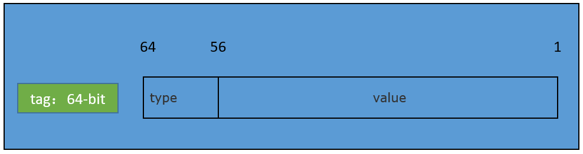
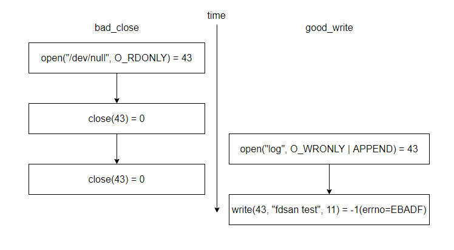

# Using fdsan

<!--Kit: ArkTS-->
<!--Subsystem: CommonLibrary-->
<!--Owner: @liyiming13-->
<!--Designer: @lijin1039-->
<!--Tester: @kirl75; @zsw_zhushiwei-->
<!--Adviser: @k1ngqaquuu-->
<!-- md-trans-meta sourceCommit=475e4d2b6871e35f77881171adb8e0af7608aa09 translatedAt=2026-08-12T06:25:11.681Z pushedAt=2026-08-12T07:48:12.970Z -->

## When to Use

fdsan is primarily used to detect incorrect operations on the same file descriptor by different users, such as double-close and use-after-close. These file descriptors can be files, directories, network sockets, or other I/O devices in the operating system. In a program, opening a file or socket generates a file descriptor. If this file descriptor is closed repeatedly or used after being closed, it can lead to security risks such as memory leaks or file handle leaks. Such issues are highly subtle and difficult to troubleshoot. To address this, fdsan is introduced as a detection tool.

## Implementation Principles

Design approach: When an existing file is opened or a new file is created, after obtaining the returned fd, set an associated tag to mark the owner information of the fd. Before closing the file, check the tag associated with the fd to determine whether it matches the expectation (owner information is consistent). If it matches, proceed with the normal file closing process. If it does not match, an anomaly is detected, and the corresponding error handling is invoked based on the configuration.

A tag is of 64 bits, consisting of the following:

**type**: an 8-bit string indicating how a file descriptor is encapsulated for management. For example, **FDSAN_OWNER_TYPE_FILE** indicates that the file descriptor is managed as a handle to a file. The value of **type** is defined in **fdsan_owner_type**.

**value**: a 56-bit string uniquely identifying a tag.

 **Figure** Tag



## Available APIs

### fdsan_set_error_level

```c
enum fdsan_error_level fdsan_set_error_level(enum fdsan_error_level new_level);
```

**Description**<br>Sets an error level, which determines the processing behavior when an exception is detected. The default value is **FDSAN_ERROR_LEVEL_WARN_ALWAYS**.

**Parameters**<br>**fdsan_error_level**

| Value                      | Description                                                        |
| -------------------------- | ------------------------------------------------------------ |
| `FDSAN_ERROR_LEVEL_DISABLED` | fdsan is disabled, that is, no processing is performed.                        |
| `FDSAN_ERROR_LEVEL_WARN_ONCE` | Give a warning in HiLog only when the error is detected for the first time and then continue execution with fdsan disabled (**FDSAN_ERROR_LEVEL_DISABLED**).|
| `FDSAN_ERROR_LEVEL_WARN_ALWAYS` | Give a warning in HiLog only each time the error is detected.|
| `FDSAN_ERROR_LEVEL_FATAL` | Call **abort** to terminate the process when the error is detected.|

**Return value**<br>Old **error_level**.

### fdsan_get_error_level

```c
enum fdsan_error_level fdsan_get_error_level();
```

**Description**<br>Obtains the current error level.

**Return value**<br>Current error level.

### fdsan_create_owner_tag

```c
uint64_t fdsan_create_owner_tag(enum fdsan_owner_type type, uint64_t tag);
```

**Description**<br>Creates a tag for a file descriptor.

**Parameters**<br>**fdsan_owner_type**

| Value                      | Description                                                        |
| -------------------------- | ------------------------------------------------------------ |
| `FDSAN_OWNER_TYPE_GENERIC_00` | Default type.    |
| `FDSAN_OWNER_TYPE_GENERIC_FF` | Default type for invalid file descriptors.|
| `FDSAN_OWNER_TYPE_FILE` | Type for a file, which can be opened by using **fopen()** or **fdopen()**.|
| `FDSAN_OWNER_TYPE_DIRECTORY` | Type for a directory, which can be opened by using **opendir** or **fdopendir**.|
| `FDSAN_OWNER_TYPE_UNIQUE_FD` | Type for **unique_fd**. This value is reserved.|
| `FDSAN_OWNER_TYPE_ZIPARCHIVE` | Type for a .zip file. This value is reserved.|

**Return value**<br>Created tag, which can be used as an input of **fdsan_exchange_owner_tag**.

### fdsan_exchange_owner_tag

```c
void fdsan_exchange_owner_tag(int fd, uint64_t expected_tag, uint64_t new_tag);
```

**Description**<br>Modifies the tag of a file descriptor.

Locate the **FdEntry** based on the file descriptor and check whether the value of **close_tag** is the same as that of **expected_tag**. If yes, you can change the value of **FdEntry** with the value of **new_tag** passed in.

If the value of **close_tag** is not the same as that of **expected_tag**, an error occurs. Perform error handling.

**Parameters**

| Value                      | Type              | Description                                                        |
| -------------------------- | ------------------------------------------------------------ | ------------------------------------------------------------ |
| `fd` | int | FD, which serves as an index of **FdEntry**.|
| `expected_tag` | uint64_t | Expected value of the tag.    |
| `new_tag` | uint64_t | New value of the tag.  |

### fdsan_close_with_tag

```c
int fdsan_close_with_tag(int fd, uint64_t tag);
```

**Description**<br>Closes a file descriptor based on the tag.

Locate the **FdEntry** based on the file descriptor. If **close_tag** is the same as **tag**, the file descriptor can be closed. Otherwise, an exception occurs.

**Parameters**

| Value                      | Type              | Description                                                        |
| -------------------------- | ------------------------------------------------------------ | ------------------------------------------------------------ |
| `fd` | int | FD to close.|
| `tag` | uint64_t | Expected tag.    |

**Return value**<br>Returns **0** if the file descriptor is closed; returns **-1** otherwise.

### fdsan_get_owner_tag

```c
uint64_t fdsan_get_owner_tag(int fd);
```

**Description**<br>Obtains tag information based on the given file descriptor.

Locate **FdEntry** based on the file descriptor and obtain **close_tag**.

**Parameters**

| Value                      | Type              | Description                                                        |
| -------------------------- | ------------------------------------------------------------ | ------------------------------------------------------------ |
| `fd` | int | File descriptor.    |

**Return value**<br>Tag of the file descriptor.

### fdsan_get_tag_type

```c
const char* fdsan_get_tag_type(uint64_t tag);
```

**Description**<br>Obtains the file descriptor type based on the given tag.

The type information can be calculated based on the tag information.

**Parameters**

| Value                      | Type              | Description                                                        |
| -------------------------- | ------------------------------------------------------------ | ------------------------------------------------------------ |
| `tag` | uint64_t | Owner tag.    |

**Return value**<br>Type obtained.

### fdsan_get_tag_value

```c
uint64_t fdsan_get_tag_value(uint64_t tag);
```

**Description**<br>Obtains the owner value based on the given tag.

The value contained in a tag can be obtained via offset calculation.

**Parameters**

| Value                      | Type              | Description                                                        |
| -------------------------- | ------------------------------------------------------------ | ------------------------------------------------------------ |
| `tag` | uint64_t | Owner tag.    |

**Return value**<br>Owner value obtained.

## Usage Example

Use fdsan to detect a double-close problem.

```c++
#include <unistd.h>
#include <fcntl.h>
#include <hilog/log.h>
#include <vector>
#include <thread>

void good_write()
{
    sleep(1);
    int fd = open("log", O_WRONLY | O_APPEND);
    sleep(3);
    ssize_t ret = write(fd, "fdsan test", 11);
    if (ret == -1) {
        OH_LOG_ERROR(LOG_APP, "good write but failed?!");
    }
    close(fd);
}

void bad_close()
{
    int fd = open("/dev/null", O_RDONLY);
    close(fd);
    sleep(2);
    // This close is expected to be detected by fdsan.
    close(fd);
}

void functional_test()
{
    std::vector<std::thread> threads;
    for (auto function : { good_write, bad_close }) {
        threads.emplace_back(function);
    }
    for (auto& thread : threads) {
        thread.join();
    }
}

int main()
{
    functional_test();
    return 0;
}
```

In this example, **good_write** is used to open a file and write data to it; **bad_close** is used to open a file and trigger a double-close problem. If the two threads run at the same time, the application execution is as follows:



The **open()** API returns file descriptors in sequence. After the main function is called, the first available file descriptor is **43**. When **bad_close** is called, the file descriptor returned by **open()** for the first time is **43**. After **close()** is called, the file descriptor **43** becomes available. When **good_write** is called, the **open()** function returns the first available file descriptor, that is, **43**. Since **bad_close()** has the double-close problem, the file opened in another thread is incorrectly closed, causing a write failure.

The fdsan tool can detect such problems in two ways: using standard library APIs or implementing APIs with fdsan.

### Using Standard Library APIs

The **fopen**, **fdopen**, **opendir**, and **fdopendir** APIs in libc have integrated fdsan. Using these APIs instead of **open** can help detect file descriptor mishandling problems. For example, use **fopen** instead of **open**.

```c
#include <stdio.h>
#include <errno.h>
#define TEMP_FILE "/data/local/tmp/test.txt"

void good_write()
{
    // fopen is protected by fdsan. Use fopen to replace open. 
    // int fd = open(TEMP_FILE, O_RDWR);
    FILE *f = fopen(TEMP_FILE, "w+");
    if (f == NULL) {
        printf("fopen failed errno=%d\n", errno);
        return;
    }
    // ssize_t ret = write(fd, "fdsan test\n", 11);
    int ret = fprintf(f, "fdsan test %d\n", 11);
    if (ret < 0) {
        printf("fprintf failed errno=%d\n", errno);
    }
    // close(fd);
    fclose(f);
}
```

### Log Information

Each file descriptor returned by **fopen** has a tag. When the file descriptor is closed by **close**, fdsan checks whether the file descriptor matches the tag. If the file descriptor does not match the tag, related log information is displayed by default. The log information for the preceding code is as follows:

```txt
# hilog | grep MUSL-FDSAN
04-30 15:03:41.760 10933  1624 E C03f00/MUSL-FDSAN: attempted to close file descriptor 43,                             expected to be unowned, actually owned by FILE* 0x00000000f7b90aa2
```

As indicated by the log, the file of **FILE** is closed by mistake. You can further locate the fault based on the address of **FILE**.

You have two options:

**Option 1: Set error_level to Fatal**

Use `fdsan_set_error_level` in the code to set the error level `error_level`. After setting it to Fatal, if fdsan detects an error, the app crashes and a crash log is written to disk, generating stack information for fault locating. The following is the crash stack information generated after `error_level` is set to Fatal:

```txt
Reason:Signal:SIGABRT(SI_TKILL)@0x0000076e from:1902:20010043
Fault thread info:
Tid:15312, Name:e.myapplication
#00 pc 000e65bc /system/lib/ld-musl-arm.so.1(raise+176)(3de40c79448a2bbced06997e583ef614)
#01 pc 0009c3bc /system/lib/ld-musl-arm.so.1(abort+16)(3de40c79448a2bbced06997e583ef614)
#02 pc 0009de4c /system/lib/ld-musl-arm.so.1(fdsan_error+116)(3de40c79448a2bbced06997e583ef614)
#03 pc 0009e2e8 /system/lib/ld-musl-arm.so.1(fdsan_close_with_tag+836)(3de40c79448a2bbced06997e583ef614)
#04 pc 0009e56c /system/lib/ld-musl-arm.so.1(close+20)(3de40c79448a2bbced06997e583ef614)
#05 pc 000055d8 /data/storage/el1/bundle/libs/arm/libentry.so(bad_close()+96)(f3339aac824c099f449153e92718e1b56f80b2ba)
#06 pc 00006cf4 /data/storage/el1/bundle/libs/arm/libentry.so(decltype(std::declval<void (*)()>()()) std::__n1::__invoke[abi:v15004]<void (*)()>(void (*&&)())+24)(f3339aac824c099f449153e92718e1b56f80b2ba)
#07 pc 00006c94 /data/storage/el1/bundle/libs/arm/libentry.so(f3339aac824c099f449153e92718e1b56f80b2ba)
#08 pc 000067b8 /data/storage/el1/bundle/libs/arm/libentry.so(void* std::__n1::__thread_proxy[abi:v15004]<std::__n1::tuple<std::__n1::unique_ptr<std::__n1::__thread_struct, std::__n1::default_delete<std::__n1::__thread_struct>>, void (*)()>>(void*)+100)(f3339aac824c099f449153e92718e1b56f80b2ba)
#09 pc 00105a6c /system/lib/ld-musl-arm.so.1(start+248)(3de40c79448a2bbced06997e583ef614)
#10 pc 000700b0 /system/lib/ld-musl-arm.so.1(3de40c79448a2bbced06997e583ef614)
```

At this point, you can see from the crash information that `bad_close` has an issue. Meanwhile, the crash information includes all opened files, helping you locate the problem and improve efficiency.

**Option 2: Use the default error_level**

Run with the default error level. In this scenario, the app does not crash after an error is detected. The generated log file name follows the template `[fdsan]-[bundleName]-[uid]-[happenedTime].log`. The log also records stack information, with additional `LastFatalMessage` entries to assist in fault locating. For details about how to obtain logs, see [How to Obtain Logs](../dfx/address-sanitizer-guidelines.md#how-to-obtain-logs). The following is an example log:

```txt
Reason:Signal:DEBUG SIGNAL(FDSAN)
LastFatalMessage:attempted to close file descriptor 57, expected to be unowned, actually owned by FILE* 0x0000005b0fe4b3e0
Fault thread info:
Tid:39450, Name:xample.dfx_test
#00 pc 000000000016a004 /system/lib/ld-musl-aarch64.so.1(fdsan_error+732)(d3497e8ceee5e58a8879aa14e39d8297)
#01 pc 000000000016a444 /system/lib/ld-musl-aarch64.so.1(fdsan_close_with_tag+936)(d3497e8ceee5e58a8879aa14e39d8297)
#02 pc 000000000016a4d0 /system/lib/ld-musl-aarch64.so.1(close+20)(d3497e8ceee5e58a8879aa14e39d8297)
#03 pc 0000000000129acc /data/storage/el1/bundle/libs/arm64/libentry.so(8c7260d3f574c5523ac6eb595e3971c393d00051)
#04 pc 0000000000066f10 /system/lib64/platformsdk/libace_napi.z.so(panda::JSValueRef ArkNativeFunctionCallBack<true>(panda::JsiRuntimeCallInfo*)+288)(cf709147fa67ebbe6123eceb4ed2c2fd)
#05 pc 0000000000e1f394 /system/lib64/module/arkcompiler/stub.an(RTStub_PushCallArgsAndDispatchNative+40)
#06 pc 000000000046d8fc /system/lib64/module/arkcompiler/stub.an(BCStub_HandleCallthis0Imm8V8StwCopy+392)
#07 at anonymous entry (entry/src/main/ets/pages/page_second/page_third_xsan/xsan_fileHandleCloseillegally.ets:39:30)
```

The `LastFatalMessage` may be one of the following:

| LastFatalMessage | Meaning | Common Cause |
|---|---|---|
| `attempted to close file descriptor <fd>, expected to be unowned, actually owned by <owner>` | The fd is closed illegally. | The raw `close()` is called on an fd that already has an owner, instead of using the owner's corresponding close interface (such as `fclose` or `fdsan_close_with_tag`). |
| `attempted to close file descriptor <fd>, expected to be owned by <owner>, actually unowned` | An owner close is attempted after the fd has already been closed. | The fd has already been closed or its owner tag has been cleared, and `fdsan_close_with_tag` is used to close it again. This is a use-after-close or double-close scenario. |
| `attempted to close file descriptor <fd>, expected to be owned by <owner1>, actually owned by <owner2>` | The fd owner does not match. | Ownership of the fd has been taken over by another object, and the current owner attempts to close it. |
| `EBADF: close failed for fd <fd> with expected tag: <tag>` | `fclose` closes an invalid fd. | The fd corresponding to `FILE*` has already been closed by the raw `close()`, and `fclose` attempts to close it again when the fd is already invalid. |
| `failed to exchange ownership of file descriptor: fd <fd>, was owned by <owner>, was expected to be unowned` | The fd already has an owner during exchange. | `fdsan_exchange_owner_tag` is called on an fd that already has a tag set, expecting the fd to be unowned but it actually has an owner. |
| `failed to exchange ownership of file descriptor: fd <fd> is unowned, was expected to be owned by <owner>` | The fd no longer has an owner during exchange. | `fdsan_exchange_owner_tag` is called with the original owner tag after the fd has already been closed. This is a use-after-close scenario. |
| `failed to exchange ownership of file descriptor: fd <fd>, was owned by <owner1>, was expected to be owned by <owner2>` | The owner does not match during exchange. | Ownership of the fd has been taken over by another object, and `fdsan_exchange_owner_tag` is called again with the original owner tag. |

**OpenFiles** lists all opened files.

**Field description**:

**fd->object description**: ID of the kernel object associated with the file descriptor **fd**.

**[Content in square brackets]**: Internal ID of the object, including the following:

- For socket/pipe: Pseudo file system ID allocated by the kernel.

- For a common file: Inode ID of the file system (data structure used by the OS to manage the file metadata and data blocks).

- For **anon_inode**: Object type name.

**native object of unknown type 0**: The tag value of the **fd** is 0.

```txt
OpenFiles:
0->/dev/null native object of unknown type 0
1->/dev/null native object of unknown type 0
2->/dev/null native object of unknown type 0
3->socket:[28102] native object of unknown type 0
4->socket:[28103] native object of unknown type 0
5->anon_inode:[eventpoll] native object of unknown type 0
6->/sys/kernel/debug/tracing/trace_marker native object of unknown type 0
7->anon_inode:[eventpoll] native object of unknown type 0
8->anon_inode:[eventpoll] native object of unknown type 0
9->/dev/console native object of unknown type 0
10->pipe:[95598] native object of unknown type 0
11->pipe:[95598] native object of unknown type 0
12->socket:[18542] native object of unknown type 0
13->pipe:[96594] native object of unknown type 0
14->socket:[18545] native object of unknown type 0
15->pipe:[96594] native object of unknown type 0
16->anon_inode:[eventfd] native object of unknown type 0
17->/dev/binder native object of unknown type 0
18->/data/storage/el1/bundle/entry.hap native object of unknown type 0
19->anon_inode:[eventpoll] native object of unknown type 0
20->anon_inode:[signalfd] native object of unknown type 0
21->socket:[29603] native object of unknown type 0
22->anon_inode:[eventfd] native object of unknown type 0
23->anon_inode:[eventpoll] native object of unknown type 0
24->anon_inode:[eventfd] native object of unknown type 0
25->anon_inode:[eventpoll] native object of unknown type 0
26->anon_inode:[eventfd] native object of unknown type 0
27->anon_inode:[eventpoll] native object of unknown type 0
28->anon_inode:[eventfd] native object of unknown type 0
29->anon_inode:[eventpoll] native object of unknown type 0
30->anon_inode:[eventfd] native object of unknown type 0
31->anon_inode:[eventpoll] native object of unknown type 0
32->anon_inode:[eventfd] native object of unknown type 0
33->anon_inode:[eventpoll] native object of unknown type 0
34->anon_inode:[eventfd] native object of unknown type 0
35->socket:[97409] native object of unknown type 0
36->socket:[94716] native object of unknown type 0
38->socket:[94720] native object of unknown type 0
40->/data/storage/el1/bundle/entry_test.hap native object of unknown type 0
41->socket:[95617] native object of unknown type 0
42->/sys/kernel/debug/tracing/trace_marker native object of unknown type 0
43->/dev/null FILE* 4155724704
44->socket:[94737] native object of unknown type 0
45->pipe:[95634] native object of unknown type 0
46->pipe:[95634] native object of unknown type 0
47->pipe:[95635] native object of unknown type 0
49->pipe:[95636] native object of unknown type 0
50->pipe:[95636] native object of unknown type 0
```

### Implementing APIs with fdsan

You can also implement APIs with fdsan by using the **fdsan_exchange_owner_tag** and **fdsan_close_with_tag** functions. The former can be used to set a tag for a file descriptor; the latter can be used to check the tag when a file is closed.

The following is an example:

```cpp
#include <errno.h>
#include <stdio.h>
#include <fcntl.h>
#include <unistd.h>

#include <utility>

struct fdsan_fd {
    fdsan_fd() = default;

    explicit fdsan_fd(int fd)
    {
        reset(fd);
    }

    fdsan_fd(const fdsan_fd& copy) = delete;
    fdsan_fd(fdsan_fd&& move)
    {
        *this = std::move(move);
    }

    ~fdsan_fd()
    {
        reset();
    }

    fdsan_fd& operator=(const fdsan_fd& copy) = delete;
    fdsan_fd& operator=(fdsan_fd&& move)
    {
        if (this == &move) {
            return *this;
        }
        reset();
        if (move.fd_ != -1) {
            fd_ = move.fd_;
            move.fd_ = -1;
            // Acquire ownership from the moved-from object.
            exchange_tag(fd_, move.tag(), tag());
        }
        return *this;
    }

    int get()
    {
        return fd_;
    }

    void reset(int new_fd = -1)
    {
        if (fd_ != -1) {
            close(fd_, tag());
            fd_ = -1;
        }
        if (new_fd != -1) {
            fd_ = new_fd;
            // Acquire ownership of the presumably unowned fd.
            exchange_tag(fd_, 0, tag());
        }
    }

  private:
    int fd_ = -1;

    // Use the address of object as the file tag
    uint64_t tag()
    {
        return reinterpret_cast<uint64_t>(this);
    }

    static void exchange_tag(int fd, uint64_t old_tag, uint64_t new_tag)
    {
        if (&fdsan_exchange_owner_tag) {
            fdsan_exchange_owner_tag(fd, old_tag, new_tag);
        }
    }

    static int close(int fd, uint64_t tag)
    {
        if (&fdsan_close_with_tag) {
            return fdsan_close_with_tag(fd, tag);
        }
    }
};
```

In this example, **fdsan_exchange_owner_tag** is used to bind a file descriptor and the address of a struct object. Then, **fdsan_close_with_tag** is used to check whether the tag matches the file descriptor before the file is closed. The expected tag is the struct object address.

You can use the implemented API in the following code to detect and prevent file descriptor mishandling problems:

```cpp
#define TEMP_FILE "/data/local/tmp/test.txt"

void good_write()
{
    // int fd = open(DEV_NULL_FILE, O_RDWR);
    fdsan_fd fd(open(TEMP_FILE, O_CREAT | O_RDWR));
    if (fd.get() == -1) {
        printf("fopen failed errno=%d\n", errno);
        return;
    }
    ssize_t ret = write(fd.get(), "fdsan test\n", 11);
    if (ret == -1) {
        printf("write failed errno=%d\n", errno);
    }
    fd.reset();
}
```

When the application is executed, the double-close problem of another thread can be detected. For details, see <a href="#log-information">Log Information</a>. You can also set **error_level** to **fatal** so that fdsan can proactively crash after detecting a crash.

## Notes on Multithreading Scenarios

When using fdsan in a multithreaded environment, because the allocation and recycling of file descriptors (fds) are global, the tag mismatch error information detected by fdsan may not correspond to the actual root cause. You need to be aware of the following scenarios:

**Fast fd recycling causes the error to point to the wrong owner:** After thread A closes an fd, the fd may be immediately recycled by thread B and bound with a new tag. At this point, if thread A (or another module in the system) performs an illegal close or double close on this fd, the owner displayed in the fdsan error message will be thread B's tag, not the original owner's information. This does not mean that thread B's tag is set incorrectly; rather, it indicates that other business logic in the current process has an illegal close or double close issue.

**Race window between detection and execution:** Inside `fdsan_close_with_tag`, there is a very small time window between "tag verification" and "close execution." In a multithreaded concurrent scenario, the fd may be recycled and reassigned to another thread within this window, causing the verification result to point to an owner that is not the actual user of the current fd.

**Troubleshooting suggestions:** When you see an fdsan error, do not immediately assume that the owner shown in the log is directly responsible for the problem. It is recommended that you conduct a comprehensive investigation by considering the fd lifecycle, call stack information, and how other modules in the system use the fd, to determine whether there are illegal close or double close behaviors in other modules.

## Signal Safety of the close Function

In the POSIX standard, the **close** function is defined as an async-signal-safe function, which can be safely called in the signal handler. However, in the system implementation integrated with the File Descriptor Sanitizer (fdsan) mechanism, the **close** function is no longer signal-safe.

This is because the implementation of fdsan depends on the mmap system call, which is not a signal-safe function. Therefore, instead of using **close()** in the signal handler, you can use the system call to implement the same functionality.