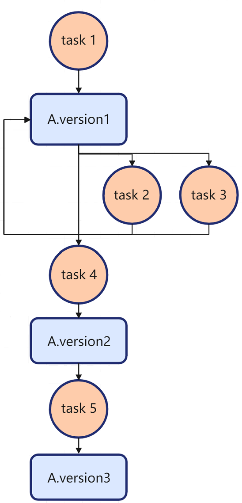

# FFRT Development

## When to Use

Function Flow is a task-based and data-driven concurrent programming model that allows you to develop an application by creating tasks and describing their dependencies. Function Flow Runtime (FFRT) is a software runtime library that works with the Function Flow programming model. It is used to schedule and execute tasks of an application developed on the Function Flow programming model. Specifically, FFRT automatically and concurrently schedules and executes tasks of the application based on the task dependency status and available resources, so that you can focus on feature development.

This topic walks you through how to implement parallel programming based on the Function Flow programming model and FFRT.

### Programming Models


|                | Thread Programming Model                                                | FFRT Programming Model                                            |
| -------------- | ------------------------------------------------------------ | ------------------------------------------------------------ |
| Degree of Parallelism (DOP) mining mode| Programmers create multiple threads and assign tasks to them for parallel execution to achieve the optimal runtime performance.| Programmers, with the help of compilers or programming language features, decompose the application into tasks and describe their data dependencies during static programming. The scheduler allocates tasks to worker threads for execution.|
| Owner for creating threads| Programmers are responsible for creating threads. The maximum number of threads that can be created is not under control.| The scheduler is responsible for creating and managing worker threads. Programmers cannot directly create threads.|
| Load balancing      | Programmers map tasks to threads during static programming. Improper mapping or uncertain task execution time will cause a load imbalance among threads.| A ready task is automatically scheduled to an idle thread for execution, reducing the load imbalance among threads.|
| Scheduling overhead      | Thread scheduling is implemented by a kernel-mode scheduler, resulting in high scheduling overhead.                      | Thread scheduling is implemented by a user-mode coroutine scheduler, requiring less scheduling overhead. In addition, FFRT can further reduce the scheduling overhead through hardware-based scheduling offload.|
| Dependency expression      | A thread is in the executable state once it is created, and it is executed parallelly with other threads, causing frequent thread switching.| FFRT determines whether a task can be executed based on the input and output dependencies explicitly expressed during task creation. If the input dependencies do not meet the requirements, the task is not scheduled.|

## Basic Concepts

### Function Flow

The Function Flow programming model allows you to develop an application by creating tasks and describing their dependencies. Its most outstanding features are task-based and data-driven.

#### Task-based

Task-based means that you can use tasks to express an application and schedule the tasks at runtime.

A task is defined as a developer-oriented programming clue and a runtime-oriented execution object. It usually contains a set of sequential instructions and a data context environment to run the instructions.

Tasks in the Function Flow programming model have the following features:

- The dependency between tasks can be specified in data-driven form.
- Tasks can be nested. That is, when a task is being executed, a new task can be generated and delivered to that task to form a parent-child relationship.
- Simultaneous operations, such as wait, lock, and condition variables, are supported.

> **NOTE**
>
> The task granularity determines the number of concurrent tasks and therefore affects the application execution performance. A small granularity increases the scheduling overhead, whereas a large granularity decreases the DOP. The minimum task granularity allowed in the Function Flow programming model is 100 μs.

#### Data-driven

Data-driven means that the dependency between tasks is expressed through data dependencies.

Data objects associated with a task are read and written during task execution. In the Function Flow programming model, a data object is abstracted as a data signature. They are in one-to-one mapping.

Data dependencies, consisting of **in_deps** and **out_deps**, are abstracted as a list of data signatures mapping to the data objects manipulated by the task. When the signature of a data object appears in **in_deps** of a task, the task is a consumer task of the data object. The execution of a consumer task does not change the content of the input data object. When the signature of a data object appears in **out_deps** of a task, the task is a producer task of the data object. The execution of a producer task changes the content of the output data object and generates a new version of the data object.

A data object may have multiple versions. Each version corresponds to one producer task and zero, one, or more consumer tasks. A sequence of the data object versions and the version-specific producer task and consumer tasks are defined according to the delivery sequence of the producer task and consumer tasks.

When all producer tasks and consumer tasks of the data object of all the available versions are executed, the data dependency is removed. In this case, the task enters the ready state and can be scheduled for execution.

With the data-driven dependency expression, FFRT can dynamically build different types of data dependencies between tasks and schedule the tasks based on the data dependency status at runtime. The following data dependency types are available:

- Producer-Consumer dependency

  A dependency formed between the producer task of a data object of a specific version and a consumer task of the data object of the same version. It is also referred to as a read-after-write dependency.

- Consumer-Producer dependency

  A dependency formed between a consumer task of a data object of a specific version and the producer task of the data object of the next version. It is also referred to as a write-after-read dependency.

- Producer-Producer dependency

  A dependency formed between the producer task of a data object of a specific version and a producer task of the data object of the next version. It is also referred to as a write-after-write dependency.


Assume that the relationship between some tasks and data A is as follows:
```{.c}
task1(OUT A);
task2(IN A);
task3(IN A);
task4(OUT A);
task5(OUT A);
```



> **NOTE**<br>For ease of description, circles are used to represent tasks and squares are used to represent data.

The following conclusions can be drawn:
- task1 and task2/task3 form a producer-consumer dependency. This means that task2/task3 can read data A only after task1 writes data A.
- task2/task3 and task4 form a consumer-producer dependency. This means that task4 can write data A only after task2/task3 reads data A.
- task 4 and task 5 form a producer-producer dependency. This means that task 5 can write data A only after task 4 writes data A.

## Available APIs

| API                                                      | Description                                                        |
| ------------------------------------------------------------ | ------------------------------------------------------------ |
| ffrt_condattr_init (ffrt_condattr_t* attr) | Initializes a condition variable attribute.|
| ffrt_condattr_destroy(ffrt_condattr_t* attr)  | Destroys a condition variable attribute.|
| ffrt_condattr_setclock(ffrt_condattr_t* attr, ffrt_clockid_t clock) | Sets the clock of a condition variable attribute.|
| ffrt_condattr_getclock(const ffrt_condattr_t* attr, ffrt_clockid_t* clock)        | Obtains the clock of a condition variable attribute.             |
| ffrt_cond_init(ffrt_cond_t* cond, const ffrt_condattr_t* attr)   | Initializes a condition variable.     |
| ffrt_cond_signal(ffrt_cond_t* cond)         | Unblocks at least one of the threads that are blocked on a condition variable.|
| ffrt_cond_broadcast(ffrt_cond_t* cond) | Unblocks all threads currently blocked on a condition variable.|
| ffrt_cond_wait(ffrt_cond_t* cond, ffrt_mutex_t* mutex)            | Blocks the calling thread on a condition variable.|
| ffrt_cond_timedwait(ffrt_cond_t* cond, ffrt_mutex_t* mutex, const struct timespec* time_point)            | Blocks the calling thread on a condition variable for a given duration.|
| ffrt_cond_destroy(ffrt_cond_t* cond)            | Destroys a condition variable.|
| ffrt_mutex_init(ffrt_mutex_t* mutex, const ffrt_mutexattr_t* attr) | Initializes a mutex.|
| ffrt_mutex_lock(ffrt_mutex_t* mutex)   | Locks a mutex.|
| ffrt_mutex_unlock(ffrt_mutex_t* mutex)  | Unlocks a mutex.|
| ffrt_mutex_trylock(ffrt_mutex_t* mutex)   | Attempts to lock a mutex.|
| ffrt_mutex_destroy(ffrt_mutex_t* mutex)   | Destroys a mutex.|
| ffrt_queue_attr_init(ffrt_queue_attr_t* attr)    | Initializes a queue attribute.|
| ffrt_queue_attr_destroy(ffrt_queue_attr_t* attr)    | Destroys a queue attribute.|
| ffrt_queue_attr_set_qos(ffrt_queue_attr_t* attr, ffrt_qos_t qos)    | Sets the QoS for a queue attribute.|
| ffrt_queue_attr_get_qos(const ffrt_queue_attr_t* attr)      | Obtains the QoS of a queue attribute.|
| ffrt_queue_create(ffrt_queue_type_t type, const char* name, const ffrt_queue_attr_t* attr)   | Creates a queue.|
| ffrt_queue_destroy(ffrt_queue_t queue)   | Destroys a queue.|
| ffrt_queue_submit(ffrt_queue_t queue, ffrt_function_header_t* f, const ffrt_task_attr_t* attr)   | Submits a task to a queue.|
| ffrt_queue_submit_h(ffrt_queue_t queue, ffrt_function_header_t* f, const ffrt_task_attr_t* attr)  | Submits a task to a queue, and obtains a task handle.|
| ffrt_queue_wait(ffrt_task_handle_t handle)    | Waits until a task in the queue is complete.|
| ffrt_queue_cancel(ffrt_task_handle_t handle)     | Cancels a task in the queue.|
| ffrt_usleep(uint64_t usec)   | Suspends the calling thread for a given duration.|
| ffrt_yield(void)     | Passes control to other tasks so that they can be executed.|
| ffrt_task_attr_init(ffrt_task_attr_t* attr)     | Initializes a task attribute.|
| ffrt_task_attr_set_name(ffrt_task_attr_t* attr, const char* name)   | Sets a task name.|
| ffrt_task_attr_get_name(const ffrt_task_attr_t* attr)   | Obtains a task name.|
| ffrt_task_attr_destroy(ffrt_task_attr_t* attr)    | Destroys a task attribute.|
| ffrt_task_attr_set_qos(ffrt_task_attr_t* attr, ffrt_qos_t qos)    | Sets the QoS for a task attribute.|
| ffrt_task_attr_get_qos(const ffrt_task_attr_t* attr)      | Obtains the QoS of a task attribute.|
| ffrt_task_attr_set_delay(ffrt_task_attr_t* attr, uint64_t delay_us)    | Sets the task delay time.|
| ffrt_task_attr_get_delay(const ffrt_task_attr_t* attr)      | Obtains the task delay time.|
| ffrt_this_task_update_qos(ffrt_qos_t qos)    | Updates the QoS of this task.|
| ffrt_this_task_get_id(void)    | Obtains the ID of this task.|
| ffrt_alloc_auto_managed_function_storage_base(ffrt_function_kind_t kind)     | Applies for memory for the function execution structure.|
| ffrt_submit_base(ffrt_function_header_t* f, const ffrt_deps_t* in_deps, const ffrt_deps_t* out_deps, const ffrt_task_attr_t* attr)   | Submits a task.|
| ffrt_submit_h_base(ffrt_function_header_t* f, const ffrt_deps_t* in_deps, const ffrt_deps_t* out_deps, const ffrt_task_attr_t* attr)    | Submits a task, and obtains a task handle.|
| ffrt_task_handle_destroy(ffrt_task_handle_t handle)    | Destroys a task handle.|
| ffrt_skip(ffrt_task_handle_t handle)     | Skips a task.|
| ffrt_wait_deps(const ffrt_deps_t* deps)    | Waits until the dependent tasks are complete.|


## API Introduction


### Task Management APIs

#### ffrt_submit_base

* Exports an FFRT dynamic library. You can encapsulate this API into the C API **ffrt_submit** for binary compatibility.

##### Declaration

```{.c}
const int ffrt_auto_managed_function_storage_size = 64 + sizeof(ffrt_function_header_t);
typedef enum {
    ffrt_function_kind_general,
    ffrt_function_kind_queue
} ffrt_function_kind_t;

void* ffrt_alloc_auto_managed_function_storage_base(ffrt_function_kind_t kind);

typedef void(*ffrt_function_t)(void*);
typedef struct {
    ffrt_function_t exec;
    ffrt_function_t destroy;
    uint64_t reserve[2];
} ffrt_function_header_t;

void ffrt_submit_base(ffrt_function_header_t* func, const ffrt_deps_t* in_deps, const ffrt_deps_t* out_deps, const ffrt_task_attr_t* attr);
```

##### Parameters

`kind`

* Subtype of **function**. It is used to optimize the internal data structure. The default value is **ffrt_function_kind_general**.

`func`

* Pointer to the CPU function. The struct executed by the pointer describes two function pointers, namely, **exec** and **destroy**, according to the **ffrt_function_header_t** definition. FFRT executes and destroys the task by using the two function pointers.

`in_deps`

* Optional.
* Input dependencies of the task. FFRT establishes the dependency by using the virtual address of the data as the data signature.

`out_deps`

* Optional.
* Output dependencies of the task.
* Note: The dependency is essentially a value. FFRT cannot determine whether the value is reasonable. It always treats the input value reasonable. However, you are not advised to use inappropriate values such as **NULL**, **1**, or **2** to establish dependencies because doing this will establish unnecessary dependencies and affect concurrency. Instead, use the actual memory address.

`attr`

* Optional.
* Task attribute, such as QoS. For details, see [ffrt_task_attr_t](#ffrt_task_attr_t).

##### Return value

* N/A

##### Use guide
* You are advised to encapsulate **ffrt_submit_base** first. For details, see **Example** below.
* As an underlying capability, **ffrt_submit_base** must meet the following requirements:
  * The **func** pointer can be allocated by calling **ffrt_alloc_auto_managed_function_storage_base**, and the two function pointers in the struct must be in the specified sequence (**exec** prior to **destroy**).
  * The memory allocated by calling **ffrt_alloc_auto_managed_function_storage_base** is of the size specified by **ffrt_auto_managed_function_storage_size**. Its lifecycle is managed by FFRT. When the task is complete, FFRT automatically releases the memory.
* The following two function pointers are defined in **ffrt_function_header_t**:
  * **exec**: describes how the task is executed. It is called by FFRT to execute the task.
  * **destroy**: describes how a task is destroyed. It is called by FFRT to destroy the task.

##### Example


```{.c}
template<class T>
struct function {
    template<class CT>
    function(ffrt_function_header_t h, CT&& c) : header(h), closure(std::forward<CT>(c)) {}
    ffrt_function_header_t header;
    T closure;
};

template<class T>
void exec_function_wrapper(void* t)
{
    auto f = (function<std::decay_t<T>>*)t;
    f->closure();
}

template<class T>
void destroy_function_wrapper(void* t)
{
    auto f = (function<std::decay_t<T>>*)t;
    f->closure = nullptr;
}

template<class T>
inline ffrt_function_header_t* create_function_wrapper(T&& func)
{
    using function_type = function<std::decay_t<T>>;
    static_assert(sizeof(function_type) <= ffrt_auto_managed_function_storage_size,
        "size of function must be less than ffrt_auto_managed_function_storage_size");

    auto p = ffrt_alloc_auto_managed_function_storage_base(ffrt_function_kind_general);
    auto f = new (p) function_type(
        {exec_function_wrapper<T>, destroy_function_wrapper<T>},
        std::forward<T>(func));
    return (ffrt_function_header_t*)f;
}

static inline void submit(std::function<void()>&& func)
{
    return ffrt_submit_base(create_function_wrapper(std::move(func)), NULL, NULL, NULL);
}
```

#### ffrt_wait

<hr/>
* Used together with **ffrt_submit_base**.
* Waits by suspending the current execution context, until the specified data is produced or all subtasks of the current task are complete.

##### Declaration

```{.c}
void ffrt_wait_deps(ffrt_deps_t* deps);
void ffrt_wait();
```

##### Parameters

`deps`

* Virtual addresses of the data to be produced. These addresses may be used as **out_deps** in **submit()** of some tasks. For details about how to generate the dependency, see **ffrt_deps_t**. Note that a null pointer indicates no dependency.

##### Return value

* N/A

##### Use guide
* **ffrt_wait_deps(deps)** is used to suspend code execution before the data specified by **deps** is produced.
* **ffrt_wait()** is used to suspend code execution before all subtasks (excluding grandchild tasks and lower-level subtasks) submitted by the current context are complete.
* This API can be called inside or outside an FFRT task.
* **ffrt_wait_deps(deps)** or **ffrt_wait()** called outside an FFRT task can be sensed by the OS, and therefore it is more expensive than that called inside an FFRT task. As such, you are advised to use **ffrt_wait()** inside an FFRT task whenever possible.

##### Example

**Recursive Fibonacci**

The Fibonacci Sequence implemented in serial mode is as follows:

```{.c}
#include <stdio.h>

void fib(int x, int* y) {
    if (x <= 1) {
        *y = x;
    } else {
        int y1, y2;
        fib(x - 1, &y1);
        fib(x - 2, &y2);
        *y = y1 + y2;
    }
}
int main(int narg, char** argv)
{
    int r;
    fib(10, &r);
    printf("fibonacci 10: %d\n", r);
    return 0;
}
```

Use FFRT to implement the Fibonacci Sequence in parallel mode: (For Fibonacci, the computing workload of a single task is small and parallel acceleration is not required. However, this pattern requires high flexibility of the parallel programming model.)

```{.c}
#include <stdio.h>
#include "ffrt.h" // All header files related to FFRT are included.

typedef struct {
    int x;
    int* y;
} fib_ffrt_s;

typedef struct {
    ffrt_function_header_t header;
    ffrt_function_t func;
    ffrt_function_t after_func;
    void* arg;
} c_function;

static void ffrt_exec_function_wrapper(void* t)
{
    c_function* f = (c_function*)t;
    if (f->func) {
        f->func(f->arg);
    }
}

static void ffrt_destroy_function_wrapper(void* t)
{
    c_function* f = (c_function*)t;
    if (f->after_func) {
        f->after_func(f->arg);
    }
}

#define FFRT_STATIC_ASSERT(cond, msg) int x(int static_assertion_##msg[(cond) ? 1 : -1])
static inline ffrt_function_header_t* ffrt_create_function_wrapper(const ffrt_function_t func,
    const ffrt_function_t after_func, void* arg)
{
    FFRT_STATIC_ASSERT(sizeof(c_function) <= ffrt_auto_managed_function_storage_size,
        size_of_function_must_be_less_than_ffrt_auto_managed_function_storage_size);
    c_function* f = (c_function*)ffrt_alloc_auto_managed_function_storage_base(ffrt_function_kind_general);
    f->header.exec = ffrt_exec_function_wrapper;
    f->header.destroy = ffrt_destroy_function_wrapper;
    f->func = func;
    f->after_func = after_func;
    f->arg = arg;
    return (ffrt_function_header_t*)f;
}

static inline void ffrt_submit_c(ffrt_function_t func, const ffrt_function_t after_func,
    void* arg, const ffrt_deps_t* in_deps, const ffrt_deps_t* out_deps, const ffrt_task_attr_t* attr)
{
    ffrt_submit_base(ffrt_create_function_wrapper(func, after_func, arg), in_deps, out_deps, attr);
}

void fib_ffrt(void* arg)
{
    fib_ffrt_s* p = (fib_ffrt_s*)arg;
    int x = p->x;
    int* y = p->y;

    if (x <= 1) {
        *y = x;
    } else {
        int y1, y2;
        fib_ffrt_s s1 = {x - 1, &y1};
        fib_ffrt_s s2 = {x - 2, &y2};
        const std::vector<ffrt_dependence_t> dx_deps = {{ffrt_dependence_data, &x}};
        ffrt_deps_t dx{static_cast<uint32_t>(dx_deps.size()), dx_deps.data()};
        const std::vector<ffrt_dependence_t> dy1_deps = {{ffrt_dependence_data, &y1}};
        ffrt_deps_t dy1{static_cast<uint32_t>(dy1_deps.size()), dy1_deps.data()};
        const std::vector<ffrt_dependence_t> dy2_deps = {{ffrt_dependence_data, &y2}};
        ffrt_deps_t dy2{static_cast<uint32_t>(dy2_deps.size()), dy2_deps.data()};
        const std::vector<ffrt_dependence_t> dy12_deps = {{ffrt_dependence_data, &y1}, {ffrt_dependence_data, &y2}};
        ffrt_deps_t dy12{static_cast<uint32_t>(dy12_deps.size()), dy12_deps.data()};
        ffrt_submit_c(fib_ffrt, NULL, &s1, &dx, &dy1, NULL);
        ffrt_submit_c(fib_ffrt, NULL, &s2, &dx, &dy2, NULL);
        ffrt_wait_deps(&dy12);
        *y = y1 + y2;
    }
}

int main(int narg, char** argv)
{
    int r;
    fib_ffrt_s s = {10, &r};
    const std::vector<ffrt_dependence_t> dr_deps = {{ffrt_dependence_data, &r}};
    ffrt_deps_t dr{static_cast<uint32_t>(dr_deps.size()), dr_deps.data()};
    ffrt_submit_c(fib_ffrt, NULL, &s, NULL, &dr, NULL);
    ffrt_wait_deps(&dr);
    printf("fibonacci 10: %d\n", r);
    return 0;
}
```

**NOTE**

(1) fibonacci (x-1) and fibonacci (x-2) are submitted to FFRT as two tasks. After the two tasks are complete, the results are accumulated.

(2) A single task can be split into only two subtasks, but the subtasks can be further split. Therefore, the entire computing graph delivers a high DOP, and a call tree is formed between tasks in FFRT.


> The preceding implementation requires you to explicitly manage the data lifecycle and encapsulate input parameters, making the code complex.


#### ffrt_deps_t

* Abstraction of dependency arrays in C code, logically equivalent to **std::vector<void*>** in C++ code.

##### Declaration

```{.c}
typedef enum {
    ffrt_dependence_data,
    ffrt_dependence_task,
} ffrt_dependence_type_t;

typedef struct {
    ffrt_dependence_type_t type;
    const void* ptr;
} ffrt_dependence_t;

typedef struct {
    uint32_t len;
    const ffrt_dependence_t* items;
} ffrt_deps_t;
```

##### Parameters

`len`

* Number of dependent signatures. The value must be greater than or equal to 0.

`item`

* Pointer to the start address of each signature.

`type`

* Dependency type, which can be data dependency or task dependency.

`ptr`

* Actual address of the dependent signature content.

##### Return value

* N/A

##### Use guide

* **item** is the start address pointer of each signature. The pointer can point to the heap space or stack space, but the allocated space must be greater than or equal to len * sizeof(ffrt_dependence_t).

##### Example

* Create a data dependency or task dependency.

```{.c}
// Create ffrt_deps_t on which the data depends.
int x = 0;
const std::vector<ffrt_dependence_t> in_deps = {{ffrt_dependence_data, &x}};
ffrt_deps_t in{static_cast<uint32_t>(in_deps.size()), in_deps.data()};

// Submit a task, and obtain a task handle.
ffrt_task_handle_t task = ffrt_submit_h_base(
        ffrt_create_function_wrapper(OnePlusForTest, NULL, &a), NULL, NULL, &attr);
// Create ffrt_deps_t on which the task depends.
const std::vector<ffrt_dependence_t> wait_deps = {{ffrt_dependence_task, task}};
ffrt_deps_t wait{static_cast<uint32_t>(wait_deps.size()), wait_deps.data()};
```

#### ffrt_task_attr_t

<hr/>
* Auxiliary class for defining task attributes. It is used together with **ffrt_submit_base**.

##### Declaration

```{.c}
typedef enum {
    ffrt_qos_inherent = -1,
    ffrt_qos_background,
    ffrt_qos_utility,
    ffrt_qos_default,
    ffrt_qos_user_initiated,
} ffrt_qos_default_t;

typedef int ffrt_qos_t;

typedef struct {
    uint32_t storage[(ffrt_task_attr_storage_size + sizeof(uint32_t) - 1) / sizeof(uint32_t)];
} ffrt_task_attr_t;
typedef void* ffrt_task_handle_t;

int ffrt_task_attr_init(ffrt_task_attr_t* attr);
void ffrt_task_attr_destroy(ffrt_task_attr_t* attr);
void ffrt_task_attr_set_qos(ffrt_task_attr_t* attr, ffrt_qos_t qos);
ffrt_qos_t ffrt_task_attr_get_qos(const ffrt_task_attr_t* attr);
void ffrt_task_attr_set_name(ffrt_task_attr_t* attr, const char* name);
const char* ffrt_task_attr_get_name(const ffrt_task_attr_t* attr);
void ffrt_task_attr_set_delay(ffrt_task_attr_t* attr, uint64_t delay_us);
uint64_t ffrt_task_attr_get_delay(const ffrt_task_attr_t* attr);
```

##### Parameters

`attr`

* Handle of the target task attribute.

`qos`

* Enumerated type of QoS.
* **ffrt_qos_inherent** is a QoS type, indicating that the QoS of the task to be submitted by **ffrt_submit** inherits the QoS of the current task.

`delay_us`

* Delay for executing the task, in μs.

##### Return value

* N/A

##### Use guide
* The content passed by **attr** is fetched and stored when **ffrt_submit** is being executed. You can destroy the content on receiving the return value of **ffrt_submit**.
* Conventions
  * If **task_attr** is not used for QoS setting during task submission, the QoS of the task is **ffrt_qos_default**.
  * If **task_attr** is set to **ffrt_qos_inherent** during task submission, the QoS of the task to be submitted is the same as that of the current task. If a task with the **ffrt_qos_inherent** attribute is submitted outside an FFRT task, its QoS is **ffrt_qos_default**.
  * In other cases, the QoS value passed in is used.
* You need to set the **ffrt_task_attr_t** object to null or destroy the object. For the same **ffrt_task_attr_t** object, **ffrt_task_attr_destroy** can be called only once. Otherwise, undefined behavior may occur.
* If **task_attr** is accessed after **ffrt_task_attr_destroy** is called, undefined behavior may occur.

##### Example

* Submit a task with the QoS set to **ffrt_qos_background**:

```{.c}
#include <stdio.h>
#include "ffrt.h"

void my_print(void* arg)
{
    printf("hello ffrt\n");
}

typedef struct {
    ffrt_function_header_t header;
    ffrt_function_t func;
    ffrt_function_t after_func;
    void* arg;
} c_function;

static void ffrt_exec_function_wrapper(void* t)
{
    c_function* f = (c_function*)t;
    if (f->func) {
        f->func(f->arg);
    }
}

static void ffrt_destroy_function_wrapper(void* t)
{
    c_function* f = (c_function*)t;
    if (f->after_func) {
        f->after_func(f->arg);
    }
}

#define FFRT_STATIC_ASSERT(cond, msg) int x(int static_assertion_##msg[(cond) ? 1 : -1])
static inline ffrt_function_header_t* ffrt_create_function_wrapper(const ffrt_function_t func,
    const ffrt_function_t after_func, void* arg)
{
    FFRT_STATIC_ASSERT(sizeof(c_function) <= ffrt_auto_managed_function_storage_size,
        size_of_function_must_be_less_than_ffrt_auto_managed_function_storage_size);
    c_function* f = (c_function*)ffrt_alloc_auto_managed_function_storage_base(ffrt_function_kind_general);
    f->header.exec = ffrt_exec_function_wrapper;
    f->header.destroy = ffrt_destroy_function_wrapper;
    f->func = func;
    f->after_func = after_func;
    f->arg = arg;
    return (ffrt_function_header_t*)f;
}

static inline void ffrt_submit_c(ffrt_function_t func, const ffrt_function_t after_func,
    void* arg, const ffrt_deps_t* in_deps, const ffrt_deps_t* out_deps, const ffrt_task_attr_t* attr)
{
    ffrt_submit_base(ffrt_create_function_wrapper(func, after_func, arg), in_deps, out_deps, attr);
}

int main(int narg, char** argv)
{
    ffrt_task_attr_t attr;
    ffrt_task_attr_init(&attr);
    ffrt_task_attr_set_qos(&attr, ffrt_qos_background);
    ffrt_task_attr_set_delay(&attr, 10000);
    ffrt_submit_c(my_print, NULL, NULL, NULL, NULL, &attr);
    ffrt_task_attr_destroy(&attr);
    ffrt_wait();
    return 0;
}
```


#### ffrt_submit_h_base

<hr/>

* Submits a task to the scheduler. Different from **ffrt_submit_base**, **ffrt_submit_h_base** returns a task handle. The handle can be used to establish the dependency between tasks or implement synchronization in the **wait** statements.

##### Declaration

```{.c}
typedef void* ffrt_task_handle_t;

ffrt_task_handle_t ffrt_submit_h_base(ffrt_function_t func, void* arg, const ffrt_deps_t* in_deps, const ffrt_deps_t* out_deps, const ffrt_task_attr_t* attr);
void ffrt_task_handle_destroy(ffrt_task_handle_t handle);
```

##### Parameters

`func`

* Pointer to the CPU function. The struct executed by the pointer describes two function pointers, namely, **exec** and **destroy**, according to the **ffrt_function_header_t** definition. FFRT executes and destroys the task by using the two function pointers.

`in_deps`

* Optional.
* Input dependencies of the task. FFRT establishes the dependency by using the virtual address of the data as the data signature.

`out_deps`

* Optional.
* Output dependencies of the task.
* Note: The dependency is essentially a value. FFRT cannot determine whether the value is reasonable. It always treats the input value reasonable. However, you are not advised to use inappropriate values such as **NULL**, **1**, or **2** to establish dependencies because doing this will establish unnecessary dependencies and affect concurrency. Instead, use the actual memory address.

`attr`

* Optional.
* Task attribute, such as QoS. For details, see [ffrt_task_attr_t](#ffrt_task_attr_t).

##### Return value

* Take handle. The handle can be used to establish the dependency between tasks or implement synchronization in the wait statements.

##### Use guide

* **ffrt_task_handle_t** in the C code must be explicitly destroyed by calling **ffrt_task_handle_destroy**.
* You need to set the **ffrt_task_handle_t** object in the C code to null or destroy the object. For the same **ffrt_task_handle_t** object, **ffrt_task_handle_destroy** can be called only once. Otherwise, undefined behavior may occur.
* If **ffrt_task_handle_t** is accessed after **ffrt_task_handle_destroy** is called, undefined behavior may occur.

##### Example

```{.c}
#include <stdio.h>
#include "ffrt.h"

void func0(void* arg)
{
    printf("hello ");
}

void func1(void* arg)
{
    (*(int*)arg)++;
}

void func2(void* arg)
{
    printf("world, x = %d\n", *(int*)arg);
}

void func3(void* arg)
{
    printf("handle wait");
    (*(int*)arg)++;
}

typedef struct {
    ffrt_function_header_t header;
    ffrt_function_t func;
    ffrt_function_t after_func;
    void* arg;
} c_function;

static void ffrt_exec_function_wrapper(void* t)
{
    c_function* f = (c_function*)t;
    if (f->func) {
        f->func(f->arg);
    }
}

static void ffrt_destroy_function_wrapper(void* t)
{
    c_function* f = (c_function*)t;
    if (f->after_func) {
        f->after_func(f->arg);
    }
}

#define FFRT_STATIC_ASSERT(cond, msg) int x(int static_assertion_##msg[(cond) ? 1 : -1])
static inline ffrt_function_header_t* ffrt_create_function_wrapper(const ffrt_function_t func,
    const ffrt_function_t after_func, void* arg)
{
    FFRT_STATIC_ASSERT(sizeof(c_function) <= ffrt_auto_managed_function_storage_size,
        size_of_function_must_be_less_than_ffrt_auto_managed_function_storage_size);
    c_function* f = (c_function*)ffrt_alloc_auto_managed_function_storage_base(ffrt_function_kind_general);
    f->header.exec = ffrt_exec_function_wrapper;
    f->header.destroy = ffrt_destroy_function_wrapper;
    f->func = func;
    f->after_func = after_func;
    f->arg = arg;
    return (ffrt_function_header_t*)f;
}

static inline ffrt_task_handle_t ffrt_submit_h_c(ffrt_function_t func, const ffrt_function_t after_func,
    void* arg, const ffrt_deps_t* in_deps, const ffrt_deps_t* out_deps, const ffrt_task_attr_t* attr)
{
    return ffrt_submit_h_base(ffrt_create_function_wrapper(func, after_func, arg), in_deps, out_deps, attr);
}

static inline void ffrt_submit_c(ffrt_function_t func, const ffrt_function_t after_func,
    void* arg, const ffrt_deps_t* in_deps, const ffrt_deps_t* out_deps, const ffrt_task_attr_t* attr)
{
    ffrt_submit_base(ffrt_create_function_wrapper(func, after_func, arg), in_deps, out_deps, attr);
}


int main(int narg, char** argv)
{  
    // Handle the work with submit.
    ffrt_task_handle_t h = ffrt_submit_h_c(func0, NULL, NULL, NULL, NULL, NULL); // not need some data in this task
    int x = 1;
    const std::vector<ffrt_dependence_t> in_deps = {{ffrt_dependence_data, &x}};
    ffrt_deps_t d2{static_cast<uint32_t>(in_deps.size()), in_deps.data()};

    const std::vector<ffrt_dependence_t> out_deps = {{ffrt_dependence_data, &x}};
    ffrt_deps_t d1{static_cast<uint32_t>(out_deps.size()), out_deps.data()};

    ffrt_submit_c(func1, NULL, &x, NULL, &d1, NULL);
    ffrt_submit_c(func2, NULL, &x, &d2, NULL, NULL); // this task depend x and h
    ffrt_task_handle_destroy(h);
    
    // Handle the work with wait.
    ffrt_task_handle_t h2 = ffrt_submit_h_c(func3, NULL, &x, NULL, NULL, NULL);

    const std::vector<ffrt_dependence_t> wait_deps = {{ffrt_dependence_task, h2}};
    ffrt_deps_t d3{static_cast<uint32_t>(wait_deps.size()), wait_deps.data()};
    ffrt_wait_deps(&d3);
    ffrt_task_handle_destroy(h2);
    printf("x = %d", x);
    ffrt_wait();
    return 0;
}
```

* Expected output:

```
hello 
handle wait
x = 2
world, x = 3
```


#### ffrt_this_task_get_id

<hr/>

* Obtains the ID of this task. This API is used for maintenance and testing. (The task ID is unique, but the task name may be duplicate.)

##### Declaration

```{.c}
uint64_t ffrt_this_task_get_id();
```

##### Parameters

* N/A

##### Return value

* ID of the task being executed.

##### Use guide

* If this API is called inside a task, the ID of this task is returned. If this API is called outside a task, **0** is returned.
* You can determine whether the function runs on an FFRT or a non-FFRT worker thread based on the return value.
* The task ID starts from 1 and is incremented by 1 each time a task is submitted. The task ID contains 64 bits. Even if one million tasks are submitted per second, it takes 292471.2 years to finish one loop.

##### Example

* N/A


#### ffrt_this_task_update_qos

<hr/>

* Updates the QoS of the task being executed.

##### Declaration

```{.c}
int ffrt_this_task_update_qos(ffrt_qos_t qos);
```

##### Parameters

* **qos**: new QoS.

##### Return value

* Returns **0** if the operation is successful; returns a non-zero value otherwise.

##### Use guide

* The QoS update takes effect immediately.
* If the new QoS is different from the current QoS, the task is blocked and then resumed based on the new QoS.
* If the new QoS is the same as the current QoS, the API returns **0** immediately without any processing.
* If this API is called not inside a task, a non-zero value is returned. You can ignore the value or perform other operations.

##### Example

* N/A

### Serial Queue
<hr />
* FFRT provides **queue** to implement capabilities similar to **WorkQueue** in Android. It can deliver excellent performance if being used properly.

#### ffrt_queue_attr_t

##### Declaration
```{.c}
typedef struct {
    uint32_t storage[(ffrt_queue_attr_storage_size + sizeof(uint32_t) - 1) / sizeof(uint32_t)];
} ffrt_queue_attr_t;

int ffrt_queue_attr_init(ffrt_queue_attr_t* attr);
void ffrt_queue_attr_destroy(ffrt_queue_attr_t* attr);
```

##### Parameters

`attr`
* Pointer to the uninitialized **ffrt_queue_attr_t** object.

##### Return value
* Returns **0** if the API is called successfully; returns **-1** otherwise.

##### Use guide
* An **ffrt_queue_attr_t** object must be created prior to an **ffrt_queue_t** object.
* You need to set the **ffrt_queue_attr_t** object to null or destroy the object. For the same **ffrt_queue_attr_t** object, **ffrt_queue_attr_destroy** can be called only once. Otherwise, undefined behavior may occur.
* If **ffrt_queue_attr_t** is accessed after **ffrt_queue_attr_destroy** is called, undefined behavior may occur.

##### Example
See the example provided in **ffrt_queue_t**.

#### ffrt_queue_t

##### Declaration
```{.c}
typedef enum { ffrt_queue_serial, ffrt_queue_max } ffrt_queue_type_t;
typedef void* ffrt_queue_t;

ffrt_queue_t ffrt_queue_create(ffrt_queue_type_t type, const char* name, const ffrt_queue_attr_t* attr)
void ffrt_queue_destroy(ffrt_queue_t queue)
```

##### Parameters

`type`
* Queue type.

`name`
* Pointer to the queue name.

`attr`
* Pointer to the queue attribute. For details, see **ffrt_queue_attr_t**.

##### Return value
* Returns the queue created if the API is called successfully; returns a null pointer otherwise.

##### Use guide
* Tasks submitted to the queue are executed in sequence. If a task is blocked, the execution sequence of the task cannot be ensured.
* You need to set the **ffrt_queue_t** object to null or destroy the object. For the same **ffrt_queue_t** object, **ffrt_queue_destroy** can be called only once. Otherwise, undefined behavior may occur.
* If **ffrt_queue_t** is accessed after **ffrt_queue_destroy** is called, undefined behavior may occur.

##### Example
```
#include <stdio.h>
#include "ffrt.h"

using namespace std;

template<class T>
struct Function {
    ffrt_function_header_t header;
    T closure;
};

template<class T>
void ExecFunctionWrapper(void* t)
{
    auto f = reinterpret_cast<Function<std::decay_t<T>>*>(t);
    f->closure();
}

template<class T>
void DestroyFunctionWrapper(void* t)
{
    auto f = reinterpret_cast<Function<std::decay_t<T>>*>(t);
    f = nullptr;
}

template<class T>
static inline ffrt_function_header_t* create_function_wrapper(T&& func,
    ffrt_function_kind_t kind = ffrt_function_kind_general)
{
    using function_type = Function<std::decay_t<T>>;
    auto p = ffrt_alloc_auto_managed_function_storage_base(kind);
    auto f = new (p)function_type;
    f->header.exec = ExecFunctionWrapper<T>;
    f->header.destroy = DestroyFunctionWrapper<T>;
    f->closure = std::forward<T>(func);
    return reinterpret_cast<ffrt_function_header_t*>(f);
}

int main(int narg, char** argv)
{
    ffrt_queue_attr_t queue_attr;
    (void)ffrt_queue_attr_init(&queue_attr);
    ffrt_queue_t queue_handle = ffrt_queue_create(ffrt_queue_serial, "test_queue", &queue_attr);
    std::function<void()>&& queueFunc = [] () {printf("Task done.\n");};
    ffrt_function_header_t* queueFunc_t = create_function_wrapper((queueFunc), ffrt_function_kind_queue);
    ffrt_queue_submit(queue_handle, queueFunc_t, nullptr);

    ffrt_queue_attr_destroy(&queue_attr);
    ffrt_queue_destroy(queue_handle);
}
```
### Synchronization Primitive

#### ffrt_mutex_t
<hr/>
* Provides performance implementation similar to pthread mutex.

##### Declaration

```{.c}
typedef enum {
    ffrt_error = -1,
    ffrt_success = 0,
    ffrt_error_nomem = ENOMEM,
    ffrt_error_timedout = ETIMEDOUT,
    ffrt_error_busy = EBUSY,
    ffrt_error_inval = EINVAL
} ffrt_error_t;

struct ffrt_mutex_t;

int ffrt_mutex_init(ffrt_mutex_t* mutex, const ffrt_mutexattr_t* attr);
int ffrt_mutex_lock(ffrt_mutex_t* mutex);
int ffrt_mutex_unlock(ffrt_mutex_t* mutex);
int ffrt_mutex_trylock(ffrt_mutex_t* mutex);
int ffrt_mutex_destroy(ffrt_mutex_t* mutex);
```

##### Parameters

`attr`

* Attribute of the mutex. Set it to a null pointer. This is because FFRT supports only mutex of the basic type currently.

`mutex`

* Pointer to the target mutex.

##### Return value

* Returns **ffrt_success** if the API is called successfully; returns an error code otherwise.

##### Use guide
* This API can be called only inside an FFRT task. If it is called outside an FFRT task, undefined behavior may occur.
* The traditional function **pthread_mutex_t** may cause unexpected kernel mode trap when it fails to lock a mutex. **ffrt_mutex_t** solves this problem and therefore provides better performance if used properly.
* Currently, recursion and timing are not supported.
* **ffrt_mutex_t** in the C code must be explicitly created and destroyed by calling **ffrt_mutex_init** and **ffrt_mutex_destroy**, respectively.
* You need to set the **ffrt_mutex_t** object in the C code to null or destroy the object. For the same **ffrt_mutex_t** object, **ffrt_mutex_destroy** can be called only once. Otherwise, undefined behavior may occur.
* If **ffrt_mutex_t** is accessed after **ffrt_mutex_destroy** is called, undefined behavior may occur.

##### Example

```{.c}
#include <stdio.h>
#include "ffrt.h"

typedef struct {
    int* sum;
    ffrt_mutex_t* mtx;
} tuple;

void func(void* arg)
{
    tuple* t = (tuple*)arg;
    
    int ret = ffrt_mutex_lock(t->mtx);
    if (ret != ffrt_success) {
        printf("error\n");
    }
    (*t->sum)++;
    ret = ffrt_mutex_unlock(t->mtx);
    if (ret != ffrt_success) {
        printf("error\n");
    }
}

typedef struct {
    ffrt_function_header_t header;
    ffrt_function_t func;
    ffrt_function_t after_func;
    void* arg;
} c_function;

static void ffrt_exec_function_wrapper(void* t)
{
    c_function* f = (c_function*)t;
    if (f->func) {
        f->func(f->arg);
    }
}

static void ffrt_destroy_function_wrapper(void* t)
{
    c_function* f = (c_function*)t;
    if (f->after_func) {
        f->after_func(f->arg);
    }
}

#define FFRT_STATIC_ASSERT(cond, msg) int x(int static_assertion_##msg[(cond) ? 1 : -1])
static inline ffrt_function_header_t* ffrt_create_function_wrapper(const ffrt_function_t func,
    const ffrt_function_t after_func, void* arg)
{
    FFRT_STATIC_ASSERT(sizeof(c_function) <= ffrt_auto_managed_function_storage_size,
        size_of_function_must_be_less_than_ffrt_auto_managed_function_storage_size);
    c_function* f = (c_function*)ffrt_alloc_auto_managed_function_storage_base(ffrt_function_kind_general);
    f->header.exec = ffrt_exec_function_wrapper;
    f->header.destroy = ffrt_destroy_function_wrapper;
    f->func = func;
    f->after_func = after_func;
    f->arg = arg;
    return (ffrt_function_header_t*)f;
}

static inline void ffrt_submit_c(ffrt_function_t func, const ffrt_function_t after_func,
    void* arg, const ffrt_deps_t* in_deps, const ffrt_deps_t* out_deps, const ffrt_task_attr_t* attr)
{
    ffrt_submit_base(ffrt_create_function_wrapper(func, after_func, arg), in_deps, out_deps, attr);
}

void ffrt_mutex_task(void *)
{
    int sum = 0;
    ffrt_mutex_t mtx;
    tuple t = {&sum, &mtx};
    int ret = ffrt_mutex_init(&mtx, NULL);
    if (ret != ffrt_success) {
        printf("error\n");
    }
    for (int i = 0; i < 10; i++) {
        ffrt_submit_c(func, NULL, &t, NULL, NULL, NULL);
    }
    ffrt_mutex_destroy(&mtx);
    ffrt_wait();
    printf("sum = %d\n", sum);
}

int main(int narg, char** argv)
{
    int r;
    ffrt_submit_c(ffrt_mutex_task, NULL, NULL, NULL, NULL, NULL);
    ffrt_wait();
    return 0;
}
```

Expected output:

```
sum=10
```

* This example is for reference only and is not encouraged in practice.


#### ffrt_cond_t
<hr/>

* Provides performance implementation similar to pthread semaphore.

##### Declaration

```{.c}
typedef enum {
    ffrt_error = -1,
    ffrt_success = 0,
    ffrt_error_nomem = ENOMEM,
    ffrt_error_timedout = ETIMEDOUT,
    ffrt_error_busy = EBUSY,
    ffrt_error_inval = EINVAL
} ffrt_error_t;

struct ffrt_cond_t;

int ffrt_cond_init(ffrt_cond_t* cond, const ffrt_condattr_t* attr);
int ffrt_cond_signal(ffrt_cond_t* cond);
int ffrt_cond_broadcast(ffrt_cond_t* cond);
int ffrt_cond_wait(ffrt_cond_t*cond, ffrt_mutex_t* mutex);
int ffrt_cond_timedwait(ffrt_cond_t* cond, ffrt_mutex_t* mutex, const struct timespec* time_point);
int ffrt_cond_destroy(ffrt_cond_t* cond);
```

##### Parameters

`cond`

* Pointer to the target semaphore.

`attr`

* Pointer to the attribute. A null pointer indicates that the default attribute is used.

`mutex`

* Pointer to the target mutex.

`time_point`

* Pointer to the maximum duration during which the thread is blocked.


##### Return value

* Returns **ffrt_success** if the API is successfully called; returns **ffrt_error_timedout** if the maximum duration is reached before the mutex is locked.

##### Use guide
* This API can be called only inside an FFRT task. If it is called outside an FFRT task, undefined behavior may occur.
* The traditional function **pthread_cond_t** may cause unexpected kernel mode trap when the conditions are not met. **ffrt_cond_t** solves this problem and therefore provides better performance if being used properly.
* **ffrt_cond_t** in the C code must be explicitly created and destroyed by calling **ffrt_cond_init** and **ffrt_cond_destroy**, respectively.
* You need to set the **ffrt_cond_t** object in the C code to null or destroy the object. For the same **ffrt_cond_t** object, **ffrt_cond_destroy** can be called only once. Otherwise, undefined behavior may occur.
* If **ffrt_cond_t** is accessed after **ffrt_cond_destroy** is called, undefined behavior may occur.

##### Example

```{.c}
#include <stdio.h>
#include "ffrt.h"

typedef struct {
    ffrt_cond_t* cond;
    int* a;
    ffrt_mutex_t* lock_;
} tuple;

void func1(void* arg)
{
    tuple* t = (tuple*)arg;
    int ret = ffrt_mutex_lock(t->lock_);
    if (ret != ffrt_success) {
        printf("error\n");
    }
    while (*t->a != 1) {
        ret = ffrt_cond_wait(t->cond, t->lock_);
        if (ret != ffrt_success) {
            printf("error\n");
        }
    }
    ret = ffrt_mutex_unlock(t->lock_);
    if (ret != ffrt_success) {
        printf("error\n");
    }
    printf("a = %d\n", *(t->a));
}

void func2(void* arg)
{
    tuple* t = (tuple*)arg;
    int ret = ffrt_mutex_lock(t->lock_);
    if (ret != ffrt_success) {
        printf("error\n");
    }
    *(t->a) = 1;
    ret = ffrt_cond_signal(t->cond);
    if (ret != ffrt_success) {
        printf("error\n");
    }
    ret = ffrt_mutex_unlock(t->lock_);
    if (ret != ffrt_success) {
        printf("error\n");
    }
}

typedef struct {
    ffrt_function_header_t header;
    ffrt_function_t func;
    ffrt_function_t after_func;
    void* arg;
} c_function;

static void ffrt_exec_function_wrapper(void* t)
{
    c_function* f = (c_function*)t;
    if (f->func) {
        f->func(f->arg);
    }
}

static void ffrt_destroy_function_wrapper(void* t)
{
    c_function* f = (c_function*)t;
    if (f->after_func) {
        f->after_func(f->arg);
    }
}

#define FFRT_STATIC_ASSERT(cond, msg) int x(int static_assertion_##msg[(cond) ? 1 : -1])
static inline ffrt_function_header_t* ffrt_create_function_wrapper(const ffrt_function_t func,
    const ffrt_function_t after_func, void* arg)
{
    FFRT_STATIC_ASSERT(sizeof(c_function) <= ffrt_auto_managed_function_storage_size,
        size_of_function_must_be_less_than_ffrt_auto_managed_function_storage_size);
    c_function* f = (c_function*)ffrt_alloc_auto_managed_function_storage_base(ffrt_function_kind_general);
    f->header.exec = ffrt_exec_function_wrapper;
    f->header.destroy = ffrt_destroy_function_wrapper;
    f->func = func;
    f->after_func = after_func;
    f->arg = arg;
    return (ffrt_function_header_t*)f;
}

static inline void ffrt_submit_c(ffrt_function_t func, const ffrt_function_t after_func,
    void* arg, const ffrt_deps_t* in_deps, const ffrt_deps_t* out_deps, const ffrt_task_attr_t* attr)
{
    ffrt_submit_base(ffrt_create_function_wrapper(func, after_func, arg), in_deps, out_deps, attr);
}

void ffrt_cv_task(void *)
{
    ffrt_cond_t cond;
    int ret = ffrt_cond_init(&cond, NULL);
    if (ret != ffrt_success) {
        printf("error\n");
    }
    int a = 0;
    ffrt_mutex_t lock_;
    tuple t = {&cond, &a, &lock_};
    ret = ffrt_mutex_init(&lock_, NULL);
    if (ret != ffrt_success) {
        printf("error\n");
    }
    ffrt_submit_c(func1, NULL, &t, NULL, NULL, NULL);
    ffrt_submit_c(func2, NULL, &t, NULL, NULL, NULL);
    ffrt_wait();
    ffrt_cond_destroy(&cond);
    ffrt_mutex_destroy(&lock_);
}

int main(int narg, char** argv)
{
    ffrt_submit_c(ffrt_cv_task, NULL, NULL, NULL, NULL, NULL);
    ffrt_wait();
    return 0;
}
```

Expected output:

```
a=1
```

* This example is for reference only and is not encouraged in practice.

### Miscellaneous

#### ffrt_usleep

<hr/>
* Provides performance implementation similar to C11 sleep and Linux usleep.

##### Declaration

```{.c}
int ffrt_usleep(uint64_t usec);
```

##### Parameters

`usec`

* Duration that the calling thread is suspended, in μs.

##### Return value

* N/A

##### Use guide
* This API can be called only inside an FFRT task. If it is called outside an FFRT task, undefined behavior may occur.
* The traditional function **sleep** may cause unexpected kernel mode trap. **ffrt_usleep** solves this problem and therefore provides better performance if used properly.

##### Example

```{.c}
#include <time.h>
#include <stdio.h>
#include "ffrt.h"

void func(void* arg)
{
    time_t current_time = time(NULL);
    printf("Time: %s", ctime(&current_time));
    ffrt_usleep(2000000); // Suspend for 2 seconds
    current_time = time(NULL);
    printf("Time: %s", ctime(&current_time));
}

typedef struct {
    ffrt_function_header_t header;
    ffrt_function_t func;
    ffrt_function_t after_func;
    void* arg;
} c_function;

static void ffrt_exec_function_wrapper(void* t)
{
    c_function* f = (c_function*)t;
    if (f->func) {
        f->func(f->arg);
    }
}

static void ffrt_destroy_function_wrapper(void* t)
{
    c_function* f = (c_function*)t;
    if (f->after_func) {
        f->after_func(f->arg);
    }
}

#define FFRT_STATIC_ASSERT(cond, msg) int x(int static_assertion_##msg[(cond) ? 1 : -1])
static inline ffrt_function_header_t* ffrt_create_function_wrapper(const ffrt_function_t func,
    const ffrt_function_t after_func, void* arg)
{
    FFRT_STATIC_ASSERT(sizeof(c_function) <= ffrt_auto_managed_function_storage_size,
        size_of_function_must_be_less_than_ffrt_auto_managed_function_storage_size);
    c_function* f = (c_function*)ffrt_alloc_auto_managed_function_storage_base(ffrt_function_kind_general);
    f->header.exec = ffrt_exec_function_wrapper;
    f->header.destroy = ffrt_destroy_function_wrapper;
    f->func = func;
    f->after_func = after_func;
    f->arg = arg;
    return (ffrt_function_header_t*)f;
}

static inline void ffrt_submit_c(ffrt_function_t func, const ffrt_function_t after_func,
    void* arg, const ffrt_deps_t* in_deps, const ffrt_deps_t* out_deps, const ffrt_task_attr_t* attr)
{
    ffrt_submit_base(ffrt_create_function_wrapper(func, after_func, arg), in_deps, out_deps, attr);
}

int main(int narg, char** argv)
{
    ffrt_submit_c(func, NULL, NULL, NULL, NULL, NULL);
    ffrt_wait();
    return 0;
}
```

An output case is as follows:

```
Time: Tue Aug 13 15:45:30 2024
Time: Tue Aug 13 15:45:32 2024
```

#### ffrt_yield
<hr/>
* Passes control to other tasks so that they can be executed. If there is no other task that can be executed, this API is invalid. 

##### Declaration

```{.c}
void ffrt_yield();
```

##### Parameters

* N/A

##### Return value

* N/A

##### Use guide
* This API can be called only inside an FFRT task. If it is called outside an FFRT task, undefined behavior may occur.
* The exact behavior of this API depends on the implementation, especially the mechanism and system state of the FFRT scheduler in use.

##### Example

* N/A


## How to Develop

The following describes how to use the native APIs provided by FFRT to create parallel tasks and serial queue tasks and destroy corresponding resources.

**Adding Dynamic Link Libraries**

Add the following libraries to **CMakeLists.txt**.
```txt
libffrt.z.so
```

**Including Header Files**
```c++
#include "ffrt/task.h"
#include "ffrt/type_def.h"
#include "ffrt/condition_variable.h"
#include "ffrt/mutex.h"
#include "ffrt/queue.h"
#include "ffrt/sleep.h"
```

1. **Encapsulate the function to be executed.**
    ```c++
    // Method 1: Use the template. C++ is supported.
    template<class T>
    struct Function {
        ffrt_function_header_t header;
        T closure;
    };

    template<class T>
    void ExecFunctionWrapper(void* t)
    {
        auto f = reinterpret_cast<Function<std::decay_t<T>>*>(t);
        f->closure();
    }

    template<class T>
    void DestroyFunctionWrapper(void* t)
    {
        auto f = reinterpret_cast<Function<std::decay_t<T>>*>(t);
        f->closure = nullptr;
    }

    template<class T>
    static inline ffrt_function_header_t* create_function_wrapper(T&& func,
        ffrt_function_kind_t kind = ffrt_function_kind_general)
    {
        using function_type = Function<std::decay_t<T>>;
        auto p = ffrt_alloc_auto_managed_function_storage_base(kind);
        auto f = new (p)function_type;
        f->header.exec = ExecFunctionWrapper<T>;
        f->header.destroy = DestroyFunctionWrapper<T>;
        f->closure = std::forward<T>(func);
        return reinterpret_cast<ffrt_function_header_t*>(f);
    }

    // Method 2
    typedef struct {
        ffrt_function_header_t header;
        ffrt_function_t func;
        ffrt_function_t after_func;
        void* arg;
    } CFunction;

    static void FfrtExecFunctionWrapper(void* t)
    {
        CFunction* f = static_cast<CFunction*>(t);
        if (f->func) {
            f->func(f->arg);
        }
    }

    static void FfrtDestroyFunctionWrapper(void* t)
    {
        CFunction* f = static_cast<CFunction*>(t);
        if (f->after_func) {
            f->after_func(f->arg);
        }
    }

    #define FFRT_STATIC_ASSERT(cond, msg) int x(int static_assertion_##msg[(cond) ? 1 : -1])
    static inline ffrt_function_header_t* ffrt_create_function_wrapper(const ffrt_function_t func,
        const ffrt_function_t after_func, void* arg, ffrt_function_kind_t kind_t = ffrt_function_kind_general)
    {
        FFRT_STATIC_ASSERT(sizeof(CFunction) <= ffrt_auto_managed_function_storage_size,
            size_of_function_must_be_less_than_ffrt_auto_managed_function_storage_size);
        CFunction* f = static_cast<CFunction*>(ffrt_alloc_auto_managed_function_storage_base(kind_t));
        f->header.exec = FfrtExecFunctionWrapper;
        f->header.destroy = FfrtDestroyFunctionWrapper;
        f->func = func;
        f->after_func = after_func;
        f->arg = arg;
        return reinterpret_cast<ffrt_function_header_t*>(f);
    }

    // Example: function to be submitted for execution.
    void OnePlusForTest(void* arg)
    {
        (*static_cast<int*>(arg)) += 1;
    }
    ```
   
2. **Set the task attributes.**

    Set the task attributes, including the QoS and task name, before submitting the task.
    ```c++
    // ******Initialize the attributes of the parallel task******
    ffrt_task_attr_t attr;
    ffrt_task_attr_init(&attr);

    // ******Create a serial queue******

    // Create the attributes of the serial queue.
    ffrt_queue_attr_t queue_attr;
    // Create the handle of the serial queue.
    ffrt_queue_t queue_handle;

    // Initialize the queue attribute.
    (void)ffrt_queue_attr_init(&queue_attr);

    // Set the QoS if necessary.
    ffrt_queue_attr_set_qos(&queue_attr, static_cast<ffrt_qos_t>(ffrt_qos_inherit));
    // Set the timeout period (ms) if necessary.
    ffrt_queue_attr_set_timeout(&queue_attr, 10000);
    // Set the timeout callback if necessary.
    int x = 0;
    ffrt_queue_attr_set_callback(&queue_attr, ffrt_create_function_wrapper(OnePlusForTest, NULL, &x,
        ffrt_function_kind_queue));

    // Initialize the queue based on the attributes.
    queue_handle = ffrt_queue_create(ffrt_queue_serial, "test_queue", &queue_attr);
    ```

3. **Submit the task.**
    ```c++
    int a = 0;
    // ******Parallel task******
    // Submit the parallel task without obtaining a handle.
    ffrt_submit_base(ffrt_create_function_wrapper(OnePlusForTest, NULL, &a), NULL, NULL, &attr);
    // Submit the parallel task and obtain a handle.
    ffrt_task_handle_t task = ffrt_submit_h_base(
        ffrt_create_function_wrapper(OnePlusForTest, NULL, &a), NULL, NULL, &attr);

    // ******Serial queue task******
    // Submit the serial queue task without obtaining a handle.
    ffrt_queue_submit(queue_handle, ffrt_create_function_wrapper(OnePlusForTest, nullptr, &a,
        ffrt_function_kind_queue), nullptr);
    // Submit the serial queue task and obtain a handle.
    ffrt_task_handle_t handle = ffrt_queue_submit_h(queue_handle,
        ffrt_create_function_wrapper(OnePlusForTest, nullptr, &a, ffrt_function_kind_queue), nullptr);

    // Call wait if you need to wait for the execution result.
    const std::vector<ffrt_dependence_t> wait_deps = {{ffrt_dependence_task, task}};
    ffrt_deps_t wait{static_cast<uint32_t>(wait_deps.size()), wait_deps.data()};
    ffrt_wait_deps(&wait);

    ffrt_queue_wait(handle);
    ```

4. **Destroy the resources after the task is submitted.**
    ```c++
    // ******Destroy the parallel task******
    ffrt_task_attr_destroy(&attr);
    ffrt_task_handle_destroy(task);

    // ******Destroy the serial queue task******
    // Destroy the task handle and then the queue.
    ffrt_queue_attr_destroy(&queue_attr);
    ffrt_task_handle_destroy(handle);
    ffrt_queue_destroy(queue_handle);
    ```

## Suggestions

### Suggestion 1: Functional programming

Basic idea: Use functional programming for the calculation process.

* Use pure functions and encapsulate them to express each step of the process.
* There is no global data access.
* There is no internal state reserved.
* Use **ffrt_submit_base()** to submit a function in asynchronous mode for execution.
* Use **in_deps** and **out_deps** of **ffrt_submit_base()** to specify the data objects to be accessed by the function and the access mode.
* Use **inDeps** and **outDeps** to specify the dependency between tasks to ensure the correctness of program execution.

> Using pure functions helps you maximize the parallelism and avoid data races and lock abuse.


In practice, you may not use pure functions in certain scenarios, with the following prerequisites:

* **in_deps** and **out_deps** can ensure the correctness of program execution.
* The lock mechanism provided by FFRT is used to protect access to global variables.


### Suggestion 2: Use FFRT APIs

* Do not use the APIs of the system thread library to create threads in FFRT tasks. Instead, use **ffrt_submit_base** or **ffrt_submit_h_base** to submit tasks.
* Use the lock, condition variable, sleep, and I/O APIs provided by FFRT to replace the APIs of the system thread library.
  * Using the APIs of the system thread library may block worker threads and result in extra performance overhead.


### Suggestion 3: Deadline mechanism

* Use FFRT APIs in processing flows that feature periodic/repeated execution.
* Use FFRT APIs in processing flows with clear time constraints and is performance critical.
* Use FFRT APIs in relatively large-granularity processing flows, such as the frame processing flow with the 16.6 ms time constraint.


### Suggestion 4: Migration from the thread model

* Create a thread instead of creating an FFRT task.
  * A thread is logically similar to a task without **in_deps**.
* Identify the dependency between threads and express the dependencies in **in_deps** or **out_deps** of the task.
* Decompose an intra-thread computing process into asynchronous tasks for invoking.
* Use the task dependency and lock mechanism to avoid data races of concurrent tasks.


## Restrictions


### After an FFRT object is initialized in the C code, you are responsible for setting the object to null or destroying the object.

* To ensure high performance, the C APIs of FFRT do not use a flag to indicate the object destruction status. You need to release resources properly. Repeatedly destroying an object will cause undefined behavior.
* Noncompliant example 1: Repeated calling of **destroy()** may cause unpredictable data damage.

```{.c}
#include "ffrt.h"
void abnormal_case_1()
{
    ffrt_task_handle_t h = ffrt_submit_h_base([](){printf("Test task running...\n");}, NULL, NULL, NULL, NULL, NULL);
    ...
    ffrt_task_handle_destroy(h);
    ffrt_task_handle_destroy(h); // double free
}
```

* Noncompliant example 2: A memory leak occurs if **destroy()** is not called.

```{.c}
#include "ffrt.h"
void abnormal_case_2()
{
    ffrt_task_handle_t h = ffrt_submit_h_base([](){printf("Test task running...\n");}, NULL, NULL, NULL, NULL, NULL);
    ...
    // Memory leak
}
```

* Recommended example: Call **destroy()** only once; set the object to null if necessary.

```{.c}
#include "ffrt.h"
void normal_case()
{
    ffrt_task_handle_t h = ffrt_submit_h_base([](){printf("Test task running...\n");}, NULL, NULL, NULL, NULL, NULL);
    ...
    ffrt_task_handle_destroy(h);
    h = nullptr; // if necessary
}
```
