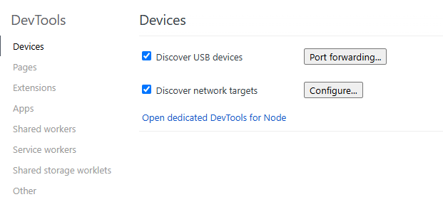
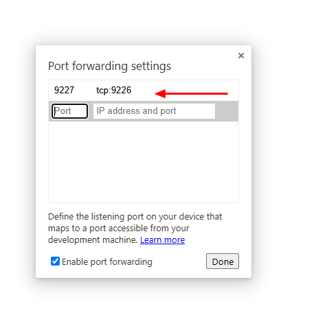
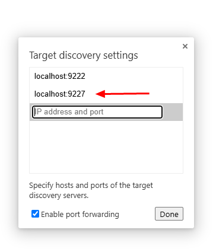

# JSVM-API Debugging

JavaScript virtual machine (JSVM) is a standard JavaScript (JS) code execution engine that strictly complies with the ECMAScript specification. For details, see [JSVM](../reference/common/_j_s_v_m.md).
The JSVM-based code debugging and tuning capabilities include Debugger, CPU Profiler, Heap Snapshot, and Heap Statistics. The following APIs are involved:
| API |  Description|
|---|---|
| OH_JSVM_GetVM  |  Obtains a VM instance.|
| OH_JSVM_GetHeapStatistics  |  Obtains heap statistics of a VM.|
| OH_JSVM_StartCpuProfiler  |  Creates and starts a CPU profiler instance.|
| OH_JSVM_StopCpuProfiler  |  Stops the CPU profiler and outputs the result to a stream.|
| OH_JSVM_TakeHeapSnapshot  |  Obtains a snapshot of the current heap and outputs it to a stream.|
| OH_JSVM_OpenInspector  |  Opens an inspector instance on the specified host and port for debugging JS code.|
| OH_JSVM_OpenInspectorWithName | Opens an inspector instance based on the PID and name.|
| OH_JSVM_CloseInspector  |  Closes all remaining inspector connections.|
| OH_JSVM_WaitForDebugger  |  Waits for the host to set up a socket connection with an inspector. After the connection is set up, the application continues to run. You can use **Runtime.runIfWaitingForDebugger** to run paused targets.|


This topic describes how to use Debugger, CPU Profiler, and Heap Snapshot.

## Using Debugger

### Using OH_JSVM_OpenInspector

1. Configure the permission for accessing the Internet in the **module.json** file of the application project.

   ```
   "requestPermissions": [{
     "name": "ohos.permission.INTERNET",
     "reason": "$string:app_name",
     "usedScene": {
       "abilities": [
         "FromAbility"
       ],
       "when": "inuse"
     }
   }]
   ```

2. To prevent the pause during the debugging process from being falsely reported as no response, [enable the DevEco Studio debug mode](https://developer.huawei.com/consumer/en/doc/harmonyos-guides-V5/ide-debug-arkts-debug-V5) without setting breakpoints or run JSVM-API in threads except the main thread.

3. Call **OH_JSVM_OpenInspector** to open an inspector instance on the specified host and port.

   For example, call **OH_JSVM_OpenInspector(env, "localhost", 9225)** to create a socket on local port 9225 of the device.

4. Call **OH_JSVM_WaitForDebugger** to wait for the setup of a socket connection.

5. Check whether the port on the device is enabled successfully.

   For example, run **hdc shell "netstat -anp | grep 9225"**. If the status of port 9225 is **LISTEN**, the port is enabled.

6. Forward port. For example, run **hdc fport tcp:9229 tcp:9225** to forward port 9229 on a PC to port 9225 on a device. If **Forwardport result:OK** is returned, the port is forwarded successfully.

7. Enter **localhost:9229/json** in the address box of Google Chrome and press **Enter**. Obtain port connection information. Copy the URL in the **devtoolsFrontendUrl** field to the address box and press **Enter**.

   On the DevTools source code page displayed, the JS source code executed by **OH_JSVM_RunScript** in the application is displayed. The Debugger pauses at the first line of the JS source code.

   > **NOTE**
   >
   > The URL specified by the **devtoolsFrontendUrl** field can be opened only on Google Chrome or Microsoft Edge. Mozilla Firefox and Apple Safari are not supported.

8. You can set breakpoints on the source code page, send debugging commands using the buttons to control JS code execution, and view variables.

9. Call **OH_JSVM_CloseInspector** to close the inspector instance and release the socket connection.

#### Example
If you are just starting out with JSVM-API, see [JSVM-API Development Process](use-jsvm-process.md). The following demonstrates only the C++ code involved.
```cpp
#include "ark_runtime/jsvm.h"

#include <string>

using namespace std;

// JS source code to be debugged.
static string srcDebugger = R"JS(
const concat = (...args) => args.reduce((a, b) => a + b);
var dialogue = concat('"What ', 'is ', 'your ', 'name ', '?"');
dialogue = concat(dialogue, ' --', '"My ', 'name ', 'is ', 'Bob ', '."');
)JS";

// Enable Debugger.
static void EnableInspector(JSVM_Env env) {
    // Open an inspector instance on the specified host and port to create a socket.
    OH_JSVM_OpenInspector(env, "localhost", 9225);
    // Wait for the host to set up a socket connection with the inspector.
    OH_JSVM_WaitForDebugger(env, true);
}

// Close Debugger.
static void CloseInspector(JSVM_Env env) {
    // Close the inspector to release the socket connection.
    OH_JSVM_CloseInspector(env);
}

static void RunScript(JSVM_Env env) {
    JSVM_HandleScope handleScope;
    OH_JSVM_OpenHandleScope(env, &handleScope);

    JSVM_Value jsSrc;
    OH_JSVM_CreateStringUtf8(env, srcDebugger.c_str(), srcDebugger.size(), &jsSrc);

    JSVM_Script script;
    OH_JSVM_CompileScript(env, jsSrc, nullptr, 0, true, nullptr, &script);

    JSVM_Value result;
    OH_JSVM_RunScript(env, script, &result);

    OH_JSVM_CloseHandleScope(env, handleScope);
}

void TestJSVM() {
    JSVM_InitOptions initOptions{};
    OH_JSVM_Init(&initOptions);

    JSVM_VM vm;
    OH_JSVM_CreateVM(nullptr, &vm);
    JSVM_VMScope vmScope;
    OH_JSVM_OpenVMScope(vm, &vmScope);

    JSVM_Env env;
    OH_JSVM_CreateEnv(vm, 0, nullptr, &env);
    // Enable Debugger before executing the JS code.
    EnableInspector(env);
    JSVM_EnvScope envScope;
    OH_JSVM_OpenEnvScope(env, &envScope);

    // Execute the JS code.
    RunScript(env);

    OH_JSVM_CloseEnvScope(env, envScope);
    // Close Debugger after the JS code is executed.
    CloseInspector(env);
    OH_JSVM_DestroyEnv(env);
    OH_JSVM_CloseVMScope(vm, vmScope);
    OH_JSVM_DestroyVM(vm);
}

```

### Using OH_JSVM_OpenInspectorWithName

1. Configure the permission for accessing the Internet in the **module.json** file of the application project.

   ```
   "requestPermissions": [{
     "name": "ohos.permission.INTERNET",
     "reason": "$string:app_name",
     "usedScene": {
       "abilities": [
         "FromAbility"
       ],
       "when": "inuse"
     }
   }]
   ```

2. To prevent the pause during the debugging process from being falsely reported as no response, [enable the DevEco Studio debug mode](https://developer.huawei.com/consumer/en/doc/harmonyos-guides-V5/ide-debug-arkts-debug-V5) without setting breakpoints or run JSVM-API in threads except the main thread.

3. Enable the inspector port and connect to devtools for debugging.

   Before executing the JS code, call **OH_JSVM_OpenInspector** to open an inspector instance on the specified host and port and create a socket. For example, call **OH_JSVM_OpenInspectorWithName (env, 123, "test")** to create a TCP socket and the corresponding unixdomain port.

4. Call **OH_JSVM_WaitForDebugger** to wait for the setup of a socket connection.

5. Check whether the port on the device is enabled successfully.<br>Run **hdc shell "cat /proc/net/unix | grep jsvm"**. An available Unix port is displayed, for example, **jsvm_devtools_remote_9229_123**, where **9229** is the TCP port number and **123** is the PID.

6. Forward port. For example, run **hdc fport tcp:9229 tcp:9229** to forward port 9229 on a PC to port 9229 on a device. If **Forwardport result:OK** is returned, the port is forwarded successfully.

7. Enter **localhost:9229/json** in the address box of Google Chrome and press **Enter**. Obtain port connection information. Open Google Chrome DevTools, copy the URL in the **devtoolsFrontendUrl** field to the address box, and press **Enter**. <br>On the DevTools source code page displayed, the JS source code executed by **OH_JSVM_RunScript** is displayed. The Debugger pauses at the first line of the JS code.

   > **NOTE**
   >
   > The URL specified by the **devtoolsFrontendUrl** field can be opened only on Google Chrome or Microsoft Edge. Mozilla Firefox and Apple Safari are not supported.

8. You can set breakpoints on the source code page, send debugging commands using the buttons to control JS code execution, and view variables.

9. Call **OH_JSVM_CloseInspector** to close the inspector instance and release the socket connection.

#### Example

Replace the "//Enable Debugger" section in the previous sample code with the following:
```cpp
// Enable Debugger.
static void EnableInspector(JSVM_Env env) {
    // Open an inspector instance on the specified host and port to create a socket.
    OH_JSVM_OpenInspectorWithName(env, 123, "test");
    // Wait for the host to set up a socket connection with the inspector.
    OH_JSVM_WaitForDebugger(env, true);
}
```

### Using Chrome inspect
In addition to opening the URL specified by the **devtoolsFrontendUrl** field for debugging, you can also open the **chrome://inspect/#devices** page on Google Chrome to perform debugging. The procedure is as follows:
1. On Google Chrome, enter **chrome://inspect/#devices** in the address box and press **Enter**. On the page displayed, select the following options:
   
   <div align=left></div>
   
2. Run **hdc fport** [*Port number on the developer's PC*] [*Port number on a device*] to forward a port. 

    Example: **hdc fport tcp:9227 tcp:9226**

3. Click **Port forwarding**, enter the port number on the PC in the left text box and the port number on the device in the right text box, and click **Done**, as shown in the figure below.

   <div align=left></div>

4. Click **Configure**, enter the port number on the PC, for example, **localhost:9227**, and click **Done**, as shown in the figure below.

   <div align=left></div>

5. Wait until the debugging content is displayed under **Target**, and click **inspect** to start debugging, as shown in the figure below.

   <div align=left></div>

## Using CPU Profiler and Heap Snapshot

### Using CPU Profiler APIs

1. Before executing the JS code, call **OH_JSVM_StartCpuProfiler** to start sampling and return a **JSVM_CpuProfiler** instance.
2. Run the JS code and call **OH_JSVM_StopCpuProfiler**, in which you need to pass in the **JSVM_CpuProfiler** instance (obtained in step 1), callback for the output stream, and pointer to the output stream. Then, the data will be written to the specified output stream.
3. Obtain the output data in JSON strings. You can also save it to the **.cpuprofile** file, which can be parsed into profiling views with the Chrome DevTools-JavaScript Profiler.

### Using Heap Snapshot APIs

1. To analyze the heap object creation of a piece of JS code, call **OH_JSVM_TakeHeapSnapshot** before and after the JS code is executed. You need to pass in the callback used to return the output stream and the pointer to the output stream. Then, the data will be written to the specified output stream.
2. Save the output data to the **.heapsnapshot** file, which can be parsed into memory analysis views with the Chrome DevTools-Memory.

### Example
If you are just starting out with JSVM-API, see [JSVM-API Development Process](use-jsvm-process.md). The following demonstrates only the C++ code involved.

```cpp
#include "ark_runtime/jsvm.h"

#include <fstream>
#include <iostream>

using namespace std;

// JS code to be optimized.
static string srcProf = R"JS(
function sleep(delay) {
    var start = (new Date()).getTime();
    while ((new Date()).getTime() - start < delay) {
        continue;
    }
}

function work3() {
    sleep(300);
}

function work2() {
    work3();
    sleep(200);
}

function work1() {
    work2();
    sleep(100);
}

work1();
)JS";

// Callback for the data output stream, which is customized to process the returned data. In this example, the output data is written to a file.
static bool OutputStream(const char *data, int size, void *streamData) {
    auto &os = *reinterpret_cast<ofstream *>(streamData);
    if (data) {
        os.write(data, size);
    } else {
        os.close();
    }
    return true;
}

static JSVM_CpuProfiler ProfilingBegin(JSVM_VM vm) {
    // Specify the path of the file saving the output profiling data. In this example, the sandbox path is /data/storage/el2/base/files, and the bundle name is com.example.helloworld.
    // The output data will be saved to /data/app/el2/100/base/com.example.helloworld/files/heap-snapshot-begin.heapsnapshot.
    ofstream heapSnapshot("/data/storage/el2/base/files/heap-snapshot-begin.heapsnapshot",
                          ios::out | ios:: binary | ios::trunc);
    // Task a heap snapshot before the JS code is executed.
    OH_JSVM_TakeHeapSnapshot(vm, OutputStream, &heapSnapshot);
    JSVM_CpuProfiler cpuProfiler;
    // Start the CPU Profiler.
    OH_JSVM_StartCpuProfiler(vm, &cpuProfiler);
    return cpuProfiler;
}

// Stop the profiling data collection tool.
static void ProfilingEnd(JSVM_VM vm, JSVM_CpuProfiler cpuProfiler) {
    // Specify the path of the file saving the output profiling data. In this example, the sandbox path is /data/storage/el2/base/files, and the bundle name is com.example.helloworld.
    // The output data will be saved to /data/app/el2/100/base/com.example.helloworld/files/cpu-profile.cpuprofile.
    ofstream cpuProfile("/data/storage/el2/base/files/cpu-profile.cpuprofile",
                        ios::out | ios:: binary | ios::trunc);
    // Stop the CPU Profiler to obtain data.
    OH_JSVM_StopCpuProfiler(vm, cpuProfiler, OutputStream, &cpuProfile);
    ofstream heapSnapshot("/data/storage/el2/base/files/heap-snapshot-end.heapsnapshot",
                              ios::out | ios:: binary | ios::trunc);
    // After the JS is executed, take a heap snapshot again and compare the two snapshots for further analysis.
    OH_JSVM_TakeHeapSnapshot(vm, OutputStream, &heapSnapshot);
}

static JSVM_Value RunScriptWithStatistics(JSVM_Env env, JSVM_CallbackInfo info) {
    JSVM_VM vm;
    OH_JSVM_GetVM(env, &vm);

    // Start profiling.
    auto cpuProfiler = ProfilingBegin(vm);

    JSVM_HandleScope handleScope;
    OH_JSVM_OpenHandleScope(env, &handleScope);

    JSVM_Value jsSrc;
    OH_JSVM_CreateStringUtf8(env, srcProf.c_str(), srcProf.size(), &jsSrc);

    JSVM_Script script;
    OH_JSVM_CompileScript(env, jsSrc, nullptr, 0, true, nullptr, &script);

    JSVM_Value result;
    // Execute the JS code.
    OH_JSVM_RunScript(env, script, &result);

    OH_JSVM_CloseHandleScope(env, handleScope);

    // End profiling.
    ProfilingEnd(vm, cpuProfiler);
    return nullptr;
}
static JSVM_CallbackStruct param[] = {
    {.data = nullptr, .callback = RunScriptWithStatistics},
};
static JSVM_CallbackStruct *method = param;
// Alias for the runScriptWithStatistics method to be called from JS.
static JSVM_PropertyDescriptor descriptor[] = {
    {"runScriptWithStatistics", nullptr, method++, nullptr, nullptr, nullptr, JSVM_DEFAULT},
};
// Call C++ code from JS.
const char *srcCallNative = R"JS(runScriptWithStatistics();)JS";
```

