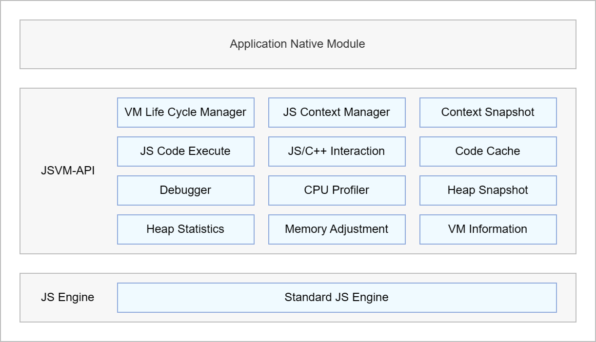
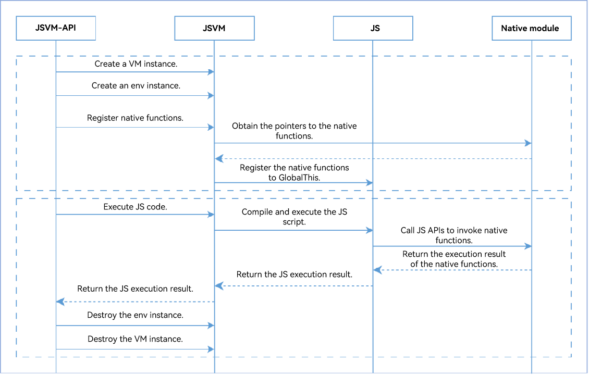

# JSVM-API Overview
<!--Kit: NDK Development-->
<!--Subsystem: arkcompiler-->
<!--Owner: @yuanxiaogou; @string_sz-->
<!--Designer: @knightaoko-->
<!--Tester: @test_lzz-->
<!--Adviser: @fang-jinxu-->

## Introduction

OpenHarmony JSVM-API provides a set of stable APIs based on the standard JavaScript (JS) engine. It supports key functionalities such as creating and destroying engines, executing JS code, and implementing interaction between JS and C/C++ modules.

OpenHarmony JSVM-API provides a set of APIs written in C programming language that complies with C99.

JSVM-API allows dynamically loaded JS code to be directly run during application runtime. With JSVM-API, you can also use C/C++ to implement core functionalities that demand high performance or closely rely on underlying system invocation, register C++ methods in JS code, and directly call the JS code to improve the execution speed.

Unless otherwise specified, JSVM-API in this document refers to OpenHarmony JSVM-API.

## JSVM-API Architecture

**Figure 1** JSVM-API architecture
  

- Native Module: module developed using JSVM-API in C/C++.

- VM Life Cycle Manager: manages the JSVM_VM lifecycle.

- JS Context Manager: manages the JSVM_Env lifecycle.

- Context Snapshot: manages context snapshots to shorten the time used to create JS context.

- JS Code Execute: executes JS code.

- JS/C++ Interaction: implements interaction between JS and C++.

- Code Cache: caches the JS code to shorten the startup time for JS code execution.

- Debugger: debugs JS code.

- CPU Profiler: records the JS code execution time and helps analyze the JS code performance bottlenecks.

- Heap Snapshot: helps you perform JS heap memory analysis, identify memory issues, and make improvements.

- Heap Statistics: provides JS heap statistics, including the memory size and context count.

- Memory Adjustment: adjusts the external memory size and VM memory pressure to accelerate GC triggering.

- VM Information: manages JSVM_VM information.

- Standard JS Engine: standard JS engine.

## JSVM-API Interaction Process

**Figure 2** Key interaction process of JSVM-API

The interaction between JSVM-API and a native module is as follows:

1. **Initialization**: Initialize the JSVM and JS context on the native module and register native functions in JS code. The native functions are hooked to **GlobalThis**, which is the global context of the JS execution environment.

2. **Invocation**: Call JS APIs to invoke the native functions that are registered in **GlobalThis** using JSVM-API. The JS engine calls the corresponding C/C++ functions.
