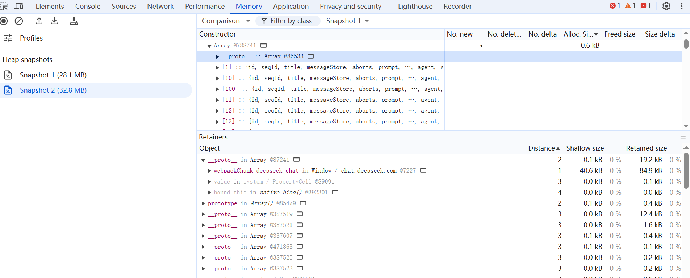

# JSVM-API Memory Leakage Troubleshooting Guide
<!--Kit: NDK Development-->
<!--Subsystem: arkcompiler-->
<!--Owner: @yuanxiaogou; @string_sz-->
<!--Designer: @knightaoko-->
<!--Tester: @test_lzz-->
<!--Adviser: @fang-jinxu-->

The memory usage of the JSVM includes the native memory usage (memory usage on the C/C++ side) and the heap memory usage of the underlying JS engine. The JS engine maintains a heap to manage the generated JS objects. The lifecycle of the JS objects is maintained by the JS engine. Other memory is classified as the native memory. When using the JSVM, users may encounter the following two situations:

This document describes how to perform qualitative analysis and how to locate native memory leaks and JS engine heap memory leaks.

## Qualitative Analysis

You can use the HDC to connect to the device, run the following command to sample the memory of the target application, and compare the memory changes within a period of time to determine whether the native memory leakage or JS memory leakage occurs. In the Pss Total column in the following figure, native heap indicates the native memory usage, and AnnonPage other indicates the JS heap memory usage.
```
hidumper --mem $(pidof dest_app)
```
<div align=left></div>


## Locating Native Memory Leakage
### Typical Use Case
1. The OH_JSVM_CreateReference and OH_JSVM_DeleteReference interfaces are not called in pairs. As a result, the reference is not released.
```c++
JSVM_Value obj = nullptr;
OH_JSVM_CreateObject(env, &obj);
// Create a reference.
JSVM_Ref reference;
OH_JSVM_CreateReference(env, obj, 1, &reference);

// Create a reference with a JS object.
JSVM_Value result;
OH_JSVM_GetReferenceValue(env, reference, &result);

// The reference is not released.
// OH_JSVM_DeleteReference(env, reference);
```

### **Locating Procedure**
To analyze native memory leakage, you can use the memory analysis module of DevEco Studio. For details, see [Memory Analysis and Optimization](https://developer.huawei.com/consumer/en/doc/harmonyos-guides/ide-insight-session-allocations-memory).
1. Use the Allocation module of Profiler to record the native memory information within a period of time.
<div align=left></div>  

2. Compare the memory changes in the Created & Existing field during this period. If the unreleased memory accounts for a large proportion and the value of Count is large, memory leakage may occur. In this case, check the call stack.
<div align=left></div> 


## Locating Heap Memory Leakage of the JS Engine
### Typical Use Case
1. Global variables are abused. As a result, dom elements are not released.
```js
const elements = [];
function createElements() {
  for (let i = 0; i < 1000; i++) {
    const el = document.createElement('div');
    document.body.appendChild(el);
    elements.push(el); // The array retains the reference even if it is removed from the DOM.
  }
}
```

### **Locating Procedure**
Currently, JSVM provides OH_JSVM_OpenInspector to enable the inspector. For details, see [Using OH_JSVM_OpenInspector](https://developer.huawei.com/consumer/en/doc/harmonyos-guides/jsvm-debugger-cpuprofiler-heapsnapshot#%E4%BD%BF%E7%94%A8-oh_jsvm_openinspector). In addition, you can use the [Chrome inspect page for debugging](https://developer.huawei.com/consumer/en/doc/harmonyos-guides/jsvm-debugger-cpuprofiler-heapsnapshot#%E4%BD%BF%E7%94%A8-chrome-inspect-%E9%A1%B5%E9%9D%A2%E8%BF%9B%E8%A1%8C%E8%B0%83%E8%AF%95).
Use DevTools to take a snapshot of the heap memory in the target scenario (before taking the snapshot, click the garbage collection button to perform garbage collection). Use the snapshot comparison function to find the unreleased JS object and its location in the source code, and further locate the cause of the heap memory release failure.
<div align=left></div> 
