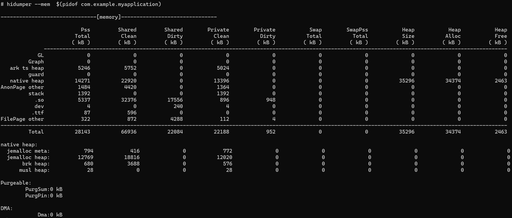
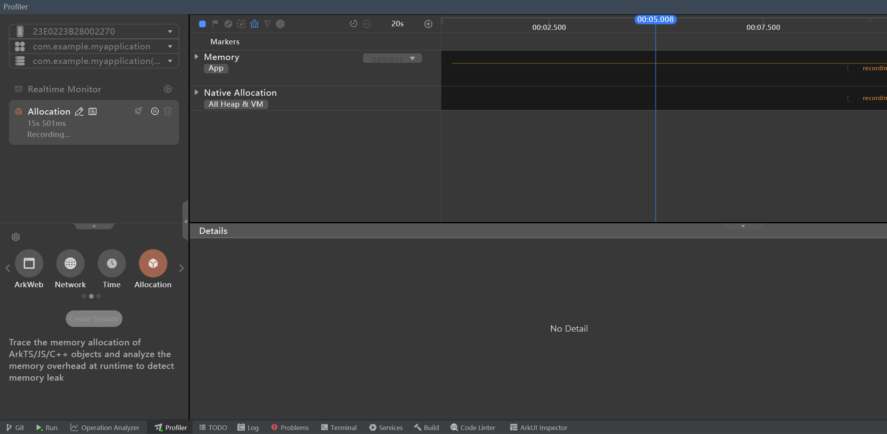
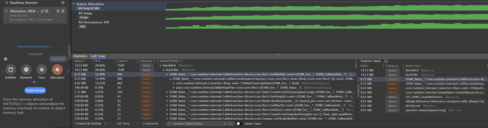
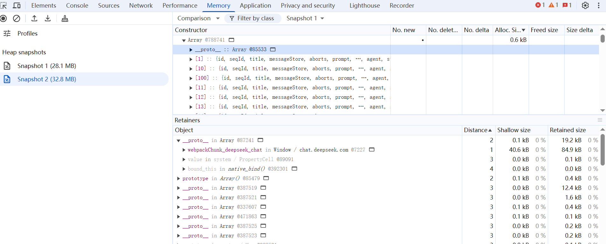

# Troubleshooting JSVM-API Memory Leaks

<!--Kit: ArkTS-->
<!--Subsystem: arkcompiler-->
<!--Owner: @yuanxiaogou-->
<!--Designer: @knightaoko-->
<!--Tester: @test_lzz-->
<!--Adviser: @k1ngqaquuu-->
<!-- md-trans-meta sourceCommit=f34ddda28f1bcebae0ddfbd293a9ffe8cb2789f9 translatedAt=2026-08-12T06:26:20.702Z pushedAt=2026-08-12T09:03:15.940Z -->

JSVM memory usage includes native memory usage (C/C++ memory usage) and heap memory usage of the underlying JavaScript engine. The JavaScript engine maintains a heap to manage the JavaScript objects it generates, and the lifecycle of these objects is maintained by the JavaScript engine. Other memory is called native memory. When using the JSVM, you may encounter the two types of abnormal memory growth.

This topic describes how to determine the memory leak type and how to locate the native memory leak and JavaScript engine heap memory leak.

## Determining the Memory Leak Type

You can connect to the device via hdc and run the following command to sample the memory of the target app, then compare the memory changes over a period of time to qualitatively determine whether the issue is a Native memory leak or abnormal JS heap memory growth. In the following figure, under the Pss Total column, native heap corresponds to Native memory usage, and AnonPage other corresponds to JS heap memory usage.

```hdc
hidumper --mem $(pidof dest_app)
```

<div align=left></div>

## Locating Native Memory Leaks

### When to Use

1. **OH_JSVM_CreateReference** and **OH_JSVM_DeleteReference** are not called in pairs. As a result, references are not released.

```c++
JSVM_Value obj = nullptr;
OH_JSVM_CreateObject(env, &obj);
// Create a reference.
JSVM_Ref reference;
OH_JSVM_CreateReference(env, obj, 1, &reference);

// Use the reference.
JSVM_Value result;
OH_JSVM_GetReferenceValue(env, reference, &result);

// The reference is not released.
// OH_JSVM_DeleteReference(env, reference);
```

### How to Locate

To analyze native memory leaks, you can use the memory analysis module of DevEco Studio. For details, see [Memory Analysis and Optimization](https://developer.huawei.com/consumer/en/doc/harmonyos-guides/ide-insight-session-allocations-memory).

1. Use the **Allocation** module of Profiler to record the native memory information within a period of time.

   <div align=left></div>  

2. Compare the memory changes in **Created & Existing** during this period. If the unreleased memory accounts for a large proportion and the value of **Count** is large, a memory leak may occur. In this case, check the call stack.

   <div align=left></div> 

## Locating JavaScript Engine Heap Memory Leaks

### When to Use

1. Global variables are misused. As a result, DOM elements are not released.

```js
const elements = [];
function createElements() {
  for (let i = 0; i < 1000; i++) {
    const el = document.createElement('div');
    document.body.appendChild(el);
    elements.push(el); // Even if the element is removed from the DOM, the array still holds the reference.
  }
}
```

### How to Locate

Currently, JSVM provides OH_JSVM_OpenInspector to enable the inspector. For details, see [Using OH_JSVM_OpenInspector](https://developer.huawei.com/consumer/en/doc/harmonyos-guides/jsvm-debugger-cpuprofiler-heapsnapshot#using-oh_jsvm_openinspector) and [Using Chrome Inspect](https://developer.huawei.com/consumer/en/doc/harmonyos-guides/jsvm-debugger-cpuprofiler-heapsnapshot#using-chrome-inspect).

Use DevTools to take a snapshot of the heap memory in the target scenario (click the garbage collection button above before taking a snapshot). Compare the snapshots to find the unreleased JavaScript objects and their locations in the source code to further locate the cause of the unreleased heap memory.

<div align=left></div> 