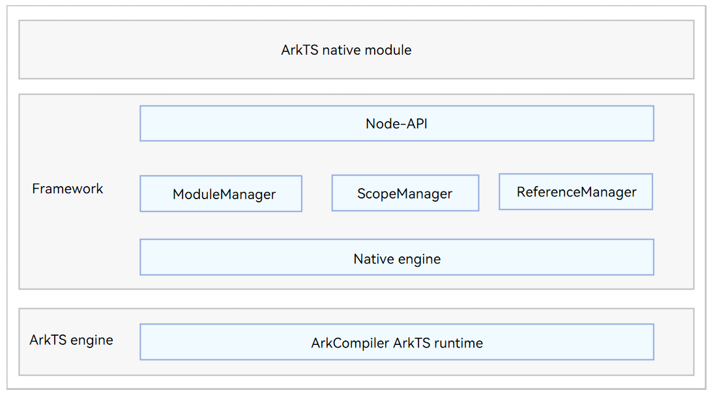
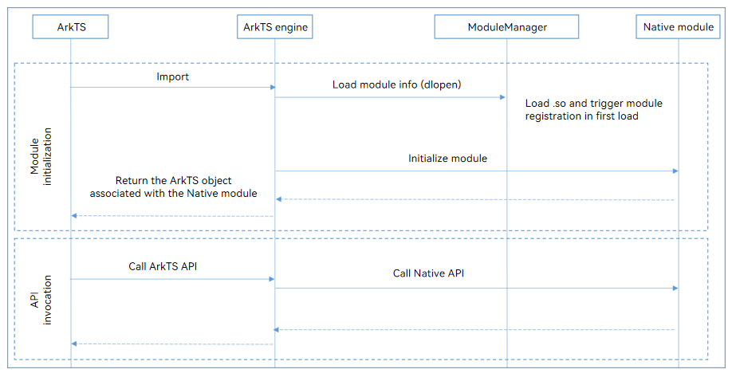

# Node-API Overview
<!--Kit: NDK-->
<!--Subsystem: arkcompiler-->
<!--Owner: @xliu-huanwei; @shilei123; @huanghello-->
<!--Designer: @shilei123-->
<!--Tester: @kirl75; @zsw_zhushiwei-->
<!--Adviser: @fang-jinxu-->

## When to Use

Developed based on the Node.js 12.x LTS [Node-API](https://nodejs.org/docs/latest-v12.x/api/n-api.html), OpenHarmony Node-API allows interaction between ArkTS/JS and C/C++ modules. It provides a set of stable APIs that can be used on different operating systems.

Unless otherwise specified, Node-API in this document refers to OpenHarmony Node-API.

> **NOTE**
>
> For details about the differences between OpenHarmony Node-API and Node.js 12.x LTS Node-API, see [Node-API](../reference/native-lib/napi.md).

Generally, ArkTS/JS is used for OpenHarmony application development. However, in compute-intensive scenarios, such as games and physical simulations, the existing C/C++ libraries are required to meet the requirements for performance and efficiency. Node-API specifications encapsulate I/O, CPU-intensive, and OS underlying capabilities, expose C interfaces, and use the registration mechanism of C/C++ modules, you can mount attributes and methods to ArkTS/JS objects to implement the interaction between ArkTS/JS and C/C++. Node-API provides the following benefits:

- The system can expose the rich module functions of the framework layer to the ArkTS/JS interface through the module registration mechanism of Node-API, and open the C/C++ capabilities to the ArkTS/JS layer of the application.

- You can encapsulate core capabilities in C/C++ and use them with ArkTS/JS APIs to improve the execution efficiency of your application.

## Node-API Architecture

**Figure 1** Node-API architecture
  

- Native module: a module developed using Node-API and imported to ArkTS.

- Node-API: implements the logic for interaction between ArkTS and C/C++ code.

- ModuleManager: manages native modules, including loading and locating native modules.

- ScopeManager: manages the lifecycle of **napi_value**.

- ReferenceManager: manages the lifecycle of **napi_ref**.

- Native engine: ArkTS engine abstraction layer, which unifies the API behavior of the ArkTS engine at the Node-API layer.

- ArkCompiler ArkTS Runtime: ArkTS runtime.

## Key Interaction Process of Node-API

**Figure 2** Key interaction process of Node-API
  

The interaction between ArkTS and C++ consists of the following two steps:

1. Initialization: When a native module is imported to ArkTS, the ArkTS engine calls the ModuleManager to load the .so file and dependencies of the module. When the module is loaded for the first time, the module registration is triggered. Then, the method properties defined by the module are embedded to an **exports** object and the object is returned.

2. Invocation: When an ArkTS method is called using the **exports** object, the ArkTS engine locates and calls the embedded C/C++ method.
