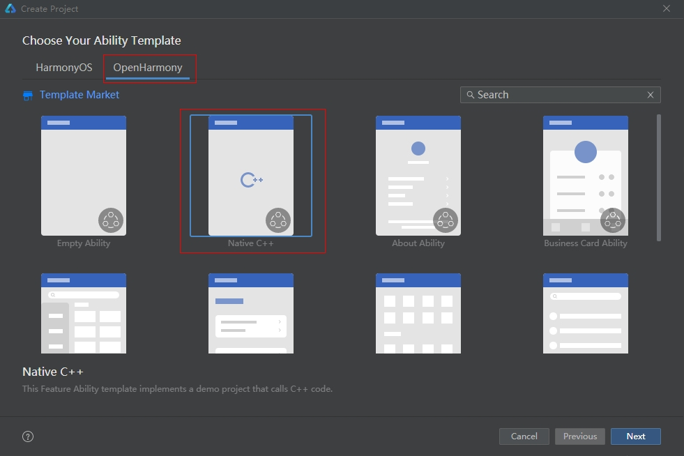

# Native Bundle Development

<!--Kit: Ability Kit-->
<!--Subsystem: BundleManager-->
<!--Owner: @wanghang904-->
<!--Designer: @hanfeng6-->
<!--Tester: @memghaiyang-->
<!--Adviser: @HelloCrease-->
<!-- md-trans-meta sourceCommit=e614db0ed9ef9e65ff9f340640f4a0fd5317e78d translatedAt=2026-08-12T06:28:23.195Z pushedAt=2026-08-12T09:56:43.686Z -->

## When to Use

Use the native bundle APIs to obtain application information.

## Available APIs

The following table lists the common APIs. For details, see [Native_Bundle](../reference/apis-ability-kit/capi-native-bundle.md).

| API                                                      | Description                                    |
| :----------------------------------------------------------- | :--------------------------------------- |
| [OH_NativeBundle_GetCurrentApplicationInfo](../reference/apis-ability-kit/capi-native-interface-bundle-h.md#oh_nativebundle_getcurrentapplicationinfo) | Obtains the information about the current application.         |
| [OH_NativeBundle_GetAppId](../reference/apis-ability-kit/capi-native-interface-bundle-h.md#oh_nativebundle_getappid) | Obtains the appId information about the application.|
| [OH_NativeBundle_GetAppIdentifier](../reference/apis-ability-kit/capi-native-interface-bundle-h.md#oh_nativebundle_getappidentifier) | Obtains the appIdentifier information about the application.|
| [OH_NativeBundle_GetMainElementName](../reference/apis-ability-kit/capi-native-interface-bundle-h.md#oh_nativebundle_getmainelementname) | Obtains the entry information of the application.|
| [OH_NativeBundle_GetCompatibleDeviceType](../reference/apis-ability-kit/capi-native-interface-bundle-h.md#oh_nativebundle_getcompatibledevicetype) | Obtains the compatible device type of the application.|
| [OH_NativeBundle_IsDebugMode](../reference/apis-ability-kit/capi-native-interface-bundle-h.md#oh_nativebundle_isdebugmode) | Queries the debug mode of the application. This API is supported since API version 20.|
| [OH_NativeBundle_GetModuleMetadata](../reference/apis-ability-kit/capi-native-interface-bundle-h.md#oh_nativebundle_getmodulemetadata) | Obtains the metadata information of the application. This API is supported since API version 20.|
| [OH_NativeBundle_GetAbilityResourceInfo](../reference/apis-ability-kit/capi-native-interface-bundle-h.md#oh_nativebundle_getabilityresourceinfo) | Obtains a list of ability resource information that supports opening a specific file type. This API is supported since API version 21.|

## How to Develop

**1. Create a project.**



**2. Add dependencies.**

After the project is created, the **cpp** directory is created in the project directory. In the **cpp** directory, there are files such as **types/libentry/index.d.ts**, **napi_init.cpp**, and **CMakeLists.txt**.

1. Open **src/main/cpp/CMakeLists.txt** and add the package-managed **libbundle_ndk.so** to the **target_link_libraries** dependency.

    ```c++
    target_link_libraries(entry PUBLIC libace_napi.z.so libbundle_ndk.so)
    ```

2. Open the **src/main/cpp/napi_init.cpp** file, and add the header file.

    <!-- @[native-bundle-guidelines_002](https://gitcode.com/openharmony/applications_app_samples/blob/master/code/DocsSample/bmsSample/NativeBundleGuidelines/entry/src/main/cpp/napi_init.cpp) -->

    ``` C++
    // Include the header file required for napi.
    #include "napi/native_api.h"
    // Include the header file required for native APIs.
    #include "bundle/ability_resource_info.h"
    #include "bundle/native_interface_bundle.h"
    // Include the standard library for the free() function.
    #include <cstdlib>
    ```

**3. Modify the source file.**

1. When the **src/main/cpp/napi_init.cpp** file is opened, **Init** is called to initialize the API.

    <!-- @[native-bundle-guidelines_004](https://gitcode.com/openharmony/applications_app_samples/blob/master/code/DocsSample/bmsSample/NativeBundleGuidelines/entry/src/main/cpp/napi_init.cpp) -->

    ``` C++
    EXTERN_C_START
    static napi_value Init(napi_env env, napi_value exports)
    {
        napi_property_descriptor desc[] = {
            { "add", nullptr, Add, nullptr, nullptr, nullptr, napi_default, nullptr },
            // Add the getCurrentApplicationInfo method.
            { "getCurrentApplicationInfo", nullptr, GetCurrentApplicationInfo, nullptr,
                nullptr, nullptr, napi_default, nullptr},
            // Add the getAppId method.
            { "getAppId", nullptr, GetAppId, nullptr, nullptr, nullptr, napi_default, nullptr},
            // Add the getAppIdentifier method.
            { "getAppIdentifier", nullptr, GetAppIdentifier, nullptr, nullptr, nullptr, napi_default, nullptr},
            // Add the getMainElementName method.
            { "getMainElementName", nullptr, GetMainElementName, nullptr, nullptr, nullptr, napi_default, nullptr},
            // Add the getCompatibleDeviceType method.
            { "getCompatibleDeviceType", nullptr, GetCompatibleDeviceType, nullptr,
                nullptr, nullptr, napi_default, nullptr},
            // Add the isDebugMode method.
            { "isDebugMode", nullptr, IsDebugMode, nullptr, nullptr, nullptr, napi_default, nullptr},
            // Add the getModuleMetadata method.
            { "getModuleMetadata", nullptr, GetModuleMetadata, nullptr, nullptr, nullptr, napi_default, nullptr},
            // Add the getAbilityResourceInfo method.
            { "getAbilityResourceInfo", nullptr, GetAbilityResourceInfo, nullptr, nullptr, nullptr, napi_default, nullptr}
        };
        napi_define_properties(env, exports, sizeof(desc) / sizeof(desc[0]), desc);
        return exports;
    }
    EXTERN_C_END
    ```

2. Obtain the native bundle information object from the **src/main/cpp/napi_init.cpp** file and convert it to a JavaScript bundle information object. In this way, you can obtain the application information on the JavaScript side.

    <!-- @[native-bundle-guidelines_003](https://gitcode.com/openharmony/applications_app_samples/blob/master/code/DocsSample/bmsSample/NativeBundleGuidelines/entry/src/main/cpp/napi_init.cpp) -->

    ``` C++
    static napi_value GetCurrentApplicationInfo(napi_env env, napi_callback_info info)
    {
        // Call the native API to obtain the application information.
        OH_NativeBundle_ApplicationInfo nativeApplicationInfo = OH_NativeBundle_GetCurrentApplicationInfo();
        napi_value result = nullptr;
        napi_create_object(env, &result);
        // Convert the bundle name obtained by calling the native API to the bundleName property in the JavaScript object.
        napi_value bundleName;
        napi_create_string_utf8(env, nativeApplicationInfo.bundleName, NAPI_AUTO_LENGTH, &bundleName);
        napi_set_named_property(env, result, "bundleName", bundleName);
        // Convert the fingerprint information obtained by calling the native API to the fingerprint property in the JavaScript object.
        napi_value fingerprint;
        napi_create_string_utf8(env, nativeApplicationInfo.fingerprint, NAPI_AUTO_LENGTH, &fingerprint);
        napi_set_named_property(env, result, "fingerprint", fingerprint);
        // To prevent memory leak, manually release the memory.
        free(nativeApplicationInfo.bundleName);
        free(nativeApplicationInfo.fingerprint);
        return result;
    }
    
    static napi_value GetAppId(napi_env env, napi_callback_info info)
    {
        // Call the native API to obtain the appId.
        char* appId = OH_NativeBundle_GetAppId();
        // Convert the appId obtained by calling the native API to nAppId and return it.
        napi_value nAppId;
        napi_create_string_utf8(env, appId, NAPI_AUTO_LENGTH, &nAppId);
        // To prevent memory leak, manually release the memory.
        free(appId);
        return nAppId;
    }
    
    static napi_value GetAppIdentifier(napi_env env, napi_callback_info info)
    {
        // Call the native API to obtain the appIdentifier.
        char* appIdentifier = OH_NativeBundle_GetAppIdentifier();
        // Convert the appIdentifier obtained by calling the native API to nAppIdentifier and return it.
        napi_value nAppIdentifier;
        napi_create_string_utf8(env, appIdentifier, NAPI_AUTO_LENGTH, &nAppIdentifier);
        // To prevent memory leak, manually release the memory.
        free(appIdentifier);
        return nAppIdentifier;
    }
    
    static napi_value GetMainElementName(napi_env env, napi_callback_info info)
    {
        // Call the native API to obtain the application entry information.
        OH_NativeBundle_ElementName elementName = OH_NativeBundle_GetMainElementName();
        napi_value result = nullptr;
        napi_create_object(env, &result);
        // Convert the bundle name obtained by calling the native API to the bundleName property in the JavaScript object.
        napi_value bundleName;
        napi_create_string_utf8(env, elementName.bundleName, NAPI_AUTO_LENGTH, &bundleName);
        napi_set_named_property(env, result, "bundleName", bundleName);
        // Convert the module name obtained by calling the native API to the moduleName property in the JavaScript object.
        napi_value moduleName;
        napi_create_string_utf8(env, elementName.moduleName, NAPI_AUTO_LENGTH, &moduleName);
        napi_set_named_property(env, result, "moduleName", moduleName);
        // Convert the ability name obtained by calling the native API to the abilityName property in the JavaScript object.
        napi_value abilityName;
        napi_create_string_utf8(env, elementName.abilityName, NAPI_AUTO_LENGTH, &abilityName);
        napi_set_named_property(env, result, "abilityName", abilityName);
        // To prevent memory leak, manually release the memory.
        free(elementName.bundleName);
        free(elementName.moduleName);
        free(elementName.abilityName);
        return result;
    }
    
    static napi_value GetCompatibleDeviceType(napi_env env, napi_callback_info info)
    {
        // Call the native API to obtain the device type.
        char* deviceType = OH_NativeBundle_GetCompatibleDeviceType();
        // Convert the device type obtained by calling the native API to nDeviceType and return it.
        napi_value nDeviceType;
        napi_create_string_utf8(env, deviceType, NAPI_AUTO_LENGTH, &nDeviceType);
        // To prevent memory leak, manually release the memory.
        free(deviceType);
        return nDeviceType;
    }
    
    static napi_value IsDebugMode(napi_env env, napi_callback_info info)
    {
        bool isDebug = false;
        // Call the native API to obtain the DebugMode information of the application. This API is supported since API version 20.
        bool isSuccess = OH_NativeBundle_IsDebugMode(&isDebug);
        // Throw an exception if the native API call fails
        if (isSuccess == false) {
            napi_throw_error(env, nullptr, "call failed");
            return nullptr;
        }
        // Convert the debug information obtained by calling the native API to debug and return it.
        napi_value debug;
        napi_get_boolean(env, isDebug, &debug);
        return debug;
    }
    
    static napi_value GetModuleMetadata(napi_env env, napi_callback_info info)
    {
        size_t moduleCount = 0;
        // Call the native API to obtain the metadata of the application. This API is supported since API version 20.
        OH_NativeBundle_ModuleMetadata* modules = OH_NativeBundle_GetModuleMetadata(&moduleCount);
        if (modules == nullptr || moduleCount == 0) {
            napi_throw_error(env, nullptr, "no metadata found");
            return nullptr;
        }
        napi_value result;
        napi_create_array(env, &result);
        for (size_t i = 0; i < moduleCount; i++) {
            napi_value moduleObj;
            napi_create_object(env, &moduleObj);
            // Convert the module name obtained by calling the native API to the moduleName property in the JavaScript object.
            napi_value moduleName;
            napi_create_string_utf8(env, modules[i].moduleName, NAPI_AUTO_LENGTH, &moduleName);
            napi_set_named_property(env, moduleObj, "moduleName", moduleName);
            napi_value metadataArray;
            napi_create_array(env, &metadataArray);
            for (size_t j = 0; j < modules[i].metadataArraySize; j++) {
                napi_value metadataObj;
                napi_create_object(env, &metadataObj);
                napi_value name;
                napi_value value;
                napi_value resource;
                napi_create_string_utf8(env, modules[i].metadataArray[j].name, NAPI_AUTO_LENGTH, &name);
                napi_create_string_utf8(env, modules[i].metadataArray[j].value, NAPI_AUTO_LENGTH, &value);
                napi_create_string_utf8(env, modules[i].metadataArray[j].resource, NAPI_AUTO_LENGTH, &resource);
                // Convert the metadata name obtained by calling the native API to the name property in the JavaScript object.
                napi_set_named_property(env, metadataObj, "name", name);
                // Convert the metadata value obtained by calling the native API to the value property in the JavaScript object.
                napi_set_named_property(env, metadataObj, "value", value);
                // Convert the metadata resource obtained by calling the native API to the resource property in the JavaScript object.
                napi_set_named_property(env, metadataObj, "resource", resource);
                napi_set_element(env, metadataArray, j, metadataObj);
            }
            napi_set_named_property(env, moduleObj, "metadata", metadataArray);
            napi_set_element(env, result, i, moduleObj);
        }
        // To prevent memory leak, manually release the memory.
        for (size_t i = 0; i < moduleCount; i++) {
            free(modules[i].moduleName);
            for (size_t j = 0; j < modules[i].metadataArraySize; j++) {
                free(modules[i].metadataArray[j].name);
                free(modules[i].metadataArray[j].value);
                free(modules[i].metadataArray[j].resource);
            }
            free(modules[i].metadataArray);
        }
        free(modules);
        return result;
    }
    ```

    <!-- @[native-bundle-guidelines_006](https://gitcode.com/openharmony/applications_app_samples/blob/master/code/DocsSample/bmsSample/NativeBundleGuidelines/entry/src/main/cpp/napi_init.cpp) -->

    ``` C++
    static void AddDefaultApp(napi_env env,
        napi_value &infoObj,
        OH_NativeBundle_AbilityResourceInfo* temp)
    {
        bool isDefaultApp = true;
        // This API is supported since API version 21.
        OH_NativeBundle_CheckDefaultApp(temp, &isDefaultApp);
        napi_value defaultAppValue;
        napi_get_boolean(env, isDefaultApp, &defaultAppValue);
        napi_set_named_property(env, infoObj, "isDefaultApp", defaultAppValue);
    }
    
    static void AddAppIndex(napi_env env,
        napi_value &infoObj,
        OH_NativeBundle_AbilityResourceInfo* temp)
    {
        int appIndex = -1;
        // This API is supported since API version 21.
        OH_NativeBundle_GetAppIndex(temp, &appIndex);
        napi_value appIndexValue;
        napi_create_int32(env, appIndex, &appIndexValue);
        napi_set_named_property(env, infoObj, "appIndex", appIndexValue);
    }
    
    static void AddLabel(napi_env env,
        napi_value &infoObj,
        OH_NativeBundle_AbilityResourceInfo* temp)
    {
        char *label = nullptr;
        // This API is supported since API version 21.
        OH_NativeBundle_GetLabel(temp, &label);
        napi_value labelValue;
        if (label) {
            napi_create_string_utf8(env, label, NAPI_AUTO_LENGTH, &labelValue);
            free(label);
        } else {
            napi_get_null(env, &labelValue);
        }
        napi_set_named_property(env, infoObj, "label", labelValue);
    }
    
    static void AddBundleName(napi_env env,
        napi_value &infoObj,
        OH_NativeBundle_AbilityResourceInfo* temp)
    {
        char *bundleName = nullptr;
        // This API is supported since API version 21.
        OH_NativeBundle_GetBundleName(temp, &bundleName);
        napi_value bundleNameValue;
        if (bundleName) {
            napi_create_string_utf8(env, bundleName, NAPI_AUTO_LENGTH, &bundleNameValue);
            free(bundleName);
        } else {
            napi_get_null(env, &bundleNameValue);
        }
        napi_set_named_property(env, infoObj, "bundleName", bundleNameValue);
    }
    
    static void AddModuleName(napi_env env,
        napi_value &infoObj,
        OH_NativeBundle_AbilityResourceInfo* temp)
    {
        char *moduleName = nullptr;
        // This API is supported since API version 21.
        OH_NativeBundle_GetModuleName(temp, &moduleName);
        napi_value moduleNameValue;
        if (moduleName) {
            napi_create_string_utf8(env, moduleName, NAPI_AUTO_LENGTH, &moduleNameValue);
            free(moduleName);
        } else {
            napi_get_null(env, &moduleNameValue);
        }
        napi_set_named_property(env, infoObj, "moduleName", moduleNameValue);
    }
    
    static void AddAbilityName(napi_env env,
        napi_value &infoObj,
        OH_NativeBundle_AbilityResourceInfo* temp)
    {
        char *abilityName = nullptr;
        // This API is supported since API version 21.
        OH_NativeBundle_GetAbilityName(temp, &abilityName);
        napi_value abilityNameValue;
        if (abilityName) {
            napi_create_string_utf8(env, abilityName, NAPI_AUTO_LENGTH, &abilityNameValue);
            free(abilityName);
        } else {
            napi_get_null(env, &abilityNameValue);
        }
        napi_set_named_property(env, infoObj, "abilityName", abilityNameValue);
    }
    
    static void GetDrawableDescriptor(
        OH_NativeBundle_AbilityResourceInfo* temp)
    {
        ArkUI_DrawableDescriptor *rawDrawable = nullptr;
        // This API is supported since API version 21.
        OH_NativeBundle_GetDrawableDescriptor(temp, &rawDrawable);
        if (rawDrawable) {
            // Draw an icon using the ArkUI_DrawableDescriptor object.
        }
    }
    
    static void AssemblyAbilityResourceInfo(napi_env env,
        napi_value &infoObj,
        OH_NativeBundle_AbilityResourceInfo* temp)
    {
        // 1. Add the default app.
        AddDefaultApp(env, infoObj, temp);
        // 2. Add an app index.
        AddAppIndex(env, infoObj, temp);
        // 3. Add a label.
        AddLabel(env, infoObj, temp);
        // 4. Add a bundle name.
        AddBundleName(env, infoObj, temp);
        // 5. Add a module name.
        AddModuleName(env, infoObj, temp);
        // 6. Add an ability name.
        AddAbilityName(env, infoObj, temp);
        // 7. Obtain the ArkUI_DrawableDescriptor object.
        GetDrawableDescriptor(temp);
    }
    
    static napi_value GetAbilityResourceInfo(napi_env env, napi_callback_info info)
    {
        size_t argc = 1;
        napi_value args[1];
        napi_status status;
        // Obtain the parameters passed in.
        status = napi_get_cb_info(env, info, &argc, args, nullptr, nullptr);
        if (status != napi_ok || argc < 1) {
            napi_throw_error(env, nullptr, "Invalid arguments. Expected fileType string.");
            return nullptr;
        }
        // Check whether the parameter is a string.
        napi_valuetype valuetype;
        status = napi_typeof(env, args[0], &valuetype);
        if (status != napi_ok || valuetype != napi_string) {
            napi_throw_error(env, nullptr, "Argument must be a string");
            return nullptr;
        }
        // Obtain the string.
        char fileType[256] = {0}; // Assume that the file type does not exceed 255 characters.
        size_t strLen;
        status = napi_get_value_string_utf8(env, args[0], fileType, sizeof(fileType) - 1, &strLen);
        if (status != napi_ok) {
            napi_throw_error(env, nullptr, "Failed to get fileType string");
            return nullptr;
        }
        size_t infosCount = 0;
        OH_NativeBundle_AbilityResourceInfo *infos = nullptr;
        // Call the native API to obtain the component resource information using the passed-in fileType. This API is supported since API version 21.
        BundleManager_ErrorCode ret = OH_NativeBundle_GetAbilityResourceInfo(fileType, &infos, &infosCount);
        if (ret == BUNDLE_MANAGER_ERROR_CODE_PERMISSION_DENIED) {
            napi_throw_error(env, nullptr, "BUNDLE_MANAGER_ERROR_CODE_PERMISSION_DENIED");
            return nullptr;
        }
        if (infos == nullptr || infosCount == 0) {
            napi_throw_error(env, nullptr, "no metadata found");
            return nullptr;
        }
        napi_value result;
        napi_create_array(env, &result);
        for (size_t i = 0; i < infosCount; i++) {
            auto temp = (OH_NativeBundle_AbilityResourceInfo *)((char *)infos + OH_NativeBundle_GetSize() * i);
            napi_value infoObj;
            napi_create_object(env, &infoObj);
            AssemblyAbilityResourceInfo(env, infoObj, temp);
            napi_set_element(env, result, i, infoObj);
        }
        // Release the memory. This API is supported since API version 21.
        OH_AbilityResourceInfo_Destroy(infos, infosCount);
        return result;
    }
    ```

**4. Expose APIs.**

1. Declare the exposed APIs in the **src/main/cpp/types/libentry/Index.d.ts** file.

    <!-- @[native-bundle-guidelines_001](https://gitcode.com/openharmony/applications_app_samples/blob/master/code/DocsSample/bmsSample/NativeBundleGuidelines/entry/src/main/cpp/types/libentry/Index.d.ts) -->

    ``` TypeScript
    export const add: (a: number, b: number) => number;
    export const getCurrentApplicationInfo: () => object;   // Add the exposed API getCurrentApplicationInfo.
    export const getAppId: () => string;                    // Add the exposed API getAppId.
    export const getAppIdentifier: () => string;            // Add the exposed API getAppIdentifier.
    export const getMainElementName: () => object;          // Add the exposed API getMainElementName.
    export const getCompatibleDeviceType: () => string;     // Add the exposed API getCompatibleDeviceType.
    export const isDebugMode: () => boolean;                // Add the exposed method isDebugMode.
    export const getModuleMetadata: () => object;           // Add the exposed API getModuleMetadata.
    export const getAbilityResourceInfo: (fileType: string) => object;      // Add the exposed API getAbilityResourceInfo.
    ```

**5. Call APIs on the JavaScript side.

1. Open src/main/ets/pages/Index.ets, import "libentry.so", and call the native APIs to print the obtained information. An example is as follows:

    <!-- @[native-bundle-guidelines_005](https://gitcode.com/openharmony/applications_app_samples/blob/master/code/DocsSample/bmsSample/NativeBundleGuidelines/entry/src/main/ets/pages/Index.ets) -->

    ``` TypeScript
    import { hilog } from '@kit.PerformanceAnalysisKit';
    import testNapi from 'libentry.so';
    
    const DOMAIN = 0x0000;
    
    @Entry
    @Component
    struct Index {
      @State message: string = 'Hello World';
    
      build() {
        Row() {
          Column() {
            Text(this.message)
              .fontSize($r('app.float.page_text_font_size'))
              .fontWeight(FontWeight.Bold)
              .onClick(() => {
                this.message = 'Welcome';
                hilog.info(DOMAIN, 'testTag', 'Test NAPI 2 + 3 = %{public}d', testNapi.add(2, 3));
                let appInfo = testNapi.getCurrentApplicationInfo();
                console.info("bundleNative getCurrentApplicationInfo success, data is " + JSON.stringify(appInfo));
                let appId = testNapi.getAppId();
                console.info("bundleNative getAppId success, appId is " + appId);
                let appIdentifier = testNapi.getAppIdentifier();
                console.info("bundleNative getAppIdentifier success, appIdentifier is " + appIdentifier);
                let mainElement = testNapi.getMainElementName();
                console.info("bundleNative getMainElementName success, data is " + JSON.stringify(mainElement));
                let deviceType = testNapi.getCompatibleDeviceType();
                console.info("bundleNative getCompatibleDeviceType success, deviceType is " + deviceType);
                let isDebugMode = testNapi.isDebugMode();
                console.info("bundleNative isDebugMode success, isDebugMode is " + isDebugMode);
                let moduleMetadata = testNapi.getModuleMetadata();
                console.info("bundleNative getModuleMetadata success, data is " + JSON.stringify(moduleMetadata));
                let fileType: string = '.png';
                let abilityResourceInfo = testNapi.getAbilityResourceInfo(fileType);
                console.info("bundleNative getAbilityResourceInfo success, data is " + JSON.stringify(abilityResourceInfo));
              })
          }
          .width('100%')
        }
        .height('100%')
      }
    }
    ```

For details about the APIs, see [Native_Bundle](../reference/apis-ability-kit/capi-native-bundle.md).