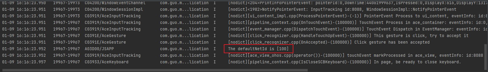
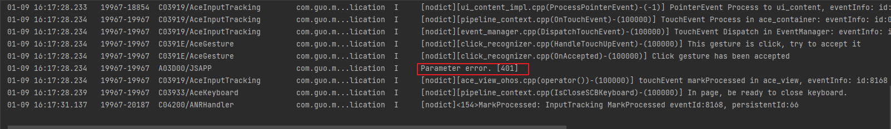

# Network Connection Development

## When to Use

The **NetConnection** module provides the capability of querying common network information.

## Available APIs

The following table lists the common **NetConnection** APIs. For details, see [NetConnection](../reference/apis-network-kit/_net_connection.md).


| API| **Test Description**|
| -------- | -------- |
| OH_NetConn_HasDefaultNet(int32_t \*hasDefaultNet) | Checks whether the default data network is activated and determines whether a network connection is available.|
| OH_NetConn_GetDefaultNet(NetConn_NetHandle \*netHandle) | Obtains the default active data network.|
| OH_NetConn_IsDefaultNetMetered(int32_t \*isMetered) | Checks whether the data traffic usage on the current network is metered.|
| OH_NetConn_GetConnectionProperties(NetConn_NetHandle \*netHandle, NetConn_ConnectionProperties *prop) | Obtains network connection information based on the specified **netHandle**.|
| OH_NetConn_GetNetCapabilities (NetConn_NetHandle \*netHandle, NetConn_NetCapabilities \*netCapacities) | Obtains network capability information based on the specified **netHandle**.|
| OH_NetConn_GetDefaultHttpProxy (NetConn_HttpProxy \*httpProxy) | Obtains the default HTTP proxy configuration of the network. If the global proxy is set, the global HTTP proxy configuration is returned. If the application has been bound to the network specified by **netHandle**, the HTTP proxy configuration of this network is returned. In other cases, the HTTP proxy configuration of the default network is returned.|
| OH_NetConn_GetAddrInfo (char \*host, char \*serv, struct addrinfo \*hint, struct addrinfo \*\*res, int32_t netId) | Obtains the DNS result based on the specified **netId**.|
| OH_NetConn_FreeDnsResult(struct addrinfo \*res) | Releases the DNS query result.|
| OH_NetConn_GetAllNets(NetConn_NetHandleList \*netHandleList) | Obtains the list of all connected networks.|
| OHOS_NetConn_RegisterDnsResolver(OH_NetConn_CustomDnsResolver resolver) | Registers a custom DNS resolver.<br>Note: This API is deprecated since API version 13.<br>You are advised to use **OH_NetConn_RegisterDnsResolver** instead.|
| OHOS_NetConn_UnregisterDnsResolver(void) | Unregisters a custom DNS resolver.<br>Note: This API is deprecated since API version 13.<br>You are advised to use **OH_NetConn_UnregisterDnsResolver** instead.|
| OH_NetConn_RegisterDnsResolver(OH_NetConn_CustomDnsResolver resolver) | Registers a custom DNS resolver.|
| OH_NetConn_UnregisterDnsResolver(void) | Unregisters a custom DNS resolver.|
| OH_NetConn_SetPacUrl(const char \*pacUrl) | Sets the URL of the system-level proxy auto-config (PAC) script.|
| OH_NetConn_GetPacUrl(char \*pacUrl) | Obtains the URL of the system-level PAC script.|

## Development Example

### How to Develop

To use related APIs to obtain network information, you need to create a Native C++ project, encapsulate the APIs in the source file, and call these APIs at the ArkTs layer. You can use hilog or console.log to print the log information on the console or generate device logs.

This document describes how to obtain the default active data network as an example.

### Adding Dependencies

**Adding the Dynamic Link Library**

Add the following library to **CMakeLists.txt**.

```txt
libace_napi.z.so
libnet_connection.so
```

**Including Header Files**

```c
#include "napi/native_api.h"
#include "network/netmanager/net_connection.h"
#include "network/netmanager/net_connection_type.h"
```

### Building the Project

1. Write the code for calling the API in the source file, encapsulate it into a value of the `napi_value` type, and return the value to the Node.js environment.

```C
// Get the execution results of the default network connection.
static napi_value GetDefaultNet(napi_env env, napi_callback_info info)
{
    size_t argc = 1;
    napi_value args[1] = {nullptr};
    napi_get_cb_info(env, info, &argc, args, nullptr, nullptr);
    int32_t param;
    napi_get_value_int32(env, args[0], &param);

    NetConn_NetHandle netHandle;
    if (param== 0) {
        param= OH_NetConn_GetDefaultNet(NULL);
    } else {
        param= OH_NetConn_GetDefaultNet(&netHandle);
    }
    
    napi_value result;
    napi_create_int32(env, param, &result);
    return result;
}

// Get the ID of the default network connection.
static napi_value NetId(napi_env env, napi_callback_info info) {
    int32_t defaultNetId;

    NetConn_NetHandle netHandle;
    OH_NetConn_GetDefaultNet(&netHandle);
    defaultNetId = netHandle.netId; // Get the default netId

    napi_value result;
    napi_create_int32(env, defaultNetId, &result);

    return result;
}
```

> **NOTE**<br>The two functions are used to obtain information about the default network connection of the system. Wherein, GetDefaultNet is used to receive the test parameters passed from ArkTs and return the corresponding return value after the API is called. You can change param as needed. If the return value is **0**, the parameters are obtained successfully. If the return value is **401**, the parameters are incorrect. If the return value is **201**, the user does not have the operation permission. NetId indicates the ID of the default network connection. You can use the information for further network operations.


2. Initialize and export the `napi_value` objects encapsulated through **NAPI**, and expose the preceding two functions to JavaScript through external function APIs.

```C
EXTERN_C_START
static napi_value Init(napi_env env, napi_value exports)
{
    // Information used to describe an exported attribute. Two properties are defined here: `GetDefaultNet` and `NetId`.
    napi_property_descriptor desc[] = {
        {"GetDefaultNet", nullptr, GetDefaultNet, nullptr, nullptr, nullptr, napi_default, nullptr},
        {"NetId", nullptr, NetId, nullptr, nullptr, nullptr, napi_default, nullptr}};
    napi_define_properties(env, exports, sizeof(desc) / sizeof(desc[0]), desc);
    return exports;
}
EXTERN_C_END
```

3. Register the objects successfully initialized in the previous step into the Node.js file by using the `napi_module_register` function of `RegisterEntryModule`.

```C
static napi_module demoModule = {
    .nm_version = 1,
    .nm_flags = 0,
    .nm_filename = nullptr,
    .nm_register_func = Init,
    .nm_modname = "entry",
    .nm_priv = ((void*)0),
    .reserved = { 0 },
};

extern "C" __attribute__((constructor)) void RegisterEntryModule(void)
{
    napi_module_register(&demoModule);
}
```

4. Define the types of the two functions in the `index.d.ts ` file of the project.

- The `GetDefaultNet ` function accepts the numeric parameter code and returns a numeric value.
- The `NetId` function does not accept parameters and returns a numeric value.

```ts
export const GetDefaultNet: (code: number) => number;
export const NetId: () => number;
```

5. Call the encapsulated APIs in the `index.ets` file.

```ts
import testNetManager from 'libentry.so';

@Entry
@Component
struct Index {
  @State message: string = '';

  build() {
    Row() {
      Column() {
        Text(this.message)
          .fontSize(50)
          .fontWeight(FontWeight.Bold)
        Button('GetDefaultNet').onClick(event => {
          this.GetDefaultNet();
        })
        Button('CodeNumber').onClick(event =>{
          this.CodeNumber();
        })
      }
      .width('100%')
    }
    .height('100%')
  }

  GetDefaultNet() {
    let netid = testNetManager.NetId();
    console.log("The defaultNetId is [" + netid + "]");
  }

  CodeNumber() {
    let testParam = 0;
    let codeNumber = testNetManager.GetDefaultNet(testParam);
    if (codeNumber === 0) {
      console.log("Test success. [" + codeNumber + "]");
    } else if (codeNumber === 201) {
      console.log("Missing permissions. [" + codeNumber + "]");
    } else if (codeNumber === 401) {
      console.log("Parameter error. [" + codeNumber + "]");
    }
  }
}

```

6. Configure the `CMakeLists.txt` file. Add the required shared library, that is, `libnet_connection.so`, to `target_link_libraries` in the `CMakeLists.txt` file automatically generated by the project.

Note: As shown in the following figure, `entry` in `add_library` is the modename automatically generated by the project. If you want to change the `modename`, ensure that it is the same as the `.nm_modname` in step 3.


After the preceding steps, the entire project is set up. Then, you can connect to the device to run the project to view logs.

## **Test Procedure**

1. Connect the device and use DevEco Studio to open the project.

2. Run the project. The following figure is displayed on the device.

> NOTE

- If you click `GetDefaultNet`, you'll obtain the default network ID.
- If you click `codeNumber`, you'll obtain the status code returned by the API.


3. Click `GetDefaultNet`. The following log is displayed, as shown below:



4. Click `codeNumber`. The status code is displayed, as shown below:


