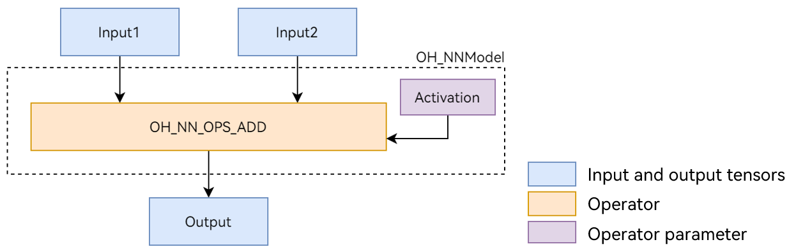

# Connecting the Neural Network Runtime to an AI Inference Framework

## When to Use

As a bridge between the AI inference engine and acceleration chip, the Neural Network Runtime provides simplified Native APIs for the AI inference engine to perform end-to-end inference through the acceleration chip.

This document uses the `Add` single-operator model shown in Figure 1 as an example to describe the development process of Neural Network Runtime. The `Add` operator involves two inputs, one parameter, and one output. Wherein, the `activation` parameter is used to specify the type of the activation function in the `Add` operator.

**Figure 1** Add single-operator model


## Preparing the Environment

### Environment Requirements

The environment requirements for the Neural Network Runtime are as follows:

- System version: OpenHarmony master branch.
- Development environment: Ubuntu 18.04 or later.
- Access device: a standard device running OpenHarmony. The built-in hardware accelerator driver has been connected to the Neural Network Runtime through an HDI API.

The Neural Network Runtime is opened to external systems through OpenHarmony Native APIs. Therefore, you need to use the Native development suite of the OpenHarmony to compile Neural Network Runtime applications. You can download the **ohos-sdk** package of the corresponding version from [Daily Build](http://ci.openharmony.cn/dailys/dailybuilds) in the OpenHarmony community and then decompress the package to obtain the Native development suite of the corresponding platform. Take Linux as an example. The package of the Native development suite is named `native-linux-{version number}.zip`.

### Environment Setup

1. Start the Ubuntu server.
2. Copy the downloaded package of the Native development suite to the root directory of the current user.
3. Decompress the package of the Native development suite.
```shell
unzip native-linux-{version number}.zip
```

The directory structure after decompression is as follows. The content in the directory may vary depending on version iteration. Use the Native APIs of the latest version.
```text
native/
─ ─ build // Cross-compilation toolchain
─ ─ build-tools // Compilation and build tools
├── docs
├── llvm
├── nativeapi_syscap_config.json
├── ndk_system_capability.json
├── NOTICE.txt
├── oh-uni-package.json
── sysroot // Native API header files and libraries
```
## Available APIs

This section describes the common APIs used in the development process of the Neural Network Runtime. 

### Structure

| Name| Description|
| --------- | ---- |
| typedef struct OH_NNModel OH_NNModel | Model handle of the Neural Network Runtime. It is used to construct a model.|
| typedef struct OH_NNCompilation OH_NNCompilation | Compiler handle of the Neural Network Runtime. It is used to compile an AI model.|
| typedef struct OH_NNExecutor OH_NNExecutor | Executor handle of the Neural Network Runtime. It is used to perform inference computing on a specified device.|

### Model Construction APIs

| Name| Description|
| ------- | --- |
| OH_NNModel_Construct() | Creates a model instance of the OH_NNModel type.|
| OH_NN_ReturnCode OH_NNModel_AddTensor(OH_NNModel *model, const OH_NN_Tensor *tensor) | Adds a tensor to a model instance.|
| OH_NN_ReturnCode OH_NNModel_SetTensorData(OH_NNModel *model, uint32_t index, const void *dataBuffer, size_t length) | Sets the tensor value.|
| OH_NN_ReturnCode OH_NNModel_AddOperation(OH_NNModel *model, OH_NN_OperationType op, const OH_NN_UInt32Array *paramIndices, const OH_NN_UInt32Array *inputIndices, const OH_NN_UInt32Array *outputIndices) | Adds an operator to a model instance.|
| OH_NN_ReturnCode OH_NNModel_SpecifyInputsAndOutputs(OH_NNModel *model, const OH_NN_UInt32Array *inputIndices, const OH_NN_UInt32Array *outputIndices) | Specifies the model input and output.|
| OH_NN_ReturnCode OH_NNModel_Finish(OH_NNModel *model) | Completes model composition.|
| void OH_NNModel_Destroy(OH_NNModel **model) | Destroys a model instance.|

### Model Compilation APIs

| Name| Description|
| ------- | --- |
| OH_NNCompilation *OH_NNCompilation_Construct(const OH_NNModel *model) | Creates a compilation instance of the OH_NNCompilation type.|
| OH_NN_ReturnCode OH_NNCompilation_SetDevice(OH_NNCompilation *compilation, size_t deviceID) | Specifies the device for model compilation and computing.|
| OH_NN_ReturnCode OH_NNCompilation_SetCache(OH_NNCompilation *compilation, const char *cachePath, uint32_t version) | Sets the cache directory and version of the compiled model.|
| OH_NN_ReturnCode OH_NNCompilation_Build(OH_NNCompilation *compilation) | Performs model compilation.|
| void OH_NNCompilation_Destroy(OH_NNCompilation **compilation) | Destroys the OH_NNCompilation instance.|

### Inference Execution APIs

| Name| Description|
| ------- | --- |
| OH_NNExecutor *OH_NNExecutor_Construct(OH_NNCompilation *compilation) | Creates an executor instance of the OH_NNExecutor type.|
| OH_NN_ReturnCode OH_NNExecutor_SetInput(OH_NNExecutor *executor, uint32_t inputIndex, const OH_NN_Tensor *tensor, const void *dataBuffer, size_t length) | Sets the single input data for a model.|
| OH_NN_ReturnCode OH_NNExecutor_SetOutput(OH_NNExecutor *executor, uint32_t outputIndex, void *dataBuffer, size_t length) | Sets the buffer for a single output of a model.|
| OH_NN_ReturnCode OH_NNExecutor_Run(OH_NNExecutor *executor) | Executes model inference.|
| void OH_NNExecutor_Destroy(OH_NNExecutor **executor) | Destroys the OH_NNExecutor instance to release the memory occupied by the instance.|

### Device Management APIs

| Name| Description|
| ------- | --- |
| OH_NN_ReturnCode OH_NNDevice_GetAllDevicesID(const size_t **allDevicesID, uint32_t *deviceCount) | Obtains the ID of the device connected to the Neural Network Runtime.|


## How to Develop

The development process of the Neural Network Runtime consists of three phases: model construction, model compilation, and inference execution. The following uses the `Add` single-operator model as an example to describe how to call Neural Network Runtime APIs during application development.

1. Create an application sample file.

    Create the source file of the Neural Network Runtime application sample. Run the following commands in the project directory to create the `nnrt_example/` directory and create the `nnrt_example.cpp` source file in the directory:

    ```shell
    mkdir ~/nnrt_example && cd ~/nnrt_example
    touch nnrt_example.cpp
    ```

2. Import the Neural Network Runtime module.

    Add the following code at the beginning of the `nnrt_example.cpp` file to import the Neural Network Runtime module:

    ```cpp
    #include <cstdint>
    #include <iostream>
    #include <vector>

    #include "neural_network_runtime/neural_network_runtime.h"

    // Constant, used to specify the byte length of the input and output data.
    const size_t DATA_LENGTH = 4 * 12;
    ```

3. Construct a model.

    Use Neural Network Runtime APIs to construct an `Add` single-operator sample model.

    ```cpp
    OH_NN_ReturnCode BuildModel(OH_NNModel** pModel)
    {
        // Create a model instance and construct a model.
        OH_NNModel* model = OH_NNModel_Construct();
        if (model == nullptr) {
            std::cout << "Create model failed." << std::endl;
            return OH_NN_MEMORY_ERROR;
        }

        // Add the first input tensor of the float32 type for the Add operator. The tensor shape is [1, 2, 2, 3].
        int32_t inputDims[4] = {1, 2, 2, 3};
        OH_NN_Tensor input1 = {OH_NN_FLOAT32, 4, inputDims, nullptr, OH_NN_TENSOR};
        OH_NN_ReturnCode ret = OH_NNModel_AddTensor(model, &input1);
        if (ret != OH_NN_SUCCESS) {
            std::cout << "BuildModel failed, add Tensor of first input failed." << std::endl;
            return ret;
        }

        // Add the second input tensor of the float32 type for the Add operator. The tensor shape is [1, 2, 2, 3].
        OH_NN_Tensor input2 = {OH_NN_FLOAT32, 4, inputDims, nullptr, OH_NN_TENSOR};
        ret = OH_NNModel_AddTensor(model, &input2);
        if (ret != OH_NN_SUCCESS) {
            std::cout << "BuildModel failed, add Tensor of second input failed." << std::endl;
            return ret;
        }

        // Add the Tensor parameter of the Add operator. This parameter is used to specify the type of the activation function. The data type of the Tensor parameter is int8.
        int32_t activationDims = 1;
        int8_t activationValue = OH_NN_FUSED_NONE;
        OH_NN_Tensor activation = {OH_NN_INT8, 1, &activationDims, nullptr, OH_NN_ADD_ACTIVATIONTYPE};
        ret = OH_NNModel_AddTensor(model, &activation);
        if (ret != OH_NN_SUCCESS) {
            std::cout << "BuildModel failed, add Tensor of activation failed." << std::endl;
            return ret;
        }

        // Set the type of the activation function to OH_NN_FUSED_NONE, indicating that no activation function is added to the operator.
        ret = OH_NNModel_SetTensorData(model, 2, &activationValue, sizeof(int8_t));
        if (ret != OH_NN_SUCCESS) {
            std::cout << "BuildModel failed, set value of activation failed." << std::endl;
            return ret;
        }

        // Set the output of the Add operator. The data type is float32 and the tensor shape is [1, 2, 2, 3].
        OH_NN_Tensor output = {OH_NN_FLOAT32, 4, inputDims, nullptr, OH_NN_TENSOR};
        ret = OH_NNModel_AddTensor(model, &output);
        if (ret != OH_NN_SUCCESS) {
            std::cout << "BuildModel failed, add Tensor of output failed." << std::endl;
            return ret;
        }

        // Specify the input, parameter, and output indexes of the Add operator.
        uint32_t inputIndicesValues[2] = {0, 1};
        uint32_t paramIndicesValues = 2;
        uint32_t outputIndicesValues = 3;
        OH_NN_UInt32Array paramIndices = {&paramIndicesValues, 1};
        OH_NN_UInt32Array inputIndices = {inputIndicesValues, 2};
        OH_NN_UInt32Array outputIndices = {&outputIndicesValues, 1};

        // Add the Add operator to the model instance.
        ret = OH_NNModel_AddOperation(model, OH_NN_OPS_ADD, &paramIndices, &inputIndices, &outputIndices);
        if (ret != OH_NN_SUCCESS) {
            std::cout << "BuildModel failed, add operation failed." << std::endl;
            return ret;
        }

        // Set the input and output indexes of the model instance.
        ret = OH_NNModel_SpecifyInputsAndOutputs(model, &inputIndices, &outputIndices);
        if (ret != OH_NN_SUCCESS) {
            std::cout << "BuildModel failed, specify inputs and outputs failed." << std::endl;
            return ret;
        }

        // Complete the model instance construction.
        ret = OH_NNModel_Finish(model);
        if (ret != OH_NN_SUCCESS) {
            std::cout << "BuildModel failed, error happened when finishing model construction." << std::endl;
            return ret;
        }

        *pModel = model;
        return OH_NN_SUCCESS;
    }
    ```

4. Query the acceleration chip connected to the Neural Network Runtime.

    The Neural Network Runtime can connect to multiple acceleration chips through HDI APIs. Before model compilation, you need to query the acceleration chips connected to the Neural Network Runtime on the current device. Each acceleration chip has a unique ID. In the compilation phase, you need to specify the chip for model compilation based on the device ID.
    ```cpp
    void GetAvailableDevices(std::vector<size_t>& availableDevice)
    {
        availableDevice.clear();

        // Obtain the available hardware ID.
        const size_t* devices = nullptr;
        uint32_t deviceCount = 0;
        OH_NN_ReturnCode ret = OH_NNDevice_GetAllDevicesID(&devices, &deviceCount);
        if (ret != OH_NN_SUCCESS) {
            std::cout << "GetAllDevicesID failed, get no available device." << std::endl;
            return;
        }

        for (uint32_t i = 0; i < deviceCount; i++) {
            availableDevice.emplace_back(devices[i]);
        }
    }
    ```

5. Compile a model on the specified device.

    The Neural Network Runtime uses abstract model expressions to describe the topology structure of an AI model. Before inference execution on an acceleration chip, the compilation module provided by Neural Network Runtime needs to deliver the abstract model expression to the chip driver layer and convert the abstract model expression into a format that supports inference and computing.
    ```cpp
    OH_NN_ReturnCode CreateCompilation(OH_NNModel* model, const std::vector<size_t>& availableDevice, OH_NNCompilation** pCompilation)
    {
        // Create a compilation instance to pass the model to the underlying hardware for compilation.
        OH_NNCompilation* compilation = OH_NNCompilation_Construct(model);
        if (compilation == nullptr) {
            std::cout << "CreateCompilation failed, error happended when creating compilation." << std::endl;
            return OH_NN_MEMORY_ERROR;
        }

        // Set compilation options, such as the compilation hardware, cache path, performance mode, computing priority, and whether to enable float16 low-precision computing.

        // Choose to perform model compilation on the first device.
        OH_NN_ReturnCode ret = OH_NNCompilation_SetDevice(compilation, availableDevice[0]);
        if (ret != OH_NN_SUCCESS) {
            std::cout << "CreateCompilation failed, error happened when setting device." << std::endl;
            return ret;
        }

        // Have the model compilation result cached in the /data/local/tmp directory, with the version number set to 1.
        ret = OH_NNCompilation_SetCache(compilation, "/data/local/tmp", 1);
        if (ret != OH_NN_SUCCESS) {
            std::cout << "CreateCompilation failed, error happened when setting cache path." << std::endl;
            return ret;
        }

        // Start model compilation.
        ret = OH_NNCompilation_Build(compilation);
        if (ret != OH_NN_SUCCESS) {
            std::cout << "CreateCompilation failed, error happened when building compilation." << std::endl;
            return ret;
        }

        *pCompilation = compilation;
        return OH_NN_SUCCESS;
    }
    ```

6. Create an executor.

    After the model compilation is complete, you need to call the execution module of the Neural Network Runtime to create an inference executor. In the execution phase, operations such as setting the model input, obtaining the model output, and triggering inference computing are performed through the executor.
    ```cpp
    OH_NNExecutor* CreateExecutor(OH_NNCompilation* compilation)
    {
        // Create an executor instance.
        OH_NNExecutor* executor = OH_NNExecutor_Construct(compilation);
        return executor;
    }
    ```

7. Perform inference computing and print the computing result.

    The input data required for inference computing is passed to the executor through the API provided by the execution module. This way, the executor is triggered to perform inference computing once to obtain the inference computing result.
    ```cpp
    OH_NN_ReturnCode Run(OH_NNExecutor* executor)
    {
        // Construct sample data.
        float input1[12] = {0, 1, 2, 3, 4, 5, 6, 7, 8, 9, 10, 11};
        float input2[12] = {11, 12, 13, 14, 15, 16, 17, 18, 19, 20, 21, 22};

        int32_t inputDims[4] = {1, 2, 2, 3};
        OH_NN_Tensor inputTensor1 = {OH_NN_FLOAT32, 4, inputDims, nullptr, OH_NN_TENSOR};
        OH_NN_Tensor inputTensor2 = {OH_NN_FLOAT32, 4, inputDims, nullptr, OH_NN_TENSOR};

        // Set the execution input.

        // Set the first input for execution. The input data is specified by input1.
        OH_NN_ReturnCode ret = OH_NNExecutor_SetInput(executor, 0, &inputTensor1, input1, DATA_LENGTH);
        if (ret != OH_NN_SUCCESS) {
            std::cout << "Run failed, error happened when setting first input." << std::endl;
            return ret;
        }

        // Set the second input for execution. The input data is specified by input2.
        ret = OH_NNExecutor_SetInput(executor, 1, &inputTensor2, input2, DATA_LENGTH);
        if (ret != OH_NN_SUCCESS) {
            std::cout << "Run failed, error happened when setting second input." << std::endl;
            return ret;
        }

        // Set the output data cache. After the OH_NNExecutor_Run instance performs inference computing, the output result is stored in the output.
        float output[12];
        ret = OH_NNExecutor_SetOutput(executor, 0, output, DATA_LENGTH);
        if (ret != OH_NN_SUCCESS) {
            std::cout << "Run failed, error happened when setting output buffer." << std::endl;
            return ret;
        }

        // Perform inference computing.
        ret = OH_NNExecutor_Run(executor);
        if (ret != OH_NN_SUCCESS) {
            std::cout << "Run failed, error doing execution." << std::endl;
            return ret;
        }

        // Print the output result.
        for (uint32_t i = 0; i < 12; i++) {
            std::cout << "Output index: " << i << ", value is: " << output[i] << "." << std::endl;
        }

        return OH_NN_SUCCESS;
    }
    ```

8. Build an end-to-end process from model construction to model compilation and execution.

    Steps 3 to 7 implement the model construction, compilation, and execution processes and encapsulates them into four functions to facilitate modular development. The following sample code shows how to concatenate the four functions into a complete Neural Network Runtime the development process.
    ```cpp
    int main()
    {
        OH_NNModel* model = nullptr;
        OH_NNCompilation* compilation = nullptr;
        OH_NNExecutor* executor = nullptr;
        std::vector<size_t> availableDevices;

        // Perform model construction.
        OH_NN_ReturnCode ret = BuildModel(&model);
        if (ret != OH_NN_SUCCESS) {
            std::cout << "BuildModel failed." << std::endl;
            OH_NNModel_Destroy(&model);
            return -1;
        }

        // Obtain the available devices.
        GetAvailableDevices(availableDevices);
        if (availableDevices.empty()) {
            std::cout << "No available device." << std::endl;
            OH_NNModel_Destroy(&model);
            return -1;
        }

        // Perform model compilation.
        ret = CreateCompilation(model, availableDevices, &compilation);
        if (ret != OH_NN_SUCCESS) {
            std::cout << "CreateCompilation failed." << std::endl;
            OH_NNModel_Destroy(&model);
            OH_NNCompilation_Destroy(&compilation);
            return -1;
        }

        // Create an inference executor for the model.
        executor = CreateExecutor(compilation);
        if (executor == nullptr) {
            std::cout << "CreateExecutor failed, no executor is created." << std::endl;
            OH_NNModel_Destroy(&model);
            OH_NNCompilation_Destroy(&compilation);
            return -1;
        }

        // Use the created executor to perform single-step inference computing.
        ret = Run(executor);
        if (ret != OH_NN_SUCCESS) {
            std::cout << "Run failed." << std::endl;
            OH_NNModel_Destroy(&model);
            OH_NNCompilation_Destroy(&compilation);
            OH_NNExecutor_Destroy(&executor);
            return -1;
        }

        // Destroy the model to release occupied resources.
        OH_NNModel_Destroy(&model);
        OH_NNCompilation_Destroy(&compilation);
        OH_NNExecutor_Destroy(&executor);

        return 0;
    }
    ```

## Verification

1. Prepare the compilation configuration file of the application sample.

    Create a `CMakeLists.txt` file, and add compilation configurations to the application sample file `nnrt_example.cpp`. The following is a simple example of the `CMakeLists.txt` file:
    ```text
    cmake_minimum_required(VERSION 3.16)
    project(nnrt_example C CXX)

    add_executable(nnrt_example
        ./nnrt_example.cpp
    )

    target_link_libraries(nnrt_example
        neural_network_runtime.z
    )
    ```

2. Compile the application sample.

    Create the **build/** directory in the current directory, and compile `nnrt\_example.cpp` in the **build/** directory to obtain the binary file `nnrt\_example`:
    ```shell
    mkdir build && cd build
    cmake -DCMAKE_TOOLCHAIN_FILE={Path of the cross-compilation tool chain }/build/cmake/ohos.toolchain.cmake -DOHOS_ARCH=arm64-v8a -DOHOS_PLATFORM=OHOS -DOHOS_STL=c++_static ..
    make
    ```

3. Push the application sample to the device for execution.
    ```shell
    # Push the `nnrt_example` obtained through compilation to the device, and execute it.
    hdc_std file send ./nnrt_example /data/local/tmp/.

    # Grant required permissions to the executable file of the test case.
    hdc_std shell "chmod +x /data/local/tmp/nnrt_example"

    # Execute the test case.
    hdc_std shell "/data/local/tmp/nnrt_example"
    ```

    If the execution is normal, information similar to the following is displayed:
    ```text
    Output index: 0, value is: 11.000000.
    Output index: 1, value is: 13.000000.
    Output index: 2, value is: 15.000000.
    Output index: 3, value is: 17.000000.
    Output index: 4, value is: 19.000000.
    Output index: 5, value is: 21.000000.
    Output index: 6, value is: 23.000000.
    Output index: 7, value is: 25.000000.
    Output index: 8, value is: 27.000000.
    Output index: 9, value is: 29.000000.
    Output index: 10, value is: 31.000000.
    Output index: 11, value is: 33.000000.
    ```

4. (Optional) Check the model cache.

    If the HDI service connected to the Neural Network Runtime supports the model cache function, you can find the generated cache file in the `/data/local/tmp` directory after the `nnrt_example` is executed successfully.

    > **NOTE**
    >
    > The IR graphs of the model need to be passed to the hardware driver layer, so that the HDI service compiles the IR graphs into a computing graph dedicated to hardware. The compilation process is time-consuming. The Neural Network Runtime supports the computing graph cache feature. It can cache the computing graphs compiled by the HDI service to the device storage. If the same model is compiled on the same acceleration chip next time, you can specify the cache path so that the Neural Network Runtime can directly load the computing graphs in the cache file, reducing the compilation time.

    Check the cached files in the cache directory.
    ```shell
    ls /data/local/tmp
    ```

    The command output is as follows:
    ```text
    # 0.nncache  cache_info.nncache
    ```

    If the cache is no longer used, manually delete the cache files.
    ```shell
    rm /data/local/tmp/*nncache
    ```

## Samples

The following sample is provided to help you understand how to connect a third-party AI inference framework to the Neural Network Runtime:
- [Development Guide for Connecting TensorFlow Lite to NNRt Delegate](https://gitee.com/openharmony/neural_network_runtime/tree/master/example/deep_learning_framework)
<!--no_check-->
