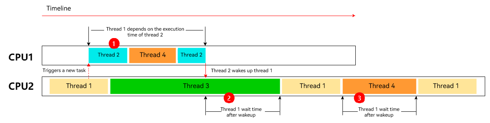
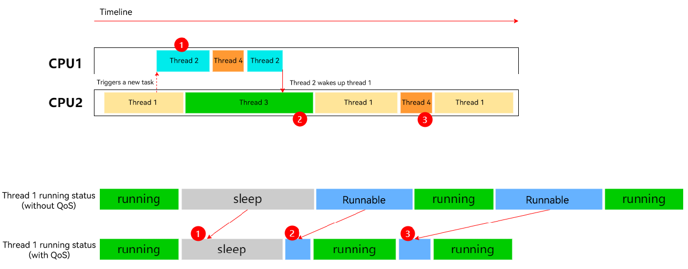

# QoS Development

## **Scenario**

In a multi-processor or multi-tasking OS, resources such as CPUs and memory are shared among processes or tasks. Proper scheduling ensures fair distribution of resources, fast system response, and optimal resource utilization. Prioritizing tasks of applications based on their importance can help the system better schedule tasks. This topic describes how to use the quality-of-service (QoS) feature and related APIs to adjust the running time of tasks in the OpenHarmony system.

You can customize the attributes for priority-based task scheduling based on the QoS feature.

## Basic Concepts

### QoS

In OpenHarmony, the QoS feature allows critical tasks to receive necessary resources to meet performance requirements. You can prioritize tasks with different QoS levels based on their importance. The system then arranges the running time and sequence of each task based on their QoS level. For example, when multiple tasks need to be executed in the system, the tasks with less interaction with users, such as the background download tasks, can be executed later than the tasks perceived by users, such as animation drawing.

### QoS Level
The system provides six QoS levels in ascending order based on the degree of system-user interaction.

| QoS Level                                                      | Application Scenario                                                        | Load                                                        |
| ------------------------------------------------------------ | ------------------------------------------------------------ | ------------------------------------------------------------ |
| QOS_BACKGROUND | Background tasks invisible to users, such as data synchronization and backup.| It takes several minutes or hours to complete the task.|
| QOS_UTILITY | Tasks that do not require immediate response, such as data download and import.| It takes several seconds or minutes to complete the task.|
| QOS_DEFAULT | Default level.| It takes a few seconds to complete the task.|
| QOS_USER_INITIATED | Tasks triggered by users with observable progress, for example, opening a file.| The task is completed in seconds.|
| QOS_DEADLINE_REQUEST | Tasks that require an immediate response, such as page loading.| The task is done immediately.|
| QOS_USER_INTERACTIVE	 | User interaction tasks (UI thread, interface refreshing, and animation).| The task is instant.|

The QoS level is specified by **QoS_Level**, which is an enum defined as follows:
### QoS_Level Declaration
```{.c}
typedef enum QoS_Level {
    /**
     * QoS level for background tasks, such as data synchronization.
     */
    QOS_BACKGROUND,
    /**
     * QoS level for tasks that do not require immediate response, such as download.
     */
    QOS_UTILITY,
    /**
     * Default QoS level.
     */
    QOS_DEFAULT,
    /**
     * QoS level for tasks triggered by users with observable progress, such as opening a file.
     */
    QOS_USER_INITIATED,
    /**
     * QoS level for tasks that require immediate response, such as page loading.
     */
    QOS_DEADLINE_REQUEST,
    /**
     * QoS level for user interaction tasks, such as animation drawing.
     */
    QOS_USER_INTERACTIVE,
} QoS_Level;

```

## Effect
A task with a higher QoS level is allocated more CPU time than a task with a lower QoS level.

The following shows how proper QoS accelerates application execution.

### Optimization of Thread Execution by QoS

**Before**



Thread 1 and thread 2 are two key threads of an application. During the running of thread 1, thread 2 is triggered. Then, thread 1 will be blocked until thread 2 is executed. Before the QoS levels of the two threads are marked, thread 3 and thread 4 take precedence over these two threads. The figure above illustrates the execution of thread 1 and thread 2 before QoS is used.

1. Thread 1 waits to be woken up by thread 2. However, thread 2 has a low priority and is always preempted for a long time. As a result, thread 1 sleeps for a long time.

2. Thread 1 also has a low priority and waits for a long period of time after being woken up.

3. Thread 1 has a low priority and is always preempted by other threads for a long period of time during running.

**After**



The figure above illustrates the thread execution after QoS levels are set for thread 1 and thread 2.

1. The ratio of thread 2 running time increases, which decreases the wait time of thread 1.

2. After thread 1 is woken up by thread 2, the wait time decreases.

3. The ratio of thread 1 running time increases, and the preemption proportion decreases.

### Optimization of the RN Framework by QoS
As indicated by the following table, the performance of the open-source benchmark test is improved by about 13% after the QoS levels are set for key threads in the RN framework.

| Scenario     | Test Environment| Total Rendering Time|
| ----------- | ----------- | ----------- |
| benchmark<br>1500view      | Without QoS      | 270.8 ms       |
| benchmark<br>1500view   | With QoS       | 236.6 ms       |

## Available APIs

| API                                                      | Description                                                        | Parameter                                                        | Return Value                                                        |
| ------------------------------------------------------------ | ------------------------------------------------------------ | ------------------------------------------------------------ | ------------------------------------------------------------ |
| OH_QoS_SetThreadQoS(QoS_Level level) | Sets the QoS level for this task.| QoS_Level level | **0** or **–1**|
| OH_QoS_ResetThreadQoS() | Removes the QoS level of this task.| N/A| **0** or **–1**|
| OH_QoS_GetThreadQoS(QoS_Level *level) | Obtains the QoS level of this task.| QoS_Level *level | **0** or **–1**|

### Constraints
* The QoS APIs can be used only for the current task.

## Function Description

### OH_QoS_SetThreadQoS

**Declaration**
```{.c}
int OH_QoS_SetThreadQoS(QoS_Level level);
```

**Parameters**

QoS_Level level
* QoS level to set.

Return Value
* Returns **0** if the operation is successful; returns **-1** otherwise.

**Description**

 Sets the QoS level for this task. You can mark the task with different QoS levels according to its importance, thereby achieving different scheduling priorities. For details, see [QoS Practice](https://developer.huawei.com/consumer/en/doc/best-practices/bpta-thread-priority-setting).

**Example**
```
#include <stdio.h>
#include "qos/qos.h"

int func()
{
    // Set the QoS level of this task to QOS_USER_INITIATED.
    int ret = OH_QoS_SetThreadQoS(QoS_Level::QOS_USER_INITIATED);
    
    if (!ret) { // If ret is 0, the operation is successful.
        printf("set QoS Success.");
    } else { // If ret is not 0, the operation fails.
        printf("set QoS failed.");
    }

    return 0;
}
```

### OH_QoS_ResetThreadQoS

**Declaration**
```{.c}
int OH_QoS_ResetThreadQoS();
```

**Parameters**
* N/A.

Return Value
* Returns **0** if the operation is successful; returns **-1** otherwise.

**Description**

 Removes the QoS level of this task. For details, see [QoS Practice](https://developer.huawei.com/consumer/en/doc/best-practices/bpta-thread-priority-setting).

**Example**
```
#include <stdio.h>
#include "qos/qos.h"

int func()
{
    // Remove the QoS level of this task.
    int ret = OH_QoS_ResetThreadQoS();
    
    if (!ret) { // If ret is 0, the operation is successful.
        printf("reset QoS Success.");
    } else { // If ret is not 0, the operation fails.
        printf("reset QoS failed.");
    }

    return 0;
}
```

### OH_QoS_GetThreadQoS

**Declaration**
```{.c}
int OH_QoS_GetThreadQoS(QoS_Level *level);
```

**Parameters**

QoS_Level *level
* Pointer to the QoS level of the task.

Return Value
* Returns **0** if the operation is successful; returns **-1** otherwise.

**Description**

Obtains the latest QoS level of this task. If no QoS level is set, **-1** is returned.  For details, see [QoS Practice](https://developer.huawei.com/consumer/en/doc/best-practices/bpta-thread-priority-setting).

**Example**
```
#include <stdio.h>
#include "qos/qos.h"

int func()
{
    // Obtain the QoS level of this task.
    QoS_Level level = QoS_Level::QOS_DEFAULT;
    int ret = OH_QoS_GetThreadQoS(&level);

    if (!ret) { // If ret is 0, the operation is successful.
        printf("get QoS level %d Success.", level);
    } else { // If ret is not 0, the operation fails.
        printf("get QoS level failed.");
    }

    return 0;
}
```

## How to Develop
The following walks you through on how to query and modify the QoS level of a task using Node-API interfaces.

### 1. Add the dynamic link library.
The QoS feature depends on the **libqos.so** library, which needs to be added to the compilation environment of the target application.

**Example**

If you use DevEco Studio to create a template NDK project, the **CMakeLists.txt** script is generated by default. Add the dependent dynamic link library to the script. The following is an example:

```txt
# Minimum version of CMake.
cmake_minimum_required(VERSION 3.4.1)
project(qos)

set(NATIVERENDER_ROOT_PATH ${CMAKE_CURRENT_SOURCE_DIR})

include_directories(${NATIVERENDER_ROOT_PATH}
                    ${NATIVERENDER_ROOT_PATH}/include)

add_library(entry SHARED hello.cpp)

# You can directly reference libqos.so because it is in the NDK of the link addressing path.
target_link_libraries(entry PUBLIC libqos.so)
```

### 2. Include the header file.

In the source code that uses the QoS feature, include the related header file.

```c
#include "qos/qos.h"
```

### 3. Call QoS APIs.

Use **OHQoSSetThreadQoS()** to set the QoS level for a task, use **OHQoSGetThreadQoS()** to obtain the QoS level set, and use **OHQoSResetThreadQoS()** to reset the QoS level to default.	
