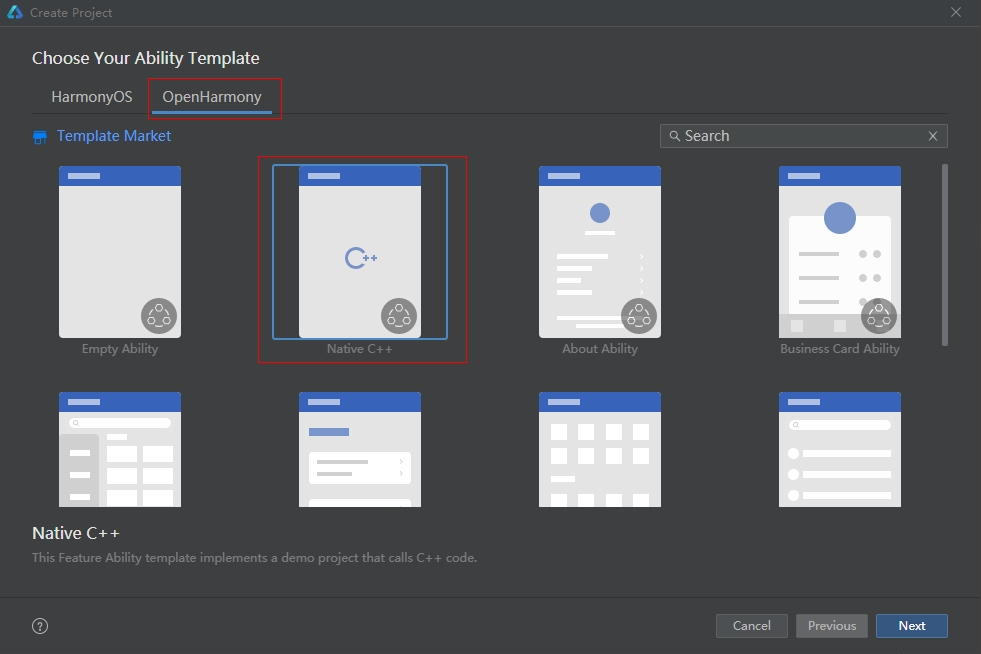

# Raw File Development

## When to Use

This document describes how to use native RawFile APIs to manage raw file directories and files in OpenHarmony. You can use the APIs to perform operations such as traversing a file list and opening, searching for, reading, and closing raw files. 
The APIs ended with **64** are new APIs. These APIs can be used to open rawfiles larger than 2 GB. For details, see [Rawfile](../reference/apis-localization-kit/capi-rawfile.md). The development procedure is the same for the API ended with **64** and the one does not. For example, you can use **OH_ResourceManager_OpenRawFile** and **OH_ResourceManager_OpenRawFile64** in the same way.

## Available APIs

| API                                                      | Description                                    |
| :----------------------------------------------------------- | :--------------------------------------- |
| NativeResourceManager *OH_ResourceManager_InitNativeResourceManager(napi_env env, napi_value jsResMgr) | Initializes the native resource manager.         |
| RawDir *OH_ResourceManager_OpenRawDir(const NativeResourceManager *mgr, const char *dirName) | Opens a raw file directory.                   |
| int OH_ResourceManager_GetRawFileCount(RawDir *rawDir)       | Obtains the number of raw files in a directory.|
| const char *OH_ResourceManager_GetRawFileName(RawDir *rawDir, int index) | Obtains the name of a raw file.                       |
| RawFile *OH_ResourceManager_OpenRawFile(const NativeResourceManager *mgr, const char *fileName) | Opens a raw file.                   |
| long OH_ResourceManager_GetRawFileSize(RawFile *rawFile)     | Obtains the size of a raw file.                   |
| int OH_ResourceManager_ReadRawFile(const RawFile *rawFile, void *buf, size_t length) | Reads a raw file.                   |
| void OH_ResourceManager_CloseRawFile(RawFile *rawFile)       | Closes a raw file to release resources.               |
| void OH_ResourceManager_CloseRawDir(RawDir *rawDir)          | Closes a raw file directory to release resources.               |
| bool OH_ResourceManager_GetRawFileDescriptor(const RawFile *rawFile, RawFileDescriptor &descriptor) | Obtains the file descriptor (FD) of a raw file.                       |
| void OH_ResourceManager_ReleaseNativeResourceManager(NativeResourceManager *resMgr) | Releases the native resource manager.   |
| bool OH_ResourceManager_IsRawDir(const NativeResourceManager *mgr, const char *path) | Checks whether a path is a subdirectory in the **rawfile** directory.   |

For details about the APIs, see [rawfile](../reference/apis-localization-kit/capi-rawfile.md).

## How to Develop

   The following uses the ArkTS as an example to describe how to obtain the rawfile list, rawfile content, rawfile descriptor (**fd**, **offset**, and **length**), and determine whether the path of a rawfile is a subdirectory in the **rawfile** directory.

1. Create a project on DevEco Studio.



2. Add dependencies.

After the project is created, the **cpp** directory is created in the project directory. In the **cpp** directory, there are files such as **libentry/index.d.ts**, **hello.cpp**, and **CMakeLists.txt**.

1. Open the **src/main/cpp/CMakeLists.txt** file, and add **librawfile.z.so** (rawfile dependency) and **libhilog_ndk.z.so** (log dependency) to **target_link_libraries**.

    ```c++
    target_link_libraries(entry PUBLIC libace_napi.z.so libhilog_ndk.z.so librawfile.z.so)
    ```

2. Open the **src/main/cpp/types/libentry/index.d.ts** file and declare the ArkTS APIs **getFileList**, **getRawFileContent**, **getRawFileDescriptor**, and **isRawDir** in this file.

    ```js
    import resourceManager from '@ohos.resourceManager';
    export const getFileList: (resmgr: resourceManager.ResourceManager, path: string) => Array<String>;
    export const getRawFileContent: (resmgr: resourceManager.ResourceManager, path: string) => Uint8Array;
    export const getRawFileDescriptor: (resmgr: resourceManager.ResourceManager, path: string) => resourceManager.RawFileDescriptor;
    export const isRawDir: (resmgr: resourceManager.ResourceManager, path: string) => boolean;
    ```

3. Modify the source file.

1. Open the **src/main/cpp/hello.cpp** file, and add the mapping between ArkTS APIs and C++ APIs in the **Init** method. The ArkTS APIs **getFileList**, **getRawFileContent**, **getRawFileDescriptor**, and **isRawDir** map to the C++ APIs **GetFileList**, **GetRawFileContent**, **GetRawFileDescriptor**, and **IsRawDir**, respectively.

    ```c++
    EXTERN_C_START
    static napi_value Init(napi_env env, napi_value exports)
    {
        napi_property_descriptor desc[] = {
            { "getFileList", nullptr, GetFileList, nullptr, nullptr, nullptr, napi_default, nullptr },
            { "getRawFileContent", nullptr, GetRawFileContent, nullptr, nullptr, nullptr, napi_default, nullptr },
            { "getRawFileDescriptor", nullptr, GetRawFileDescriptor, nullptr, nullptr, nullptr, napi_default, nullptr },
            { "isRawDir", nullptr, IsRawDir, nullptr, nullptr, nullptr, napi_default, nullptr }
        };

        napi_define_properties(env, exports, sizeof(desc) / sizeof(desc[0]), desc);
        return exports;
    }
    EXTERN_C_END
    ```
    <!-- @[module_registration](https://gitcode.com/openharmony/applications_app_samples/blob/master/code/DocsSample/ResourceManagement/RawFile/entry/src/main/cpp/hello.cpp) -->

2. Add the four C++ native APIs to the **src/main/cpp/hello.cpp** file.

    ```c++
    static napi_value GetFileList(napi_env env, napi_callback_info info)
    static napi_value GetRawFileContent(napi_env env, napi_callback_info info)
    static napi_value GetRawFileDescriptor(napi_env env, napi_callback_info info)
    static napi_value IsRawDir(napi_env env, napi_callback_info info)
    ```

3. Implement the four APIs in the **hello.cpp** file. Obtain the JS **resourceManager** object through the specified **env** and **info**, and convert it into the native **resourceManager** object. Then, you can call the APIs of the native **resourceManager** object to implement resource management. The sample code is as follows:
    
    Import the header files.
    ```c++
    #include <js_native_api.h>
    #include <js_native_api_types.h>
    #include <string>
    #include <vector>
    #include <cstdlib>
    #include "napi/native_api.h"
    #include "rawfile/raw_file_manager.h"
    #include "rawfile/raw_file.h"
    #include "rawfile/raw_dir.h"
    #include "hilog/log.h"
    ```
    <!-- @[includes](https://gitcode.com/openharmony/applications_app_samples/blob/master/code/DocsSample/ResourceManagement/RawFile/entry/src/main/cpp/hello.cpp) -->

    Declare the **DOMAIN** and **TAG** constants of HiLog.
    ```c++
    const int GLOBAL_RESMGR = 0xFF00;
    const char *TAG = "[Sample_rawfile]";
    ```
    <!-- @[constants](https://gitcode.com/openharmony/applications_app_samples/blob/master/code/DocsSample/ResourceManagement/RawFile/entry/src/main/cpp/hello.cpp) -->

    Examples:
    ```c++
    // Example 1: Use GetFileList to obtain the raw file list.
    static napi_value GetFileList(napi_env env, napi_callback_info info)
    {
        OH_LOG_Print(LOG_APP, LOG_INFO, GLOBAL_RESMGR, TAG, "NDKTest GetFileList Begin");
        size_t argc = 2;
        napi_value argv[2] = { nullptr };
        // Obtain arguments of the native API.
        napi_get_cb_info(env, info, &argc, argv, nullptr, nullptr);

        // argv[0] is the first parameter of the function, which is a JS resource object. The  OH_ResourceManager_InitNativeResourceManager function converts this JS resource object into a native object.
        NativeResourceManager *mNativeResMgr = OH_ResourceManager_InitNativeResourceManager(env, argv[0]);

        // Obtain argv[1], which specifies the relative path of the rawfile.
        size_t strSize;
        char strBuf[256];
        napi_get_value_string_utf8(env, argv[1], strBuf, sizeof(strBuf), &strSize);
        std::string dirName(strBuf, strSize);

        // Obtain the corresponding rawDir pointer object.
        RawDir* rawDir = OH_ResourceManager_OpenRawDir(mNativeResMgr, dirName.c_str());

        // Obtain the number of files and folders in rawDir.
        int count = OH_ResourceManager_GetRawFileCount(rawDir);

        // Traverse rawDir to obtain the list of file names and save it.
        std::vector<std::string> tempArray;
        for (int i = 0; i < count; i++) {
            std::string filename = OH_ResourceManager_GetRawFileName(rawDir, i);
            tempArray.emplace_back(filename);
        }

        // Convert the object to a JS array.
        napi_value fileList;
        napi_create_array(env, &fileList);
        for (size_t i = 0; i < tempArray.size(); i++) {
            napi_value jsString;
            napi_create_string_utf8(env, tempArray[i].c_str(), NAPI_AUTO_LENGTH, &jsString);
            napi_set_element(env, fileList, i, jsString);
        }

        // Close the rawDir pointer object.
        OH_ResourceManager_CloseRawDir(rawDir);
        OH_ResourceManager_ReleaseNativeResourceManager(mNativeResMgr);
        return fileList;
    }
    ```
    <!-- @[example_get_file_list](https://gitcode.com/openharmony/applications_app_samples/blob/master/code/DocsSample/ResourceManagement/RawFile/entry/src/main/cpp/hello.cpp) -->


    ```c++
    // Example 2: Use GetRawFileContent to obtain the content of the raw file.
    napi_value CreateJsArrayValue(napi_env env, std::unique_ptr<uint8_t[]> &data, long length)
    {
        // Create a JS ArrayBuffer object with external data.
        napi_value buffer;
        napi_status status = napi_create_external_arraybuffer(env, data.get(), length,
            [](napi_env env, void *data, void *hint) {
                delete[] static_cast<char*>(data);
            }, nullptr, &buffer);
        // Check whether the ArrayBuffer object is successfully created.
        if (status != napi_ok) {
            OH_LOG_Print(LOG_APP, LOG_ERROR, GLOBAL_RESMGR, TAG, "Failed to create external array buffer");
            return nullptr;
        }
        // Create a JS TypedArray object and bind it to the TypedArray object.
        napi_value result = nullptr;
        status = napi_create_typedarray(env, napi_uint8_array, length, buffer, 0, &result);
        if (status != napi_ok) {
            OH_LOG_Print(LOG_APP, LOG_ERROR, GLOBAL_RESMGR, TAG, "Failed to create media typed array");
            return nullptr;
        }
        data.release();
        return result;
    }

    static napi_value GetRawFileContent(napi_env env, napi_callback_info info)
    {
        OH_LOG_Print(LOG_APP, LOG_INFO, GLOBAL_RESMGR, TAG, "GetFileContent Begin");
        size_t argc = 2;
        napi_value argv[2] = { nullptr };
        // Obtain arguments of the native API.
        napi_get_cb_info(env, info, &argc, argv, nullptr, nullptr);

        // argv[0] is the first parameter of the function, which is a JS resource object. The  OH_ResourceManager_InitNativeResourceManager function converts this JS resource object into a native object.
        NativeResourceManager *mNativeResMgr = OH_ResourceManager_InitNativeResourceManager(env, argv[0]);
        size_t strSize;
        char strBuf[256];
        napi_get_value_string_utf8(env, argv[1], strBuf, sizeof(strBuf), &strSize);
        std::string filename(strBuf, strSize);

        // Obtain the raw file pointer object.
        RawFile *rawFile = OH_ResourceManager_OpenRawFile(mNativeResMgr, filename.c_str());
        if (rawFile != nullptr) {
            OH_LOG_Print(LOG_APP, LOG_INFO, GLOBAL_RESMGR, TAG, "OH_ResourceManager_OpenRawFile success");
        }
        // Obtain the size of the raw file and apply for memory.
        long len = OH_ResourceManager_GetRawFileSize(rawFile);
        std::unique_ptr<uint8_t[]> data = std::make_unique<uint8_t[]>(len);

        // Read all content of the raw file at a time.
        int res = OH_ResourceManager_ReadRawFile(rawFile, data.get(), len);

        // Close the rawDir pointer object.
        OH_ResourceManager_CloseRawFile(rawFile);
        OH_ResourceManager_ReleaseNativeResourceManager(mNativeResMgr);
        // Convert the native object to a JS object.
        return CreateJsArrayValue(env, data, len);
    }
    ```
    <!-- @[example_get_rawfile_content](https://gitcode.com/openharmony/applications_app_samples/blob/master/code/DocsSample/ResourceManagement/RawFile/entry/src/main/cpp/hello.cpp) -->


    ```c++
    // Example 3: Use GetRawFileDescriptor to obtain the FD of the raw file.
    // Define a function to convert RawFileDescriptor to a JS object.
    napi_value createJsFileDescriptor(napi_env env, RawFileDescriptor& descriptor)
    {
        // Create a JS object.
        napi_value result;
        napi_status status = napi_create_object(env, &result);
        if (status != napi_ok) {
            return result;
        }

        // Save df (file descriptor) to the result object.
        napi_value fd;
        status = napi_create_int32(env, descriptor.fd, &fd);
        if (status != napi_ok) {
            return result;
        }
        status = napi_set_named_property(env, result, "fd", fd);
        if (status != napi_ok) {
            return result;
        }

        // Save offset (file offset) to the result object.
        napi_value offset;
        status = napi_create_int64(env, descriptor.start, &offset);
        if (status != napi_ok) {
            return result;
        }
        status = napi_set_named_property(env, result, "offset", offset);
        if (status != napi_ok) {
            return result;
        }

        // Save length (file length) to the result object.
        napi_value length;
        status = napi_create_int64(env, descriptor.length, &length);
        if (status != napi_ok) {
            return result;
        }
        status = napi_set_named_property(env, result, "length", length);
        if (status != napi_ok) {
            return result;
        }
        return result;
    }

    static napi_value GetRawFileDescriptor(napi_env env, napi_callback_info info)
    {
        OH_LOG_Print(LOG_APP, LOG_INFO, GLOBAL_RESMGR, TAG, "NDKTest GetRawFileDescriptor Begin");
        size_t argc = 2;
        napi_value argv[2] = { nullptr };
        // Obtain arguments of the native API.
        napi_get_cb_info(env, info, &argc, argv, nullptr, nullptr);

        // argv[0] is the first parameter of the function, which is a JS resource object. The  OH_ResourceManager_InitNativeResourceManager function converts this JS resource object into a native object.
        NativeResourceManager *mNativeResMgr = OH_ResourceManager_InitNativeResourceManager(env, argv[0]);
        size_t strSize;
        char strBuf[256];
        napi_get_value_string_utf8(env, argv[1], strBuf, sizeof(strBuf), &strSize);
        std::string filename(strBuf, strSize);
        // Obtain the raw file pointer object.
        RawFile *rawFile = OH_ResourceManager_OpenRawFile(mNativeResMgr, filename.c_str());
        if (rawFile != nullptr) {
            OH_LOG_Print(LOG_APP, LOG_INFO, GLOBAL_RESMGR, TAG, "OH_ResourceManager_OpenRawFile success");
        }
        // Obtain the FD of the rawfile, that is, RawFileDescriptor {fd, offset, length}.
        RawFileDescriptor descriptor;
        OH_ResourceManager_GetRawFileDescriptor(rawFile, descriptor);
        // Close the rawDir pointer object.
        OH_ResourceManager_CloseRawFile(rawFile);
        OH_ResourceManager_ReleaseNativeResourceManager(mNativeResMgr);
        // Convert the native object to a JS object.
        return createJsFileDescriptor(env, descriptor);
    }
    ```
    <!-- @[example_get_rawfile_descriptor](https://gitcode.com/openharmony/applications_app_samples/blob/master/code/DocsSample/ResourceManagement/RawFile/entry/src/main/cpp/hello.cpp) -->


    ```c++
    // Example 4: Use IsRawDir to check whether the path is a subdirectory in the rawfile directory.
    napi_value CreateJsBool(napi_env env, bool &bValue)
    {
        napi_value jsValue = nullptr;
        if (napi_get_boolean(env, bValue, &jsValue) != napi_ok) {
            return nullptr;
        }
        return jsValue;
    }

    static napi_value IsRawDir(napi_env env, napi_callback_info info)
    {
        OH_LOG_Print(LOG_APP, LOG_INFO, GLOBAL_RESMGR, TAG, "NDKTest IsRawDir Begin");
        size_t argc = 2;
        napi_value argv[2] = { nullptr };
        // Obtain arguments of the native API.
        napi_get_cb_info(env, info, &argc, argv, nullptr, nullptr);

        // argv[0] is the first parameter of the function, which is a JS resource object. The  OH_ResourceManager_InitNativeResourceManager function converts this JS resource object into a native object.
        NativeResourceManager *mNativeResMgr = OH_ResourceManager_InitNativeResourceManager(env, argv[0]);

        napi_valuetype fileNameType;
        napi_typeof(env, argv[1], &fileNameType);
        if (fileNameType == napi_undefined || fileNameType == napi_null) {
            OH_LOG_Print(LOG_APP, LOG_ERROR, GLOBAL_RESMGR, TAG, "NDKTest file name is null");
            bool temp = false;
            return CreateJsBool(env, temp);
        }
        size_t strSize;
        char strBuf[256];
        napi_get_value_string_utf8(env, argv[1], strBuf, sizeof(strBuf), &strSize);
        std::string filename(strBuf, strSize);
        // Check whether the path is a subdirectory in the rawfile directory.
        bool result = OH_ResourceManager_IsRawDir(mNativeResMgr, filename.c_str());
        OH_ResourceManager_ReleaseNativeResourceManager(mNativeResMgr);
        return CreateJsBool(env, result);
    }
    ```
    <!-- @[example_is_raw_dir](https://gitcode.com/openharmony/applications_app_samples/blob/master/code/DocsSample/ResourceManagement/RawFile/entry/src/main/cpp/hello.cpp) -->

**4. Calling ArkTS APIs**

1. Open the **src\main\ets\pages\index.ets** file, and import **libentry.so**.

2. Obtain intra-package resources and cross-package resources within an application and cross-application package resources.<br>Call **context.resourceManager** to obtain a **resourceManager** object for intra-package resources within the application.<br>Call **context.createModuleContext().resourceManager** to obtain a **resourceManager** object for cross-package resources within the application.<!--Del--><br>Call **context.createModuleContext(bundleName: 'bundleName name', moduleName: 'module name').resourceManager** to obtain a **resourceManager** object for cross-application package resources. This API can be used only by system applications.<!--DelEnd--><br>For details about **Context**, see [Context (Stage Model)](../application-models/application-context-stage.md).
    
3. Call the APIs declared in **src/main/cpp/types/libentry/index.d.ts**. For example, call **getFileList** with the JS resource object and the relative path of the rawfile specified.

   Example: Obtain a **resourceManager** object for intra-package resources within the application.

	```js
	import { util } from '@kit.ArkTS';
	import { resourceManager } from '@kit.LocalizationKit';
	import testNapi from 'libentry.so'  // Import the libentry.so file.

	@Entry
	@Component
	struct Index {
	  @State message: string = 'Hello World';
	  private resMgr = this.getUIContext().getHostContext()?.resourceManager; // Obtain the resourceManager object for intra-package resources within the application.
	  @State rawfileListMsg: string = 'FileList = ';
	  @State retMsg: string = 'isRawDir = ';
	  @State rawfileContentMsg: string = 'RawFileContent = ';
	  @State rawfileDescriptorMsg: string = 'RawFileDescriptor.length = ';

	  build() {
		Row() {
		  Column() {
			Text(this.message)
			  .id('hello_world')
			  .fontSize(30)
			  .fontWeight(FontWeight.Bold)
			  .onClick(async () => {
				// Pass in the JS resource object and the relative path of the rawfile.
				let rawFileList: Array<String> = testNapi.getFileList(this.resMgr, '');
				this.rawfileListMsg = 'FileList = ' + rawFileList;
				console.log(this.rawfileListMsg);

				let ret: boolean = testNapi.isRawDir(this.resMgr, 'subrawfile');
				this.retMsg = 'isRawDir = ' + ret;
				console.log(this.retMsg);

				// Pass in the JS resource object and the relative path of the rawfile.
				let rawfileArray: Uint8Array = testNapi.getRawFileContent(this.resMgr, 'rawfile1.txt');
				// Convert Uint8Array to a string.
				let textDecoder: util.TextDecoder = new util.TextDecoder();
				let rawfileContent: string = textDecoder.decodeToString(rawfileArray);
				this.rawfileContentMsg = 'RawFileContent = ' + rawfileContent;
				console.log(this.rawfileContentMsg);

				// Pass in the JS resource object and the rawfile name.
				let rawfileDescriptor: resourceManager.RawFileDescriptor =
				  testNapi.getRawFileDescriptor(this.resMgr, 'rawfile1.txt');
				this.rawfileDescriptorMsg = 'RawFileDescriptor.length = ' + rawfileDescriptor.length;
				console.log(this.rawfileDescriptorMsg);
			  })
			Text(this.rawfileListMsg).id('get_file_list').fontSize(30);
			Text(this.retMsg).id('is_raw_dir').fontSize(30);
			Text(this.rawfileContentMsg).id('get_raw_file_content').fontSize(30);
			Text(this.rawfileDescriptorMsg).id('get_raw_file_descriptor').fontSize(30);
		  }
		  .width('100%')
		}
		.height('100%')
	  }
	}
	```
    <!-- @[native_rawfile_guide_sample](https://gitcode.com/openharmony/applications_app_samples/blob/master/code/DocsSample/ResourceManagement/RawFile/entry/src/main/ets/pages/Index.ets) -->

##  

 

- [Native Rawfile](https://gitcode.com/openharmony/applications_app_samples/tree/master/code/BasicFeature/Native/NdkRawfile)
