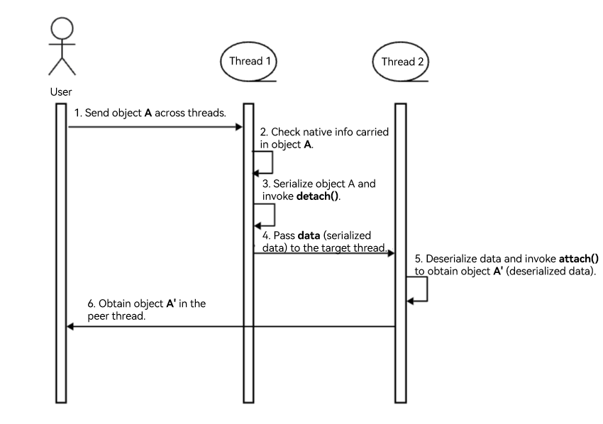

# Using Node-API Extension APIs

## Introduction

The Node-API [extension APIs](../reference/native-lib/napi.md) extends Node-API functionalities and provides APIs for creating custom ArkTS objects, which allows more flexible interaction between ArkTS and C/C++.

If you are just starting out with Node-API, see [Node-API Development Process](use-napi-process.md). The following demonstrates only the C++ and ArkTS code involved in the Node-API extension APIs.

## Module Loading

### Available APIs

| API| Description|
| -------- | -------- |
| napi_load_module | Loads an .abc file as a module. This API returns the namespace of the module. You can use it for the applications that need to dynamically load modules or resources in runtime.|
| napi_load_module_with_info | Loads a module. After the module is loaded, you can use **napi_get_property** to obtain the variables exported by the module or use **napi_get_named_property** to obtain the functions exported by the module. The **napi_load_module_with_info** API can be used in a [newly created ArkTS runtime environment](use-napi-ark-runtime.md).|
| napi_module_register | Registers a native module. Sometimes, you may need to implement certain functionalities using Node-API for better performance. You can use **napi_module_register** to customize the functionalities implemented using Node-API as a module and register it with ArkTS. This can improve the overall performance.|

### Example

#### napi_load_module

Use **napi_load_module** to [load a module in the main thread](use-napi-load-module.md).

#### napi_load_module_with_info

Use **napi_load_module_with_info** to [load a module](use-napi-load-module-with-info.md).

#### napi_module_register

Use **napi_module_register** to register a custom module, which is implemented by using Node-API, with the ArkTS environment.

CPP code:

```cpp
#include "napi/native_api.h"

// This module is a Node-API callback function.
static napi_value Add(napi_env env, napi_callback_info info)
{
    // Obtain the two parameters passed in.
    size_t requireArgc = 2;
    size_t argc = 2;
    napi_value args[2] = {nullptr};
    napi_get_cb_info(env, info, &argc, args , nullptr, nullptr);

    // Convert the parameter of the napi_value type to the double type.
    double valueLift;
    double valueRight;
    napi_get_value_double(env, args[0], &valueLift);
    napi_get_value_double(env, args[1], &valueRight);

    // Add up the converted double values, convert the sum into napi_value, and return the result to ArkTS.
    napi_value sum;
    napi_create_double(env, valueLift + valueRight, &sum);

    return sum;
}

// Call the C++ Init() function to initialize the addon, which associates the functions or properties in ArkTS with those in C++.
EXTERN_C_START
static napi_value Init(napi_env env, napi_value exports)
{
    // Use the napi_property_descriptor struct to define the properties to be exported and used in the Node-API module. napi_define_properties associates ArkTS properties with C++ functions so that they can be accessed and called from ArkTS.
    napi_property_descriptor desc[] = {
        { "add", nullptr, Add, nullptr, nullptr, nullptr, napi_default, nullptr }
    };
    napi_define_properties(env, exports, sizeof(desc) / sizeof(desc[0]), desc);
    return exports;
}
EXTERN_C_END

// The addon initialization is defined in a struct named demoModule, which contains the basic module information, such as the version number and registered functions.
static napi_module demoModule = {
    .nm_version =1,
    .nm_flags = 0,
    .nm_filename = nullptr,
    .nm_register_func = Init,
    .nm_modname = "entry",
    .nm_priv = ((void*)0),
    .reserved = { 0 },
};

// In the RegisterEntryModule function, the napi_module_register function is used to register and export the addon.
extern "C" __attribute__((constructor)) void RegisterEntryModule(void)
{
    napi_module_register(&demoModule);
}
```

API declaration:

```ts
// index.d.ts
export const add: (a: number, b: number) => number;
```

ArkTS code:

```ts
import hilog from '@ohos.hilog'
import testNapi from 'libentry.so'

hilog.info(0x0000, 'testTag', 'Test Node-API 2 + 3 = %{public}d', testNapi.add(2, 3));
```

## ArkTS Object Operations

### Available APIs

| API| Description|
| -------- | -------- |
| napi_create_object_with_properties | Creates an ArkTS object with the given **napi_property_descriptor** in a native module. The key in **napi_property_descriptor** must be a string and cannot be converted into a number.|
| napi_create_object_with_named_properties | Creates an ArkTS object with the given **napi_value** and key in a native module. The key must be a string and cannot be converted into a number.|

### Example

#### napi_create_object_with_properties

Use **napi_create_object_with_properties** to create an ArkTS object with the given **napi_property_descriptor**. The key of **napi_property_descriptor** must be a string and cannot be converted into a number.

CPP code:

```cpp
#include "napi/native_api.h"

static napi_value CreateObjectWithProperties(napi_env env, napi_callback_info info)
{
    size_t argc = 1;
    napi_value argv[1] = nullptr;
    // Obtain the parameters of the call.
    napi_get_cb_info(env, info, &argc, argv, nullptr, nullptr);
    // Declare a desc array in napi_property_descriptor. The desc array contains a property named "name", whose value is the first input parameter argv[0].
    napi_property_descriptor desc[] = {
        {"name", nullptr, nullptr, nullptr, nullptr, argv[0], napi_default_jsproperty, nullptr}};
    napi_value object = nullptr;
    // Call napi_create_object_with_properties to create an ArkTS object with the specified properties.
    napi_create_object_with_properties(env, &object, sizeof(desc) / sizeof(desc[0]), desc);
    napi_valuetype valueType;
    napi_typeof(env, object, &valueType);
    if (valueType == napi_object) {
        return object;
    }
}
```

API declaration:

```ts
// index.d.ts
export const createObjectWithProperties: (data: string) => Object;
```

ArkTS code:

```ts
import hilog from '@ohos.hilog'
import testNapi from 'libentry.so'

let value = testNapi.createObjectWithProperties('createObject');
hilog.info(0x0000, 'testTag', 'Node-API napi_create_object_with_properties:%{public}s', JSON.stringify(value));
```

#### napi_create_object_with_named_properties

Use **napi_create_object_with_named_properties** to create an ArkTS object with the specified **napi_value** and key. The key must be a string and cannot be converted into a number.

CPP code:

```cpp
#include "napi/native_api.h"

static napi_value CreateObjectWithNameProperties(napi_env env, napi_callback_info info)
{
    size_t argc = 1;
    napi_value argv[1] = nullptr;
    // Obtain the parameters of the call.
    napi_get_cb_info(env, info, &argc, argv, nullptr, nullptr);
    napi_value obj = nullptr;
    const char *key[] = {
        "name",
    };
    const napi_value values[] = {
        argv[0],
    };
    napi_property_descriptor desc[] = {{"name", nullptr, nullptr,
                                        nullptr, nullptr, nullptr, napi_default, nullptr}};
    napi_status status;
    status = napi_create_object_with_named_properties(env, &obj, sizeof(desc) / sizeof(desc[0]), key, values);
    if (status != napi_ok) {
        return argv[0];
    }
    return obj;
}
```

API declaration:

```ts
// index.d.ts
export const createObjectWithNameProperties: (data: string) => string | { name: string };
```

ArkTS code:

```ts
import hilog from '@ohos.hilog'
import testNapi from 'libentry.so'

let value = testNapi.createObjectWithNameProperties('ls');
hilog.info(0x0000, 'testTag', 'Node-API napi_create_object_with_named_properties:%{public}s', JSON.stringify(value));
```

## Runing an .abc File

### Available APIs

| API| Description|
| -------- | -------- |
| napi_run_script_path | Runs the specified .abc file.|

### Example

#### napi_run_script_path

Use **napi_run_script_path** to run an .abc file.

CPP code:

```cpp
#include "napi/native_api.h"

static napi_value RunScriptPath(napi_env env, napi_callback_info info)
{
    napi_value value = nullptr;
    // The .abc file in the rawfile directory of the application.
    const char *scriptPath = "/entry/resources/rawfile/test.abc";
    // Call napi_run_script_path to execute the file of the specified path.
    napi_status status = napi_run_script_path(env, scriptPath, &value);
    // Check whether the script execution is successful. If the execution fails, return false.
    napi_value returnValue = nullptr;
    if (value == nullptr || status != napi_ok) {
        napi_get_boolean(env, false, &returnValue);
    } else {
        napi_get_boolean(env, true, &returnValue);
    }
    return returnValue;
}
```

API declaration:

```ts
// index.d.ts
export const runScriptPath: () => boolean;
```

ArkTS code:

```ts
import hilog from '@ohos.hilog'
import testNapi from 'libentry.so'

try {
  // Return true is the script is executed successfully; return false otherwise.
  hilog.info(0x0000, 'testTag', 'Test Node-API napi_run_script_path: %{public}s', testNapi.runScriptPath());
} catch (error) {
  hilog.error(0x0000, 'testTag', 'Test Node-API napi_run_script_path errorMessage: %{public}s', error.message);
}
```

To compile JS code, **test.js** for example, into an .abc file, perform the following steps:

1. Place the **test.js** file in the **ets/build-tools/ets-loader/bin/ark/build-win/bin** directory of the SDK.
2. Run the **es2abc.exe test.js --output test.abc** command. The **test.abc** file is generated.

Save the file to the **/entry/resources/rawfile** directory.

```js
function add(a, b) {
  return a+b;
}
add(1, 2);
```

## Adding an Async Work with the Specified Priority to a Queue

### Available APIs

| API| Description|
| -------- | -------- |
| napi_queue_async_work_with_qos | Adds an async work object to the queue so that it can be scheduled for execution based on the QoS priority passed in.|

### Example

#### napi_queue_async_work_with_qos

Use **napi_queue_async_work_with_qos** to add an async work to the queue. Then, the async work will be scheduled for execution based on the specified QoS priority.

<!--Del-->
See [Prioritizing Asynchronous Tasks](../performance/develop-Native-modules-using-NAPI-safely-and-efficiently.md#prioritizing-asynchronous-tasks).
<!--DelEnd-->

## Binding an ArkTS Object and a Native Callback with Parameters

### Available APIs

| API| Description|
| -------- | -------- |
| napi_coerce_to_native_binding_object | Forcibly binds an ArkTS object and a native callback with necessary data. This API allows the ArkTS object to carry native information.|

### Example

#### napi_coerce_to_native_binding_object

Use **napi_coerce_to_native_binding_object** to bind an ArkTS object and a native callback with necessary data. This API allows the ArkTS object to carry native information.

CPP code:

```cpp
#include <bits/alltypes.h>
#include <mutex>
#include <unordered_set>
#include <uv.h>
#include "napi/native_api.h"

class Object {
public:
    Object() = default;
    ~Object() = default;

    static Object* GetInstance()
    {
        Object* instance = new Object();
        return instance;
    }

    static napi_value GetAddress(napi_env env, napi_callback_info info)
    {
        napi_value thisVar = nullptr;
        napi_get_cb_info(env, info, nullptr, nullptr, &thisVar, nullptr);
        if (thisVar == nullptr) {
            return nullptr;
        }
        void* object = nullptr;
        napi_unwrap(env, thisVar, &object);
        if (object == nullptr) {
            return nullptr;
        }
        uint64_t addressVal = reinterpret_cast<uint64_t>(object);
        napi_value address = nullptr;
        napi_create_bigint_uint64(env, addressVal, &address);
        return address;
    }

    // Obtain the array size.
    static napi_value GetSetSize(napi_env env, napi_callback_info info)
    {
        napi_value thisVar = nullptr;
        napi_get_cb_info(env, info, nullptr, nullptr, &thisVar, nullptr);
        if (thisVar == nullptr) {
            return nullptr;
        }
        void* object = nullptr;
        napi_unwrap(env, thisVar, &object);
        if (object == nullptr) {
            return nullptr;
        }
        std::lock_guard<std::mutex> lock(reinterpret_cast<Object*>(object)->numberSetMutex_);
        uint32_t setSize = reinterpret_cast<Object*>(object)->numberSet_.size();
        napi_value napiSize = nullptr;
        napi_create_uint32(env, setSize, &napiSize);
        return napiSize;
    }

    // Insert an element into the array.
    static napi_value Store(napi_env env, napi_callback_info info)
    {
        size_t argc = 1;
        napi_value args[1] = {nullptr};
        napi_value thisVar = nullptr;
        napi_get_cb_info(env, info, &argc, args, &thisVar, nullptr);
        if (argc != 1) {
            napi_throw_error(env, nullptr, "Store args number must be one.");
            return nullptr;
        }
        napi_valuetype type = napi_undefined;
        napi_typeof(env, args[0], &type);
        if (type != napi_number) {
            napi_throw_error(env, nullptr, "Store args is not number.");
            return nullptr;
        }
        if (thisVar == nullptr) {
            return nullptr;
        }
        uint32_t value = 0;
        napi_get_value_uint32(env, args[0], &value);
        void* object = nullptr;
        napi_unwrap(env, thisVar, &object);
        if (object == nullptr) {
            return nullptr;
        }
        std::lock_guard<std::mutex> lock(reinterpret_cast<Object*>(object)->numberSetMutex_);
        reinterpret_cast<Object *>(object)-> numberSet_.insert(value);
        return nullptr;
    }

    // Delete an element from the array.
    static napi_value Erase(napi_env env, napi_callback_info info)
    {
        size_t argc = 1;
        napi_value args[1] = {nullptr};
        napi_value thisVar = nullptr;
        napi_get_cb_info(env, info, &argc, args, &thisVar, nullptr);
        if (argc != 1) {
            napi_throw_error(env, nullptr, "Erase args number must be one.");
            return nullptr;
        }
        napi_valuetype type = napi_undefined;
        napi_typeof(env, args[0], &type);
        if (type != napi_number) {
            napi_throw_error(env, nullptr, "Erase args is not number.");
            return nullptr;
        }
        if (thisVar == nullptr) {
            return nullptr;
        }
        uint32_t value = 0;
        napi_get_value_uint32(env, args[0], &value);
        void* object = nullptr;
        napi_unwrap(env, thisVar, &object);
        if (object == nullptr) {
            return nullptr;
        }
        std::lock_guard<std::mutex> lock(reinterpret_cast<Object*>(object)->numberSetMutex_);
        reinterpret_cast<Object *>(object)->numberSet_.erase(value);
        return nullptr;
    }

    // Clear the array.
    static napi_value Clear(napi_env env, napi_callback_info info)
    {
        napi_value thisVar = nullptr;
        napi_get_cb_info(env, info, nullptr, nullptr, &thisVar, nullptr);
        if (thisVar == nullptr) {
            return nullptr;
        }
        void* object = nullptr;
        napi_unwrap(env, thisVar, &object);
        if (object == nullptr) {
            return nullptr;
        }
        std::lock_guard<std::mutex> lock(reinterpret_cast<Object*>(object)->numberSetMutex_);
        reinterpret_cast<Object *>(object)->numberSet_.clear();
        return nullptr;
    }

private:
    Object(const Object &) = delete;
    Object &operator=(const Object &) = delete;

    std::unordered_set<uint32_t> numberSet_{};
    std::mutex numberSetMutex_{};
};

void FinializeCallback(napi_env env, void *data, void *hint)
{
    return;
}

// Detach a callback. Generally, it is called in serialization to perform cleanup operations when the object is detached.
void* DetachCallback(napi_env env, void *value, void *hint)
{
    return value;
}

// Attach the callback, which is called during deserialization.
napi_value AttachCallback(napi_env env, void* value, void* hint)
{
    napi_value object = nullptr;
    napi_create_object(env, &object);
    napi_property_descriptor desc[] = {
        {"getAddress", nullptr, Object::GetAddress, nullptr, nullptr, nullptr, napi_default, nullptr},
        {"getSetSize", nullptr, Object::GetSetSize, nullptr, nullptr, nullptr, napi_default, nullptr},
        {"store", nullptr, Object::Store, nullptr, nullptr, nullptr, napi_default, nullptr},
        {"erase", nullptr, Object::Erase, nullptr, nullptr, nullptr, napi_default, nullptr},
        {"clear", nullptr, Object::Clear, nullptr, nullptr, nullptr, napi_default, nullptr}};
    napi_define_properties(env, object, sizeof(desc) / sizeof(desc[0]), desc);
    // Bind the ArkTS object named object to the lifecycle of the native object named value.
    napi_wrap(env, object, value, FinializeCallback, nullptr, nullptr);
    // Enable the ArkTS object to carry native information.
    napi_coerce_to_native_binding_object(env, object, DetachCallback, AttachCallback, value, hint);
    return object;
}

EXTERN_C_START
static napi_value Init(napi_env env, napi_value exports)
{
    napi_property_descriptor desc[] = {
        {"getAddress", nullptr, Object::GetAddress, nullptr, nullptr, nullptr, napi_default, nullptr},
        {"getSetSize", nullptr, Object::GetSetSize, nullptr, nullptr, nullptr, napi_default, nullptr},
        {"store", nullptr, Object::Store, nullptr, nullptr, nullptr, napi_default, nullptr},
        {"erase", nullptr, Object::Erase, nullptr, nullptr, nullptr, napi_default, nullptr},
        {"clear", nullptr, Object::Clear, nullptr, nullptr, nullptr, napi_default, nullptr}};
    napi_define_properties(env, exports, sizeof(desc) / sizeof(desc[0]), desc);
    auto object = Object::GetInstance();
    napi_wrap(env, exports, reinterpret_cast<void*>(object), FinializeCallback, nullptr, nullptr);
    napi_coerce_to_native_binding_object(env, exports, DetachCallback, AttachCallback, reinterpret_cast<void*>(object),
                                         nullptr);
    return exports;
}
EXTERN_C_END

static napi_module demoModule = {
    .nm_version = 1,
    .nm_flags = 0,
    .nm_filename = nullptr,
    .nm_register_func = Init,
    .nm_modname = "entry",
    .nm_priv = ((void*)0),
    .reserved = { 0 },
};

extern "C" __attribute__((constructor)) void RegisterEntryModule(void)
{
    napi_module_register(&demoModule);
}
```

API declaration:

```ts
// index.d.ts
export const getAddress: () => number;
export const getSetSize: () => number;
export const store: (a: number) => void;
export const erase: (a: number) => void;
export const clear: () => void;
```

ArkTS code:

```ts
// index.ets
import testNapi from 'libentry.so';
import taskpool from '@ohos.taskpool';

@Concurrent
function getAddress() {
  let address: number = testNapi.getAddress();
  console.info("taskpool:: address is " + address);
}

@Concurrent
function store(a:number, b:number, c:number) {
  let size:number = testNapi.getSetSize();
  console.info("set size is " + size + " before store");
  testNapi.store(a);
  testNapi.store(b);
  testNapi.store(c);
  size = testNapi.getSetSize();
  console.info("set size is " + size + " after store");
}

@Concurrent
function erase(a:number) {
  let size:number = testNapi.getSetSize();
  console.info("set size is " + size + " before erase");
  testNapi.erase(a);
  size = testNapi.getSetSize();
  console.info("set size is " + size + " after erase");
}

@Concurrent
function clear() {
  let size:number = testNapi.getSetSize();
  console.info("set size is " + size + " before clear");
  testNapi.clear();
  size = testNapi.getSetSize();
  console.info("set size is " + size + " after clear");
}

let address:number = testNapi.getAddress();
console.info("host thread address is " + address);

let task1 = new taskpool.Task(getAddress);
await taskpool.execute(task1);

let task2 = new taskpool.Task(store, 1, 2, 3);
await taskpool.execute(task2);

let task3 = new taskpool.Task(store, 4, 5, 6);
await taskpool.execute(task3);

let task4 = new taskpool.Task(erase, 3);
await taskpool.execute(task4);

let task5 = new taskpool.Task(erase, 5);
await taskpool.execute(task5);

let task6 = new taskpool.Task(clear);
await taskpool.execute(task6);
```

**NOTE**

Call **napi_coerce_to_native_binding_object** to add the **detach()** and **attach()** callbacks and native object information to ArkTs object A, and then pass object A across threads. Object A needs to be serialized and deserialized when passed cross threads. In thread 1, "data" is obtained after object A is serialized, and the **detach()** callback is invoked in the serialization process. Then, "data" is passed to thread 2 and deserialized in thread 2. The **attach()** callback is invoked to obtain the ArkTS object A'.


## Event Loop

### Available APIs

| API| Description|
| -------- | -------- |
| napi_run_event_loop | Runs an underlying event loop.|
| napi_stop_event_loop | Stops an underlying event loop.|

### Example

#### napi_run_event_loop, napi_stop_event_loop

See [Running or Stopping an Event Loop in an Asynchronous Thread Using Node-API Extensions](use-napi-event-loop.md)

## ArkTS Runtime Environment

### Available APIs

| API| Description|
| -------- | -------- |
| napi_create_ark_runtime | Creates an ArkTS runtime environment.|
| napi_destroy_ark_runtime | Destroys the ArkTS runtime environment.|

### Example

#### napi_create_ark_runtime, napi_destroy_ark_runtime

See [Creating an ArkTs Runtime Environment Using Node-API](use-napi-ark-runtime.md).

## Serialization and Deserialization

### Available APIs

| API| Description|
| -------- | -------- |
| napi_serialize | Converts an ArkTS object into native data. <br>The first parameter **env** indicates the ArkTS environment where the API is executed. The second parameter **object** indicates the ArkTS object to be serialized. The third parameter **transfer_list** indicates an array that holds the **arrayBuffer** to be passed. This parameter can be set to **undefined** if there is no data to be passed. The fourth parameter **clone_list** indicates an array that holds the sendable object to be cloned. This parameter can be set to **undefined** if there is no data to be cloned. The fifth parameter **result** indicates the serialized data obtained.|
| napi_deserialize | Converts native data into an ArkTS object. The first parameter **env** indicates the ArkTS environment where the API is executed. The second parameter **buffer** indicates the data to be deserialized. The third parameter **object** indicates the deserialized data obtained.|
| napi_delete_serialization_data | Deletes serialized data.|

### Example

#### napi_serialize, napi_deserialize, napi_delete_serialization_data

Use **napi_serialize** to convert an ArkTS object into native data; use **napi_deserialize** to convert native data into an ArkTS object; use napi_delete_serialization_data to delete serialized data.

CPP code:

```cpp
#include "napi/native_api.h"

static napi_value AboutSerialize(napi_env env, napi_callback_info info)
{
    // Obtain an ArkTS object as a parameter.
    size_t argc = 1;
    napi_value args[1] = {nullptr};
    napi_get_cb_info(env, info, &argc, args, nullptr, nullptr);
    napi_value undefined = nullptr;
    // Construct the parameters required by the napi_serialize method.
    napi_get_undefined(env, &undefined);
    void *data = nullptr;
    // Call napi_serialize to convert the ArkTS object into native data.
    napi_status status = napi_serialize(env, args[0], undefined, undefined, &data);
    if (status != napi_ok ||data == nullptr) {
        napi_throw_error(env, nullptr, "Node-API napi_serialize fail");
        return nullptr;
    }
    // Construct data of the napi_value type to hold the ArkTS object converted from the native data.
    napi_value result = nullptr;
    napi_deserialize(env, data, &result);
    napi_value number = nullptr;
    // Obtain the value of the numKey property in the ArkTS object converted from native data.
    napi_get_named_property(env, result, "numKey", &number);
    // Check whether the obtained property value is of the number type.
    napi_valuetype valuetype;
    napi_typeof(env, number, &valuetype);
    if (valuetype != napi_number) {
        napi_throw_error(env, nullptr, "Node-API Wrong type of argment. Expects a number.");
        return nullptr;
    }
    // Call napi_delete_serialization_data to delete the serialized data.
    napi_delete_serialization_data(env, data);
    // Return the obtained property value.
    return number;
}
```

API declaration:

```ts
// index.d.ts
export const aboutSerialize: (obj: Object) => number;
```

ArkTS code:

```ts
import hilog from '@ohos.hilog'
import testNapi from 'libentry.so'
class Obj {
  numKey:number = 0;
}
let obj: Obj = { numKey: 500 };
hilog.info(0x0000, 'testTag', ' Node-API aboutSerialize: %{public}d', testNapi.aboutSerialize(obj));
```

## Passing a Task from an Asynchronous Thread to an ArkTS Thread

### Available APIs

| API| Description|
| -------- | -------- |
| napi_call_threadsafe_function_with_priority | Calls a task with the specified priority and enqueuing mode into the ArkTS main thread.|

### Example

#### napi_call_threadsafe_function_with_priority

See [Passing a Task with the Specified Priority to an ArkTS Thread from an Asynchronous Thread Using Node-API](use-call-threadsafe-function-with-priority.md).

## Sendable-related Operations

### Available APIs

| API                      | Description                              |
| -------------------------- | ---------------------------------- |
| napi_is_sendable           | Checks whether an ArkTS value is sendable.|
| napi_define_sendable_class | Creates a sendable class.              |
| napi_create_sendable_object_with_properties | Creates a sendable object with the given **napi_property_descriptor**.|
| napi_create_sendable_array | Creates a sendable array.|
| napi_create_sendable_array_with_length | Creates a sendable array of the specified length.|
| napi_create_sendable_arraybuffer | Creates a sendable **ArrayBuffer**.|
| napi_create_sendable_typedarray | Creates a sendable **TypedArray**.|
| napi_wrap_sendable | Wraps a native instance into an ArkTS object.|
| napi_wrap_sendable_with_size | Wraps a native instance of the specified size into an ArkTS object.|
| napi_unwrap_sendable | Unwraps the native instance from an ArkTS object.|
| napi_remove_wrap_sendable | Removes the native instance from an ArkTS object.|

### Example

#### napi_is_sendable

Use **napi_is_sendable** to check whether an ArkTS value is sendable.

CPP code:

```cpp
#include "napi/native_api.h"

static napi_value IsSendable(napi_env env, napi_callback_info info) {
    size_t argc = 1;
    napi_value args[1] = {nullptr};
    napi_get_cb_info(env, info, &argc, args, nullptr, nullptr);
    bool isSendable = false;
    napi_is_sendable(env, args[0], &isSendable);
    napi_value result;
    napi_get_boolean(env, isSendable, &result);
    return result;
}
```

API declaration:

```ts
// index.d.ts
export const isSendable: <T>(a: T) => boolean;
```

ArkTS code:

```ts
import hilog from '@ohos.hilog'
import testNapi from 'libentry.so'

let value = testNapi.isSendable('createObject');
hilog.info(0x0000, 'testTag', 'Node-API napi_is_sendable: %{public}s', JSON.stringify(value));
```

#### napi_define_sendable_class

Use **napi_define_sendable_class** to create a sendable class.

CPP code:

```cpp
#include "napi/native_api.h"

static napi_value func(napi_env env, napi_callback_info info) {
    napi_value val;
    napi_create_string_utf8(env, "func result", NAPI_AUTO_LENGTH, &val);
    return val;
}

static napi_value DefineSendableClass(napi_env env) {
    napi_value str;
    napi_create_string_utf8(env, "str", NAPI_AUTO_LENGTH, &str);

    napi_property_descriptor props[] = {
        {"staticStr", nullptr, nullptr, nullptr, nullptr, str,
         static_cast<napi_property_attributes>(napi_static | napi_writable), nullptr},
        {"staticFunc", nullptr, func, nullptr, nullptr, nullptr, napi_static, nullptr},
        {"str", nullptr, nullptr, nullptr, nullptr, str, static_cast<napi_property_attributes>(1 << 9 | napi_writable),
         nullptr},
        {"func", nullptr, nullptr, nullptr, nullptr, nullptr,
         static_cast<napi_property_attributes>(1 << 11 | napi_writable), nullptr},
    };

    napi_value sendableClass = nullptr;
    napi_define_sendable_class(
        env, "SendableClass", NAPI_AUTO_LENGTH,
        [](napi_env env, napi_callback_info info) -> napi_value {
            napi_value thisVar = nullptr;
            napi_get_cb_info(env, info, nullptr, nullptr, &thisVar, nullptr);
            napi_value str;
            napi_create_string_utf8(env, "instance str", NAPI_AUTO_LENGTH, &str);
            napi_property_descriptor props[] = {
                {"str", nullptr, nullptr, nullptr, nullptr, str, napi_default, nullptr},
                {"func", nullptr, func, nullptr, nullptr, nullptr, napi_default, nullptr},
            };
            napi_define_properties(env, thisVar, sizeof(props) / sizeof(props[0]), props);
            return thisVar;
        },
        nullptr, sizeof(props) / sizeof(props[0]), props, nullptr, &sendableClass);

    return sendableClass;
}
```

API declaration:

```ts
// index.d.ts
@Sendable
export class SendableClass {
  static staticStr: string;
  static staticFunc(): string;
  str: string;
  func(): string;
}
```

ArkTS code:

```ts
import hilog from '@ohos.hilog'
import testNapi from 'libentry.so'

let value = new testNapi.SendableClass();
hilog.info(0x0000, 'testTag', 'Node-API napi_define_sendable_class: %{public}s', value.str);
```

#### napi_create_sendable_object_with_properties

Use **napi_create_sendable_object_with_properties** to create a sendable object with the given **napi_property_descriptor**.

CPP code:

```cpp
#include "napi/native_api.h"

static napi_value GetSendableObject(napi_env env, napi_callback_info info) {
    napi_value val_true;
    napi_get_boolean(env, true, &val_true);
    napi_property_descriptor desc1[] = {
        {"x", nullptr, nullptr, nullptr, nullptr, val_true, napi_default_jsproperty, nullptr},
    };
    napi_value obj;
    napi_create_sendable_object_with_properties(env, 1, desc1, &obj);
    return obj;
}
```

API declaration:

```ts
// index.d.ts
export const getSendableObject: () => { x: true };
```

ArkTS code:

```ts
import hilog from '@ohos.hilog'
import testNapi from 'libentry.so'

let value = testNapi.getSendableObject();
hilog.info(0x0000, 'testTag', 'Node-API napi_create_sendable_object_with_properties: %{public}s', JSON.stringify(value));
```

#### napi_create_sendable_array

Use **napi_create_sendable_array** to create a sendable array.

CPP code:

```cpp
#include "napi/native_api.h"

static napi_value GetSendableArray(napi_env env, napi_callback_info info) {
    napi_value result = nullptr;
    napi_create_sendable_array(env, &result);
    return result;
}
```

API declaration:

```ts
// index.d.ts
export const getSendableArray: () => [];
```

ArkTS code:

```ts
import hilog from '@ohos.hilog'
import testNapi from 'libentry.so'

let value = testNapi.getSendableArray();
hilog.info(0x0000, 'testTag', 'Node-API napi_create_sendable_array: %{public}s', JSON.stringify(value));
```

#### napi_create_sendable_array_with_length

Use **napi_create_sendable_array_with_length** to create a sendable array of the specified length.

CPP code:

```cpp
static napi_value GetSendableArrayWithLength(napi_env env, napi_callback_info info) {
    napi_value result = nullptr;
    napi_create_sendable_array_with_length(env, 1, &result);
    return result;
}
```

API declaration:

```ts
// index.d.ts
export const getSendableArrayWithLength: () => [];
```

ArkTS code:

```ts
import hilog from '@ohos.hilog'
import testNapi from 'libentry.so'

let value = testNapi.getSendableArrayWithLength();
hilog.info(0x0000, 'testTag', 'Node-API napi_create_sendable_array_with_length: %{public}s', JSON.stringify(value.length));
```

#### napi_create_sendable_arraybuffer

Use **napi_create_sendable_arraybuffer** to create a sendable **ArrayBuffer**.

CPP code:

```cpp
#include "napi/native_api.h"
#include "hilog/log.h"

static napi_value GetSendableArrayBuffer(napi_env env, napi_callback_info info) {
    static size_t LENGTH = 1024;
    void *data;
    napi_value result = nullptr;
    napi_create_sendable_arraybuffer(env, LENGTH, &data, &result);
    bool isArrayBuffer = false;
    napi_is_arraybuffer(env, result, &isArrayBuffer);
    OH_LOG_INFO(LOG_APP, "isArrayBuffer: %{public}d", isArrayBuffer);
    return result;
}
```

API declaration:

```ts
// index.d.ts
export const getSendableArrayBuffer: () => void;
```

ArkTS code:

```ts
import hilog from '@ohos.hilog'
import testNapi from 'libentry.so'

testNapi.getSendableArrayBuffer();
```

#### napi_create_sendable_typedarray

Use **napi_create_sendable_typedarray** to create a sendable **TypedArray**.

CPP code:

```cpp
#include "napi/native_api.h"
#include "hilog/log.h"

static napi_value GetSendableTypedArray(napi_env env, napi_callback_info info) {
    static size_t LENGTH = 1024;
    static size_t OFFSET = 0;
    void *data;
    napi_value arraybuffer = nullptr;
    napi_create_sendable_arraybuffer(env, LENGTH, &data, &arraybuffer);

    napi_value result = nullptr;
    napi_create_sendable_typedarray(env, napi_uint8_array, LENGTH, arraybuffer, OFFSET, &result);
    bool isTypedArray = false;
    napi_is_typedarray(env, result, &isTypedArray);
    OH_LOG_INFO(LOG_APP, "isTypedArray: %{public}d", isTypedArray);
    return result;
}
```

API declaration:

```ts
// index.d.ts
export const getSendableTypedArray: () => void;
```

ArkTS code:

```ts
import hilog from '@ohos.hilog'
import testNapi from 'libentry.so'

testNapi.getSendableTypedArray();
```

#### napi_wrap_sendable

Use **napi_wrap_sendable** to wrap a native instance into an ArkTS object.

CPP code:

```cpp
#include "napi/native_api.h"

static napi_value WrapSendable(napi_env env, napi_callback_info info) {
    napi_value val_true;
    napi_get_boolean(env, true, &val_true);
    napi_property_descriptor desc1[] = {
        {"x", nullptr, nullptr, nullptr, nullptr, val_true, napi_default_jsproperty, nullptr},
    };
    napi_value obj;
    napi_create_sendable_object_with_properties(env, 1, desc1, &obj);

    const char* testStr = "test";
    napi_wrap_sendable(env, obj, (void*)testStr, [](napi_env env, void* data, void* hint) {}, nullptr);
    
    return nullptr;
}
```

API declaration:

```ts
// index.d.ts
export const wrapSendable: () => void;
```

ArkTS code:

```ts
import hilog from '@ohos.hilog'
import testNapi from 'libentry.so'

testNapi.wrapSendable();
```

#### napi_wrap_sendable_with_size

Use **napi_wrap_sendable_with_size** to wrap a native instance of the specified size into an ArkTS object.

CPP code:

```cpp
#include "napi/native_api.h"

static napi_value WrapSendableWithSize(napi_env env, napi_callback_info info) {
    napi_value val_true;
    napi_get_boolean(env, true, &val_true);
    napi_property_descriptor desc1[] = {
        {"x", nullptr, nullptr, nullptr, nullptr, val_true, napi_default_jsproperty, nullptr},
    };
    napi_value obj;
    napi_create_sendable_object_with_properties(env, 1, desc1, &obj);

    const char* testStr = "test";
    napi_wrap_sendable_with_size(env, obj, (void*)testStr, [](napi_env env, void* data, void* hint) {}, nullptr, 100);
    
    return nullptr;
}
```

API declaration:

```ts
// index.d.ts
export const wrapSendableWithSize: () => void;
```

ArkTS code:

```ts
import hilog from '@ohos.hilog'
import testNapi from 'libentry.so'

testNapi.wrapSendableWithSize();
```

#### napi_unwrap_sendable

Use **napi_unwrap_sendable** to unwrap the native instance from an ArkTS object.

CPP code:

```cpp
#include "napi/native_api.h"

static napi_value UnwrapSendable(napi_env env, napi_callback_info info) {
    napi_value val_true;
    napi_get_boolean(env, true, &val_true);
    napi_property_descriptor desc1[] = {
        {"x", nullptr, nullptr, nullptr, nullptr, val_true, napi_default_jsproperty, nullptr},
    };
    napi_value obj;
    napi_create_sendable_object_with_properties(env, 1, desc1, &obj);

    const char* testStr = "test";
    napi_wrap_sendable(env, obj, (void*)testStr, [](napi_env env, void* data, void* hint) {}, nullptr);

    char* tmpTestStr = nullptr;
    napi_unwrap_sendable(env, obj, (void**)&tmpTestStr);
    OH_LOG_INFO(LOG_APP, "native value is %{public}s", tmpTestStr);
    
    return nullptr;
}
```

API declaration:

```ts
// index.d.ts
export const unwrapSendable: () => void;
```

ArkTS code:

```ts
import hilog from '@ohos.hilog'
import testNapi from 'libentry.so'

testNapi.unwrapSendable();
```

#### napi_remove_wrap_sendable

Use **napi_remove_wrap_sendable** to remove the native instance from an ArkTS object.

CPP code:

```cpp
#include "napi/native_api.h"

static napi_value RemoveWrapSendable(napi_env env, napi_callback_info info) {
    napi_value val_true;
    napi_get_boolean(env, true, &val_true);
    napi_property_descriptor desc1[] = {
        {"x", nullptr, nullptr, nullptr, nullptr, val_true, napi_default_jsproperty, nullptr},
    };
    napi_value obj;
    napi_create_sendable_object_with_properties(env, 1, desc1, &obj);

    const char* testStr = "test";
    napi_wrap_sendable(env, obj, (void*)testStr, [](napi_env env, void* data, void* hint) {}, nullptr);

    char* tmpTestStr = nullptr;
    napi_remove_wrap_sendable(env, obj, (void**)&tmpTestStr);
    OH_LOG_INFO(LOG_APP, "native value is %{public}s", tmpTestStr);
    
    return nullptr;
}
```

API declaration:

```ts
// index.d.ts
export const removeWrapSendable: () => void;
```

ArkTS code:

```ts
import hilog from '@ohos.hilog'
import testNapi from 'libentry.so'

testNapi.removeWrapSendable();
```

To print logs in the native CPP, add the following information to the **CMakeLists.txt** file and add the header file by using **#include "hilog/log.h"**.

```text
// CMakeLists.txt
add_definitions( "-DLOG_DOMAIN=0xd0d0" )
add_definitions( "-DLOG_TAG=\"testTag\"" )
target_link_libraries(entry PUBLIC libhilog_ndk.z.so)
```
