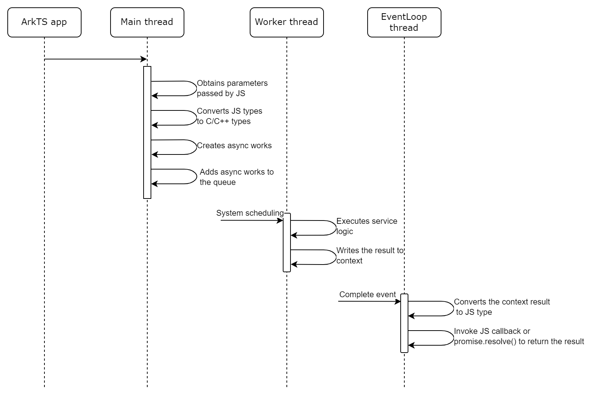
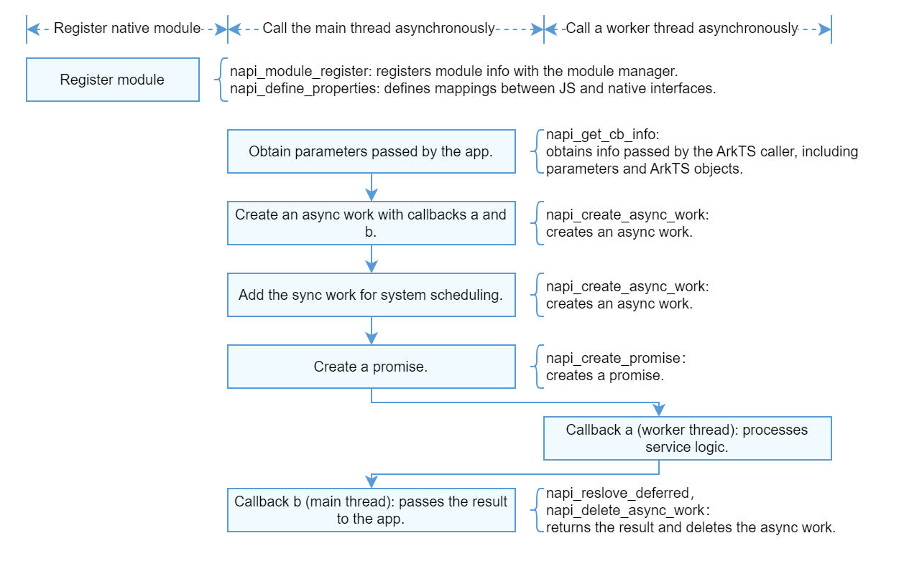
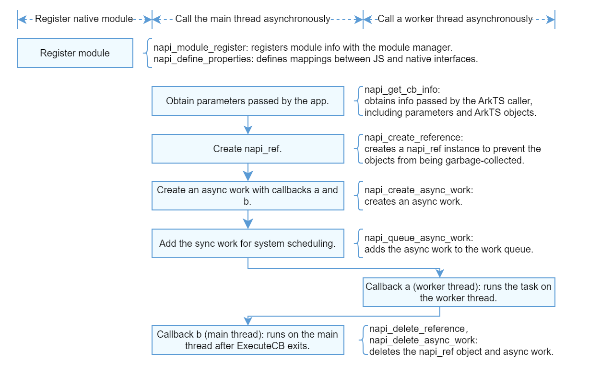

# Asynchronous Task Development Using Node-API

## When to Use

For a time-consuming operation, you can use **napi_create_async_work** to create an asynchronous work object to prevent the main thread from being blocked while ensuring the performance and response of your application. You can use asynchronous work objects in the following scenarios:

- File operations: You can use asynchronous work objects in complex file operations or when a large file needs to be read to prevent the main thread from being blocked.

- Network request: When your application needs to wait for a response to a network request, using an asynchronous worker object can improve its response performance without affecting the main thread.

- Database operation: Using asynchronous work objects in complex database query or write operations can improve the concurrency performance of your application without compromising the running of the main thread.

- Image processing: When large images need to be processed or complex image algorithms need to be executed, asynchronous work objects can ensure normal running of the main thread and improve the real-time performance of your application.

You can use a promise or a callback to implement asynchronous calls. To use a callback, you must pass in the callback.



## Example (Promise)



1. Use **napi_create_async_work** to create an asynchronous work object, and use **napi_queue_async_work** to add the object to a queue.

   ```cpp
   struct CallbackData {
       napi_async_work asyncWork = nullptr;
       napi_deferred deferred = nullptr;
       napi_ref callback = nullptr;
       double args = 0;
       double result = 0;
   };
   
   static napi_value AsyncWork(napi_env env, napi_callback_info info)
   {
      size_t argc = 1;
      napi_value args[1];
      napi_get_cb_info(env, info, &argc, args, nullptr, nullptr);
   
      napi_value promise = nullptr;
      napi_deferred deferred = nullptr;
      napi_create_promise(env, &deferred, &promise);
   
      auto callbackData = new CallbackData();
      callbackData->deferred = deferred;
      napi_get_value_double(env, args[0], &callbackData->args);
   
      napi_value resourceName = nullptr;
      napi_create_string_utf8(env, "AsyncCallback", NAPI_AUTO_LENGTH, &resourceName);
      // Create an asynchronous work object.
      napi_create_async_work(env, nullptr, resourceName, ExecuteCB, CompleteCB, callbackData, &callbackData->asyncWork);
      // Add the asynchronous work object to a queue.
      napi_queue_async_work(env, callbackData->asyncWork);
   
      return promise;
   }
   ```

2. Define the first callback of the asynchronous work object. This callback is executed in a worker thread to process specific service logic.

   ```cpp
   static void ExecuteCB(napi_env env, void *data)
   {
       CallbackData *callbackData = reinterpret_cast<CallbackData *>(data);
       callbackData->result = callbackData->args;
   }
   ```

3. Define the second callback of the asynchronous work object. This callback is executed in the main thread to return the result to the ArkTS side.

   ```cpp
   static void CompleteCB(napi_env env, napi_status status, void *data)
   {
       CallbackData *callbackData = reinterpret_cast<CallbackData *>(data);
       napi_value result = nullptr;
       napi_create_double(env, callbackData->result, &result);
       if (callbackData->result > 0) {
           napi_resolve_deferred(env, callbackData->deferred, result);
       } else {
           napi_reject_deferred(env, callbackData->deferred, result);
       }
   
       napi_delete_async_work(env, callbackData->asyncWork);
       delete callbackData;
   }
   ```

4. Initialize the module and call the API of ArkTS.

   ```cpp
   // Initialize the module.
   static napi_value Init(napi_env env, napi_value exports)
   {
       napi_property_descriptor desc[] = {
           { "asyncWork", nullptr, AsyncWork, nullptr, nullptr, nullptr, napi_default, nullptr }
       };
       napi_define_properties(env, exports, sizeof(desc) / sizeof(desc[0]), desc);
       return exports;
   }
    ```

    ```ts
   // Description of the interface in the .d.ts file.
   export const asyncWork(data: number): Promise<number>;

   // Call the API of ArkTS.
   nativeModule.asyncWork(1024).then((result) => {
       hilog.info(0x0000, 'XXX', 'result is %{public}d', result);
     });
   ```

## Example (Callback)



1. Use **napi_create_async_work** to create an asynchronous work object, and use **napi_queue_async_work** to add the object to a queue.

   ```cpp
   struct CallbackData {
     napi_async_work asyncWork = nullptr;
     napi_ref callbackRef = nullptr;
     double args[2] = {0};
     double result = 0;
   };
   
   napi_value AsyncWork(napi_env env, napi_callback_info info) 
   {
       size_t argc = 3;
       napi_value args[3];
       napi_get_cb_info(env, info, &argc, args, nullptr, nullptr);
       auto asyncContext = new CallbackData();
       // Save the received parameters to callbackData.
       napi_get_value_double(env, args[0], &asyncContext->args[0]);
       napi_get_value_double(env, args[1], &asyncContext->args[1]);
       // Convert the callback to napi_ref to extend its lifecycle to prevent it from being garbage-collected.
       napi_create_reference(env, args[2], 1, &asyncContext->callbackRef);
       napi_value resourceName = nullptr;
       napi_create_string_utf8(env, "asyncWorkCallback", NAPI_AUTO_LENGTH, &resourceName);
       // Create an asynchronous work object.
       napi_create_async_work(env, nullptr, resourceName, ExecuteCB, CompleteCB, 
                              asyncContext, &asyncContext->asyncWork); 
       // Add the asynchronous work object to a queue.
       napi_queue_async_work(env, asyncContext->asyncWork);
       return nullptr;
   }
   ```

2. Define the first callback of the asynchronous work object. This callback is executed in a worker thread to process specific service logic.

   ```cpp
   static void ExecuteCB(napi_env env, void *data) 
   {
       CallbackData *callbackData = reinterpret_cast<CallbackData *>(data);
       callbackData->result = callbackData->args[0] + callbackData->args[1];
   }
   ```

3. Define the second callback of the asynchronous work object. This callback is executed in the main thread to return the result to the ArkTS side.

   ```cpp
   static void CompleteCB(napi_env env, napi_status status, void *data) 
   {
       CallbackData *callbackData = reinterpret_cast<CallbackData *>(data);
       napi_value callbackArg[1] = {nullptr};
       napi_create_double(env, callbackData->result, &callbackArg[0]);
       napi_value callback = nullptr;
       napi_get_reference_value(env, callbackData->callbackRef, &callback);
       // Execute the callback.
       napi_value result;
       napi_value undefined;
       napi_get_undefined(env, &undefined);
       napi_call_function(env, undefined, callback, 1, callbackArg, &result);
       // Delete the napi_ref object and asynchronous work object.
       napi_delete_reference(env, callbackData->callbackRef);
       napi_delete_async_work(env, callbackData->asyncWork);
       delete callbackData;
   }
   ```

4. Initialize the module and call the API of ArkTS.

   ```cpp
   // Initialize the module.
   static napi_value Init(napi_env env, napi_value exports)
   {
       napi_property_descriptor desc[] = {
           { "asyncWork", nullptr, AsyncWork, nullptr, nullptr, nullptr, napi_default, nullptr }
       };
       napi_define_properties(env, exports, sizeof(desc) / sizeof(desc[0]), desc);
       return exports;
   }
   ```

   ```ts
   // Description of the interface in the .d.ts file.
   export const asyncWork(arg1: number, arg2: number,
     callback: (result: number) => void): void;

   // Call the API of ArkTS.
   let num1: number = 123;
   let num2: number = 456;
   nativeModule.asyncWork(num1, num2, (result) => {
     hilog.info(0x0000, 'XXX', 'result is %{public}d', result);
   }); 
   ```
