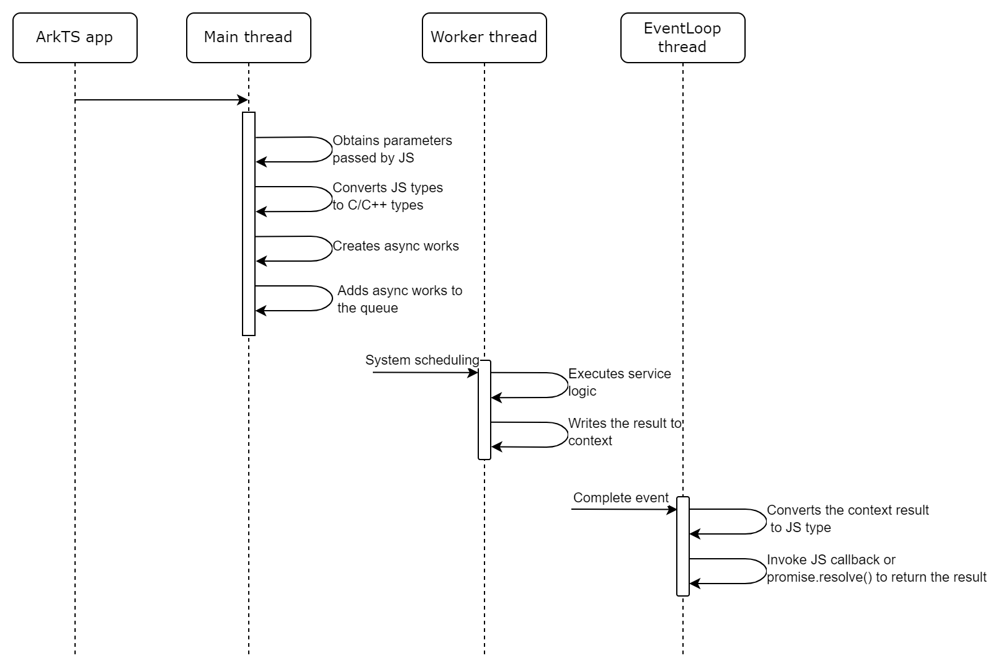
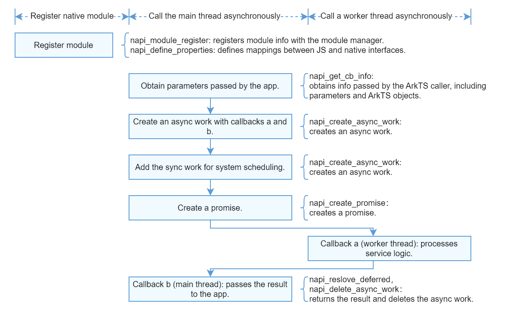
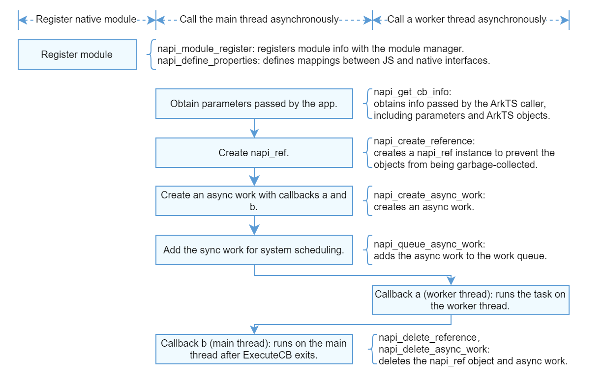

# Asynchronous Task Development Using Node-API

<!--Kit: ArkTS-->
<!--Subsystem: arkcompiler-->
<!--Owner: @xliu-huanwei; @shilei123; @huanghello-->
<!--Designer: @shilei123-->
<!--Tester: @kirl75; @zsw_zhushiwei-->
<!--Adviser: @k1ngqaquuu-->
<!-- md-trans-meta sourceCommit=21434ce8d323ecbd7d67463989a2ef075be92cec translatedAt=2026-08-12T06:41:32.095Z pushedAt=2026-08-12T11:15:50.223Z -->

## When to Use

For time-consuming operations, you can use [napi_create_async_work](../reference/native-lib/napi.md#napi_create_async_work) to create an asynchronous work object to prevent the ArkTS thread where env exists from being blocked while ensuring the performance and response speed of your application. You can use asynchronous work objects in the following scenarios:

- File operations: You can use asynchronous work objects in complex file operations or when a large file needs to be read to prevent the ArkTS thread where env exists from being blocked.

- Network request: When your application needs to wait for a response to a network request, using an asynchronous worker object can improve its response performance without affecting the main thread.

- Database operation: Using asynchronous work objects in complex database query or write operations can improve the concurrency performance of your application without compromising the running of the main thread.

- Image processing: When large images need to be processed or complex image algorithms need to be executed, asynchronous work objects can ensure normal running of the main thread and improve the real-time performance of your application.

**napi_queue_async_work** uses the **uv_queue_work** capability and manages the lifecycle of **napi_value** in the callback.

You can use a callback or a promise to implement asynchronous calls as required. The following is sample code for the two methods:



## Example (Promise)



1. Configure the **CMakeLists.txt** file.

   ``` txt
   # the minimum version of CMake.
   cmake_minimum_required(VERSION 3.5.0)
   project(NodeAPIAsynchronousTask)

   set(NATIVERENDER_ROOT_PATH ${CMAKE_CURRENT_SOURCE_DIR})

   if(DEFINED PACKAGE_FIND_FILE)
       include(${PACKAGE_FIND_FILE})
   endif()

   include_directories(${NATIVERENDER_ROOT_PATH}
                       ${NATIVERENDER_ROOT_PATH}/include)

   add_library(entry SHARED napi_init.cpp)
   target_link_libraries(entry PUBLIC libace_napi.z.so)

   add_library(entry1 SHARED callback.cpp)
   target_link_libraries(entry1 PUBLIC libace_napi.z.so)
   ```

2. Call **napi_create_async_work** to create an asynchronous work object, and call **napi_queue_async_work** to add the object to a queue.

   <!-- @[napi_create_async_work_promise_cpp](https://gitcode.com/openharmony/applications_app_samples/blob/master/code/DocsSample/ArkTS/NodeAPI/NodeAPIClassicUseCases/NodeAPIAsynchronousTask/entry/src/main/cpp/napi_init.cpp) -->

   ``` C++
   #include "napi/native_api.h"
   // Data context provided by the caller. The data is transferred to the execute and complete functions.
   struct CallbackData {
       napi_async_work asyncWork = nullptr;
       napi_deferred deferred = nullptr;
       napi_ref callback = nullptr;
       double args = 0;
       double result = 0;
   };
   
   // ...
   
   static napi_value AsyncWork(napi_env env, napi_callback_info info)
   {
       size_t argc = 1;
       napi_value args[1];
       napi_get_cb_info(env, info, &argc, args, nullptr, nullptr);
   
       napi_value promise = nullptr;
       napi_deferred deferred = nullptr;
       napi_create_promise(env, &deferred, &promise);
   
       auto callbackData = new CallbackData();
       callbackData->deferred = deferred;
       napi_get_value_double(env, args[0], &callbackData->args);
   
       napi_value resourceName = nullptr;
       napi_create_string_utf8(env, "AsyncCallback", NAPI_AUTO_LENGTH, &resourceName);
       // Create an asynchronous work object.
       napi_create_async_work(env, nullptr, resourceName, ExecuteCB, CompleteCB, callbackData, &callbackData->asyncWork);
       // Add the asynchronous work object to a queue.
       napi_queue_async_work(env, callbackData->asyncWork);
   
       return promise;
   }
   ```

3. Define the first callback of the asynchronous work object. This callback is executed in a worker thread to process specific service logic.

   <!-- @[napi_first_call_back_work_promise_cpp](https://gitcode.com/openharmony/applications_app_samples/blob/master/code/DocsSample/ArkTS/NodeAPI/NodeAPIClassicUseCases/NodeAPIAsynchronousTask/entry/src/main/cpp/napi_init.cpp) -->

   ``` C++
   static void ExecuteCB(napi_env env, void *data)
   {
       CallbackData *callbackData = reinterpret_cast<CallbackData *>(data);
       callbackData->result = callbackData->args;
   }
   ```

4. Define the second callback of the asynchronous work object. This callback is executed in the main thread to return the result to the ArkTS side.

   <!-- @[napi_second_call_back_main_promise_cpp](https://gitcode.com/openharmony/applications_app_samples/blob/master/code/DocsSample/ArkTS/NodeAPI/NodeAPIClassicUseCases/NodeAPIAsynchronousTask/entry/src/main/cpp/napi_init.cpp) -->

   ``` C++
   static void CompleteCB(napi_env env, napi_status status, void *data)
   {
       CallbackData *callbackData = reinterpret_cast<CallbackData *>(data);
       napi_value result = nullptr;
       napi_create_double(env, callbackData->result, &result);
       if (callbackData->result > 0) {
           napi_resolve_deferred(env, callbackData->deferred, result);
       } else {
           napi_reject_deferred(env, callbackData->deferred, result);
       }
   
       napi_delete_async_work(env, callbackData->asyncWork);
       delete callbackData;
       callbackData = nullptr;
   }
   ```

5. Register the module and call the API from the ArkTS side.

   ``` C++
   // Initialize the module.
   static napi_value Init(napi_env env, napi_value exports)
   {
       napi_property_descriptor desc[] = {
           { "asyncWork", nullptr, AsyncWork, nullptr, nullptr, nullptr, napi_default, nullptr }
       };
       napi_define_properties(env, exports, sizeof(desc) / sizeof(desc[0]), desc);
       return exports;
   }
   ```

   Description of the API in the .d.ts file.

   <!-- @[promise_call_interface_dts](https://gitcode.com/openharmony/applications_app_samples/blob/master/code/DocsSample/ArkTS/NodeAPI/NodeAPIClassicUseCases/NodeAPIAsynchronousTask/entry/src/main/cpp/types/libentry/Index.d.ts) -->

   ``` TypeScript
   // index.d.ts
   export const asyncWork: (data: number) => Promise<number>;
   ```

   API calls from the ArkTS side.

   ``` ts
   import { hilog } from '@kit.PerformanceAnalysisKit';
   import testNapi from 'libentry.so';
   ```

   <!-- @[promise_call_interface](https://gitcode.com/openharmony/applications_app_samples/blob/master/code/DocsSample/ArkTS/NodeAPI/NodeAPIClassicUseCases/NodeAPIAsynchronousTask/entry/src/main/ets/pages/Index.ets) -->

   ``` TypeScript
   testNapi.asyncWork(1024).then((result: number) => {
     hilog.info(0x0000, 'XXX', 'result is %{public}d', result);
   });
   ```

   ``` txt
   Result: **result is 1024**
   ```

## Example (Callback)



1. Call **napi_create_async_work** to create an asynchronous work object, and call **napi_queue_async_work** to add the object to a queue.

   <!-- @[napi_create_queue_async_work_callback_cpp](https://gitcode.com/openharmony/applications_app_samples/blob/master/code/DocsSample/ArkTS/NodeAPI/NodeAPIClassicUseCases/NodeAPIAsynchronousTask/entry/src/main/cpp/callback.cpp) -->

   ``` C++
   #include "napi/native_api.h"
   
   static constexpr int INT_ARGS_2 = 2; // Input parameter index.
   
   // Data context provided by the caller. The data is transferred to the execute and complete functions.
   struct CallbackData {
       napi_async_work asyncWork = nullptr;
       napi_ref callbackRef = nullptr;
       double args[2] = {0};
       double result = 0;
   };
   
   // ...
   napi_value AsyncWork(napi_env env, napi_callback_info info)
   {
       size_t argc = 3;
       napi_value args[3];
       napi_get_cb_info(env, info, &argc, args, nullptr, nullptr);
       auto asyncContext = new CallbackData();
       // Save the received parameters to callbackData.
       napi_get_value_double(env, args[0], &asyncContext->args[0]);
       napi_get_value_double(env, args[1], &asyncContext->args[1]);
       // Convert the callback to napi_ref to extend its lifecycle to prevent it from being garbage-collected.
       napi_create_reference(env, args[INT_ARGS_2], 1, &asyncContext->callbackRef);
       napi_value resourceName = nullptr;
       napi_create_string_utf8(env, "asyncWorkCallback", NAPI_AUTO_LENGTH, &resourceName);
       // Create an asynchronous work object.
       napi_create_async_work(env, nullptr, resourceName, ExecuteCB, CompleteCB,
                              asyncContext, &asyncContext->asyncWork);
       // Add the asynchronous work object to a queue.
       napi_queue_async_work(env, asyncContext->asyncWork);
       return nullptr;
   }
   ```

2. Define the first callback of the asynchronous work object. This callback is executed in a worker thread to process specific service logic.

   <!-- @[napi_async_first_call_back_work_callback_cpp](https://gitcode.com/openharmony/applications_app_samples/blob/master/code/DocsSample/ArkTS/NodeAPI/NodeAPIClassicUseCases/NodeAPIAsynchronousTask/entry/src/main/cpp/callback.cpp) -->

   ``` C++
   static void ExecuteCB(napi_env env, void *data)
   {
       CallbackData *callbackData = reinterpret_cast<CallbackData *>(data);
       callbackData->result = callbackData->args[0] + callbackData->args[1];
   }
   ```

3. Define the second callback of the asynchronous work object. This callback is executed in the main thread to return the result to the ArkTS side.

   <!-- @[napi_async_second_call_back_work_callback_cpp](https://gitcode.com/openharmony/applications_app_samples/blob/master/code/DocsSample/ArkTS/NodeAPI/NodeAPIClassicUseCases/NodeAPIAsynchronousTask/entry/src/main/cpp/callback.cpp) -->

   ``` C++
   static void CompleteCB(napi_env env, napi_status status, void *data)
   {
       CallbackData *callbackData = reinterpret_cast<CallbackData *>(data);
       napi_value callbackArg[1] = {nullptr};
       napi_create_double(env, callbackData->result, &callbackArg[0]);
       napi_value callback = nullptr;
       napi_get_reference_value(env, callbackData->callbackRef, &callback);
       // Execute the callback.
       napi_value result;
       napi_value undefined;
       napi_get_undefined(env, &undefined);
       napi_call_function(env, undefined, callback, 1, callbackArg, &result);
       // Delete the napi_ref object and asynchronous work object.
       napi_delete_reference(env, callbackData->callbackRef);
       napi_delete_async_work(env, callbackData->asyncWork);
       delete callbackData;
       callbackData = nullptr;
   }
   ```

4. Register the module and call the API from the ArkTS side.

   The export method name is the same as that above. You can reuse the module registration code.

   ``` C++
   // Initialize the module.
   static napi_value Init(napi_env env, napi_value exports)
   {
       napi_property_descriptor desc[] = {
           { "asyncWork", nullptr, AsyncWork, nullptr, nullptr, nullptr, napi_default, nullptr }
       };
       napi_define_properties(env, exports, sizeof(desc) / sizeof(desc[0]), desc);
       return exports;
   }
   ```

   Description of the API in the .d.ts file.

   <!-- @[callback_call_interface_dts](https://gitcode.com/openharmony/applications_app_samples/blob/master/code/DocsSample/ArkTS/NodeAPI/NodeAPIClassicUseCases/NodeAPIAsynchronousTask/entry/src/main/cpp/types/libentry1/Index.d.ts) -->

   ``` TypeScript
   export const asyncWork: (arg1: number, arg2: number, callback: (result: number) => void) => void;
   ```

   API calls from the ArkTS side.

   ```ts
   import { hilog } from '@kit.PerformanceAnalysisKit';
   import nativeModule from 'libentry1.so';

   let num1: number = 123;
   let num2: number = 456;
   ```

   <!-- @[callback_call_interface](https://gitcode.com/openharmony/applications_app_samples/blob/master/code/DocsSample/ArkTS/NodeAPI/NodeAPIClassicUseCases/NodeAPIAsynchronousTask/entry/src/main/ets/pages/Index.ets) -->  

   ``` TypeScript
   nativeModule.asyncWork(num1, num2, (result: number) => {
     hilog.info(0x0000, 'XXX', 'result is %{public}d', result);
   });
   ```

   ``` txt
   Result: **result is 579**
   ```

## Child Thread Interaction Scenarios

- The **napi_queue_async_work** API creates a C++ child thread. Therefore, the native code can directly reuse the code that uses the callback mode. The following shows the usage differences on the ArkTS side.

### C++ and ArkTS Child Thread Interaction Based on [Worker](../../application-dev/arkts-utils/worker-introduction.md)

- DevEco Studio supports generation of Worker templates with a single click. In the corresponding {moduleName} directory, right-click anywhere and choose **New > Worker** to automatically generate the Worker template files and configuration information. In this example, we will create a Worker named "Worker".

1. Configure the Worker.

   ``` json5
   "buildOption": {
     "sourceOption": {
       "workers": [
         "./src/main/ets/workers/Worker.ets"
        ]
     },
   }
   ```

2. Sample code of the worker thread.

   <!-- @[napi_create_async_work_worker](https://gitcode.com/openharmony/applications_app_samples/blob/master/code/DocsSample/ArkTS/NodeAPI/NodeAPIClassicUseCases/NodeAPIAsynchronousTask/entry/src/main/ets/workers/Worker.ets) -->  

   ``` TypeScript
   // entry/src/main/ets/workers/Worker.ets
   
   import nativeModule from 'libentry1.so';
   import { worker, MessageEvents } from '@kit.ArkTS';
   
   const port = worker.workerPort;
   
   port.onmessage = (e : MessageEvents) => {
       console.info('Worker thread received data:', e.data.num1 + ', ' + e.data.num2);
       nativeModule.asyncWork(e.data.num1, e.data.num2, (result: number) => {
           port.postMessage(result);
       });
   }
   ```

3. ArkTS thread code.

   ```ts
   import { hilog } from '@kit.PerformanceAnalysisKit';
   import { worker } from '@kit.ArkTS';
   let num1: number = 123;
   let num2: number = 456;
   ```

   <!-- @[AsyncWorkCallbackWorker](https://gitcode.com/openharmony/applications_app_samples/blob/master/code/DocsSample/ArkTS/NodeAPI/NodeAPIClassicUseCases/NodeAPIAsynchronousTask/entry/src/main/ets/pages/Index.ets) -->  

   ``` TypeScript
   const wk = new worker.ThreadWorker('entry/ets/workers/Worker.ets');
   wk.postMessage({num1, num2});
   wk.onmessage = (msg) => {
     console.info('result is:', msg.data);
     wk.terminate();
   }
   ```

   ``` txt
   Execution result: 
   Worker thread received data: 123, 456 
   result is 579
   ```

### C++ and ArkTS Child Thread Interaction Based on [Taskpool](../../application-dev/arkts-utils/taskpool-introduction.md)

1. ArkTS thread code.

   ```ts
   import { hilog } from '@kit.PerformanceAnalysisKit';
   import { taskpool } from '@kit.ArkTS';
   import nativeModule from 'libentry1.so';
   let num1: number = 123;
   let num2: number = 456;

   @Concurrent
   function nativeCall(num1 : number, num2 : number): void {
     console.info('Taskpool thread received data:', + num1 + ', ' + num2);
     nativeModule.asyncWork(num1, num2, (result: number) => {
       hilog.info(0x0000, 'XXX', 'result is: %{public}d', result);
     });
   }

   async function testTaskpool() : Promise<void> {
     try {
       const task = new taskpool.Task(nativeCall, num1, num2);
       await taskpool.execute(task);
     } catch (e) {
       console.error(`Taskpool execute error: ${e}`);
     }
   }
   ```

   <!-- @[AsyncWorkCallbackTaskPool](https://gitcode.com/openharmony/applications_app_samples/blob/master/code/DocsSample/ArkTS/NodeAPI/NodeAPIClassicUseCases/NodeAPIAsynchronousTask/entry/src/main/ets/pages/Index.ets) -->

   ``` TypeScript
   testTaskpool();
   ```

   ``` txt
   Execution result: 
   Taskpool thread received data: 123, 456 
   result is 579
   ```

## NOTE

- When the **napi_cancel_async_work** API is called, **napi_ok** is returned regardless of whether the underlying UV fails. If the task fails to be canceled due to the underlying UV, the corresponding error value is transferred to **status** in the complete callback. You need to perform the corresponding operation based on the value of **status**.

- It is recommended that the asynchronous work item of Node-API (**napi_async_work**) be used only once. After **napi_queue_async_work** is called, you should release it through **napi_delete_async_work** during or after the execution of the **complete** callback. The same **napi_async_work** can be released only once. Repeated release attempts will cause undefined behavior.

- The **execute_cb** of **napi_async_work** runs in an independent work thread, which is obtained from the uv thread pool. Different worker threads do not affect each other. The service logic in the **execute_cb** function is executed in the worker thread instead of the original ArkTS thread. Therefore, you cannot use the input parameter **env** (the **env** of the original ArkTS thread) to construct **napi_value**.

- **napi_async_work** only ensures that **complete_cb** is executed after **execute_cb**. **execute_cb** of different **napi_async_work** runs on their respective worker threads. Therefore, their execution sequence cannot be ensured. If tasks need to be executed in sequence, you are advised to use the **napi_threadsafe_function** APIs. For details, see [Thread Safety Development Using Node-API](use-napi-thread-safety.md).