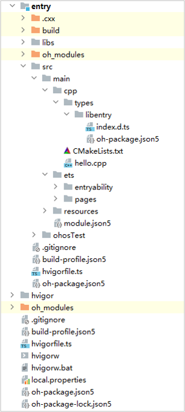

# Node-API Development Process


To implement cross-language interaction using Node-API, you need to register and load modules based on the Node-API mechanism.


- ArkTS/JS: Call C++ methods by importing the related .so library.

- Native: Implement module registration via a .cpp file. You need to declare the name of the lib to register and define the mapping between the Native and JS/ArkTS methods in the callback registered.


The following demonstrates how to implement cross-language interaction by implementing **add()** in ArkTS/JS and **Add()** in Native.


## Creating a Native C++ Project

In DevEco Studio, choose **New** > **Create Project**, select the **Native C++** template, click **Next**, select the API version, set the project name, and click **Finish**.

The main code of the project created consists of two parts: **cpp** and **ets**.

**Project Directory Structure**



- **entry &gt; src &gt; main &gt; cpp &gt; types**: directory for C++ API description files.

- **entry &gt; src &gt; main &gt; cpp &gt; types &gt; libentry &gt; index.d.ts**: file containing C++ APIs, including the API names, input parameters, and return values.

- **entry &gt; src &gt; main &gt; cpp &gt; types &gt; libentry &gt; oh-package.json5**: file for configuring the entry and name of the third-party .so package.

- **entry &gt; src &gt; main &gt; cpp &gt; CMakeLists.txt**: C++ source code build file, which provides the CMake build script.

- **entry &gt; src &gt; main &gt; cpp &gt; hello.cpp**: file containing the C++ APIs of your application.

- **entry &gt; src &gt; main &gt; ets**: directory for ArkTS source code.

For details about more projects, see [C++ Project Directory Structure](https://developer.harmonyos.com/en/docs/documentation/doc-guides-V3/project_overview-0000001053822398-V3#section3732132312179).


## Implementing Native Methods

- Set module registration information.

  When a native module is imported in ArkTS, the .so file will be loaded. During the loading process, the **napi_module_register** method is called to register the module with the system and call the module initialization function.

  napi_module has two key attributes: **.nm_register_func** and **.nm_modname**. The former defines the module initialization function, and the latter specifies the module name, that is, the name of the .so library imported by ArkTS.

  ```
  // entry/src/main/cpp/hello.cpp
  
  // Information about the module. Record information such as the Init() function and module name.
  static napi_module demoModule = {
      .nm_version = 1,
      .nm_flags = 0,
      .nm_filename = nullptr,
      .nm_register_func = Init,
      .nm_modname = "entry",
      .nm_priv = nullptr,
      .reserved = {0},
  };
  
  // When the .so file is loaded, this function is automatically called to register the demoModule module with the system.
  extern "C" __attribute__((constructor)) void RegisterDemoModule() { 
      napi_module_register(&demoModule);
   }
  ```

- Initialize the module.

  Implement the binding and mapping between ArkTS and C++ interfaces.

  ```
  // entry/src/main/cpp/hello.cpp
  EXTERN_C_START
  // Initialize the module.
  static napi_value Init(napi_env env, napi_value exports) {
      // Implement the binding and mapping between ArkTS and C++ interfaces.
      napi_property_descriptor desc[] = {
          {"callNative", nullptr, CallNative, nullptr, nullptr, nullptr, napi_default, nullptr},
          {"nativeCallArkTS", nullptr, NativeCallArkTS, nullptr, nullptr, nullptr, napi_default, nullptr},
      };
      // Embed the CallNative and NativeCallArkTS methods to the exports object.
      napi_define_properties(env, exports, sizeof(desc) / sizeof(desc[0]), desc);
      return exports;
  }
  EXTERN_C_END
  
  // Basic module information.
  static napi_module demoModule = {
      .nm_version = 1,
      .nm_flags = 0,
      .nm_filename = nullptr,
      .nm_register_func = Init,
      .nm_modname = "entry",
      .nm_priv = nullptr,
      .reserved = {0},
  };
  ```

- Add the JS methods in the **index.d.ts** file.

  ```
  // entry/src/main/cpp/types/libentry/index.d.ts
  export const callNative: (a: number, b: number) => number;
  export const nativeCallArkTS: (cb: (a: number) => number) => number;
  ```

- Associate **index.d.ts** with **.cpp** in the **oh-package.json5** file.

  ```
  {
    "name": "libentry.so",
    "types": "./index.d.ts",
    "version": "",
    "description": "Please describe the basic information."
  }
  ```

- Configure CMake packaging parameters in the **CMakeLists.txt** file.

  ```
  # entry/src/main/cpp/CMakeLists.txt
  cmake_minimum_required(VERSION 3.4.1)
  project(MyApplication2)
  
  set(NATIVERENDER_ROOT_PATH ${CMAKE_CURRENT_SOURCE_DIR})
  
  include_directories(${NATIVERENDER_ROOT_PATH}
                      ${NATIVERENDER_ROOT_PATH}/include)
  
  # Add a library named entry.
  add_library(entry SHARED hello.cpp)
  # Build the library to be linked to this executable.
  target_link_libraries(entry PUBLIC libace_napi.z.so)
  ```

- Implement **CallNative** and **NativeCallArkTS**. The code is as follows:

  ```
  // entry/src/main/cpp/hello.cpp
  static napi_value CallNative(napi_env env, napi_callback_info info)
  {
      size_t argc = 2;
      // Declare the parameter array.
      napi_value args[2] = {nullptr};
  
      // Obtain input parameters and put them into the parameter array in sequence.
      napi_get_cb_info(env, info, &argc, args, nullptr, nullptr);
  
      // Obtain parameters in sequence.
      double value0;
      napi_get_value_double(env, args[0], &value0);
      double value1;
      napi_get_value_double(env, args[1], &value1);
  
      // Return the sum of the two numbers.
      napi_value sum;
      napi_create_double(env, value0 + value1, &sum);
      return sum;
  }
  
  static napi_value NativeCallArkTS(napi_env env, napi_callback_info info)
  {    
      size_t argc = 1;
      // Declare the parameter array.
      napi_value args[1] = {nullptr};
  
      // Obtain input parameters and put them into the parameter array in sequence.
      napi_get_cb_info(env, info, &argc, args , nullptr, nullptr);
  
      // Create an int() as the input parameter of ArkTS.
      napi_value argv = nullptr;    
      napi_create_int32(env, 2, &argv );
  
      // Invoke the callback that is passed in, and return the result.
      napi_value result = nullptr;
      napi_call_function(env, nullptr, args[0], 1, &argv, &result);
      return result;
  }
  ```


## Calling C/C++ Methods on ArkTS

On ArkTS, import the .so file that contains the Native processing logic. This allows C/C++ methods to be called on ArkTS.

```
// entry/src/main/ets/pages/Index.ets
// Import the Native APIs.
import nativeModule from 'libentry.so'

@Entry
@Component
struct Index {
  @State message: string = 'Test Node-API callNative result: ';
  @State message2: string = 'Test Node-API nativeCallArkTS result: ';
  build() {
    Row() {
      Column() {
        // Pressing the first button calls the add() method, which uses the Native CallNative() method to add the two numbers.
        Text(this.message)
          .fontSize(50)
          .fontWeight(FontWeight.Bold)
          .onClick(() => {
            this.message += nativeModule.callNative(2, 3);
            })
        // Pressing the second button calls the nativeCallArkTS method, which calls the ArkTS function in Native.
        Text(this.message2)
          .fontSize(50)
          .fontWeight(FontWeight.Bold)
          .onClick(() => {
            this.message2 += nativeModule.nativeCallArkTS((a: number)=> {
                return a * 2;
            });
          })
      }
      .width('100%')
    }
    .height('100%')
  }
}
```


## Node-API Constraints


### SO Naming Rules

The module name to be imported must be in the same case as the module name registered. For example, if the module name is **entry**, the .so name must be **libentry.so**, and the **nm_modname** field in **napi_module** must be **entry**. When importing the module in ArkTS, use **import xxx from 'libentry.so'**.


### Registration

- To prevent conflicts with symbols in the .so file, add "static" to the function corresponding to **nm_register_func**. For example, the **Init()** function in this document.

- The name of the module registration entry, that is, the function modified by **__attribute__((constructor))** must be unique. For example, the **RegisterDemoModule** function in this document.


### Multithread Processing

Each engine instance corresponds to a JS thread. The objects of an instance cannot be operated across threads. Otherwise, the application may crash. Observe the following rules:

- The N-APIs can be used only by JS threads.

- The input parameter **env** of the Native interface can be bound to a JS thread only when the thread is created.

