# Using HTTP Global Interceptor (C/C++)

<!--Kit: Network Kit-->
<!--Subsystem: Communication-->
<!--Owner: @wmyao_mm-->
<!--Designer: @guo-min_net-->
<!--Tester: @tongxilin-->
<!--Adviser: @zhang_yixin13-->
<!-- md-trans-meta sourceCommit=24f70274f5c6a1a75284e2ff3385181e6321affa translatedAt=2026-08-13T03:08:20.480Z pushedAt=2026-08-13T06:12:25.601Z -->

## When to Use

Starting from API version 24, you can use HTTP global interceptors (which include read-only interceptors and writable interceptors) to monitor HTTP traffic in read-only interceptors for logging, or add custom logic in writable interceptors to modify request headers, response headers, response bodies, and more.

## Available APIs

The following table lists the common APIs of HTTP global interceptors. For details, see [http_interceptor.h](../reference/apis-network-kit/capi-net-http-interceptor-h.md).

| Name | Description |
| -------- | -------- |
| OH_Http_AddReadOnlyInterceptor(struct OH_Http_Interceptor *interceptor) | Adds an HTTP global read-only interceptor. |
| OH_Http_AddWritableInterceptor(struct OH_Http_Interceptor *interceptor) | Adds an HTTP global writable interceptor. |
| OH_Http_RemoveInterceptor(struct OH_Http_Interceptor *interceptor) | Removes the specified HTTP global interceptor. |
| OH_Http_RemoveAllInterceptors(int32_t groupId) | Removes all HTTP global interceptors with the specified group ID. |
| OH_Http_StartAllInterceptors(int32_t groupId) | Enables all HTTP global interceptors with the specified group ID. |
| OH_Http_StopAllInterceptors(int32_t groupId) | Disables all HTTP global interceptors with the specified group ID. |

## How to Develop

To create and use an HTTP global interceptor with the APIs described in this document, first create a Native C++ project, encapsulate the related APIs in the source file, and then call the encapsulated APIs from the ArkTS layer. Use methods such as hilog or console.info to print logs to the console or generate device logs.

This topic uses adding a globally read-only response interceptor, a modifiable request interceptor, and a modifiable response interceptor as examples to provide specific development guidance.

### Adding Dependencies

**Linking Dynamic Libraries**

Add the following libraries to **CMakeLists.txt**:

```txt
libace_napi.z.so
libhttp_interceptor.so
```

**Including Header Files**

```c
#include "napi/native_api.h"
#include "network/netstack/http_interceptor.h"
#include "network/netstack/http_interceptor_type.h"
```

### Building the Project

1. Write code in the source file to call the API, implementing the handler functions and related operations for HTTP global interceptors.

   <!-- @[HttpInterceptor_build_project](https://gitcode.com/openharmony/applications_app_samples/blob/master/code/DocsSample/NetWork_Kit/NetWorkKit_Datatransmission/HTTP_interceptor_C/entry/src/main/cpp/napi_init.cpp) -->

   ``` C++
   #include "napi/native_api.h"
   #include "network/netstack/http_interceptor.h"
   #include "network/netstack/http_interceptor_type.h"
   #include "hilog/log.h"
   
   #include <cstring>
   #include <cstdlib>
   #include <string>
   
   #undef LOG_DOMAIN
   #undef LOG_TAG
   #define LOG_DOMAIN 0x3200 // Global domain macro that identifies the service domain.cro that identifies the service domain.
   #define LOG_TAG "HttpInterceptorDemo"  // Global tag macro that identifies the module log tag. that identifies the module log tag.
   
   // Globally read-only response interceptor instance.
   static OH_Http_Interceptor g_readOnlyResponseInterceptor = {
       .groupId = 1,
       .stage = OH_STAGE_RESPONSE,
       .type = OH_TYPE_READ_ONLY,
       .enabled = 1,
       .handler = nullptr,
   };
   
   // Modifiable request interceptor instance (used to modify the request packets of Network Kit).
   static OH_Http_Interceptor g_modifyRequestInterceptor = {
       .groupId = 2,
       .stage = OH_STAGE_REQUEST,
       .type = OH_TYPE_MODIFY_NETWORK_KIT,
       .enabled = 1,
       .handler = nullptr,
   };
   
   // Modifiable response interceptor instance (used to modify the response packets of Network Kit).
   static OH_Http_Interceptor g_modifyResponseInterceptor = {
       .groupId = 3,
       .stage = OH_STAGE_RESPONSE,
       .type = OH_TYPE_MODIFY_NETWORK_KIT,
       .enabled = 1,
       .handler = nullptr,
   };
   
   // Helper function for memory allocation and string copying.
   char *MallocCString(const std::string &origin)
   {
       if (origin.empty()) {
           return nullptr;
       }
   
       auto len = origin.length() + 1;
       char *res = static_cast<char *>(malloc(sizeof(char) * len));
       if (res == nullptr) {
           return nullptr;
       }
       return std::char_traits<char>::copy(res, origin.c_str(), len);
   }
   
   // Helper function for printing logs.
   void LogHeader(OH_Http_Interceptor_Headers *headers)
   {
       OH_LOG_INFO(LOG_APP, "---------------------header begin---------------------");
       while (headers != nullptr) {
           if (headers->data != nullptr) {
               OH_LOG_INFO(LOG_APP, "%{public}s", headers->data);
           }
           headers = headers->next;
       }
       OH_LOG_INFO(LOG_APP, "---------------------header end---------------------");
   }
   
   // Print response information.
   void PrintResponseInfo(OH_Http_Interceptor_Response *response)
   {
       OH_LOG_INFO(LOG_APP, "-----PrintResponseInfo Begin-----");
       if (response != nullptr) {
           OH_LOG_INFO(LOG_APP, "responseCode = %{public}d", response->responseCode);
           if (response->body.buffer != nullptr) {
               OH_LOG_INFO(LOG_APP, "body = %{public}s", response->body.buffer);
           }
           if (response->headers != nullptr) {
               LogHeader(response->headers);
           }
   
           OH_LOG_INFO(LOG_APP, "dns: %{public}lf", response->performanceTiming.dnsTiming);
           OH_LOG_INFO(LOG_APP, "tcp: %{public}lf", response->performanceTiming.tcpTiming);
           OH_LOG_INFO(LOG_APP, "tls: %{public}lf", response->performanceTiming.tlsTiming);
           OH_LOG_INFO(LOG_APP, "snd: %{public}lf", response->performanceTiming.firstSendTiming);
           OH_LOG_INFO(LOG_APP, "rcv: %{public}lf", response->performanceTiming.firstReceiveTiming);
           OH_LOG_INFO(LOG_APP, "tot: %{public}lf", response->performanceTiming.totalFinishTiming);
           OH_LOG_INFO(LOG_APP, "rdr: %{public}lf", response->performanceTiming.redirectTiming);
           OH_LOG_INFO(LOG_APP, "-----PrintResponseInfo End-----");
       }
   }
   
   // Read-only response interceptor handler function.
   OH_Interceptor_Result ReadOnlyResponseInterceptorHandler(
       OH_Http_Interceptor_Request *request,
       OH_Http_Interceptor_Response *response,
       int32_t *isModified)
   {
       (void)request;
       (void)isModified;
       
       if (response != nullptr) {
           OH_LOG_INFO(LOG_APP, "---ReadOnly Response Interceptor Handler---");
           PrintResponseInfo(response);
       }
       return OH_CONTINUE;
   }
   
   // Modify the request method.
   static void ModifyRequestMethod(OH_Http_Interceptor_Request *request)
   {
       if (request->method.buffer != nullptr) {
           // Release the original memory. Use free to release memory allocated by malloc.
           free((void *)request->method.buffer);
           
           // Reallocate memory and set the new value. Use malloc to allocate memory.
           const std::string newMethodStr = "GET";
           char *newMethodBuffer = MallocCString(newMethodStr);
           if (newMethodBuffer != nullptr) {
               request->method.buffer = newMethodBuffer;
               request->method.length = newMethodStr.length();
               OH_LOG_INFO(LOG_APP, "Modified Method: %{public}s", request->method.buffer);
           }
       }
   }
   
   // Modify the first header node.
   static void ModifyFirstHeaderNode(OH_Http_Interceptor_Headers **headers, const char *headerData)
   {
       size_t headerLen = strlen(headerData) + 1;
       
       if (*headers != nullptr) {
           // Modify the first header node.
           if ((*headers)->data != nullptr) {
               // Free the original memory. Use free to release the memory allocated by malloc.
               free((void *)(*headers)->data);
           }
           // Use malloc to allocate memory.
           const std::string headerDataStr = headerData;
           char *headerBuffer = MallocCString(headerDataStr);
           if (headerBuffer != nullptr) {
               (*headers)->data = headerBuffer;
               OH_LOG_INFO(LOG_APP, "Modified first header: %{public}s", headerData);
           }
       } else {
           // If no header node exists, create a new first node.
           // Create a new header node. Use malloc to allocate memory.
           OH_Http_Interceptor_Headers *newHeader =
               (OH_Http_Interceptor_Headers *)malloc(sizeof(OH_Http_Interceptor_Headers));
           if (newHeader != nullptr) {
               // Use malloc to allocate memory.
               const std::string headerDataStr = headerData;
               char *headerBuffer = MallocCString(headerDataStr);
               if (headerBuffer != nullptr) {
                   newHeader->data = headerBuffer;
                   newHeader->next = nullptr;
                   *headers = newHeader;
                   OH_LOG_INFO(LOG_APP, "Created first header: %{public}s", headerData);
               } else {
                   // If memory allocation fails, release the header node. Use free to release the memory allocated by malloc.
                   free((void *)newHeader);
               }
           }
       }
   }
   
   // Modify the body content.
   static void ModifyBodyContent(Http_Buffer *body, const char *newBodyContent)
   {
       // Release the original body memory. You must use free to release memory allocated by malloc.
       if (body->buffer != nullptr) {
           free((void *)body->buffer);
       }
       
       // Reallocate memory and set the new body content. You must use malloc to allocate memory.
       const std::string bodyContentStr = newBodyContent;
       char *bodyBuffer = MallocCString(bodyContentStr);
       if (bodyBuffer != nullptr) {
           body->buffer = bodyBuffer;
           body->length = bodyContentStr.length();
           OH_LOG_INFO(LOG_APP, "Modified Body: %{public}s", body->buffer);
       }
   }
   
   // Modifiable request interceptor handler (modifies the Network Kit request packet).
   OH_Interceptor_Result ModifyRequestInterceptorHandler(
       OH_Http_Interceptor_Request *request,
       OH_Http_Interceptor_Response *response,
       int32_t *isModified)
   {
       (void)response;
       
       if (request != nullptr) {
           OH_LOG_INFO(LOG_APP, "---Modify Interceptor Handler---");
           OH_LOG_INFO(LOG_APP, "Original URL: %{public}s", request->url.buffer);
           OH_LOG_INFO(LOG_APP, "Original Method: %{public}s", request->method.buffer);
           
           // Modify the request method.
           ModifyRequestMethod(request);
           
           // Modify the first request header.
           const char *requestHeaderData = "X-Custom-Header: CustomValue";
           ModifyFirstHeaderNode(&request->headers, requestHeaderData);
           
           // Modify the request body.
           const char *requestBodyData = "{\"key\": \"value\"}";
           ModifyBodyContent(&request->body, requestBodyData);
           
           // Mark as modified.
           *isModified = 1;
           OH_LOG_INFO(LOG_APP, "Request modified: %{public}d", *isModified);
       }
       
       // Return OH_CONTINUE to continue processing the request.
       // Return OH_ABORT to abort the request, which will not be sent to the server.
       return OH_CONTINUE;
   }
   
   // Modifiable response interceptor handler (modifies the Network Kit response packet).
   OH_Interceptor_Result ModifyResponseInterceptorHandler(
       OH_Http_Interceptor_Request *request,
       OH_Http_Interceptor_Response *response,
       int32_t *isModified)
   {
       (void)request;
       
       if (response != nullptr) {
           OH_LOG_INFO(LOG_APP, "---Modify Response Interceptor Handler---");
           OH_LOG_INFO(LOG_APP, "Original Response Code: %{public}d", response->responseCode);
           if (response->body.buffer != nullptr) {
               OH_LOG_INFO(LOG_APP, "Original Response Body: %{public}s", response->body.buffer);
           }
           
           // Modify the response body.
           const char *responseBodyData = "{\"modified\": true, \"message\": \"Response modified by interceptor\"}";
           ModifyBodyContent(&response->body, responseBodyData);
           
           // Modify the first response header.
           const char *responseHeaderData = "X-Intercepted: true";
           ModifyFirstHeaderNode(&response->headers, responseHeaderData);
           
           // Mark as modified.
           *isModified = 1;
           OH_LOG_INFO(LOG_APP, "Response modified: %{public}d", *isModified);
       }
       
       // Return OH_CONTINUE to continue processing the response.
       // Return OH_ABORT to terminate the execution of the current interceptor chain.
       return OH_CONTINUE;
   }
   
   // Add the read-only response interceptor.
   static napi_value AddReadOnlyResponseInterceptor(napi_env env, napi_callback_info info)
   {
       napi_value result;
       
       // Set the interceptor handler.
       g_readOnlyResponseInterceptor.handler = ReadOnlyResponseInterceptorHandler;
       
       // Add the interceptor.
       int ret = OH_Http_AddReadOnlyInterceptor(&g_readOnlyResponseInterceptor);
       
       OH_LOG_INFO(LOG_APP, "AddReadOnlyResponseInterceptor ret: %{public}d", ret);
       napi_create_int32(env, ret, &result);
       return result;
   }
   
   // Remove the read-only response interceptor.
   static napi_value RemoveReadOnlyResponseInterceptor(napi_env env, napi_callback_info info)
   {
       napi_value result;
       
       // Remove the interceptor.
       int ret = OH_Http_RemoveInterceptor(&g_readOnlyResponseInterceptor);
       
       OH_LOG_INFO(LOG_APP, "RemoveReadOnlyResponseInterceptor ret: %{public}d", ret);
       napi_create_int32(env, ret, &result);
       return result;
   }
   
   // Enable the read-only response interceptor group.
   static napi_value StartReadOnlyResponseInterceptors(napi_env env, napi_callback_info info)
   {
       napi_value result;
       
       // Enable all interceptors with group ID 1.
       int ret = OH_Http_StartAllInterceptors(1);
       
       OH_LOG_INFO(LOG_APP, "StartReadOnlyResponseInterceptors ret: %{public}d", ret);
       napi_create_int32(env, ret, &result);
       return result;
   }
   
   // Disable the read-only response interceptor group.
   static napi_value StopReadOnlyResponseInterceptors(napi_env env, napi_callback_info info)
   {
       napi_value result;
       
       // Disable all interceptors with group ID 1.
       int ret = OH_Http_StopAllInterceptors(1);
       
       OH_LOG_INFO(LOG_APP, "StopReadOnlyResponseInterceptors ret: %{public}d", ret);
       napi_create_int32(env, ret, &result);
       return result;
   }
   
   // Remove the read-only response interceptor group.
   static napi_value RemoveAllReadOnlyResponseInterceptors(napi_env env, napi_callback_info info)
   {
       napi_value result;
       
       // Remove all interceptors with group ID 1.
       int ret = OH_Http_RemoveAllInterceptors(1);
       
       OH_LOG_INFO(LOG_APP, "RemoveAllReadOnlyResponseInterceptors ret: %{public}d", ret);
       napi_create_int32(env, ret, &result);
       return result;
   }
   
   // Add a writable request interceptor (of the OH_TYPE_MODIFY_NETWORK_KIT type).
   static napi_value AddModifyRequestInterceptor(napi_env env, napi_callback_info info)
   {
       napi_value result;
       
       // Set the interceptor handler.
       g_modifyRequestInterceptor.handler = ModifyRequestInterceptorHandler;
       
       // Add a writable interceptor.
       int ret = OH_Http_AddWritableInterceptor(&g_modifyRequestInterceptor);
       
       OH_LOG_INFO(LOG_APP, "AddModifyRequestInterceptor ret: %{public}d", ret);
       napi_create_int32(env, ret, &result);
       return result;
   }
   
   // Remove the writable request interceptor.
   static napi_value RemoveModifyRequestInterceptor(napi_env env, napi_callback_info info)
   {
       napi_value result;
       
       // Remove the interceptor.
       int ret = OH_Http_RemoveInterceptor(&g_modifyRequestInterceptor);
       
       OH_LOG_INFO(LOG_APP, "RemoveModifyRequestInterceptor ret: %{public}d", ret);
       napi_create_int32(env, ret, &result);
       return result;
   }
   
   // Enable the modifiable request interceptor group.
   static napi_value StartModifyRequestInterceptors(napi_env env, napi_callback_info info)
   {
       napi_value result;
       
       // Enable all interceptors with group ID 2.
       int ret = OH_Http_StartAllInterceptors(2);
       
       OH_LOG_INFO(LOG_APP, "StartModifyRequestInterceptors ret: %{public}d", ret);
       napi_create_int32(env, ret, &result);
       return result;
   }
   
   // Disable the modifiable request interceptor group.
   static napi_value StopModifyRequestInterceptors(napi_env env, napi_callback_info info)
   {
       napi_value result;
       
       // Disable all interceptors with group ID 2.
       int ret = OH_Http_StopAllInterceptors(2);
       
       OH_LOG_INFO(LOG_APP, "StopModifyRequestInterceptors ret: %{public}d", ret);
       napi_create_int32(env, ret, &result);
       return result;
   }
   
   // Remove the writable request interceptor group.
   static napi_value RemoveAllModifyRequestInterceptors(napi_env env, napi_callback_info info)
   {
       napi_value result;
       
       // Remove all interceptors with group ID 2.
       int ret = OH_Http_RemoveAllInterceptors(2);
       
       OH_LOG_INFO(LOG_APP, "RemoveAllModifyRequestInterceptors ret: %{public}d", ret);
       napi_create_int32(env, ret, &result);
       return result;
   }
   
   // Add a writable response interceptor (of the OH_TYPE_MODIFY_NETWORK_KIT type).
   static napi_value AddModifyResponseInterceptor(napi_env env, napi_callback_info info)
   {
       napi_value result;
       
       // Set the interceptor handler.
       g_modifyResponseInterceptor.handler = ModifyResponseInterceptorHandler;
       
       // Add a writable interceptor.
       int ret = OH_Http_AddWritableInterceptor(&g_modifyResponseInterceptor);
       
       OH_LOG_INFO(LOG_APP, "AddModifyResponseInterceptor ret: %{public}d", ret);
       napi_create_int32(env, ret, &result);
       return result;
   }
   
   // Remove the modifiable response interceptor.
   static napi_value RemoveModifyResponseInterceptor(napi_env env, napi_callback_info info)
   {
       napi_value result;
       
       // Remove the interceptor.
       int ret = OH_Http_RemoveInterceptor(&g_modifyResponseInterceptor);
       
       OH_LOG_INFO(LOG_APP, "RemoveModifyResponseInterceptor ret: %{public}d", ret);
       napi_create_int32(env, ret, &result);
       return result;
   }
   
   // Enable the modifiable response interceptor group.
   static napi_value StartModifyResponseInterceptors(napi_env env, napi_callback_info info)
   {
       napi_value result;
       
       // Enable all interceptors with group ID 3.
       int ret = OH_Http_StartAllInterceptors(3);
       
       OH_LOG_INFO(LOG_APP, "StartModifyResponseInterceptors ret: %{public}d", ret);
       napi_create_int32(env, ret, &result);
       return result;
   }
   
   // Disable the modifiable response interceptor group.
   static napi_value StopModifyResponseInterceptors(napi_env env, napi_callback_info info)
   {
       napi_value result;
       
       // Disable all interceptors with group ID 3.
       int ret = OH_Http_StopAllInterceptors(3);
       
       OH_LOG_INFO(LOG_APP, "StopModifyResponseInterceptors ret: %{public}d", ret);
       napi_create_int32(env, ret, &result);
       return result;
   }
   
   // Remove the modifiable response interceptor group.
   static napi_value RemoveAllModifyResponseInterceptors(napi_env env, napi_callback_info info)
   {
       napi_value result;
       
       // Remove all interceptors with group ID 3.
       int ret = OH_Http_RemoveAllInterceptors(3);
       
       OH_LOG_INFO(LOG_APP, "RemoveAllModifyResponseInterceptors ret: %{public}d", ret);
       napi_create_int32(env, ret, &result);
       return result;
   }
   ```

The preceding code implements multiple HTTP global interceptors, including a read-only response interceptor, a modifiable request interceptor, and a modifiable response interceptor. In the interceptor handler functions, information about the request or response is printed, such as the status code, request body/response body, request header/response header, and performance metrics.

2. Initialize and export the `napi_value` object encapsulated through N-API, and expose the functions to JavaScript through the external function interface.

   <!-- @[HttpInterceptor_extern_c](https://gitcode.com/openharmony/applications_app_samples/blob/master/code/DocsSample/NetWork_Kit/NetWorkKit_Datatransmission/HTTP_interceptor_C/entry/src/main/cpp/napi_init.cpp) -->

   ``` C++
   EXTERN_C_START
   static napi_value Init(napi_env env, napi_value exports)
   {
       napi_property_descriptor desc[] = {
           {"AddReadOnlyResponseInterceptor", nullptr, AddReadOnlyResponseInterceptor, nullptr, nullptr, nullptr,
               napi_default, nullptr},
           {"RemoveReadOnlyResponseInterceptor", nullptr, RemoveReadOnlyResponseInterceptor, nullptr, nullptr, nullptr,
               napi_default, nullptr},
           {"StartReadOnlyResponseInterceptors", nullptr, StartReadOnlyResponseInterceptors, nullptr, nullptr, nullptr,
               napi_default, nullptr},
           {"StopReadOnlyResponseInterceptors", nullptr, StopReadOnlyResponseInterceptors, nullptr, nullptr, nullptr,
               napi_default, nullptr},
           {"RemoveAllReadOnlyResponseInterceptors", nullptr, RemoveAllReadOnlyResponseInterceptors, nullptr, nullptr,
               nullptr, napi_default, nullptr},
           {"AddModifyRequestInterceptor", nullptr, AddModifyRequestInterceptor, nullptr, nullptr, nullptr,
               napi_default, nullptr},
           {"RemoveModifyRequestInterceptor", nullptr, RemoveModifyRequestInterceptor, nullptr, nullptr, nullptr,
               napi_default, nullptr},
           {"StartModifyRequestInterceptors", nullptr, StartModifyRequestInterceptors, nullptr, nullptr, nullptr,
               napi_default, nullptr},
           {"StopModifyRequestInterceptors", nullptr, StopModifyRequestInterceptors, nullptr, nullptr, nullptr,
               napi_default, nullptr},
           {"RemoveAllModifyRequestInterceptors", nullptr, RemoveAllModifyRequestInterceptors, nullptr, nullptr, nullptr,
               napi_default, nullptr},
           {"AddModifyResponseInterceptor", nullptr, AddModifyResponseInterceptor, nullptr, nullptr, nullptr,
               napi_default, nullptr},
           {"RemoveModifyResponseInterceptor", nullptr, RemoveModifyResponseInterceptor, nullptr, nullptr, nullptr,
               napi_default, nullptr},
           {"StartModifyResponseInterceptors", nullptr, StartModifyResponseInterceptors, nullptr, nullptr, nullptr,
               napi_default, nullptr},
           {"StopModifyResponseInterceptors", nullptr, StopModifyResponseInterceptors, nullptr, nullptr, nullptr,
               napi_default, nullptr},
           {"RemoveAllModifyResponseInterceptors", nullptr, RemoveAllModifyResponseInterceptors, nullptr, nullptr,
               nullptr, napi_default, nullptr},
       };
       napi_define_properties(env, exports, sizeof(desc) / sizeof(desc[0]), desc);
       return exports;
   }
   EXTERN_C_END
   ```

3. Register the object initialized in the previous step with Node.js by calling the `napi_module_register` function through the `RegisterEntryModule` function.

   <!-- @[HttpInterceptor_napi_module](https://gitcode.com/openharmony/applications_app_samples/blob/master/code/DocsSample/NetWork_Kit/NetWorkKit_Datatransmission/HTTP_interceptor_C/entry/src/main/cpp/napi_init.cpp) -->

   ``` C++
   static napi_module demoModule = {
       .nm_version = 1,
       .nm_flags = 0,
       .nm_filename = nullptr,
       .nm_register_func = Init,
       .nm_modname = "entry",
       .nm_priv = ((void *)0),
       .reserved = {0},
   };
   
   extern "C" __attribute__((constructor)) void RegisterEntryModule(void)
   {
       napi_module_register(&demoModule);
   }
   ```

4. Define the function types in the `Index.d.ts` file of the project.

   <!-- @[HttpInterceptor_defining_function_types](https://gitcode.com/openharmony/applications_app_samples/blob/master/code/DocsSample/NetWork_Kit/NetWorkKit_Datatransmission/HTTP_interceptor_C/entry/src/main/cpp/types/libentry/Index.d.ts) -->

   ``` TypeScript
   export const AddReadOnlyResponseInterceptor: () => number;
   export const RemoveReadOnlyResponseInterceptor: () => number;
   export const StartReadOnlyResponseInterceptors: () => number;
   export const StopReadOnlyResponseInterceptors: () => number;
   export const RemoveAllReadOnlyResponseInterceptors: () => number;
   export const AddModifyRequestInterceptor: () => number;
   export const RemoveModifyRequestInterceptor: () => number;
   export const StartModifyRequestInterceptors: () => number;
   export const StopModifyRequestInterceptors: () => number;
   export const RemoveAllModifyRequestInterceptors: () => number;
   export const AddModifyResponseInterceptor: () => number;
   export const RemoveModifyResponseInterceptor: () => number;
   export const StartModifyResponseInterceptors: () => number;
   export const StopModifyResponseInterceptors: () => number;
   export const RemoveAllModifyResponseInterceptors: () => number;
   ```

5. Call the encapsulated APIs in the `Index.ets` file.

   <!-- @[HttpInterceptor_C_full_example](https://gitcode.com/openharmony/applications_app_samples/blob/master/code/DocsSample/NetWork_Kit/NetWorkKit_Datatransmission/HTTP_interceptor_C/entry/src/main/ets/pages/Index.ets) -->

   ``` TypeScript
   import { hilog } from '@kit.PerformanceAnalysisKit';
   import httpInterceptor from 'libentry.so';
   import { http } from '@kit.NetworkKit';
   
   const LOG_TAG: string = 'HttpInterceptorDemo';
   const HTTP_URL_BAIDU: string = "http://www.baidu.com";
   
   @Entry
   @Component
   struct Index {
     @State message: string = 'ReadOnly Network Kit Response Interceptor';
     scroller: Scroller = new Scroller();
   
     build() {
       Scroll(this.scroller) {
         Column() {
           Text(this.message)
             .fontSize(20)
             .margin({ bottom: 30 })
   
           Button('Add ReadOnly Response Interceptor')
             .margin({ top: 10 })
             .width(350)
             .borderRadius(8)
             .id('AddInterceptor')
             .onClick(() => {
               let ret = httpInterceptor.AddReadOnlyResponseInterceptor();
               hilog.info(0x0000, LOG_TAG, `AddReadOnlyResponseInterceptor ret: ${ret}`);
             })
   
           Button('Start ReadOnly Response Interceptors')
             .id('StartInterceptors')
             .width(350)
             .borderRadius(8)
             .margin({ top: 15 })
             .onClick(() => {
               let ret = httpInterceptor.StartReadOnlyResponseInterceptors();
               hilog.info(0x0000, LOG_TAG, `StartReadOnlyResponseInterceptors ret: ${ret}`);
             })
   
           Button('Stop ReadOnly Response Interceptors')
             .id('StopInterceptors')
             .width(350)
             .borderRadius(8)
             .margin({ top: 15 })
             .onClick(() => {
               let ret = httpInterceptor.StopReadOnlyResponseInterceptors();
               hilog.info(0x0000, LOG_TAG, `StopReadOnlyResponseInterceptors ret: ${ret}`);
             })
   
           Button('Remove ReadOnly Response Interceptor')
             .id('RemoveInterceptor')
             .width(350)
             .borderRadius(8)
             .margin({ top: 15 })
             .onClick(() => {
               let ret = httpInterceptor.RemoveReadOnlyResponseInterceptor();
               hilog.info(0x0000, LOG_TAG, `RemoveReadOnlyResponseInterceptor ret: ${ret}`);
             })
   
           Button('Remove All ReadOnly Response Interceptors')
             .id('RemoveAllInterceptors')
             .width(350)
             .borderRadius(8)
             .margin({ top: 15, bottom: 30 })
             .onClick(() => {
               let ret = httpInterceptor.RemoveAllReadOnlyResponseInterceptors();
               hilog.info(0x0000, LOG_TAG, `RemoveAllReadOnlyResponseInterceptors ret: ${ret}`);
             })
   
           Text('Modify Network Kit Request Interceptor')
             .fontSize(20)
             .margin({ bottom: 30 })
   
           Button('Add Modify Request Interceptor')
             .id('AddModifyRequestInterceptor')
             .width(350)
             .borderRadius(8)
             .margin({ top: 10 })
             .onClick(() => {
               let ret = httpInterceptor.AddModifyRequestInterceptor();
               hilog.info(0x0000, LOG_TAG, `AddModifyRequestInterceptor ret: ${ret}`);
             })
   
           Button('Start Modify Request Interceptors')
             .id('StartModifyRequestInterceptors')
             .width(350)
             .borderRadius(8)
             .margin({ top: 15 })
             .onClick(() => {
               let ret = httpInterceptor.StartModifyRequestInterceptors();
               hilog.info(0x0000, LOG_TAG, `StartModifyRequestInterceptors ret: ${ret}`);
             })
   
           Button('Stop Modify Request Interceptors')
             .id('StopModifyRequestInterceptors')
             .width(350)
             .borderRadius(8)
             .margin({ top: 15 })
             .onClick(() => {
               let ret = httpInterceptor.StopModifyRequestInterceptors();
               hilog.info(0x0000, LOG_TAG, `StopModifyRequestInterceptors ret: ${ret}`);
             })
   
           Button('Remove Modify Request Interceptor')
             .id('RemoveModifyRequestInterceptor')
             .width(350)
             .borderRadius(8)
             .margin({ top: 15 })
             .onClick(() => {
               let ret = httpInterceptor.RemoveModifyRequestInterceptor();
               hilog.info(0x0000, LOG_TAG, `RemoveModifyRequestInterceptor ret: ${ret}`);
             })
   
           Button('Remove All Modify Request Interceptors')
             .id('RemoveAllModifyRequestInterceptors')
             .width(350)
             .borderRadius(8)
             .margin({ top: 15, bottom: 30 })
             .onClick(() => {
               let ret = httpInterceptor.RemoveAllModifyRequestInterceptors();
               hilog.info(0x0000, LOG_TAG, `RemoveAllModifyRequestInterceptors ret: ${ret}`);
             })
   
           Text('Modify Network Kit Response Interceptor')
             .fontSize(20)
             .margin({ bottom: 30 })
   
           Button('Add Modify Response Interceptor')
             .id('AddModifyResponseInterceptor')
             .width(350)
             .borderRadius(8)
             .margin({ top: 10 })
             .onClick(() => {
               let ret = httpInterceptor.AddModifyResponseInterceptor();
               hilog.info(0x0000, LOG_TAG, `AddModifyResponseInterceptor ret: ${ret}`);
             })
   
           Button('Start Modify Response Interceptors')
             .id('StartModifyResponseInterceptors')
             .width(350)
             .borderRadius(8)
             .margin({ top: 15 })
             .onClick(() => {
               let ret = httpInterceptor.StartModifyResponseInterceptors();
               hilog.info(0x0000, LOG_TAG, `StartModifyResponseInterceptors ret: ${ret}`);
             })
   
           Button('Stop Modify Response Interceptors')
             .id('StopModifyResponseInterceptors')
             .width(350)
             .borderRadius(8)
             .margin({ top: 15 })
             .onClick(() => {
               let ret = httpInterceptor.StopModifyResponseInterceptors();
               hilog.info(0x0000, LOG_TAG, `StopModifyResponseInterceptors ret: ${ret}`);
             })
   
           Button('Remove Modify Response Interceptor')
             .id('RemoveModifyResponseInterceptor')
             .width(350)
             .borderRadius(8)
             .margin({ top: 15 })
             .onClick(() => {
               let ret = httpInterceptor.RemoveModifyResponseInterceptor();
               hilog.info(0x0000, LOG_TAG, `RemoveModifyResponseInterceptor ret: ${ret}`);
             })
   
           Button('Remove All Modify Response Interceptors')
             .id('RemoveAllModifyResponseInterceptors')
             .width(350)
             .borderRadius(8)
             .margin({ top: 15, bottom: 30 })
             .onClick(() => {
               let ret = httpInterceptor.RemoveAllModifyResponseInterceptors();
               hilog.info(0x0000, LOG_TAG, `RemoveAllModifyResponseInterceptors ret: ${ret}`);
             })
   
           Text('Send HTTP Request')
             .fontSize(20)
             .margin({ bottom: 30 })
   
           Button('Send HTTP Request')
             .id('networkRequest')
             .width(350)
             .borderRadius(8)
             .margin({ top: 15 })
             .onClick(() => {
               let httpRequest: http.HttpRequest = http.createHttp();
               let options: http.HttpRequestOptions = {
                 method: http.RequestMethod.POST,
               };
               httpRequest.request(HTTP_URL_BAIDU, options, (err: BusinessError, res: http.HttpResponse) => {
                 if (err) {
                   hilog.info(0x0000, LOG_TAG, `request fail, error code: ${err.code}, msg: ${err.message}`);
                   httpRequest.destroy();
                 } else {
                   hilog.info(0x0000, LOG_TAG, `res:${JSON.stringify(res)}`);
                   httpRequest.destroy();
                 }
               });
             })
         }
         .width('100%')
       }
     }
   }
   ```

6. Configure `CMakeLists.txt`. The shared library required by this module is `libhttp_interceptor.so`. Add this shared library to `target_link_libraries` in the auto-generated `CMakeLists.txt`.

   Note: As shown in the figure, `entry` in `add_library` is the auto-generated `module name` of the project. If you modify it, keep it consistent with `.nm_modname` in step 3.

   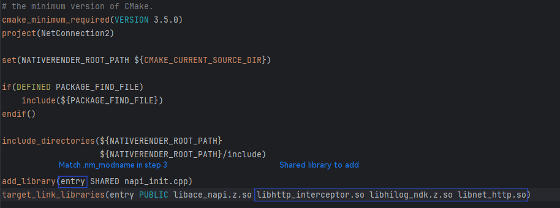

7. Calling the HTTP global interceptor C APIs requires the app to have the `ohos.permission.INTERNET` permission. Add this permission to the `requestPermissions` item in `module.json5`.

After the preceding steps are completed, the project setup is complete. You can connect a device, run the project, and view the logs.

## Testing Procedure

1. Connect the device and open the built project in DevEco Studio.

2. Run the project. The device displays the interface shown in the following figures.

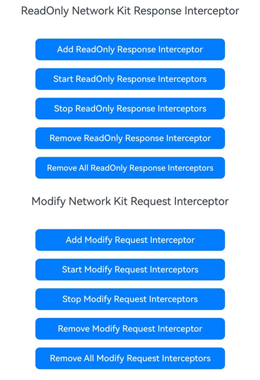

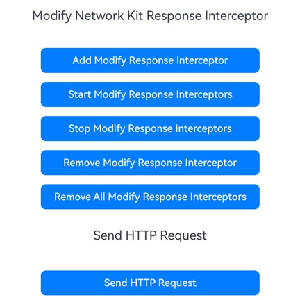

   - Click `Add Read Only Response Interceptor` to add an HTTP globally read-only response interceptor.

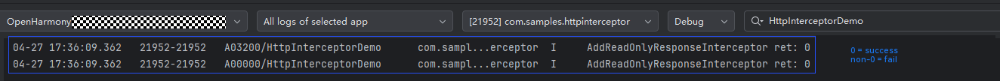

   - Click `Start Read Only Response Interceptors` to enable all read-only response interceptors with group ID 1.

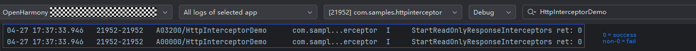

   - Click `Add Modify Request Interceptor` to add an HTTP globally modifiable request interceptor.

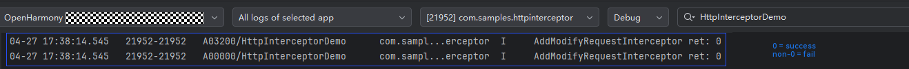

  - Click `Start Modify Request Interceptors` to enable all modifiable request interceptors with group ID 2.  

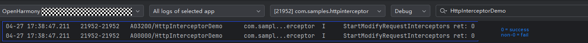

  - Click `Add Modify Response Interceptor` to add an HTTP globally modifiable response interceptor.  

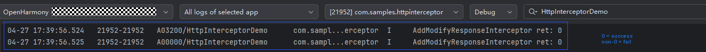

  - Click `Start Modify Response Interceptors` to enable all modifiable response interceptors with group ID 3.

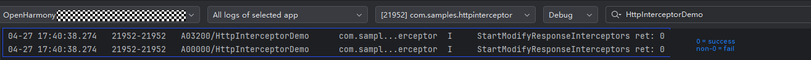

   - Click `Send HTTP Request`. The interceptor captures the response and prints related information to the log.

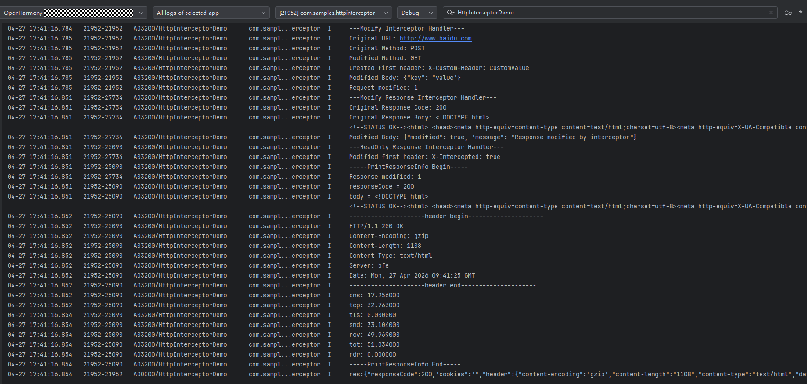

   - Click `Stop Read Only Response Interceptors` to disable the read-only response interceptor with group ID 1.

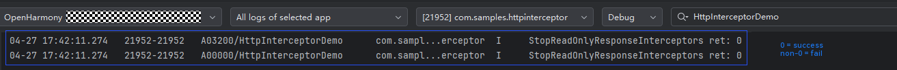

   - Click `Stop Modify Request Interceptors` to disable the writable request interceptor with group ID 2.

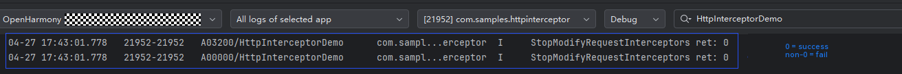

   - Click `Stop Modify Response Interceptors` to disable the writable response interceptor with group ID 3.

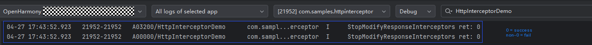

   - Click `Remove Read Only Response Interceptor` to remove the previously added read-only response interceptor.

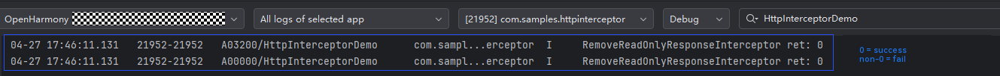

   - Click `Remove Modify Request Interceptor` to remove the previously added modifiable request interceptor.

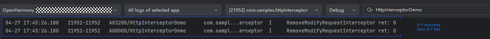

   - Click `Remove Modify Response Interceptor` to remove the previously added modifiable response interceptor.

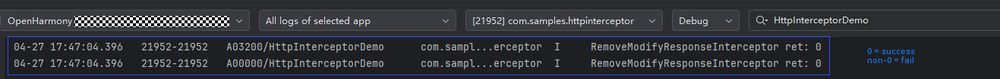

  - Click `Remove All Read Only Response Interceptors` to remove all read-only response interceptors with group ID 1.

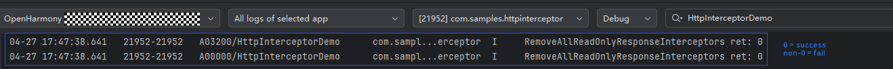

  - Click `Remove All Modify Request Interceptors` to remove all modifiable request interceptors with group ID 2.

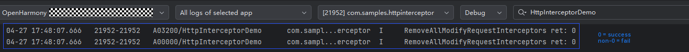

  - Click **Remove All Modify Response Interceptors** to remove all modifiable response interceptors with group ID 3.

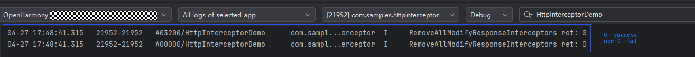

## Samples

The following samples are provided for your reference on HTTP global interceptor development:

- [HTTP Global Interceptor (C/C++)](https://gitcode.com/openharmony/applications_app_samples/tree/master/code/DocsSample/NetWork_Kit/NetWorkKit_Datatransmission/HTTP_interceptor_C)