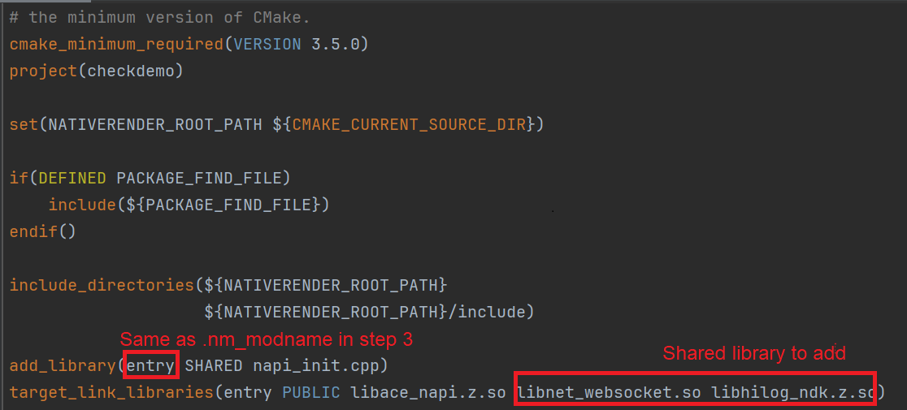
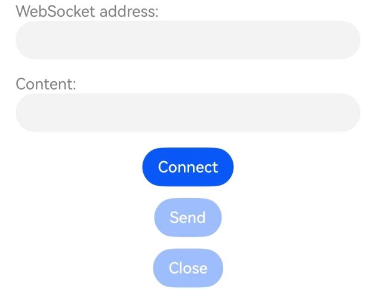
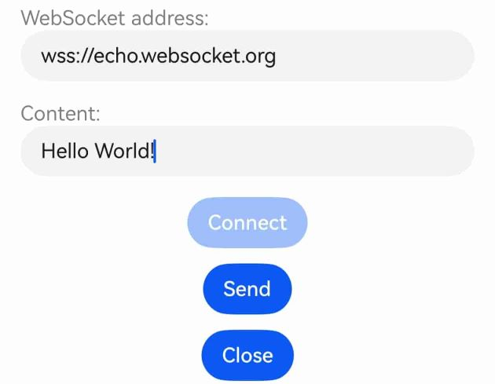
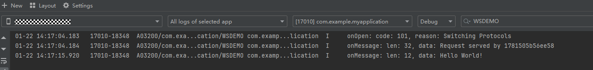

# WebSocket Connection (C/C++)

## When to Use

The WebSocket module can be used to establish bidirectional connections between the server and the client.

## Available APIs

The following table lists the common **WebSocket** APIs. For details, see [net_websocket.h](../reference/apis-network-kit/net__websocket_8h.md).


| API| Description|
| -------- | -------- |
| OH_WebSocketClient_Constructor(WebSocket_OnOpenCallback onOpen, WebSocket_OnMessageCallback onMessage, WebSocket_OnErrorCallback onError, WebSocket_OnCloseCallback onclose) | Constructor used to create a **WebSocketClient** instance. |
| OH_WebSocketClient_AddHeader(struct WebSocket \*client, struct WebSocket_Header header) | Adds the header information to the client request. |
| OH_WebSocketClient_Connect(struct WebSocket \*client, const char \*url, struct WebSocket_RequestOptions options) | Connects the WebSocket client to the server. |
| OH_WebSocketClient_Send(struct WebSocket \*client, char \*data, size_t length) | Sends data from the WebSocket client to the server. |
| OH_WebSocketClient_Close(struct WebSocket \*client, struct WebSocket_CloseOption options) | Lets the WebSocket client proactively close the connection. |
| OH_WebSocketClient_Destroy(struct WebSocket \*client) | Releases the context and resources of the WebSocket connection. |

## Development Example

### How to Develop

To use related APIs to establish a connection to the WebSocket server, you need to create a Native C++ project, encapsulate the APIs in the source file, and call these APIs at the ArkTS layer. You can use hilog or console.log to print the log information on the console or generate device logs.

The following walks you through on how to establish a connection to the WebSocket server, send messages to the WebSocket server, and close the WebSocket connection.

### Adding Dependencies

**Adding Dynamic Link Libraries**

Add the following library to **CMakeLists.txt**.

```txt
libace_napi.z.so
libnet_websocket.so
```

**Including Header Files**

```c
#include "napi/native_api.h"
#include "network/netstack/net_websocket.h"
#include "network/netstack/net_websocket_type.h"
```

### Building the Project

1. Write the API call code in the source file to allow applications to receive the URL string passed from ArkTS, create a pointer to the **WebSocketClient** object, and check whether the connection to the WebSocket server is successful.

```cpp
#include "napi/native_api.h"
#include "network/netstack/net_websocket.h"
#include "network/netstack/net_websocket_type.h"
#include "hilog/log.h"

#include <cstring>

#undef LOG_DOMAIN
#undef LOG_TAG
#define LOG_DOMAIN 0x3200 // Global domain, which identifies the service domain.
#define LOG_TAG "WSDEMO"   // Global tag, which identifies the module log tag.

// Global variables of the WebSocket client
static struct WebSocket *client = nullptr;

static void onOpen(struct WebSocket *client, WebSocket_OpenResult openResult)
{
    (void)client;
    OH_LOG_INFO(LOG_APP, "onOpen: code: %{public}u, reason: %{public}s",
        openResult.code, openResult.reason);
}

static void onMessage(struct WebSocket *client, char *data, uint32_t length)
{
    (void)client;
    char *tmp = new char[length + 1];
    for (uint32_t i = 0; i < length; i++) {
        tmp[i] = data[i];
    }
    tmp[length] = '\0';
    OH_LOG_INFO(LOG_APP, "onMessage: len: %{public}u, data: %{public}s",
        length, tmp);
}

static void onError(struct WebSocket *client, WebSocket_ErrorResult errorResult)
{
    (void)client;
    OH_LOG_INFO(LOG_APP, "onError: code: %{public}u, message: %{public}s",
        errorResult.errorCode, errorResult.errorMessage);
}

static void onClose(struct WebSocket *client, WebSocket_CloseResult closeResult)
{
    (void)client;
    OH_LOG_INFO(LOG_APP, "onClose: code: %{public}u, reason: %{public}s",
        closeResult.code, closeResult.reason);
}

static napi_value ConnectWebsocket(napi_env env, napi_callback_info info)
{
    size_t argc = 2;
    napi_value args[2] = {nullptr};
    napi_value result;
    
    napi_get_cb_info(env, info, &argc, args , nullptr, nullptr);
    
    size_t length = 0;
    napi_status status = napi_get_value_string_utf8(env, args[0], nullptr, 0, &length);
    if (status != napi_ok) {
        napi_get_boolean(env, false, &result);
        return result;
    }
    
    if (client != nullptr) {
        OH_LOG_INFO(LOG_APP, "there is already one websocket client running.");
        napi_get_boolean(env, false, &result);
        return result;
    }
    char *buf = new char[length + 1];
    std::memset(buf, 0, length + 1);
    napi_get_value_string_utf8(env, args[0], buf, length + 1, &length);
	// Create a pointer to the WebSocketClient object.
    client = OH_WebSocketClient_Constructor(onOpen, onMessage, onError, onClose);
    if (client == nullptr) {
        delete[] buf;
        napi_get_boolean(env, false, &result);
        return result;
    }
	// Connect to the WebSocket server identified by the URL stored in the buffer.
    int connectRet = OH_WebSocketClient_Connect(client, buf, {});
    
    delete[] buf;
    napi_get_boolean(env, connectRet == 0, &result);
    return result;
}

static napi_value SendMessage(napi_env env, napi_callback_info info)
{
    size_t argc = 1;
    napi_value args[1] = {nullptr};
    napi_value result;
    
    napi_get_cb_info(env, info, &argc, args , nullptr, nullptr);
    
    size_t length = 0;
    napi_status status = napi_get_value_string_utf8(env, args[0], nullptr, 0, &length);
    if (status != napi_ok) {
        napi_create_int32(env, -1, &result);
        return result;
    }
    
    if (client == nullptr) {
        OH_LOG_INFO(LOG_APP, "websocket client not connected.");
        napi_create_int32(env, WebSocket_ErrCode::WEBSOCKET_CLIENT_NULL, &result);
        return result;
    }
    char *buf = new char[length + 1];
    std::memset(buf, 0, length + 1);
    napi_get_value_string_utf8(env, args[0], buf, length + 1, &length);
	// Send the messages in the buffer to the server.
    int ret = OH_WebSocketClient_Send(client, buf, length);
    
    delete[] buf;
    napi_create_int32(env, ret, &result);
    return result;
}

static napi_value CloseWebsocket(napi_env env, napi_callback_info info)
{
    napi_value result;
    if (client == nullptr) {
        OH_LOG_INFO(LOG_APP, "websocket client not connected.");
        napi_create_int32(env, -1, &result);
        return result;
    }
	// Close the WebSocket connection.
    int ret = OH_WebSocketClient_Close(client, {
        .code = 0,
        .reason = "Actively Close",
    });
	// Release the WebSocket resources.
    OH_WebSocketClient_Destroy(client);
    client = nullptr;
    napi_create_int32(env, ret, &result);
    return result;
}

```

On receiving a WebSocket URL, the `ConnectWebsocket` function attempts to connect to the server identified by the URL. If the connection is successful, **true** is returned. Otherwise, **false** is returned. Before creating a pointer to the **WebSocketClient** object, define the **onOpen**, **onMessage**, **onError**, and **onClose** callbacks for the WebSocket connection. In the sample code, functions such as `OH_WebSocketClient_Send` and `OH_WebSocketClient_Close` are also called to send messages to the server and proactively close the WebSocket connection.


2. Initialize and export the `napi_value` objects encapsulated through **NAPI**, and expose the preceding functions to JavaScript through external function APIs. In the sample code, the `ConnectWebsocket` function is exposed as the external function `Connect`, the `SendMessage` function is exposed as the external function `Send`, and the `CloseWebsocket` function is exposed as the external function `Close`.

```C
EXTERN_C_START
static napi_value Init(napi_env env, napi_value exports) {
    napi_property_descriptor desc[] = {
        {"Connect", nullptr, ConnectWebsocket, nullptr, nullptr, nullptr, napi_default, nullptr },
        {"Send", nullptr, SendMessage, nullptr, nullptr, nullptr, napi_default, nullptr },
        {"Close", nullptr, CloseWebsocket, nullptr, nullptr, nullptr, napi_default, nullptr},
    };
    napi_define_properties(env, exports, sizeof(desc) / sizeof(desc[0]), desc);
    return exports;
}
EXTERN_C_END
```

3. Register the objects successfully initialized in the previous step into the Node.js file by using the `napi_module_register` function of `RegisterEntryModule`.

```C
static napi_module demoModule = {
    .nm_version = 1,
    .nm_flags = 0,
    .nm_filename = nullptr,
    .nm_register_func = Init,
    .nm_modname = "entry",
    .nm_priv = ((void*)0),
    .reserved = { 0 },
};

extern "C" __attribute__((constructor)) void RegisterEntryModule(void)
{
    napi_module_register(&demoModule);
}
```

4. Define the types of the functions in the `index.d.ts` file of the project. For example, the `Connect` function takes a string parameter as the input parameter and returns a Boolean value indicating whether the WebSocket connection is successfully established.

```ts
export const Connect: (url: string) => boolean;
export const Send: (data: string) => number;
export const Close: () => number;
```

5. Call the encapsulated APIs in the `index.ets` file.

```ts
import testWebsocket from 'libentry.so'

@Entry
@Component
struct Index {
  @State wsUrl: string = ''
  @State content: string = ''
  @State connecting: boolean = false

  build() {
    Navigation() {
      Column() {
        Column() {
          Text("WebSocket address: ")
            .fontColor(Color.Gray)
            .textAlign(TextAlign.Start)
            .width('100%')
          TextInput()
            .width('100%')
            .onChange((value) => {
              this.wsUrl = value
            })
        }
        .margin({
          bottom: 16
        })
        .padding({
          left: 16,
          right: 16
        })

        Column() {
          Text("Content: ")
            .fontColor(Color.Gray)
            .textAlign(TextAlign.Start)
            .width('100%')
          TextInput()
            .width('100%')
            .enabled(this.connecting)
            .onChange((value) => {
              this.content = value
            })
        }
        .margin({
          bottom: 16
        })
        .padding({
          left: 16,
          right: 16
        })

        Blank()

        Column({ space: 12 }) {
          Button('Connect')
            .enabled(!this.connecting)
            .onClick(() => {
              let connRet = testWebsocket.Connect(this.wsUrl)
              if (connRet) {
                this.connecting = true;
              }
            })
          Button('Send')
            .enabled(this.connecting)
            .onClick(() => {
              testWebsocket.Send(this.content)
            })
          Button('Close')
            .enabled(this.connecting)
            .onClick(() => {
              let closeResult = testWebsocket.Close()
              if (closeResult != -1) {
                this.connecting = false
              }
            })
        }
      }
    }
  }
}
```

6. Configure the `CMakeLists.txt` file. Add the required shared library, that is, `libnet_websocket.so`, to `target_link_libraries` in the `CMakeLists.txt` file automatically generated by the project.

Note: As shown in the following figure, `entry` in `add_library` is the `modename` automatically generated by the project. If you want to change its value, ensure that it is the same as the `.nm_modname` in step 3.



7. To call WebSocket C APIs, make sure that you have the `ohos.permission.INTERNET` permission. Add this permission to the `requestPermissions` item in the `module.json5` file.

After the preceding steps, the entire project is set up. Then, you can connect to the device to run the project to view logs.

## Test Procedure

1. Connect the device and use DevEco Studio to open the project.

2. Run the project. The following page is displayed.



Description of settings:

- In the text box in the first line, enter a WebSocket URL starting with `ws://` or `wss://`.

- Tap `Connect`. If the connection is successful, the **onOpen** callback is triggered and logs are printed.

- Enter the content to be sent to the server in the `Content` text box and tap `Send`. If the server returns a message, the `onMessage` callback is triggered and logs are printed.

- Tap `Close`. The WebSocket connection is released. You can enter a new WebSocket URL to establish a new connection.




