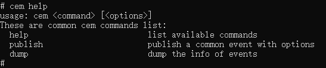

# Debugging Assistant Usage

The common event and notification module provides debugging tools to facilitate your application development. With these tools, you can view common event and notification information, publish common events, and more. These tools have been integrated with the system. You can run related commands directly in the shell.

## cem Debugging Assistant

### publish

* Functionality

  Publishes a common event.

* Usage

  `cem publish [<options>]` 

  The table below describes the available options.

  | Option        | Description                                  |
  | ------------ | ------------------------------------------ |
  | -e/--event   | Indicates the name of the common event to publish. Mandatory.                    |
  | -s/--sticky  | Indicates that the common event to publish is sticky. Optional. By default, non-sticky events are published.|
  | -o/--ordered | Indicates that the common event to publish is ordered. Optional. By default, non-ordered events are published.  |
  | -c/--code    | Indicates the result code of the common event. Optional.                  |
  | -d/--data    | Indicates the data carried in the common event. Optional.                |
  | -h/--help    | Indicates the help Information                                  |

* Example

  `cem publish --event "testevent"`

  Publish a common event named **testevent**.

   

  

  `cem publish -e "testevent" -s -o -c 100 -d "this is data" `

  Publish a sticky, ordered common event named **testevent**. The result code of the event is **100** and the data carried is **this is data**.

   

### dump

* Functionality

  Displays information about common events.

* Usage

  `cem dump [<options>]`

  The table below describes the available options.

  | Option      | Description                                    |
  | ---------- | -------------------------------------------- |
  | -a/--all   | Displays information about all common events that have been sent since system startup.|
  | -e/--event | Displays information about a specific event.                  |
  | -h/--help  | Displays the help information.                                    |

* Example

​        `cem dump -e "testevent"`

​        Display information about the common event testevent.

​        

### help

* Functionality

  Displays the help information.

* Usage

  `cem help`

* Example

    

## anm Debugging Assistant

### dump

* Functionality

  Displays information about notifications.

* Usage

  `anm dump [<options>]`

  The table below describes the available options.

  | Option            | Description                                |
  | ---------------- | ---------------------------------------- |
  | -A/--active      | Displays information about all active notifications.                  |
  | -R/--recent      | Displays information about the recent notifications.                      |
  | -D/--distributed | Displays information about distributed notifications from other devices.        |
  | --setRecentCount | Indicates the number of the cached recent notifications to be displayed. Optional.|
  | -h/--help        | Displays the help information.                                |

* Example

  `anm dump -A`

  Displays information about all active notifications.

   

  

  `anm dump --setRecentCount  10`

  Set the number of the cached recent notifications to be displayed to 10.

### help

* Functionality

  Displays the help information.

* Usage

  `anm help`

* Example

 
