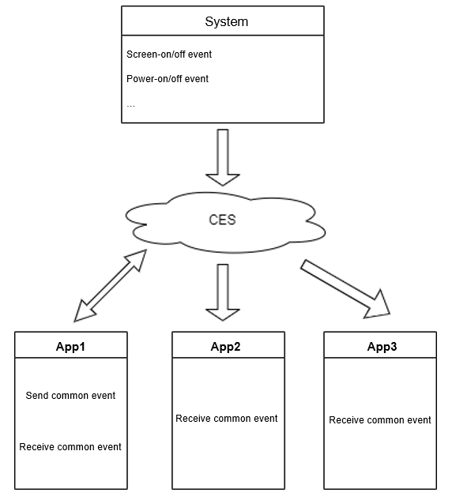
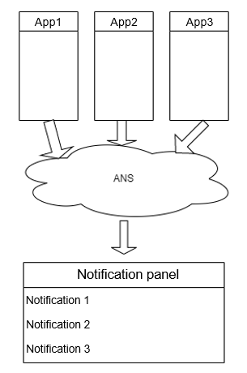

# Common Event and Notification Overview

The common event and notification module enables applications to publish messages to other applications, and receive messages from the system or other applications. These messages can be news push messages, advertisement notifications, warning information, and more.

Common Event Service (CES) enables applications to publish, subscribe to, and unsubscribe from common events. Based on the sender type, common events are classified into system common events and custom common events.

- System common event: sent by the system based on system policies to the applications that have subscribed to the event. This type of event includes the screen-on/off events that the users are aware of and the system events published by key system services, such as USB device attachment or detachment, network connection, and system update events.
- Custom common event: customized by applications to be received by specific subscribers. This type of event is usually related to the service logic of the sender applications.

The Advanced Notification Service (ANS) enables applications to publish notifications. Below are some typical use cases for publishing notifications:

- Display received SMS messages and instant messages.
- Display push messages of applications, such as advertisements, version updates, and news notifications.
- Display ongoing events, such as music playback, navigation information, and download progress.

Notifications are displayed in the notification panel. Uses can delete a notification or click the notification to trigger predefined actions.

