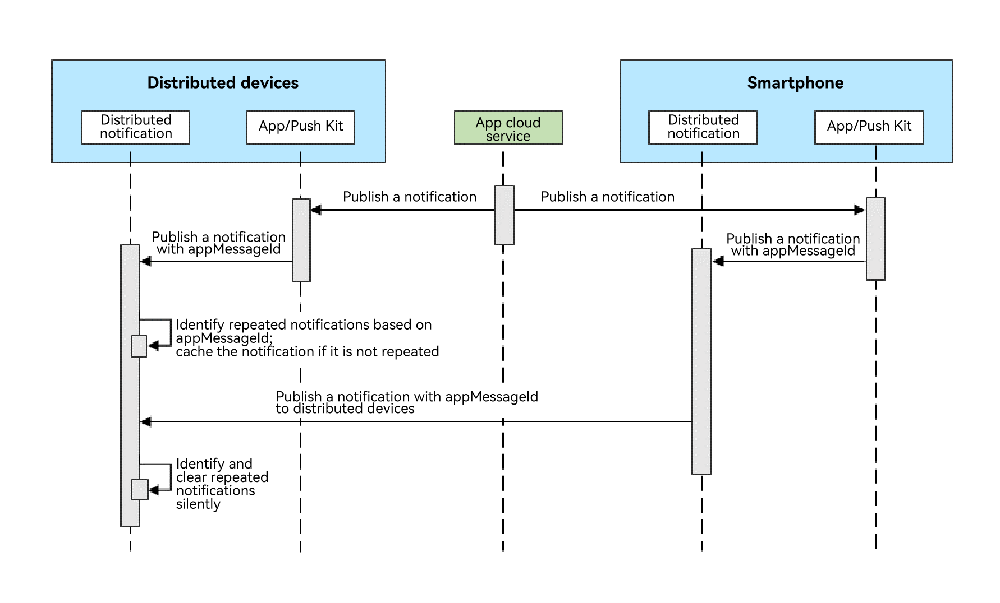

# Clearing Repeated Notifications Across Devices

Since API version 20, you can clear repeated notifications across devices to prevent users from being disturbed by notifications published through different ways (for example, notifications sent from a mobile phone to the current device are the same as those published by Push Kit).

## Implementation Principles

When an application publishes a notification, the notification carries the [appMessageId](../../application-dev/reference/apis-notification-kit/js-apis-inner-notification-notificationRequest.md#notificationrequest) field, which is a unique identifier. After receiving notifications from multiple ways, the distributed notification service checks the notification based on this field to clear repeated notifications.

Only the first notification is displayed on the device. Duplicate notifications received later will be silently cleared and will not be displayed or notified.

**Figure 1** Process of notification deduplication in all scenarios



## Constraints

- The uniqueness of the [appMessageId](../../application-dev/reference/apis-notification-kit/js-apis-inner-notification-notificationRequest.md#notificationrequest) field must be ensured. This field for the same notification must stay consistent on all devices.
- The [appMessageId](../../application-dev/reference/apis-notification-kit/js-apis-inner-notification-notificationRequest.md#notificationrequest) field is valid only within 24 hours after the notification is published. If the notification is published beyond 24 hours or the device is restarted, this field becomes invalid.

## Available APIs

| **API** | **Description**|**Description**|
| -------- | -------- | -------- |
| [publish](../reference/apis-notification-kit/js-apis-notificationManager.md#notificationmanagerpublish-1)(request: NotificationRequest): Promise\<void\>       | Publishes a notification. |For details, see the description of the **appMessageId** field in the [NotificationRequest](../reference/apis-notification-kit/js-apis-inner-notification-notificationRequest.md) object.|

## How to Develop

1. Import the related modules.

    ```typescript
    import { notificationManager } from '@kit.NotificationKit';
    import { BusinessError } from '@kit.BasicServicesKit';
    ```

2. Publish a notification that contains the **appMessageId** field.

    ```typescript
    // publish callback
    let publishCallback = (err: BusinessError): void => {
    if (err) {
        console.error(`Failed to publish notification. Code is ${err.code}, message is ${err.message}`);
    } else {
        console.info(`Succeeded in publishing notification.`);
    }
    }
    // NotificationRequest object
    let notificationRequest: notificationManager.NotificationRequest = {
        id: 1,
        content: {
            notificationContentType: notificationManager.ContentType.NOTIFICATION_CONTENT_BASIC_TEXT,
            normal: {
            title: "test_title",
            text: "test_text",
            additionalText: "test_additionalText"
            }
        },
        appMessageId: 'test_appmessageid_1'
    };
    notificationManager.publish(notificationRequest, publishCallback);
    ```
