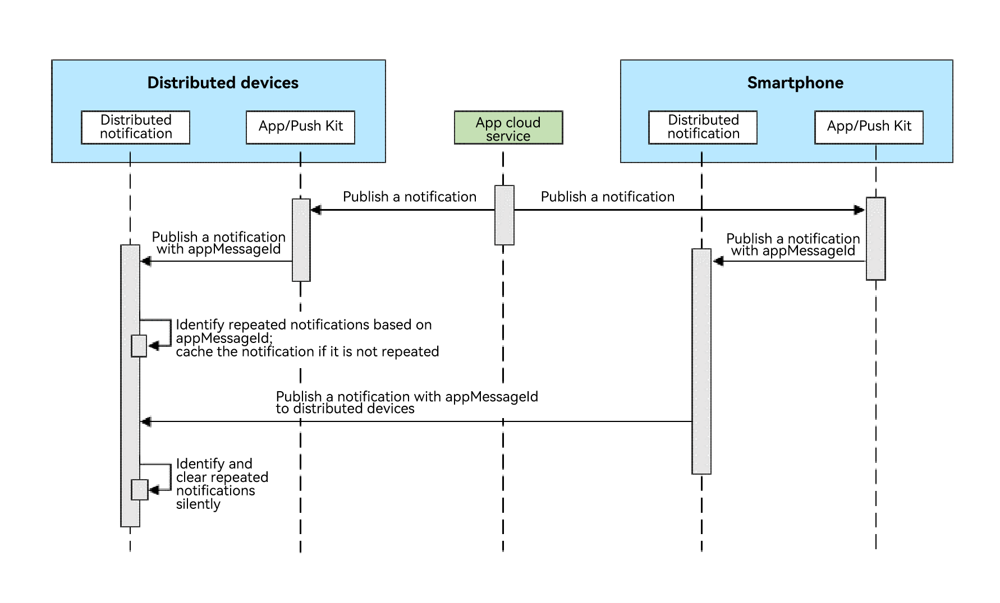

# Clearing Repeated Notifications Across Devices

<!--Kit: Notification Kit-->
<!--Subsystem: Notification-->
<!--Owner: @HuYueRong-->
<!--Designer: @dongqingran-->
<!--Tester: @wanghong1997-->
<!--Adviser: @fang-jinxu-->
<!-- md-trans-meta sourceCommit=2d26d65ed8809e3397733f0dc440ee753e9d6e8a translatedAt=2026-08-13T03:10:51.854Z pushedAt=2026-08-13T07:31:32.698Z -->

Since API version 20, you can clear repeated notifications across devices to prevent users from being disturbed by notifications published through different ways (for example, notifications sent from a mobile phone to the current device are the same as those published by Push Kit).

## Implementation Principles

When an application publishes a notification, the notification carries the [appMessageId](../../application-dev/reference/apis-notification-kit/js-apis-inner-notification-notificationRequest.md#notificationrequest-1) field, which is a unique identifier. After receiving notifications from multiple ways, the cross-device notification service checks the notification based on this field to clear duplicate notifications.

Only the first notification is displayed on the device. Duplicate notifications received later will be silently cleared and will not be displayed or notified.

**Figure 1** Process of notification deduplication in all scenarios



## Constraints

- You must ensure the uniqueness of **appMessageId**. The same notification must retain the same value for this field across all device form factors.

- This field is only valid within 24 hours after the notification is published. It becomes invalid after 24 hours or when the device is restarted.

## Available APIs

| **API** | **Description**|**Description**|
| -------- | -------- | -------- |
| [publish](../reference/apis-notification-kit/js-apis-notificationManager.md#notificationmanagerpublish-1)(request: NotificationRequest): Promise\<void\>       | Publishes a notification. |For details, see the description of the **appMessageId** field in the [NotificationRequest](../reference/apis-notification-kit/js-apis-inner-notification-notificationRequest.md) object.|

## How to Develop

1. Import the related modules.

   <!-- @[clear_duplicate_notifications_header](https://gitcode.com/openharmony/applications_app_samples/blob/master/code/DocsSample/Notification-Kit/Notification/entry/src/main/ets/filemanager/ClearDuplicateNotifications.ets) -->

   ``` TypeScript
   import { notificationManager } from '@kit.NotificationKit';
   import { BusinessError } from '@kit.BasicServicesKit';
   ```

2. Publish a notification that contains the **appMessageId** field.

   <!-- @[pub_appMsgId_notify](https://gitcode.com/openharmony/applications_app_samples/blob/master/code/DocsSample/Notification-Kit/Notification/entry/src/main/ets/filemanager/ClearDuplicateNotifications.ets) -->

   ``` TypeScript
   // publish callback
   let publishCallback = (err: BusinessError): void => {
     if (err) {
       console.error(`Failed to publish notification. Code is ${err.code}, message is ${err.message}`);
     } else {
       console.info(`Succeeded in publishing notification.`);
     }
   };
   // NotificationRequest object
   let notificationRequest: notificationManager.NotificationRequest = {
     id: 1,
     content: {
       notificationContentType: notificationManager.ContentType.NOTIFICATION_CONTENT_BASIC_TEXT,
       normal: {
         title: 'test_title',
         text: 'test_text',
         additionalText: 'test_additionalText'
       }
     },
     appMessageId: 'test_appMessageId_1'
   };
   notificationManager.publish(notificationRequest, publishCallback);
   ```