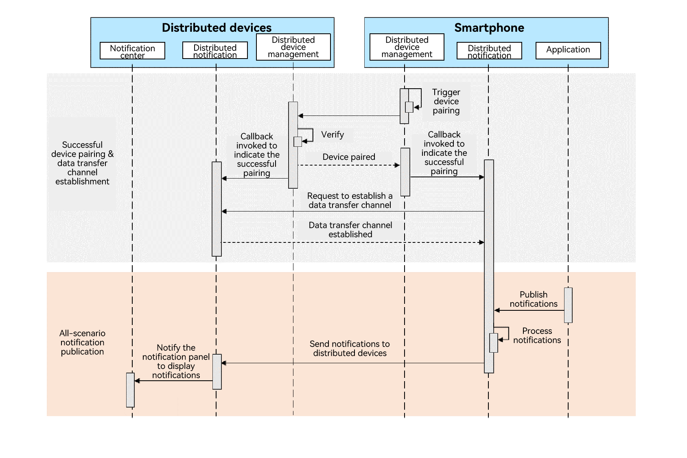

# Cross-Device Notification Overview

The cross-device notification is designed to implement collaborative interaction of notifications between a smartphone and another devices such as a watch. Typical scenarios are as follows:

<!--Del-->
  - [Cross-Device Notification Management (for System Applications Only)](./notification-distributed-notdistributed.md): Configure cross-device notifications for system applications and enable this feature as required.
<!--DelEnd-->
  - [Enabling Quick Reply for Cross-device Notifications](./notification-quickreply.md): Enable quick reply for social communication applications so that users can quickly reply messages across devices.
  - [Clearing Repeated Notifications Across Devices](./notification-distributed-messageid.md): Clear repeated notifications published across devices and by the local device to prevent multiple notifications from disturbing users.

## Constraints
  - Currently, cross-device notification can only be implemented between a smartphone and a watch.
  - Only the notification slots [SOCIAL_COMMUNICATION](../../application-dev/reference/apis-notification-kit/js-apis-notificationManager.md#slottype) and [LIVE_VIEW](../../application-dev/reference/apis-notification-kit/js-apis-notificationManager.md#slottype) support cross-device notification.

## Working Principles

