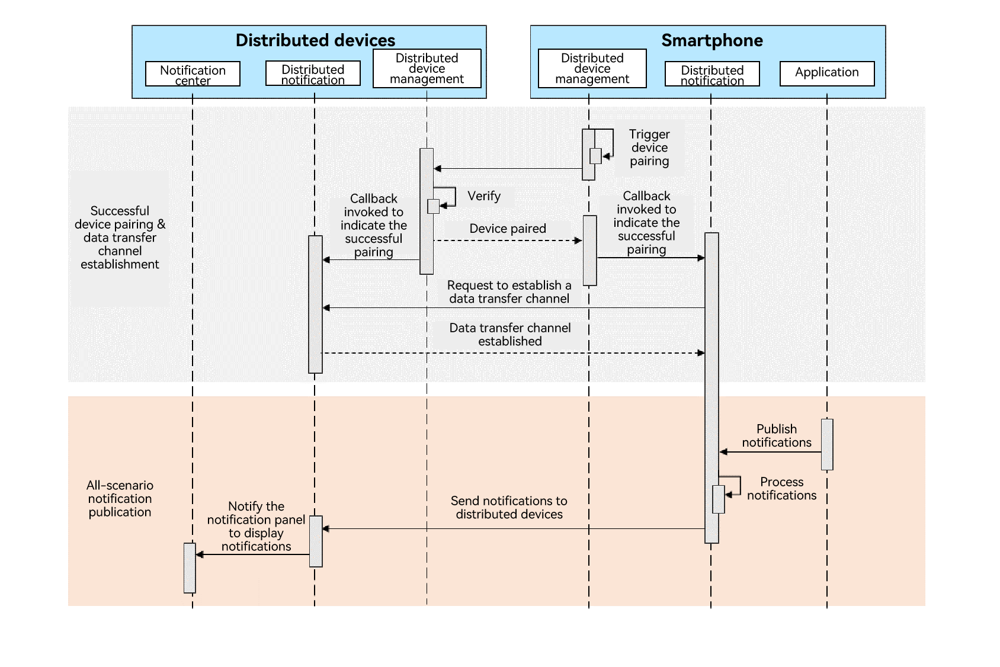

# Cross-Device Notification Overview

<!--Kit: Notification Kit-->
<!--Subsystem: Notification-->
<!--Owner: @HuYueRong-->
<!--Designer: @dongqingran-->
<!--Tester: @wanghong1997-->
<!--Adviser: @fang-jinxu-->
<!-- md-trans-meta sourceCommit=81f445fd08211cfc3b68579d2e6edda6177d5f3e translatedAt=2026-08-13T03:12:35.004Z pushedAt=2026-08-13T07:36:50.073Z -->

The cross-device notification is designed to implement collaborative interaction of notifications between a smartphone and another device such as a watch. Typical scenarios are as follows:

<!--Del-->

  - [Cross-Device Notification Management (for System Applications Only)](./notification-distributed-notdistributed-sys.md): Configure cross-device notifications for system applications and enable this feature as required.

<!--DelEnd-->

  - [Clearing Repeated Notifications Across Devices](./notification-distributed-messageid.md): Clear repeated notifications published across devices and by the local device to prevent multiple notifications from disturbing users.

## Constraints

  - Devices supported for cross-device collaboration: Starting from API version 18, notification message collaboration between phones and wearables is supported; starting from API version 20, notification message collaboration between phones and tablets/PCs/2-in-1 devices is supported.

  - [Notification slot types](../../application-dev/reference/apis-notification-kit/js-apis-notificationManager.md#slottype) supported for cross-device notification:

    - Wearable: social communication notifications with quick reply (SOCIAL_COMMUNICATION) and LIVE_VIEW.

    - Tablet: **SOCIAL_COMMUNICATION**, **SERVICE_INFORMATION**, **LIVE_VIEW**, and **CUSTOMER_SERVICE**.

    - PC/2-in-1 device: **SOCIAL_COMMUNICATION**, **SERVICE_INFORMATION**, and **CUSTOMER_SERVICE**.

## Working Principles

